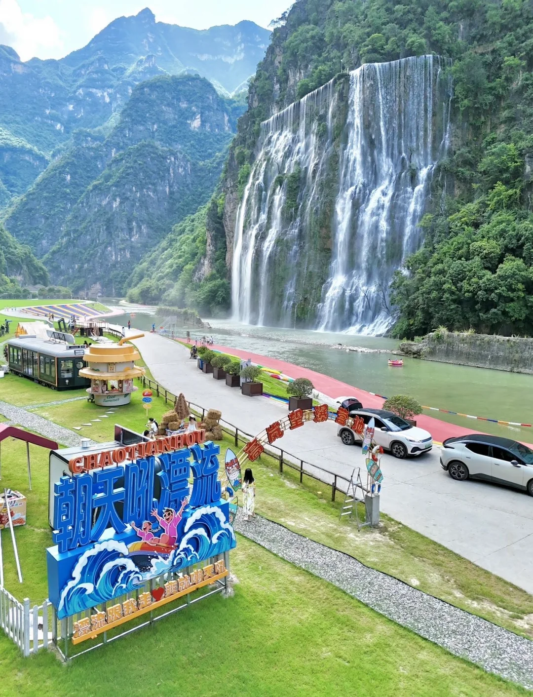
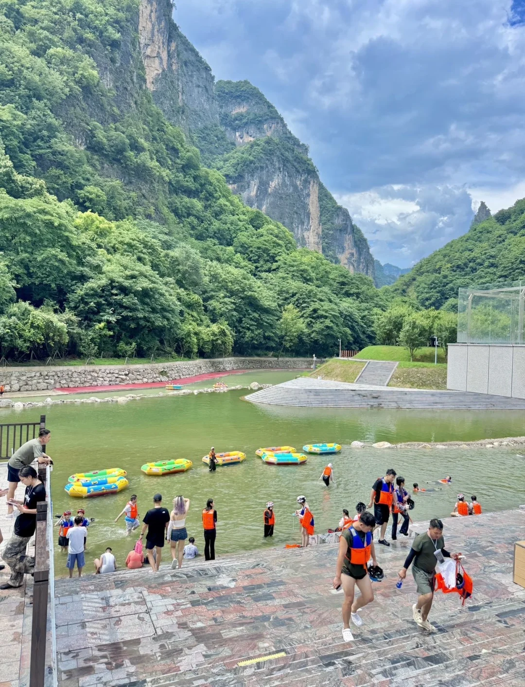
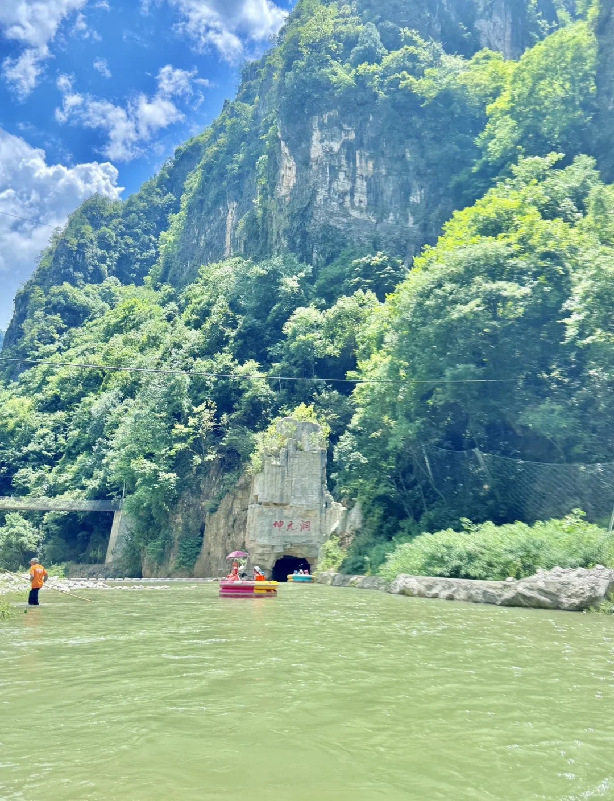
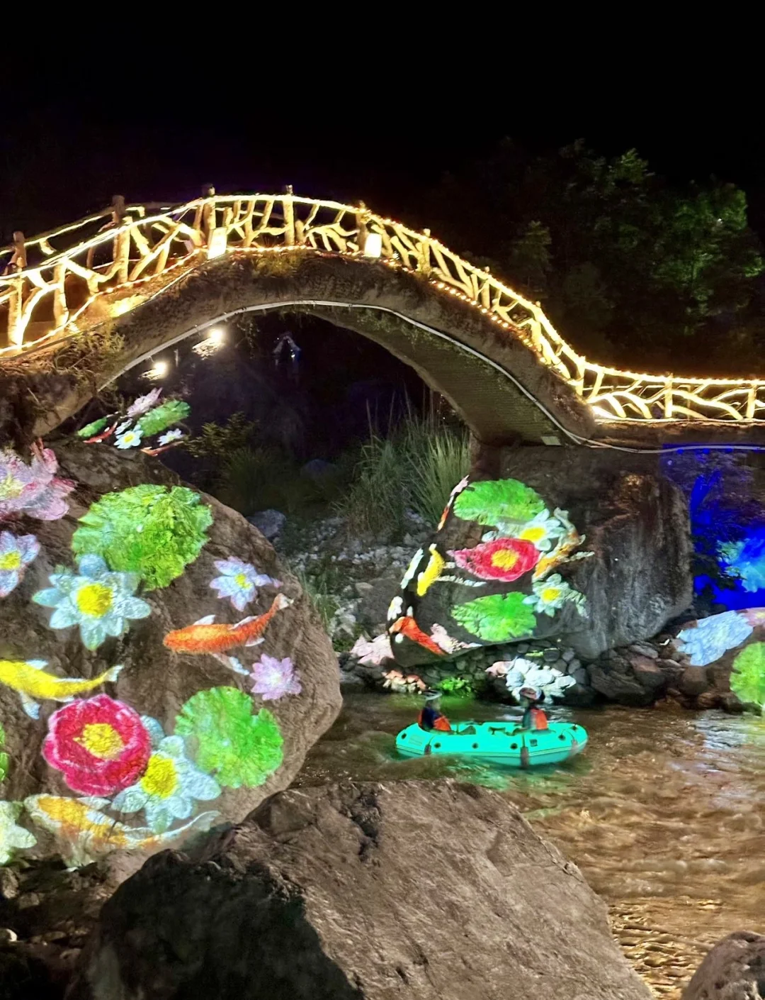
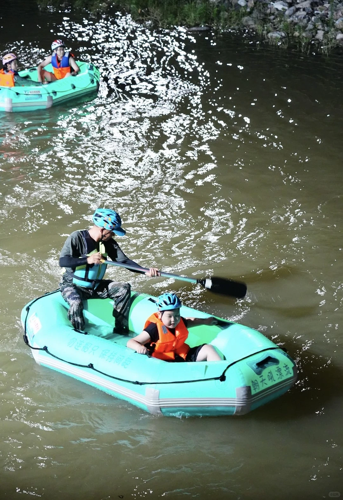

# 在湖北我很少用震撼来形容一个地方！！！🌊

- 作者: Bunny
- 👍147 · 💬18 · ⭐49 · 图 6
- feed_id: 6a6bf4f2000000002702207d

> [OCR] CHAO TIAN HOU
朝天吼漂流
漂流跟我走❤️ 逛就朝天吼

> [OCR] [?]

> [OCR] 山地车

> [OCR] 神元洞

> [OCR] [?]

> [OCR] 勿连船只 保持间距
朝天吼漂流

## 正文
朝天吼的漂流真的不是普通玩水！
6.5公里天然河道，148米垂直落差
20多个险滩裹着浪花劈头盖脸砸过来
耳边是尖叫和水流的轰鸣
两岸是奇峰绝壁
从骨髓里炸开的肾上腺素飙升感
只有亲身漂过一次才懂什么叫爽到失语🔥
·
暑假不想在热门景点看后脑勺
真心建议你锁死湖北兴山这条线
漂流+水上公路+避暑纳凉
两天一夜满分配齐！
·
📍朝天吼漂流（湖北宜昌兴山县）
高铁到兴山站，出站换808路城际公交直达景区
自驾直接搜“朝天吼漂流终点”——终点停车场免费！停好车坐景区免费摆渡车去起点，漂完直接回终点取车，完全不用走回头路
·
✅暑假游玩路线（两天一夜版）
Day 1：
上午武汉出发→自驾沪蓉高速高岚出口下（约4-5h）→入住朝天吼房车露营基地（推荐河畔木屋！落地窗正对漂流河道）→午餐高岚草堂→下午激情白漂（13:00前完成检票，避开旺季大排队）→晚餐露天烧烤→夜宿树屋数星星✨
·
Day 2：
早餐后打卡朝天吼大瀑布→自驾古昭公路（中国首条水上生态公路，4.4公里悬浮在香溪河上，导航“古夫镇观景台”，S型弯道+青山倒影，随手拍都是壁纸级）→下午穿汉服逛昭君村→傍晚返程
.
✅游玩必打卡
1️⃣朝天吼白漂
6.5公里漂流体验更丰满。最绝的是“八缎锦”险滩，连续三个大落差点，浪头直接把你整个人吞进去又吐出来。沿途抬头就是孔雀岭、将军柱的奇峰，刺激与美景并存，爽感翻倍！今年还新增了穿瀑洞漂和浪漫夜漂，白天黑夜全天候玩水！
2️⃣朝天吼美食汇
今年刚在止漂点建成的美食汇！景区自营10多家摊位，面食、煲仔饭、汉堡、奶茶这些日常小吃有，凉虾、萝卜饺子、土豆饼这些宜昌本地特色也有
3️⃣最美水上公路（古昭公路）
强烈推荐无人机，S型弯道+青山倒影+偶尔划过的小船，随手拍都是壁纸级
4️⃣昭君村
深入昭君故里，逛昭君纪念馆、娘娘泉、抚琴台，穿一身汉服沉浸式打卡，一秒穿越回西汉
.
夏天玩水的快乐，只有漂过才知道！
赶紧艾特你的搭子，周末就冲！💦
.
#暑假去哪玩[话题]# #朝天吼漂流[话题]# #宜昌旅游攻略[话题]# #湖北周边游[话题]# #夏日避暑好去处[话题]# #漂流[话题]# #武汉周边游[话题]# #湖北省内游[话题]#

---