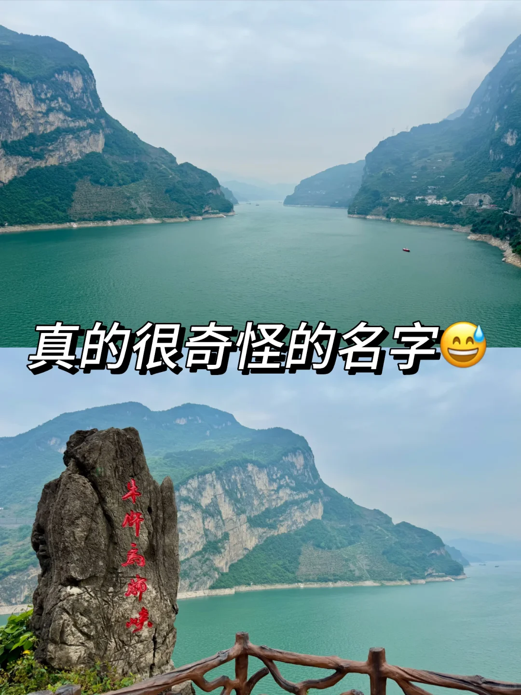
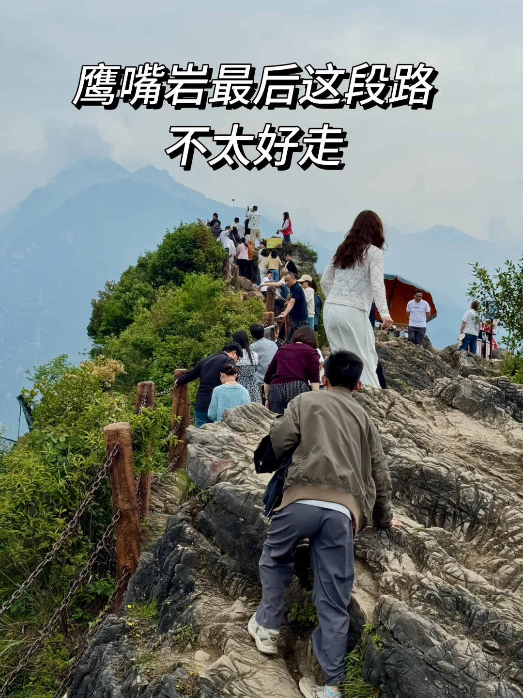
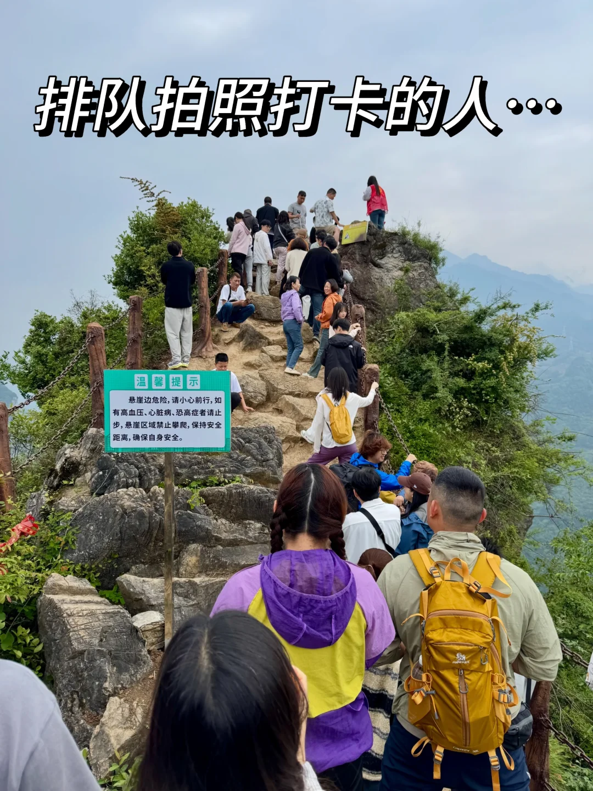
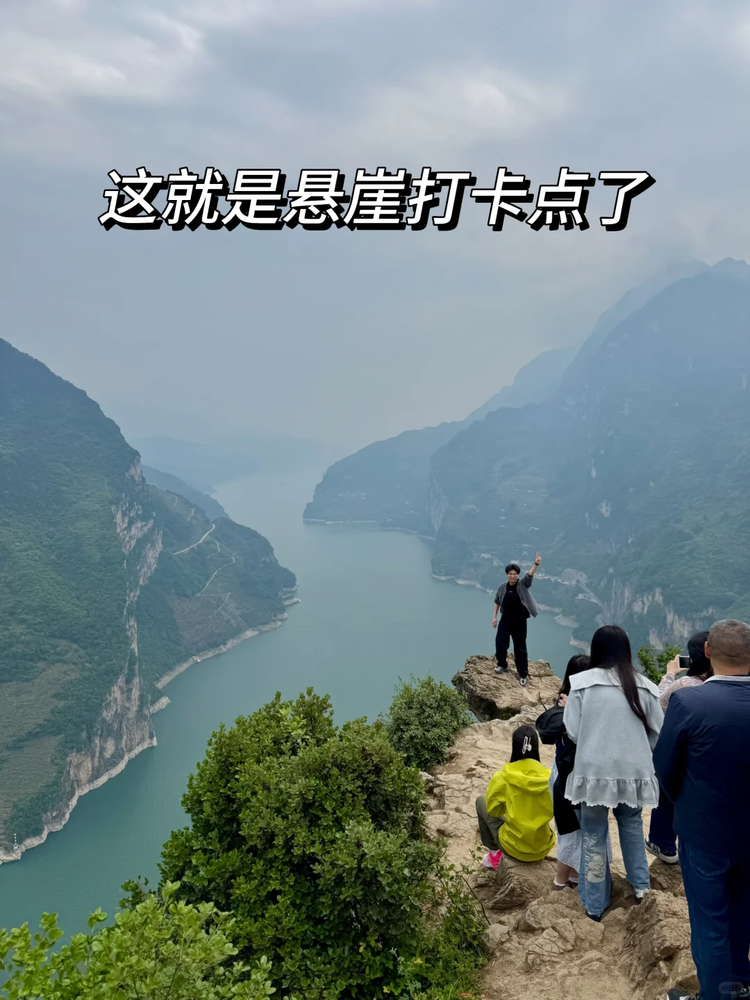
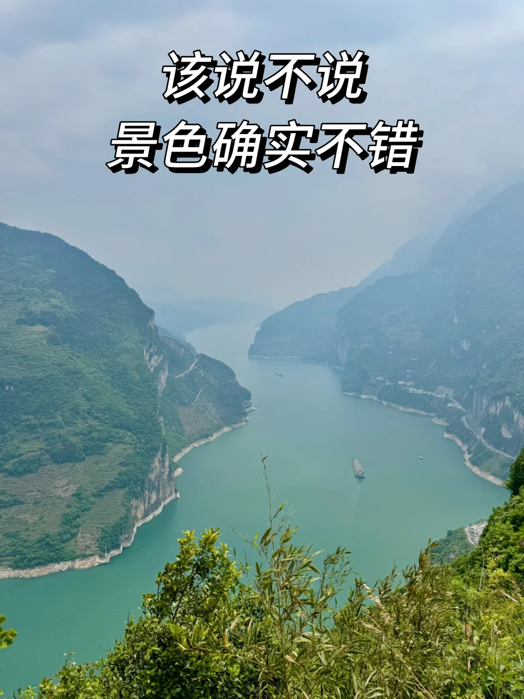
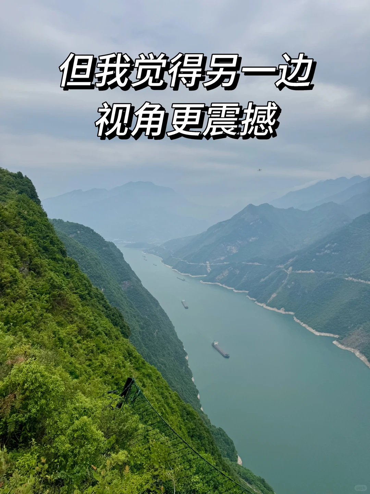
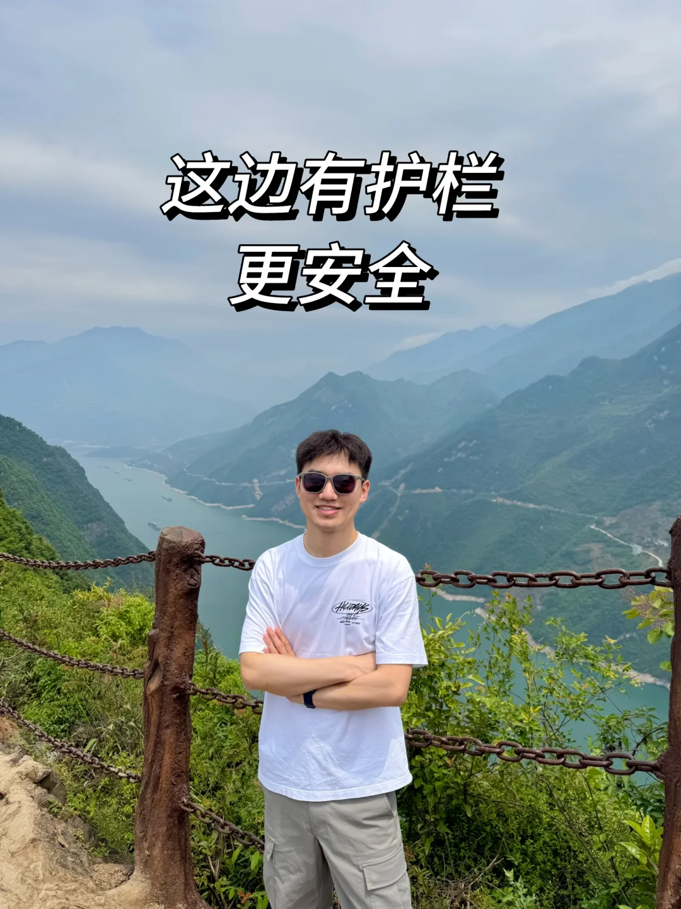
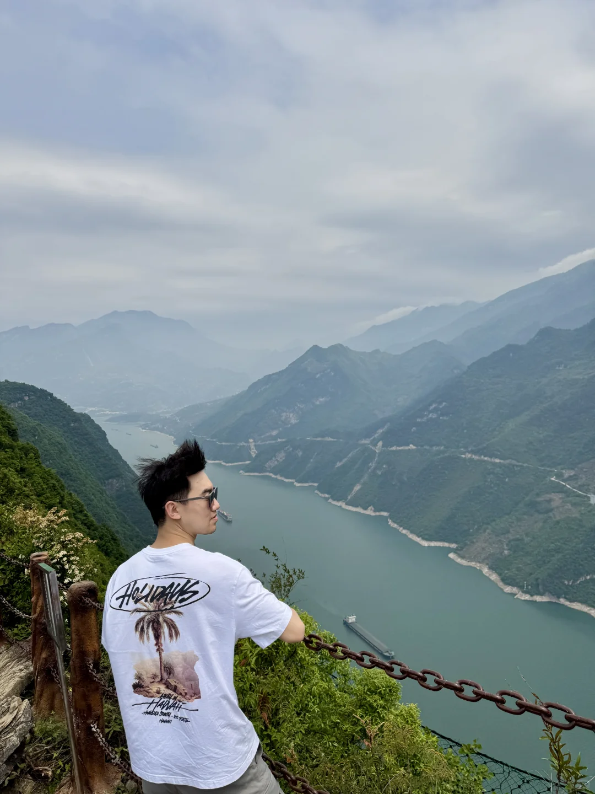

# 武汉自驾G348🚗宜昌秭归小狗山鹰嘴岩攻略

- 作者: 高大兴爱旅行
- 👍144 · 💬74 · ⭐80 · 图 9
- feed_id: 69f47ad9000000003700d4c2

> [OCR] 小狗山-鹰嘴岩
5.1实况

> [OCR] 真的很奇怪的名字😅

> [OCR] 鹰嘴岩最后这段路
不太好走

> [OCR] 排队拍照打卡的人…
温馨提示
悬崖边危险，请小心前行，
如有高血压、心脏病、恐高症者请止步，
悬崖区域禁止攀爬，保持安全距离，
确保自身安全。

> [OCR] 这就是悬崖打卡点了

> [OCR] 该说不说
景色确实不错

> [OCR] 但我觉得另一边
视角更震撼

> [OCR] 这边有护栏
更安全

> [OCR] HOLIYAYS
[?]
HAWAII

## 正文
又路过国道G348了，这次特意停下摸摸小狗头🐶
鹰嘴岩排队拍照打卡的人好多，果断放弃排队…
	
[星R]友情提醒：
[一R]小狗山观景台可以直接导航“牛肝马肺峡观景台”，免费停车🅿️。
[二R]鹰嘴岩直接导航“鹰嘴岩农庄”，停车8元一次，不限时。
[三R]鹰嘴岩想拍照打卡建议早上十点前过来，否则排队人很多，等很久，而且我们下山的时候已经开始交通管制了。
[四R]最后一段山路很不好走，建议穿舒适防滑的鞋子。（看到有大妈穿带跟的尖头皮鞋过来[石化R]）
	
[举手R][举手R][举手R]最后想说，虽然山路不好走，但是观景台、每个路口、会车点、停车点都有志愿者在指挥交通、维持现场秩序，会车停车不再难，真心为秭归的志愿者们点赞[点赞R][点赞R][点赞R]
#武汉周边游[话题]# #宜昌旅游攻略[话题]# #五一出行问活人[话题]# #户外领路人集合[话题]# #为山峰做一次创作[话题]# #因为山在那边[话题]# #一万种旅行howto[话题]# #howto出片[话题]# #对我友好的旅行[话题]# #出片友好旅行[话题]#
@生活薯 @户外薯 @HOWTO薯 @宜昌文旅 @湖北文旅 @文旅秭归

---