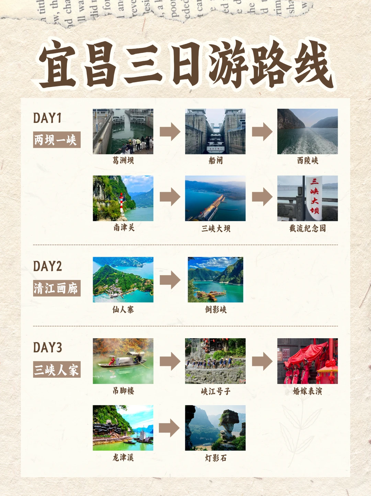

# 宜昌3天2夜保姆级旅游攻略，看这一篇就够了

- 作者: 悦诚旅游
- 👍140 · 💬36 · ⭐164 · 图 1
- feed_id: 68f9e587000000000300f049

> [OCR] 宜昌三日游路线

DAY1
两坝一峡
葛洲坝
船闸
西陵峡
南津关
三峡大坝
截流纪念园

DAY2
清江画廊
仙人寨
倒影峡

DAY3
三峡人家
吊脚楼
峡江号子
婚嫁表演
龙津溪
灯影石

## 正文
来宜昌必打卡两坝一峡、清江画廊、三峡人家，这三个景点分别代表了宜昌的水利工程、自然风光和民俗文化，按照这个线路，3天玩得轻松又尽兴👇👇👇
Day1：两坝一峡
上午：前往三峡大坝，在坛子岭俯瞰全貌，去185观景台平视大坝，在截流纪念园看工程器械。建议9点到，能避开旅游团。
下午：从三斗坪游客中心登船，欣赏西陵峡风光，过葛洲坝船闸，体验水涨船高。
晚上：去滨江公园看长江夜景，再尝尝郭场鸡、萝卜饺子这些特色美食。
	
Day2：清江画廊
上午：乘坐旅游大巴前往清江画廊，打卡土家风雨廊桥和隔河岩大坝。
中午：在农家乐一条街品尝土家菜，合渣、土家腊肉炒蕨菜都不错。
下午：登画舫游船，欣赏倒影峡、孔雀开屏、清江大佛，在武落钟离山码头下船，登山上的白虎堂、廪君殿，之后登船返程。
	
Day3：三峡人家
上午：前往三峡人家王家坪换乘中心，转景区中转车到胡金滩码头，渡船过江后游览山上人家，看石令牌、巴王宫，在三棵树广场看表演。
中午：景区内吃农家菜，三峡肥鱼火锅、炕洋芋不要错过。
下午：游览龙津溪，看龙溪桥、鹊桥，欣赏婚嫁楼表演和峡江号子 。
#宜昌旅游[话题]# #宜昌[话题]# #三峡大坝[话题]# #清江画廊[话题]# #一站式旅游[话题]# #值得N刷的宝藏出游地[话题]# #避开人流的旅游地[话题]# #两坝一峡[话题]#

---