# 宜昌一日游｜两坝一峡➕三峡大坝

- 作者: 王快乐
- 👍135 · 💬12 · ⭐160 · 图 14
- feed_id: 6a34a5ee000000000702967c

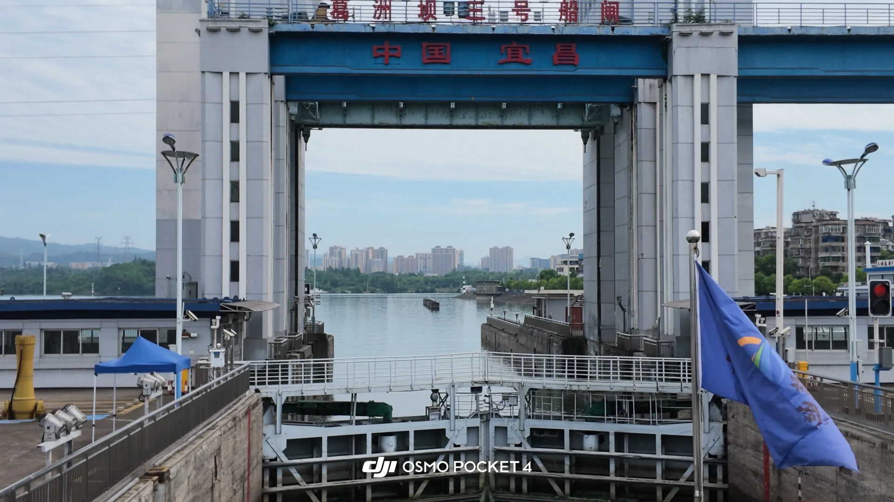
> [OCR] 葛洲坝三号船闸
中国宜昌
DJI OSMO POCKET 4
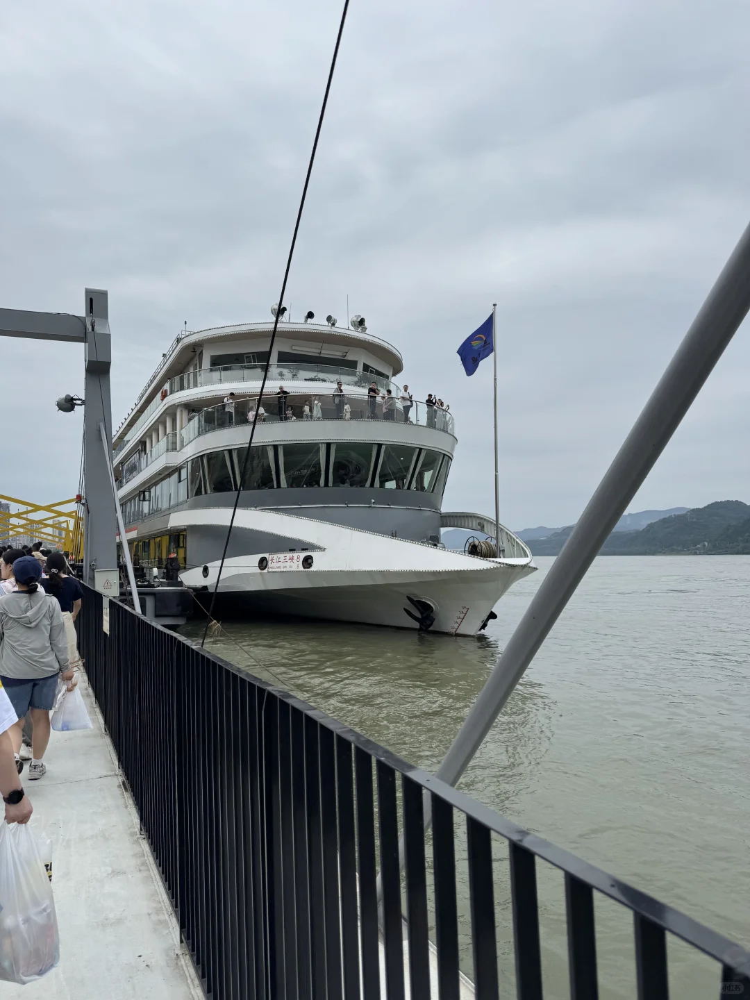
> [OCR] 长江三峡8
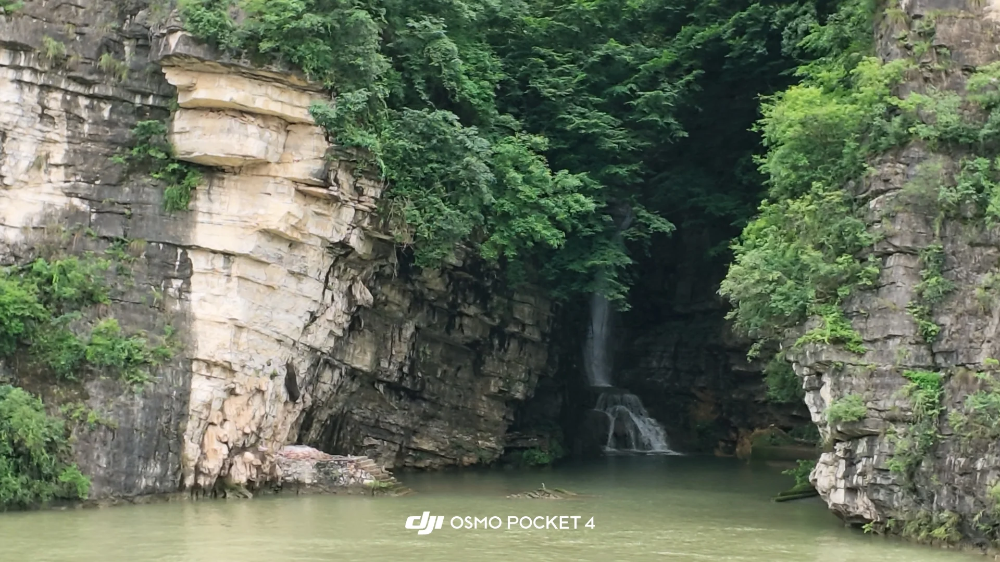
> [OCR] dji OSMO POCKET 4
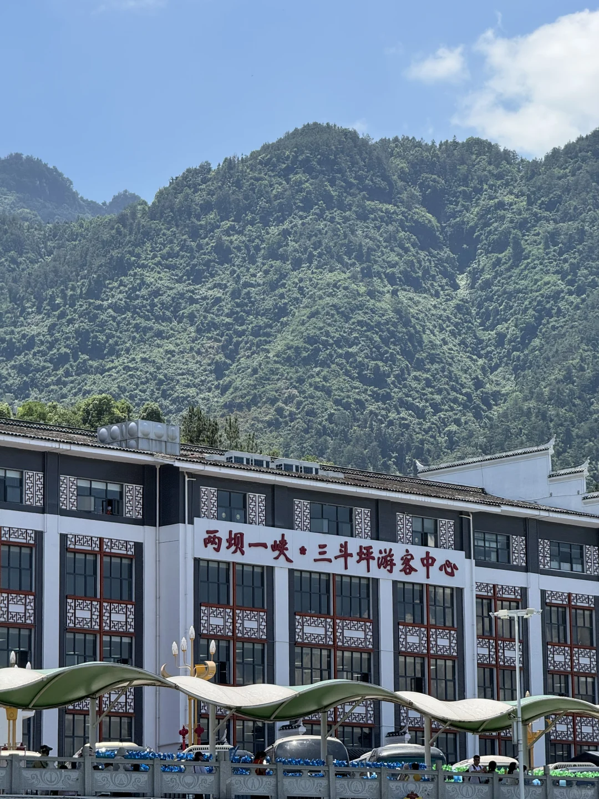
> [OCR] 两坝一峡·三斗坪游客中心
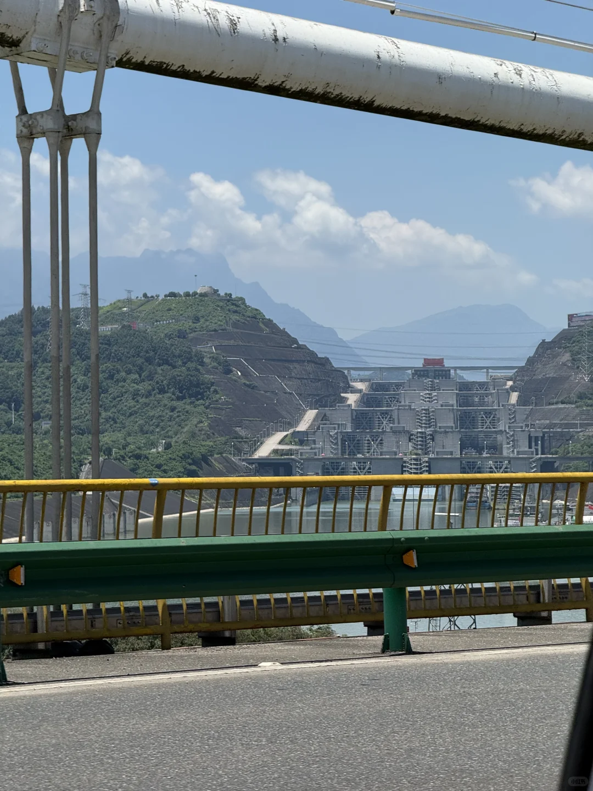
> [OCR] [?][?]
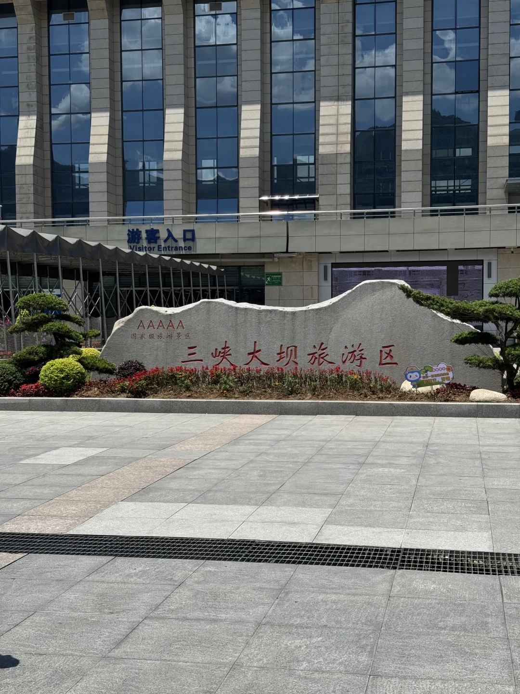
> [OCR] 游客入口
Visitor Entrance
AAAAA
国家级旅游区
三峡大坝旅游区
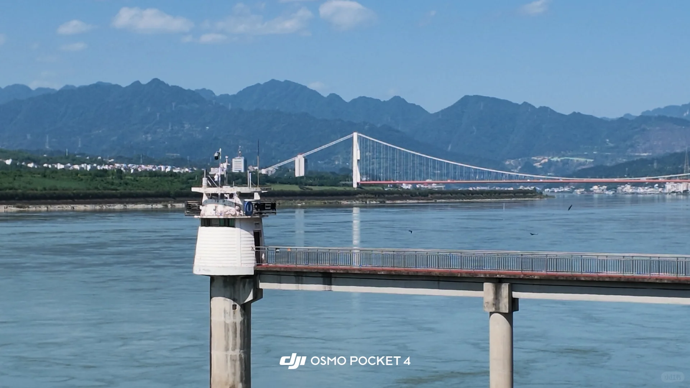
> [OCR] dji OSMO POCKET 4
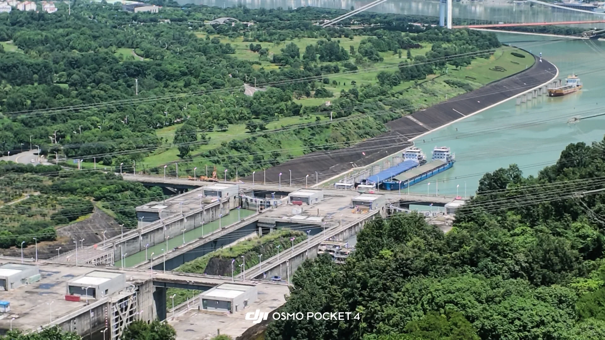
> [OCR] DJI OSMO POCKET4
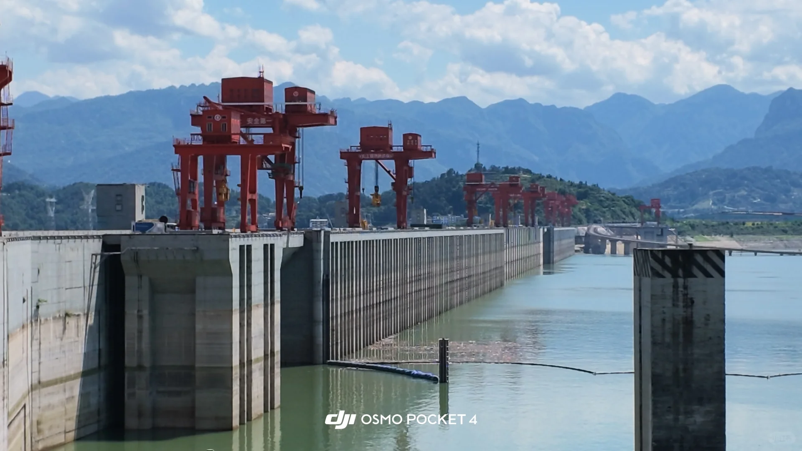
> [OCR] 安全第一
dji OSMO POCKET 4
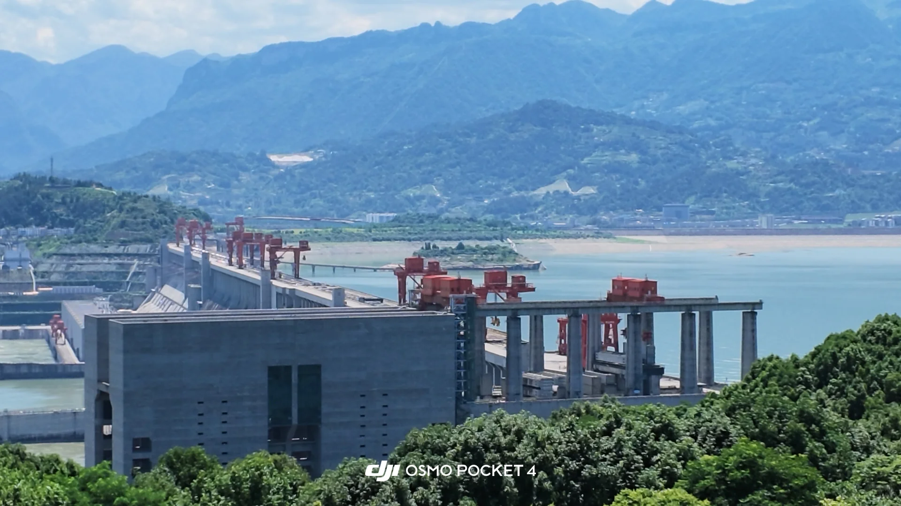
> [OCR] dji OSMO POCKET 4
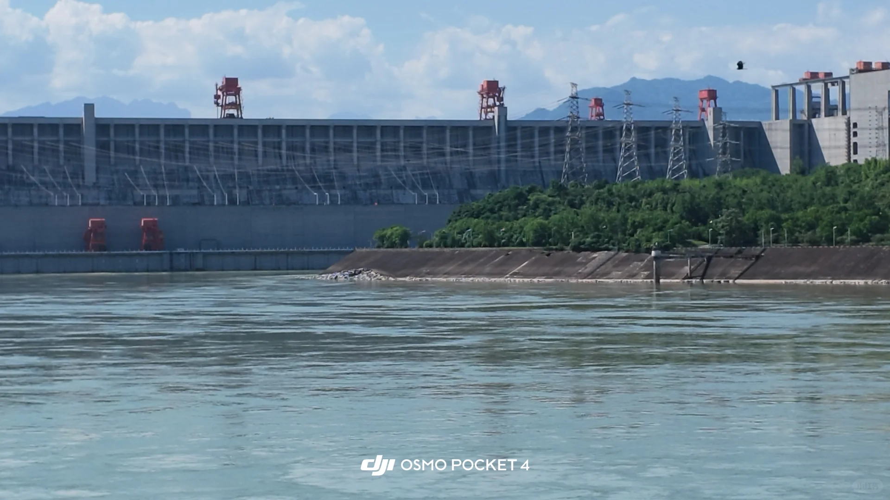
> [OCR] dji OSMO POCKET 4
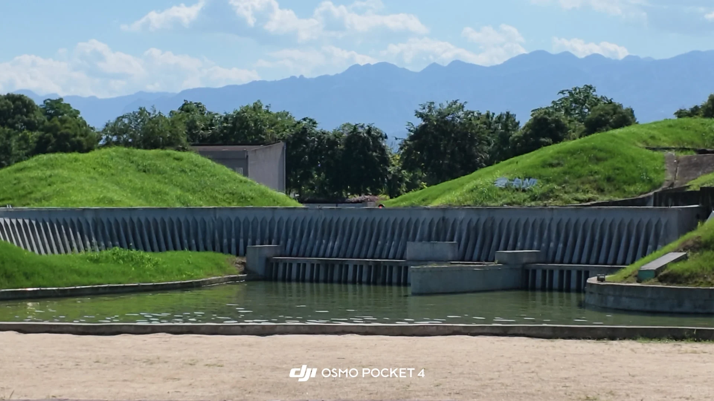
> [OCR] dji OSMO POCKET 4

> [OCR] [?]
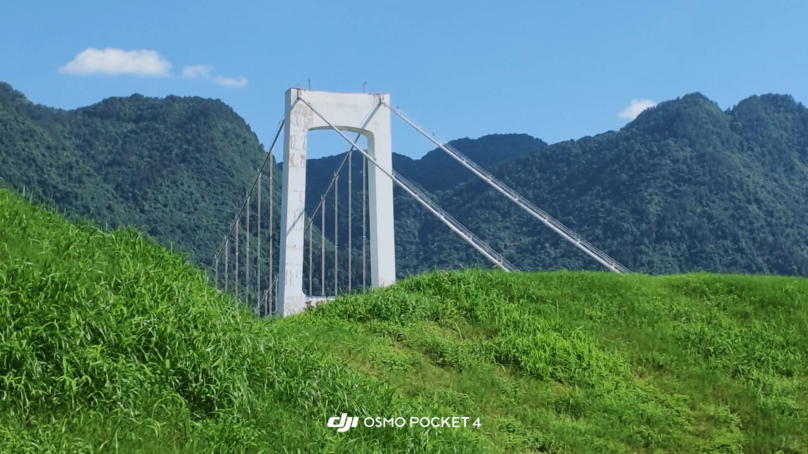
> [OCR] dji OSMO POCKET 4

## 正文
-
🔔票
1️⃣船票
出发前一天准备好“上水净船票”，也就是单程船票，从三峡游客中心出发，到三斗坪码头
	
2️⃣观光车票
三峡大坝旅游区需要乘坐观光车
-
🔔路线
三峡游客中心➡️葛洲坝（船观）➡️西陵峡（船观）➡️三斗坪码头➡️三峡大坝旅游区
-
🔔行程
1️⃣检票登船
三峡游客中心检票登船，7:58登船，8:11开船
船上一楼有卫生间🚻、演播厅，三层有开放式的甲板
	
2️⃣葛洲坝
抵达葛洲坝码头时，船上工作人员会提醒，这时可以到三楼的甲板，等待“水上电梯”的运转，体验“水涨船高”的全过程
	
3️⃣西陵峡
吹着峡谷清风，坐船沿江赏西陵峡连绵山水
	
4️⃣三斗坪码头
预估12:15抵达三斗坪码头，开始下船，下船后直接打车到三峡大坝游客换乘中心
	
5️⃣三峡大坝旅游区
三峡大坝换乘中心对面有餐馆，可以在对面补给
在换乘中心搭乘景交车，按照旅游区规划好的路线进行游览
	
换乘中心➡️坛子岭（扶手电梯可登顶）➡️185观景平台➡️三峡工程博物馆➡️截流纪念园➡️微缩景观园➡️换乘中心
	
15:37，从微缩景观园步行到换乘中心，步行途中打个拼车，大概16:43回到星光天地
	
#宜昌[话题]# #两坝一峡[话题]# #葛洲坝[话题]# #三峡大坝[话题]#

---