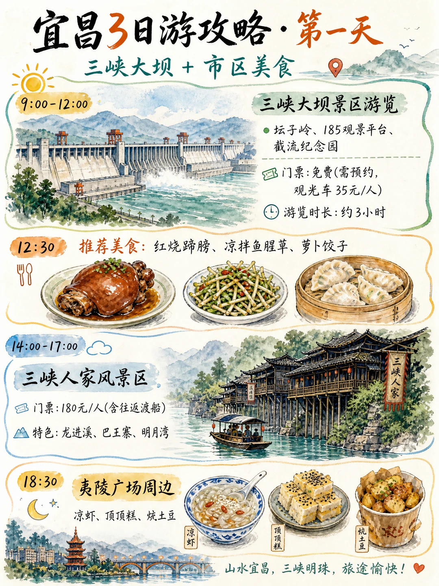
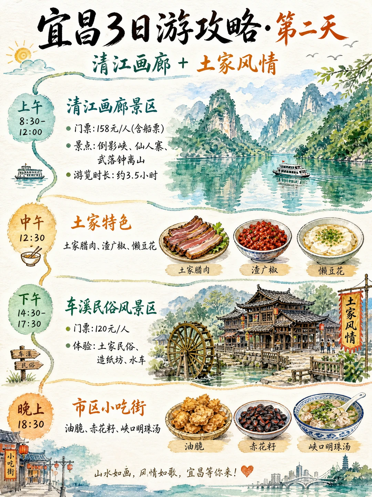
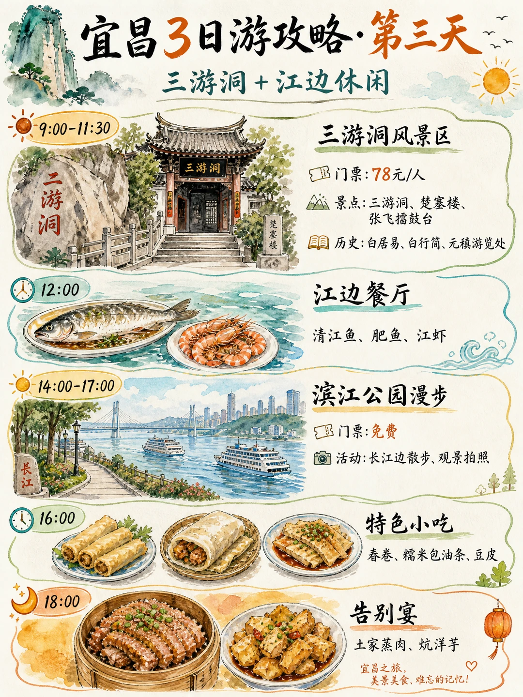
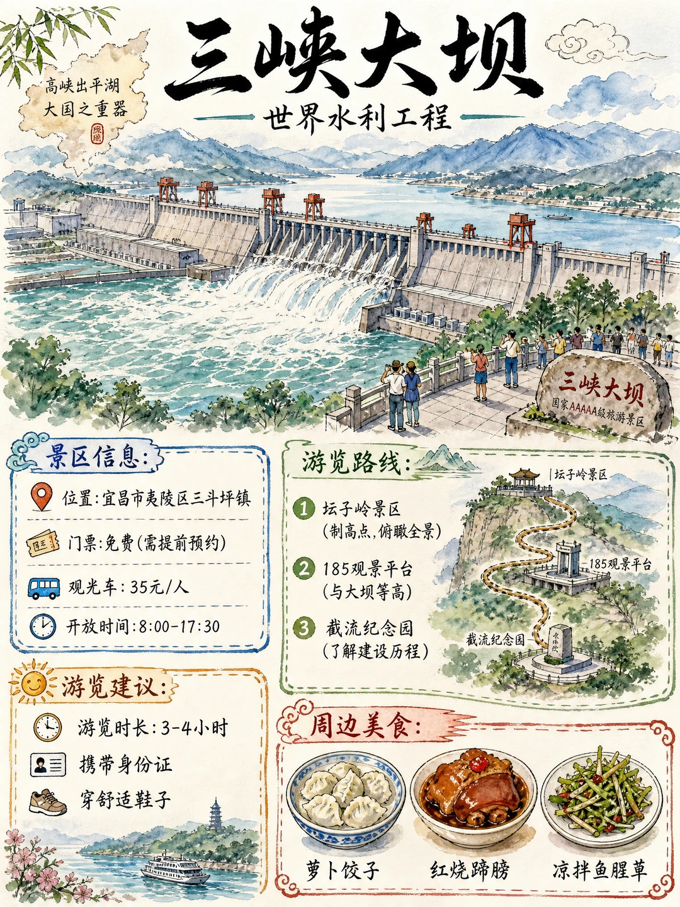
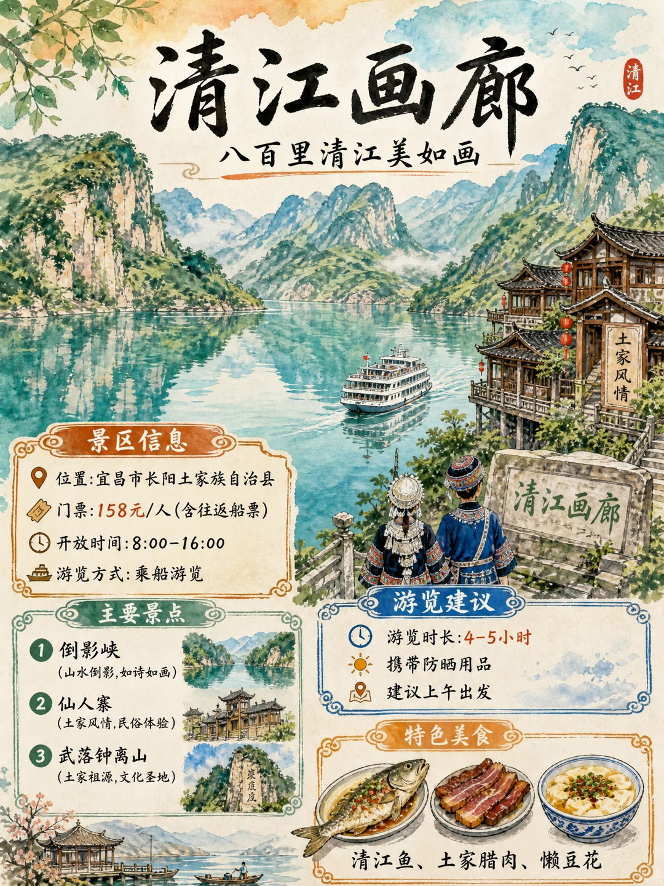

# 宜昌3日深度游｜山水土家手绘攻略地图🌊

- 作者: 墨诚Ai设计
- 👍128 · 💬 · ⭐167 · 图 5
- feed_id: 6a599fb7000000001002481a

> [OCR] 宜昌3日游攻略·第一天
三峡大坝+市区美食

9:00-12:00
三峡大坝景区游览
坛子岭、185观景平台、截流纪念园
门票：免费(需预约，
观光车35元/人)
游览时长：约3小时

12:30 推荐美食：红烧蹄膀、凉拌鱼腥草、萝卜饺子

14:00-17:00 三峡人家风景区
门票：180元/人(含往返渡船)
特色：龙进溪、巴王寨、明月湾

18:30 夷陵广场周边
凉虾、顶顶糕、烩土豆
凉虾
顶顶糕
烩土豆
山水宜昌，三峡明珠，旅途愉快！

> [OCR] 宜昌3日游攻略·第二天
清江画廊 + 土家风情

上午
8:30-12:00
清江画廊景区
• 门票：158元/人（含船票）
• 景点：倒影峡、仙人寨、武落钟离山
• 游览时长：约3.5小时

中午
12:30
土家特色
土家腊肉、渣广椒、懒豆花
土家腊肉
渣广椒
懒豆花

下午
14:30-17:30
车溪民俗风景区
• 门票：120元/人
• 体验：土家民俗、造纸坊、水车

晚上
18:30
市区小吃街
油脆、赤花籽、峡口明珠汤
油脆
赤花籽
峡口明珠汤

山水如画，风情如歌，宜昌等你来！

> [OCR] 宜昌3日游攻略·第三天
三游洞+江边休闲

9:00-11:30
二游洞

三游洞风景区
门票：78元/人
景点：三游洞、楚塞楼、张飞擂鼓台
历史：白居易、白行简、元稹游览处

12:00
江边餐厅
清江鱼、肥鱼、江虾

14:00-17:00
滨江公园漫步
门票：免费
活动：长江边散步、观景拍照

16:00
特色小吃
春卷、糯米包油条、豆皮

18:00
告别宴
土家蒸肉、炕洋芋
宜昌之旅，
美景美食，难忘的记忆！

> [OCR] 三峡大坝
世界水利工程

景区信息：
位置：宜昌市夷陵区三斗坪镇
门票：免费(需提前预约)
观光车：35元/人
开放时间：8:00-17:30

游览建议：
游览时长：3-4小时
携带身份证
穿舒适鞋子

周边美食：
萝卜饺子 红烧蹄膀 凉拌鱼腥草

游览路线：
① 坛子岭景区 (制高点,俯瞰全景)
② 185观景平台 (与大坝等高)
③ 截流纪念园 (了解建设历程)

坛子岭景区
185观景平台

> [OCR] 清江画廊
八百里清江美如画

景区信息
位置:宜昌市长阳土家族自治县
门票:158元/人(含往返船票)
开放时间:8:00-16:00
游览方式:乘船游览

主要景点
① 倒影峡
(山水倒影,如诗如画)
② 仙人寨
(土家风情,民俗体验)
③ 武落钟离山
(土家祖源,文化圣地)

游览建议
游览时长:4-5小时
携带防晒用品
建议上午出发

特色美食
清江鱼、土家腊肉、懒豆花

## 正文
Day1 三峡大坝 + 峡江风光初体验🌅
上午 9 点直奔三峡大坝景区，门票免费但一定要提前预约！沿着坛子岭、185 观景平台、截流纪念园慢慢逛，近距离感受世界级水利工程的壮阔，全程游览大约 3 小时，记得带上🪪、穿舒服的平底鞋👟。
中午尝本地特色硬菜，软糯入味的红烧蹄膀、清爽凉拌鱼腥草、鲜美的萝卜饺子🥟，地道峡江风味一口沦陷。
下午前往三峡人家风景区，180 元门票包含往返渡船⛴️，龙进溪、巴王寨、明月湾一步一景，吊脚楼临水而立，沉浸式感受峡江人家的生活气息。
傍晚到夷陵广场周边逛吃，凉虾、顶顶糕、炕土豆挨个打卡，晚风配小吃，完美结束第一天行程🌙
Day2 清江画廊沉浸式土家之旅🏞️
全天留给有 “八百里清江美如画” 之称的清江画廊！建议上午 8 点半出发，158 元门票含往返船票，乘船穿梭倒影峡，江面碧水如镜，山水倒影宛如水墨画。中途停靠仙人寨体验土家民俗，武落钟离山了解土家族起源文化，全程游览 3.5 小时左右，记得备好防晒用品🧴。
中午安排土家特色餐，肥瘦相间的土家腊肉、香辣开胃渣广椒、嫩滑懒豆花，都是本地人常吃的家常菜。
下午去车溪民俗风景区，120 元门票解锁古法造纸坊、大水车，漫步古村落深度感受土家族传统文化🪆。
晚上打卡市区小吃街，酥脆油脆、解腻赤花籽、鲜醇峡口明珠汤，烟火气拉满🍢
Day3 人文古迹 + 江边休闲收官📜
上午打卡三游洞，78 元门票逛遍三游洞、楚塞楼、张飞擂鼓台，追随白居易、白行简、元稹的足迹，感受千年诗词人文底蕴。
中午在江边餐厅吃现捞清江鱼、肥美江虾🦐，鲜美的河鲜不容错过。
下午前往免费的滨江公园，沿着长江步道散步吹风，隔江远眺两岸城市与青山，随手拍都是治愈江景大片📸。
沿路顺路打卡春卷、糯米包油条、豆皮等街边小吃，傍晚吃一顿土家蒸肉、炕洋芋告别宴，用美食圆满收尾宜昌之旅🍽️
出行实用 Tips
清江画廊、三峡人家需要坐船，备好防晒、遮阳帽；
宜昌景点分布略分散，跨景区出行打车 / 报一日游团更省心🚗；
本地小吃种类丰富，分量适中，多逛几条街能一次尝全。
#宜昌旅游[话题]# #宜昌三日游[话题]# #三峡大坝[话题]# #清江画廊[话题]# #湖北周边游[话题]# #土家美食[话题]# #短途旅行攻略[话题]#

---