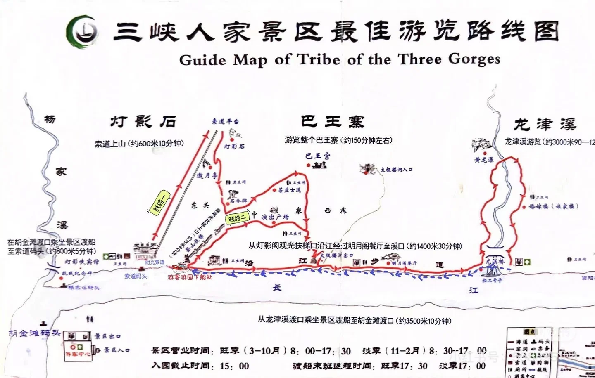
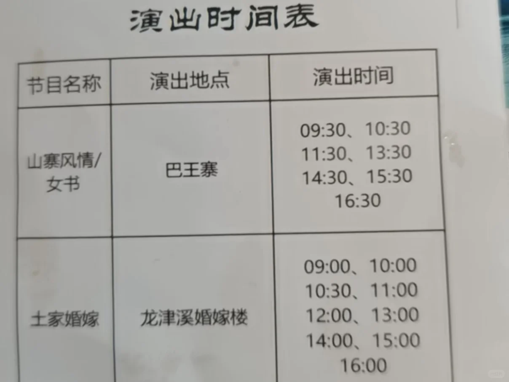
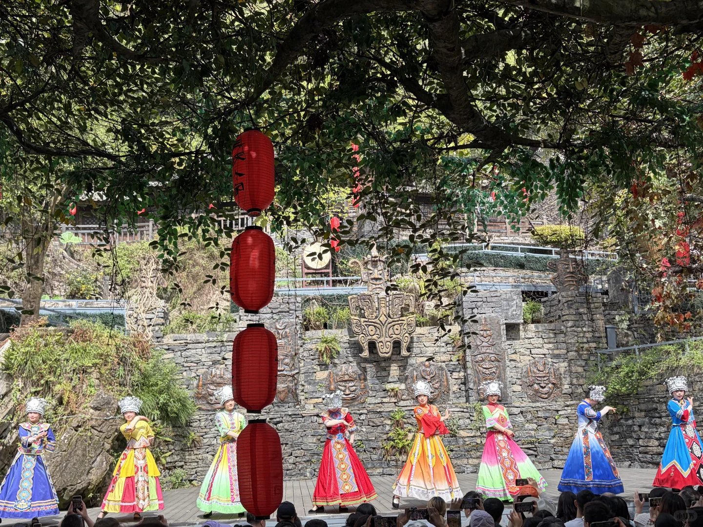
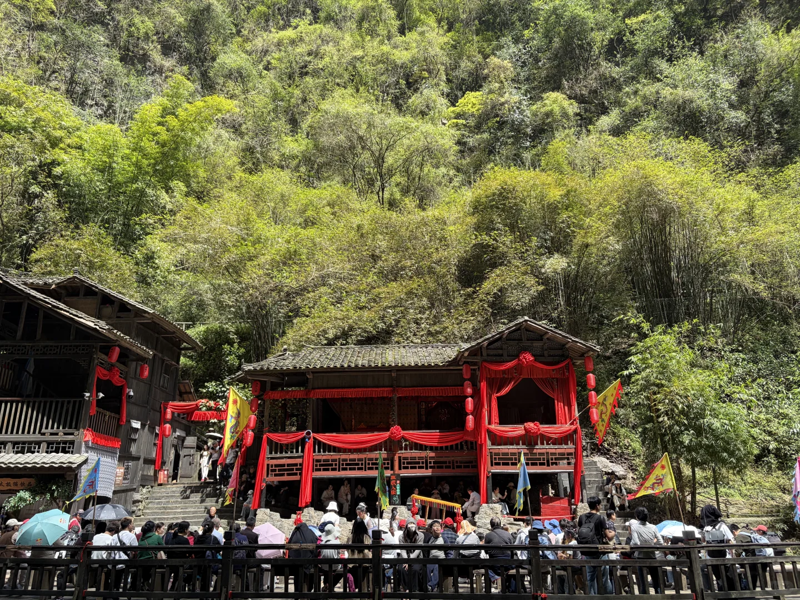
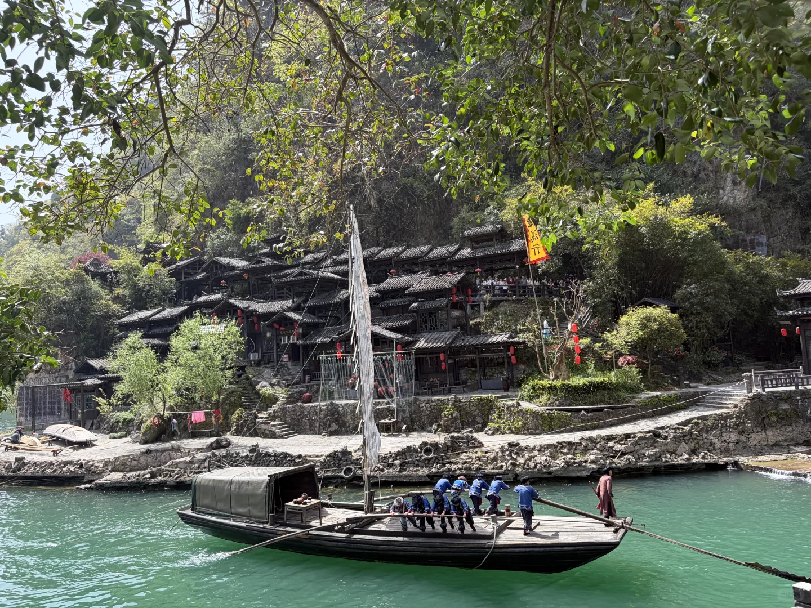
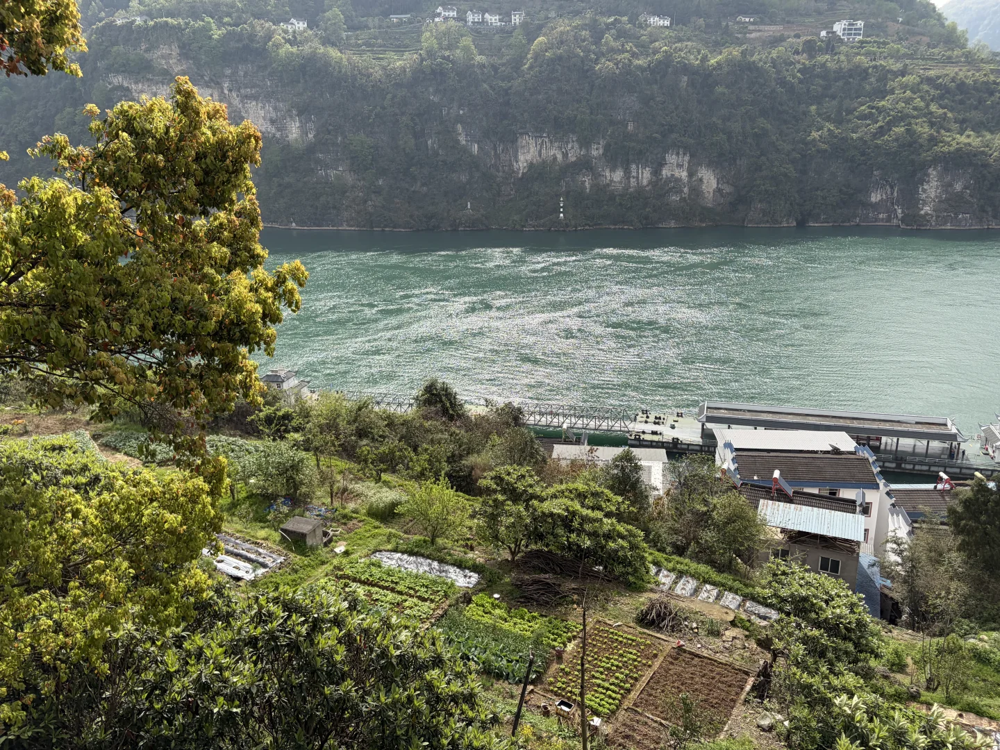

# 船入船出三峡人家的tips

- 作者: Joe
- 👍127 · 💬31 · ⭐87 · 图 6
- feed_id: 69d0d845000000001e00f4ba

> [OCR] 三峡人家景区最佳游览路线图
Guide Map of Tribe of the Three Gorges

灯影石
索道上山(约600米10分钟)
巴王寨
游览整个巴王寨（约150分钟左右）
龙津溪
龙津溪游览（约3000米90—120分钟）

在胡金滩渡口乘坐景区渡船至索道码头（约800米5分钟）
从灯影阁观光扶梯口沿江经过明月阁餐厅至溪口(约1400米30分钟)
从龙津溪渡口乘坐景区渡船至胡金滩渡口（约3500米10分钟）

索道码头
游客游园下船处

景区营业时间：旺季（3-10月）8:00-17:30 淡季（11-2月）8:30-17:00
入园截止时间：15:00 渡船末班返程时间：旺季17:30 淡季17:00

胡金滩码头
景区出口
游客中心
景区入口

> [OCR] 演出时间表

节目名称 | 演出地点 | 演出时间
山寨风情/女书 | 巴王寨 | 09:30、10:30  
| | 11:30、13:30  
| | 14:30、15:30  
| | 16:30  
土家婚嫁 | 龙津溪婚嫁楼 | 09:00、10:00
| | 10:30、11:00
| | 12:00、13:00
| | 14:00、15:00
| | 16:00

> [OCR] 小红书

> [OCR] 太极阴阳师

> [OCR] [?]

> [OCR] [?]

## 正文
最早一班是坐船 8点进入，二等座升一等是40元，不用纠结，差别不大，40元是来回。
回来，坐船 2点到6点，船满发船
	
坐船是下来是电梯入口，电梯30直达半山，多走300米 索道可以直到山顶。
	
三峡人家里面走向明月阁的路上，可以遇到15吃饱的小摊子。船上 提供35元团餐，小红书上风评一般，我没尝试，具体味道不清楚。
	
景区三个表演：
船工号子在龙津溪后半段，我是两点看到的，具体时间没到公示。
其余的两个，具体时间见图2，表演都是二十分钟左右，提前去有板凳坐。
土家婚嫁，和巴王寨的唱跳歌舞，都还挺特别。
	
这边水清的像抠图，值得一看。
	
船上的矿泉水是3块钱，景区里的矿泉水有的是3块钱，5块钱，鲜榨橙汁我买的是十元一瓶，都还算能接受。
	
注意⚠️
船进船出需要在同一个码头，所以要走一部分回头路，需要保留好体力，返回我走了小半个小时，有点累。
#坐船看风景[话题]#

---