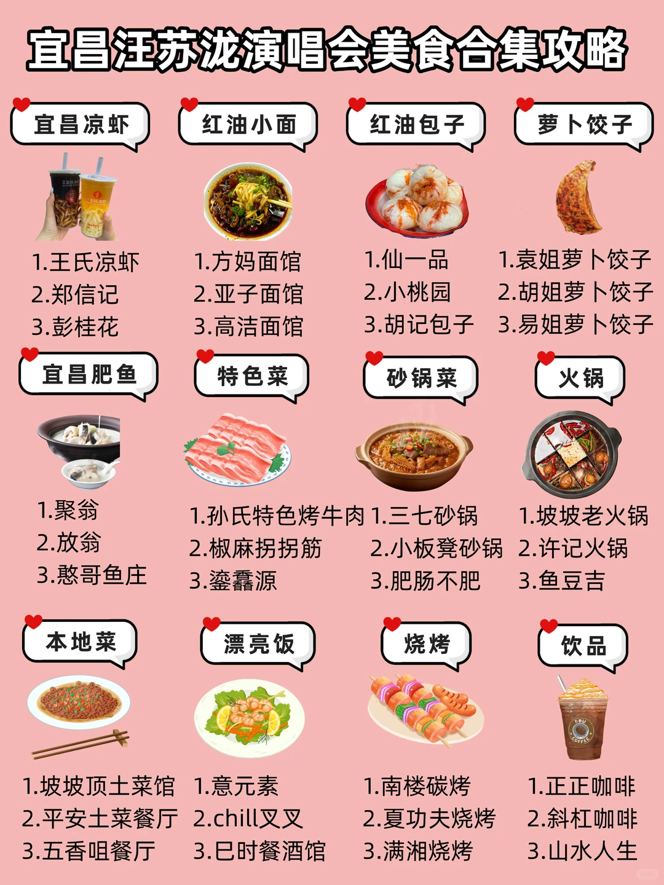

# 宜昌汪苏泷演唱会超全美食合集攻略🔥附地址

- 作者: 船进三峡人家
- 👍119 · 💬5 · ⭐123 · 图 1
- feed_id: 69fda4a8000000003502db5a

> [OCR] 宜昌汪苏泷演唱会美食合集攻略

宜昌凉虾
1.王氏凉虾
2.[?]信记
3.彭桂花

红油小面
1.方妈面馆
2.亚子面馆
3.高洁面馆

红油包子
1.仙一品
2.小桃园
3.胡记包子

萝卜饺子
1.袁姐萝卜饺子
2.[?]姐萝卜饺子
3.易姐萝卜饺子

宜昌肥鱼
1.聚翁
2.放翁
3.憨哥鱼庄

特色菜
1.孙氏特色烤牛肉
2.椒麻拐拐筋
3.鎏蠢源

砂锅菜
1.三七砂锅
2.[?]板凳砂锅
3.肥肠不肥

火锅
1.坡坡老火锅
2.许记火锅
3.鱼豆吉

本地菜
1.坡坡顶土菜馆
2.平安土菜餐厅
3.五香咀餐厅

漂亮饭
1.[?]元素
2.chill叉叉
3.巳时餐酒馆

烧烤
1.南楼碳烤
2.夏功夫烧烤
3.满湘烧烤

饮品
1.正正咖啡
2.斜杠咖啡
3.山水人生

## 正文
宜昌汪苏泷演唱会5.29-5.31连开三场，小泷包们快提前收藏这份超全的宜昌美食合集攻略吧～
	
【宜昌凉虾】
1️⃣王氏凉虾(解放路店)
2️⃣郑信记凉虾(解放路店)
3️⃣彭桂花凉虾(水悦城店)
【红油小面】
1️⃣方妈面馆(福绥路店)
2️⃣亚子面馆(气象台小区店)
3️⃣高洁面馆(墨池苑店)
【红油包子】
1️⃣仙一品(隆康路店)
2️⃣小桃园(胜利三路老字号店)
3️⃣胡记包子(福绥路店)
【萝卜饺子】
1️⃣袁姐萝卜饺子(解放路朱哥板栗旁)
2️⃣胡姐脆皮萝卜饺子(宜昌国际广场店)
3️⃣易姐萝卜饺子(CBD店)
【宜昌肥鱼】
1️⃣聚翁(墨池苑店)
2️⃣放翁(西陵峡口风景区店)
3️⃣憨哥鱼庄(陶珠路店)
【特色菜】
1️⃣孙氏特色烤牛肉(汕头路店)
2️⃣椒麻拐拐筋(西陵后路店)
3️⃣鎏馫源(步行街店)
【砂锅菜】
1️⃣三七砂锅(体育场北路店)
2️⃣小板凳砂锅(解放路店)
3️⃣肥肠不肥(大公桥店)
【火锅】
1️⃣坡坡老火锅(伍家岗区港前路店)
2️⃣许记火锅(夷陵大道店)
3️⃣鱼豆吉火锅(滨江万达广场店)
【本地菜】
1️⃣坡坡顶土菜馆(云集路店)
2️⃣平安土菜(夷陵大道店)
3️⃣五香咀餐厅(宜昌国际广场店)
【漂亮饭】
1️⃣意元素(星光天地店)
2️⃣chill叉叉(环城南路店)
3️⃣巳时餐酒馆(金缔华城店)
【烧烤】
1️⃣南楼碳烤(港窑路店)
2️⃣夏功夫烧烤(紫宸府店)
3️⃣满湘烧烤(步行街店)
【饮品】
1️⃣正正咖啡(金融街店)
2️⃣斜杠咖啡(建委大厦旁)
3️⃣山水人生(华灯初上店)
#湖北旅游[话题]# #攻略[话题]# #汪苏泷[话题]# #宜昌[话题]# #演唱会[话题]# #美食[话题]# #美食解构主理人[话题]# #美食特种兵[话题]##本地人做的攻略[话题]#

---