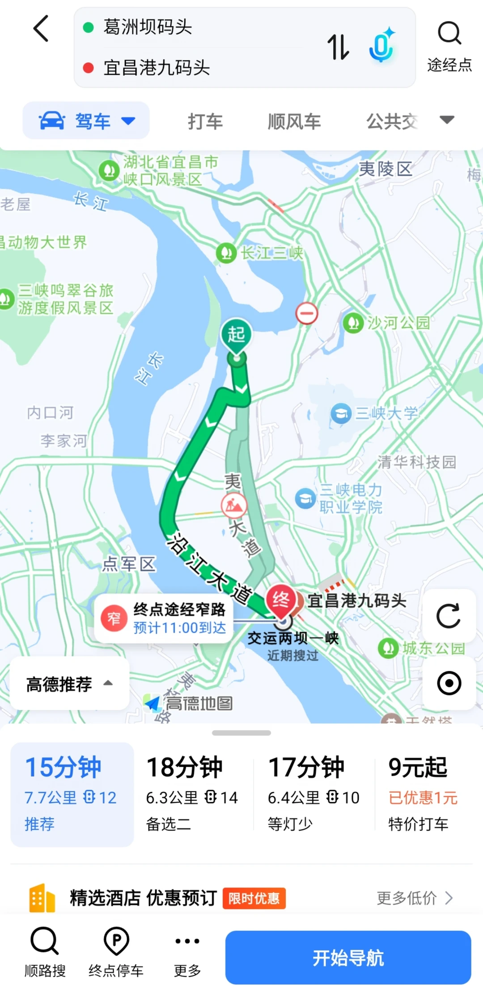

# 宜昌旅游攻略混乱，一日游

- 作者: 壮壮
- 👍117 · 💬19 · ⭐110 · 图 2
- feed_id: 69cddb2a000000002202aeeb

> [OCR] 三峡大坝
三峡人家
两坝一峡
概念区分

> [OCR] 葛洲坝码头
宜昌港九码头

驾车
打车
顺风车
公交

湖北省宜昌市
峡口风景区
长江三峡
沙河公园
动物大世界
三峡鸣翠谷旅游度假风景区
起
[ ]
终点途经窄路
预计11:00到达
交运两坝一峡
近期搜过
夷陵区
三峡大学
清华科技园
内口河
李家河
沿江大道
宜昌港九码头
点军区
城东公园

高德推荐
[ ]
15分钟
7.7公里 12
推荐
18分钟
6.3公里 14
备选二
17分钟
6.4公里 10
等灯少
9元起
已优惠1元
特价打车

精选酒店 优惠预订 [限时优惠]
更多低价 >

顺路搜 终点停车 更多 开始导航

## 正文
三峡人家，三峡大坝是景“点”
两坝一峡可以理解为旅游产品=长江坐船+三峡大坝景点旅游吗？
长江坐船包括坐游船看西陵峡 + 过葛洲坝 + 最后到三峡大坝
三峡人家可以坐船去，可以坐车去
去三峡人家坐船对比两坝一峡长江坐船
三去峡人家坐船码头：葛洲坝码头-- 下船终点：三峡人家胡金滩码头（景区入口）
两坝一峡长江坐船：九码头---下船终点：三斗坪/太平溪码头（三峡大坝坝区）
都是在长江坐船，但是去三峡人家坐船和两坝一峡对比，少坐了一段，少了葛洲坝过闸
- 三峡人家船 = 短途摆渡船+看一小段峡江
- 两坝一峡船 = 完整长江观光+葛洲坝过闸+全程西陵峡+直达大坝
想一日游三峡人家和三峡大坝可以先坐船到三峡人家再从三峡人家坐船到三峡大坝，再从三峡大坝坐车到市区吗？
外地人混乱#宜昌旅游[话题]# #旅游攻略[话题]##三峡人家[话题]##三峡大坝[话题]##两坝一峡[话题]# #旅游[话题]# #一日游[话题]#

---