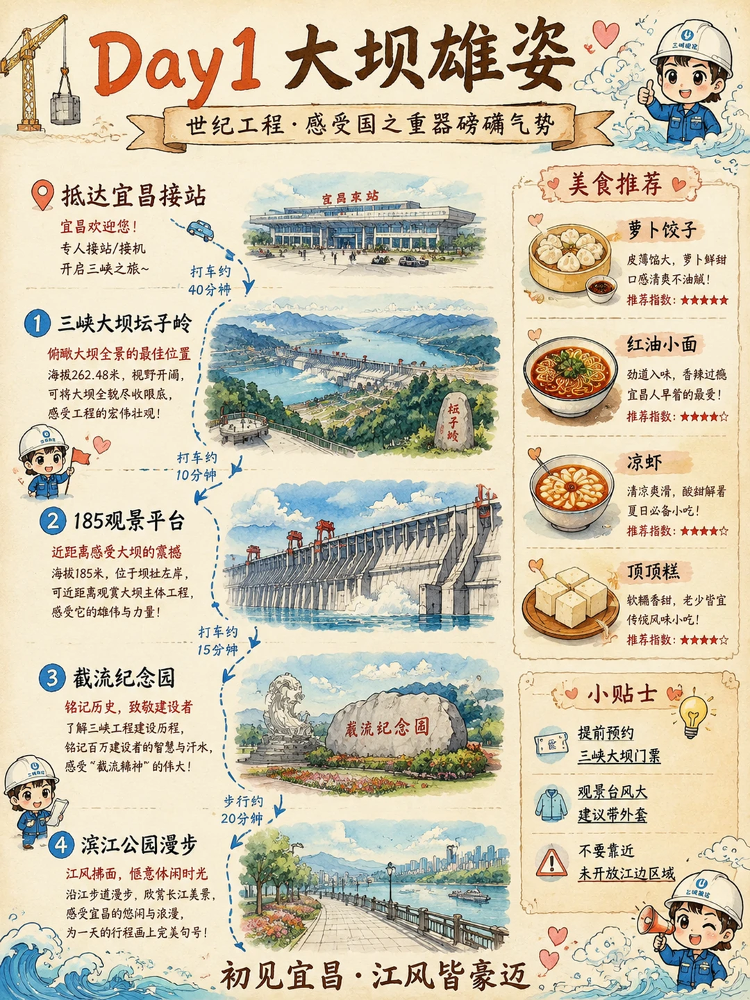
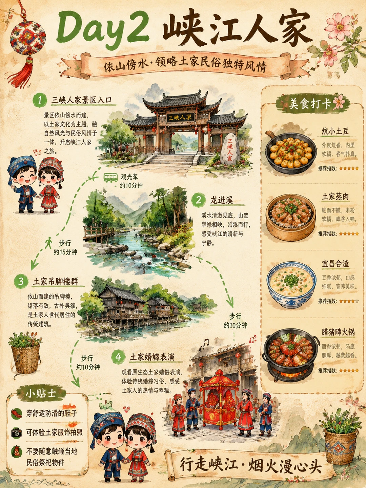
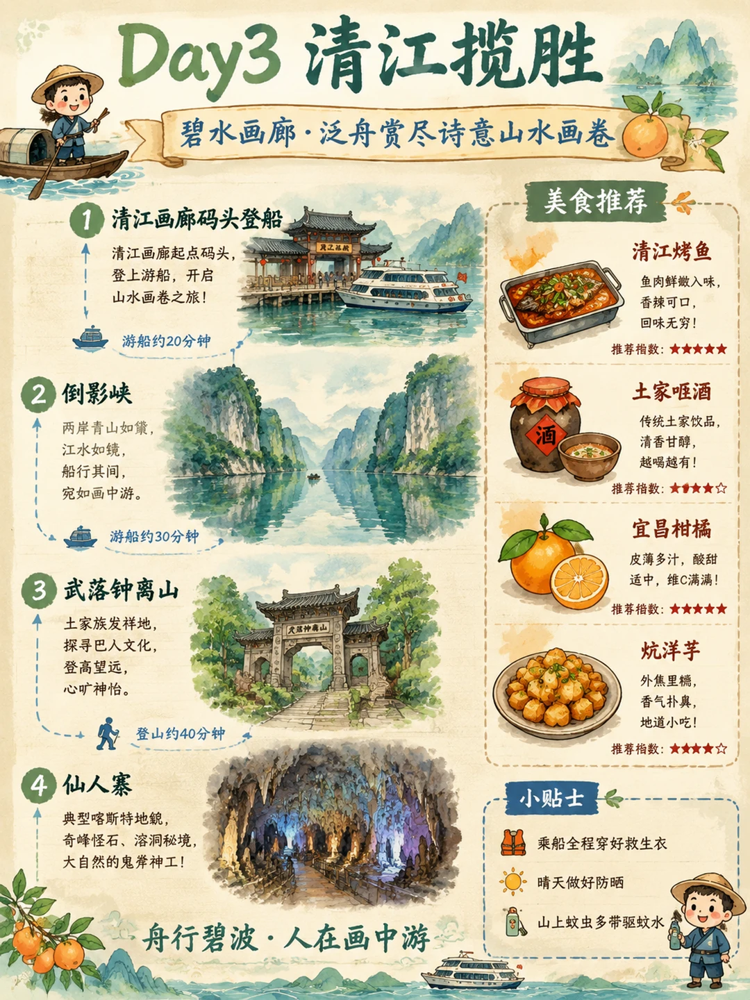
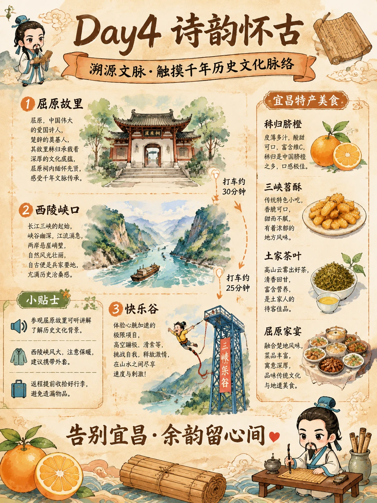

# 宜昌4日游 手绘旅行攻略

- 作者: 王安全的富贵儿
- 👍116 · 💬4 · ⭐129 · 图 4
- feed_id: 6a6cb10800000000220165f2

> [OCR] Day1 大坝雄姿
世纪工程·感受国之重器磅礴气势

抵达宜昌接站
宜昌欢迎您！
专人接站/接机
开启三峡之旅~

打车约40分钟

美食推荐
萝卜饺子
皮薄馅大，萝卜鲜甜
口感清爽不油腻！
推荐指数：★★★★★

红油小面
劲道入味，香辣过瘾
宜昌人早着的最爱！
推荐指数：★★★★☆

凉虾
清凉爽滑，酸甜解暑
夏日必备小吃！
推荐指数：★★★★☆

顶顶糕
软糯香甜，老少皆宜
传统风味小吃！
推荐指数：★★★★☆

小贴士
提前预约
三峡大坝门票
观景台风大
建议带外套
不要靠近
未开放江边区域

初见宜昌·江风皆豪迈

> [OCR] Day2 峡江人家
依山傍水·领略土家民俗独特风情

1 三峡人家景区入口
景区依山傍水而建，
以土家文化为主题，
融自然风光与民俗风情于一体，
开启峡江人家之旅。

观光车
约10分钟

步行
约15分钟

2 龙进溪
溪水清澈见底，山峦翠绿相映，
沿溪而行，
感受峡江的清新与宁静。

步行
约10分钟

3 土家吊脚楼群
依山而建的吊脚楼，
错落有致，古朴典雅，
是土家人世代居住的传统建筑。

步行
约10分钟

4 土家婚嫁表演
观看原生态土家婚俗表演，
体验传统婚嫁习俗，
感受土家人的热情与幸福。

小贴士
穿舒适防滑的鞋子
可体验土家服饰拍照
不要随意触碰当地民俗祭祀物件

美食打卡
炕小土豆
外皮焦香，内里软糯，香气扑鼻。
推荐指数：★★★★★

土家蒸肉
肥而不腻，米粉软糯，咸香入味。
推荐指数：★★★★★

宜昌合渣
豆香浓郁，口感细腻，营养美味。
推荐指数：★★★★☆

腊猪蹄火锅
脂香浓郁，汤底醇厚，越煮越香。
推荐指数：★★★★★

行走峡江·烟火漫心头

> [OCR] Day3 清江揽胜
碧水画廊·泛舟赏尽诗意山水画卷

1. 清江画廊码头登船
清江画廊起点码头，
登上游船，开启
山水画卷之旅！

游船约20分钟

2. 倒影峡
两岸青山如黛，
江水如镜，
船行其间，
宛如画中游。

游船约30分钟

3. 武落钟离山
土家族发祥地，
探寻巴人文化，
登高望远，
心旷神怡。

登山约40分钟

4. 仙人寨
典型喀斯特地貌，
奇峰怪石、溶洞秘境，
大自然的鬼斧神工！

舟行碧波·人在画中游

美食推荐
清江烤鱼
鱼肉鲜嫩入味，香辣可口，回味无穷！
推荐指数：★★★★★

土家咂酒
传统土家饮品，清香甘醇，越喝越有！
推荐指数：★★★★☆

宜昌柑橘
皮薄多汁，酸甜适中，维C满满！
推荐指数：★★★★★

炕洋芋
外焦里糯，香气扑鼻，地道小吃！
推荐指数：★★★★☆

小贴士
乘船全程穿好救生衣
晴天做好防晒
山上蚊虫多带驱蚊水

> [OCR] Day4 诗韵怀古
溯源文脉·触摸千年历史文化脉络

1 屈原故里
屈原，中国伟大的爱国诗人，
楚辞的奠基人，
其故里秭归承载着深厚的文化底蕴，
屈原祠内缅怀先贤，
感受千年文脉传承。

2 西陵峡口
长江三峡的起始，
峡谷幽深，江流湍急，
两岸悬崖峭壁，
自然风光壮丽，
自古便是兵家要地，
充满历史沧桑感。

小贴士
参观屈原故里可听讲解了解历史文化背景。
西陵峡风大，注意保暖，建议携带外套。
返程提前收拾好行李，避免遗漏物品。

3 快乐谷
体验心跳加速的极限项目，
高空蹦极、滑索等，
挑战自我，释放激情，
在山水之间尽享速度与刺激！

宜昌特产美食

秭归脐橙
皮薄多汁，酸甜可口，富含维C，
秭归是中国脐橙之多，口感极佳。

三峡茗酥
传统特色小吃，
香脆可口，
甜而不腻，
有着浓郁的地方风味。

土家茶叶
高山云雾出好茶，
清香回甘，
富含营养，
是土家人待客佳品。

屈原家宴
融合楚地风味，
菜品丰富，寓意深厚，
品味传统文化与地道美食。

告别宜昌·余韵留心间

## 正文
宜昌4日游 手绘旅行攻略#我的地图拼贴照[话题]#
宜昌的清山绿水真的太戳人啦⛰️
慢悠悠晃了四天，把喜欢的小角落都收进手账
不用赶行程挤热门，随走随停就有超多惊喜
这份手绘攻略整理的都是亲测舒服的体验点
去宜昌玩的宝子可以码住参考哦
#手绘地图[话题]# #旅游攻略[话题]# #带着手账去旅行[话题]# #城市速写[话题]# #宜昌旅行[话题]# #湖北旅游[话题]#

---