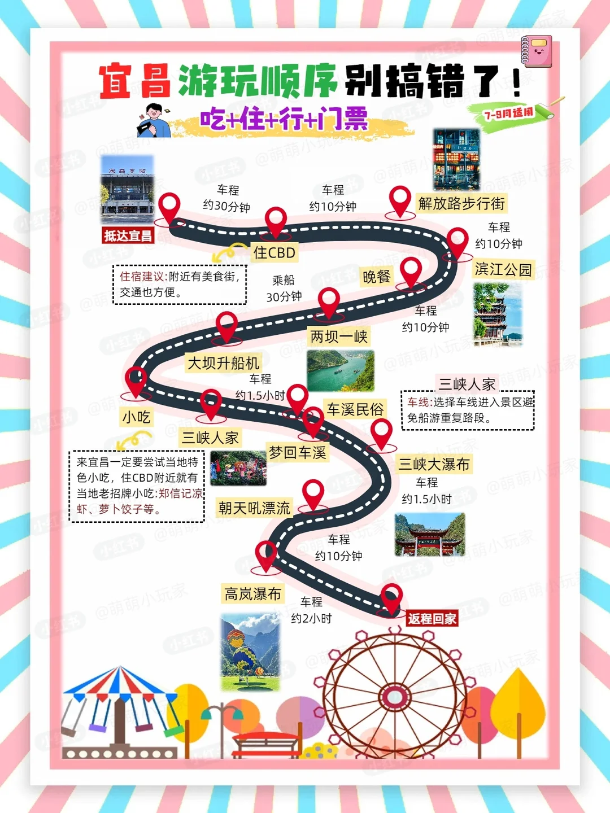
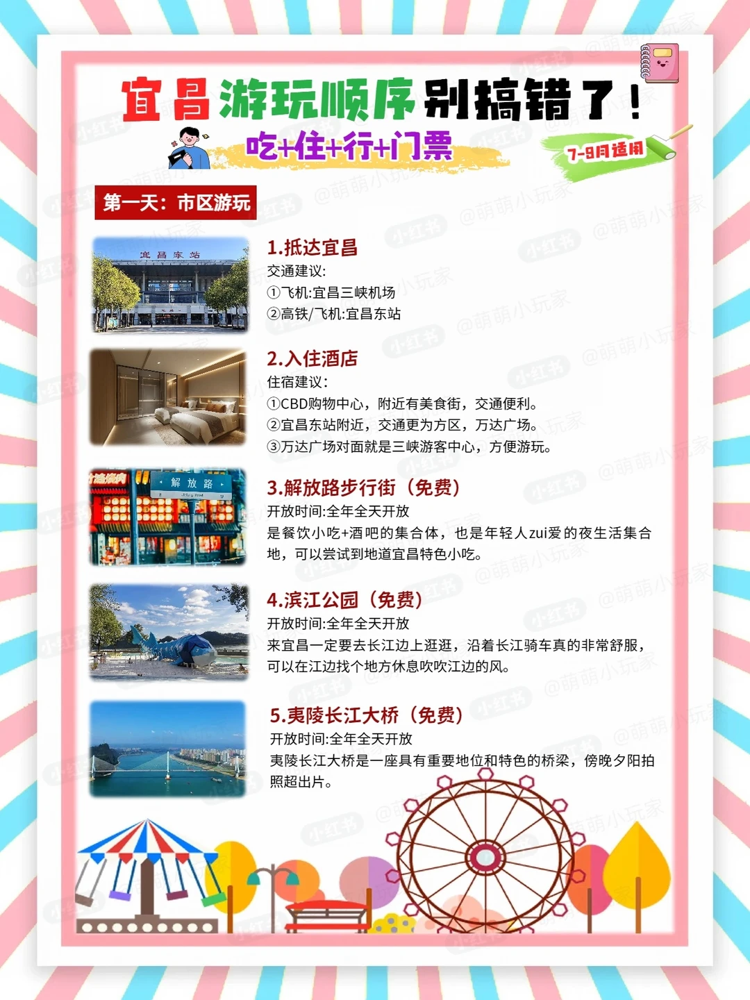
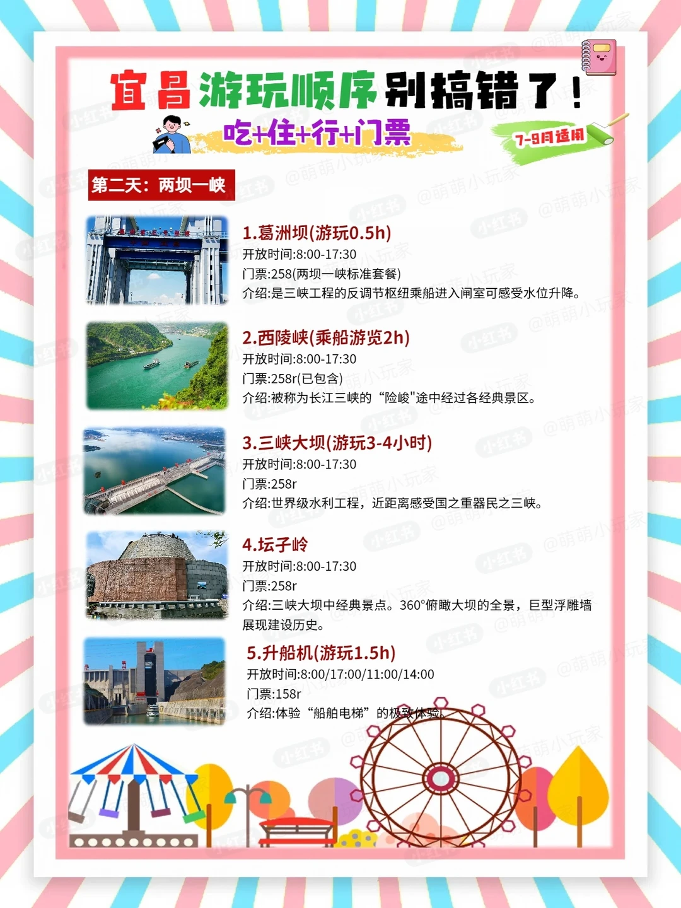
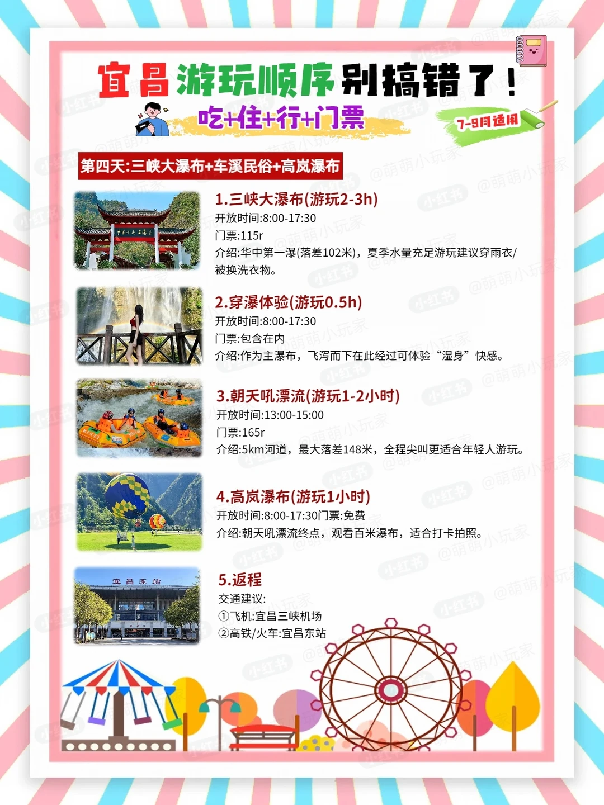
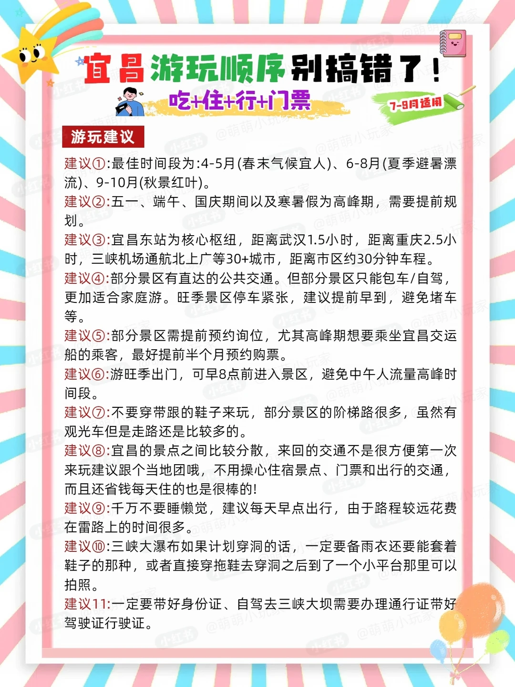

# 宜昌 4 天 3 晚保姆级攻略✨新手直接抄作业

- 作者: 萌萌小玩家
- 👍98 · 💬9 · ⭐117 · 图 6
- feed_id: 69ce4919000000002102d996

> [OCR] 宜昌游玩顺序别搞错了！
吃+住+行+门票
7-8月适用

抵达宜昌
车程约30分钟
住CBD
乘船
30分钟
晚餐
滨江公园
车程约10分钟
解放路步行街
车程约10分钟

大坝升船机
三峡人家
两坝一峡
三峡人家
车溪民俗
梦回车溪
朝天吼漂流
高岚瀑布
返程回家
车程约2小时
三峡大瀑布
车程约1.5小时
[?]小吃
住宿建议:附近有美食街，交通也方便。
来宜昌一定要尝试当地特色小吃，住CBD附近就有当地老招牌小吃：郑信记凉虾、萝卜饺子等。

> [OCR] 宜昌游玩顺序别搞错了！
吃+住+行+门票
7-9月适用

第一天：市区游玩

1. 抵达宜昌
交通建议：
①飞机:宜昌三峡机场
②高铁/飞机:宜昌东站

2. 入住酒店
住宿建议：
①CBD购物中心，附近有美食街，交通便利。
②宜昌东站附近，交通更为方便，万达广场。
③万达广场对面就是三峡游客中心，方便游玩。

3. 解放路步行街（免费）
开放时间:全年全天开放
是餐饮小吃+酒吧的集合体，也是年轻人zui爱的夜生活集合地，可以尝试到地道宜昌特色小吃。

4. 滨江公园（免费）
开放时间:全年全天开放
来宜昌一定要去长江边上逛逛，沿着长江骑车真的非常舒服，
可以在江边找个地方休息吹吹江边的风。

5. 夷陵长江大桥（免费）
开放时间:全年全天开放
夷陵长江大桥是一座具有重要地位和特色的桥梁，傍晚夕阳拍照超大片。

> [OCR] 宜昌游玩顺序别搞错了！
吃+住+行+门票
7-9月适用

第二天：两坝一峡

1. 葛洲坝(游玩0.5h)
开放时间:8:00-17:30
门票:258r (两坝一峡标准套餐)
介绍:是三峡工程的反调节枢纽乘船进入闸室可感受水位升降。

2. 西陵峡(乘船游览2h)
开放时间:8:00-17:30
门票:258r (已包含)
介绍:被称为长江三峡的“险峻”途中经过各经典景区。

3. 三峡大坝(游玩3-4小时)
开放时间:8:00-17:30
门票:258r
介绍:世界级水利工程，近距离感受国之重器民之三峡。

4. 坛子岭
开放时间:8:00-17:30
门票:258r
介绍:三峡大坝中经典景点。360°俯瞰大坝的全景，巨型浮雕墙展现建设历史。

5. 升船机(游玩1.5h)
开放时间:8:00/17:00/11:00/14:00
门票:158r
介绍:体验“船舶电梯”的极致体验。

> [OCR] 宜昌游玩顺序别搞错了！
吃+住+行+门票
7-9月适用

第三天：三峡人家+车溪民俗

1. 三峡人家(游玩4-5h)
开放时间:8:00-17:30
门票:210(三峡人家车线)
介绍:由巴王寨与龙津溪两部分组成。融合峡江风光与土家民俗。

2. 巴王寨:(游玩2h)
开放时间:8:00-17:30
门票:210(包含在内)
介绍:还原古巴国军事要塞，保留石砌成墙烽火台遗址。

3. 龙津溪(游玩2-3小时)
开放时间:8:00-17:30
门票:210(包含在内)
介绍:观三峡猕猴群、古帆船、吊脚楼，感受山水与人文。

4. 车溪民俗(游玩2-3小时)
开放时间:18:00-21:30
门票:258r
介绍:逛车溪民俗村，品土家风情，拾人间烟火气。

5. 梦回车溪(游玩1.5h)
开放时间:20:00-21:00
门票:228(包含在内)
介绍:以土家少女为的视角，串联盐道兴衰、白虎神话等故事。

> [OCR] 宜昌游玩顺序别搞错了！
吃+住+行+门票
7-9月适用

第四天:三峡大瀑布+车溪民俗+高岚瀑布

1. 三峡大瀑布(游玩2-3h)
开放时间：8:00-17:30
门票:115r
介绍:华中第一瀑（落差102米），夏季水量充足游玩建议穿雨衣/被换洗衣物。

2. 穿瀑体验(游玩0.5h)
开放时间：8:00-17:30
门票:包含在内
介绍:作为主瀑布，飞泻而下在此经过可体验“湿身”快感。

3. 朝天吼漂流(游玩1-2小时)
开放时间：13:00-15:00
门票:165r
介绍:5km河道，最大落差148米，全程尖叫更适合年轻人游玩。

4. 高岚瀑布(游玩1小时)
开放时间：8:00-17:30门票:免费
介绍:朝天吼漂流终点，观看百米瀑布，适合打卡拍照。

5. 返程
交通建议:
①飞机:宜昌三峡机场
②高铁/火车:宜昌东站

> [OCR] 宜昌游玩顺序别搞错了！
吃+住+行+门票
7-9月适用

游玩建议

建议①:最佳时间段为：4-5月(春末气候宜人)、6-8月(夏季避暑漂流)、9-10月(秋景红叶)。
建议②:五一、端午、国庆期间以及寒暑假为高峰期，需要提前规划。
建议③:宜昌东站为核心枢纽，距离武汉1.5小时，距离重庆2.5小时，三峡机场通航北上广等30+城市，距离市区约30分钟车程。
建议④:部分景区有直达的公共交通。但部分景区只能包车/自驾，更加适合家庭游。旺季景区停车紧张，建议提前早到，避免堵车等。
建议⑤:部分景区需提前预约询位，尤其高峰期想要乘坐宜昌交运船的乘客，最好提前半个月预约购票。
建议⑥:游旺季出门，可早8点前进入景区，避免中午人流量高峰时间段。
建议⑦:不要穿带跟的鞋子来玩，部分景区的阶梯路很多，虽然有观光车但是走路还是比较多的。
建议⑧:宜昌的景点之间比较分散，来回的交通不是很方便第一次来玩建议跟个当地团哦，不用操心住宿景点、门票和出行的交通，而且还省钱每天住的也是很棒的!
建议⑨:千万不要睡懒觉，建议每天早点出行，由于路程较远花费在雷路上的时间很多。
建议⑩:三峡大瀑布如果计划穿洞的话，一定要备雨衣还要能套着鞋子的那种，或者直接穿拖鞋去穿洞之后到了一个小平台那里可以拍照。
建议11:一定要带好身份证、自驾去三峡大坝需要办理通行证带好驾驶证行驶证。

## 正文
第一次来宜昌的宝子们，别再瞎做攻略了！这份 4 天 3 晚的行程直接抄，吃住行门票全给你安排明白，7-9 月去超合适！
📅行程总览
Day1 市区逛吃，轻松适应
抵达宜昌后，优先选 CBD / 宜昌东站附近住宿，交通美食双在线！
下午冲解放路步行街，免费逛吃宜昌特色小吃，郑信记凉虾、萝卜饺子直接冲！傍晚去滨江公园吹江风，沿着长江骑行超舒服，还能打卡夷陵长江大桥的绝美日落，免费出片！
Day2 两坝一峡，震撼国之重器
全天解锁世界级水利工程！
葛洲坝乘船体验水位升降→西陵峡乘船赏三峡险峻风光→三峡大坝近距离感受大国重器→坛子岭 360° 俯瞰大坝全景→升船机体验 “船舶电梯” 的极致震撼！
💰两坝一峡标准套票 258r，升船机单独 158r，建议提前半个月预约船位！
Day3 三峡人家 + 车溪民俗，沉浸式土家风情
上午逛三峡人家，210r 车线票包含巴王寨 + 龙津溪，看三峡猕猴、古帆船、吊脚楼，沉浸式感受峡江风光与土家民俗，建议走车线避免走重复路！
晚上冲车溪民俗村，258r 门票包含《梦回车溪》实景演出，逛土家古村、品土家风情，看以土家少女视角串联的盐道兴衰、白虎神话，烟火气拉满！
Day4 瀑布漂流，清凉一夏返程
上午打卡三峡大瀑布，115r 门票包含穿瀑体验，落差 102 米的华中第一瀑，一定要备雨衣 + 防水鞋，沉浸式感受 “湿身” 快感！
下午玩朝天吼漂流，165r 解锁 5km 河道、148 米最大落差，全程尖叫超刺激，年轻人必冲！漂流终点就是免费的高岚瀑布，顺路打卡拍照，完美收官返程！
💡避坑 & 实用 Tips
最佳出行时间：4-5 月春末宜人、6-8 月避暑漂流、9-10 月秋景红叶，旺季提前规划！
景点分散，第一次来建议跟当地团，省心省钱；自驾去三峡大坝需提前办通行证，带好身份证、驾驶证、行驶证！
别穿高跟鞋，景区台阶多；穿瀑 / 漂流一定要备防水装备！
旺季早 8 点前入园，避开人流高峰，停车更方便！
#三峡旅游[话题]# #湖北周边游[话题]# #本地人做的攻略[话题]# #宜昌旅游[话题]# #攻略吃喝玩乐[话题]# #游玩攻略[话题]# #小包团[话题]# #小众游玩路线[话题]# #攻略[话题]# #无滤镜旅行攻略[话题]#

---