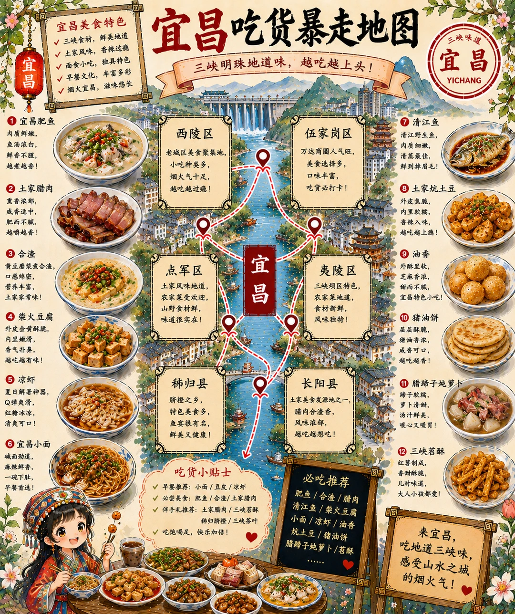
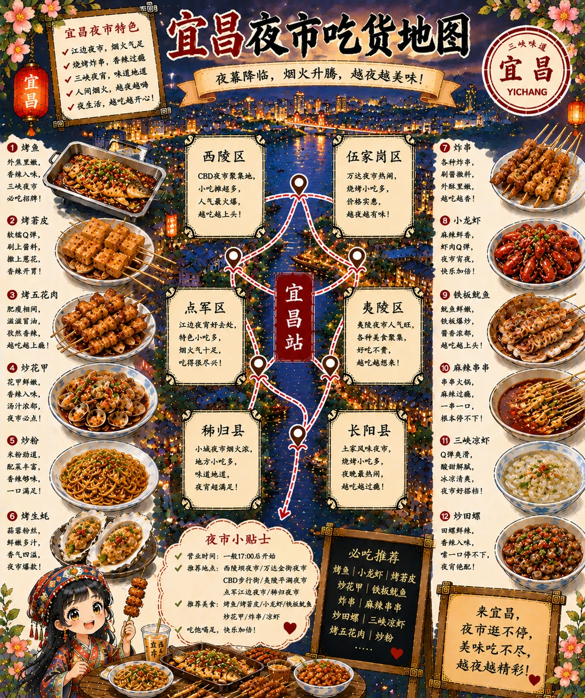
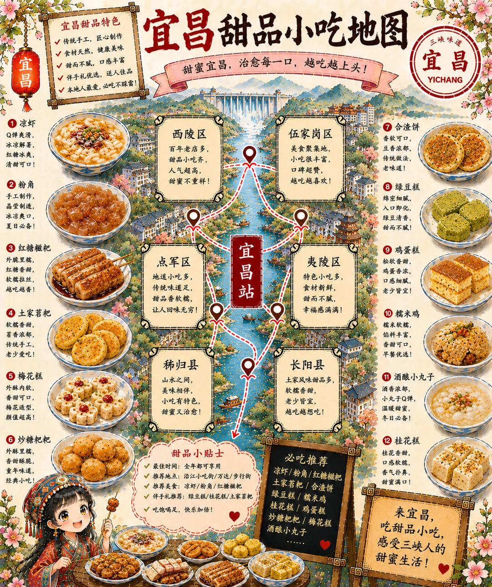
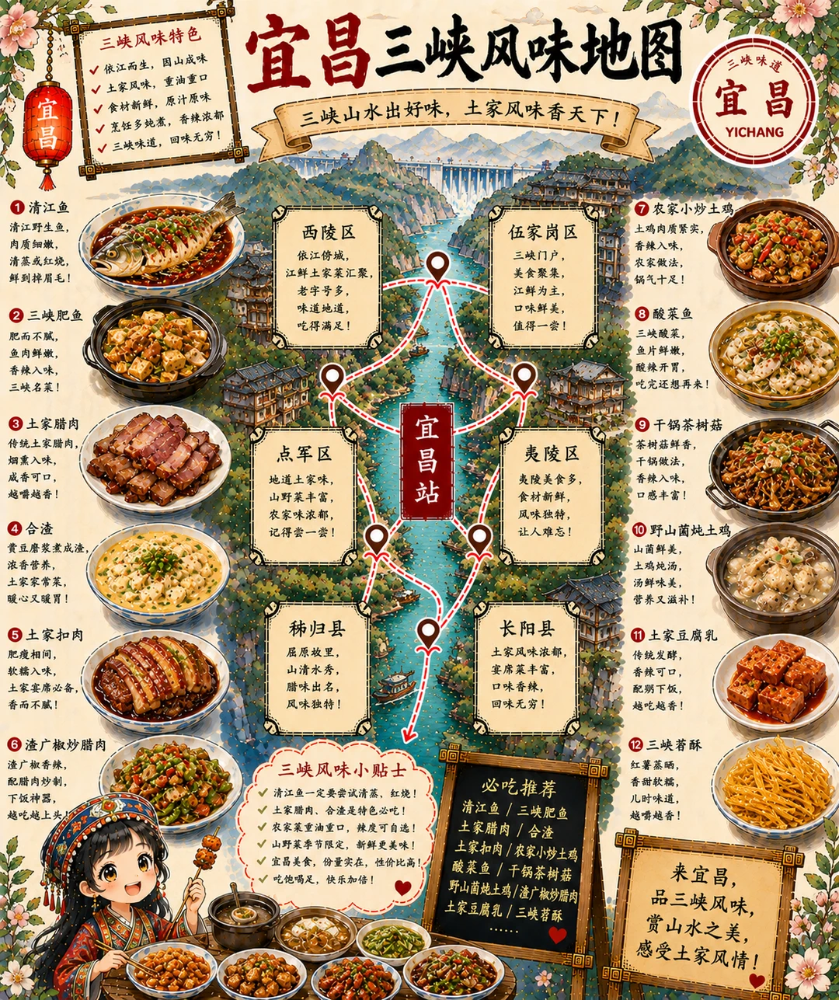

# 宜昌吃货暴走地图｜越走越上头三峡风味之城

- 作者: 羽见AI
- 👍85 · 💬5 · ⭐48 · 图 4
- feed_id: 6a067071000000003701df09

> [OCR] 宜昌美食特色
三峡食材，鲜美地道
土家风味，香辣过瘾
面食小吃，独具特色
早餐文化，丰富多彩
烟火宜昌，滋味悠长

宜昌吃货暴走地图
三峡明珠地道味，越吃越上头！

西陵区
老城区美食聚集地，
小吃种类多，
烟火气息足，
越吃越过瘾！

伍家岗区
万达商圈人气旺，
美食选择多，
口味丰富，
吃货必打卡！

点军区
土家风味地道，
农家菜受欢迎，
山野食材鲜，
味道很实在！

夷陵区
三峡坝区特色，
农家菜地道，
食材新鲜，
风味独特！

秭归县
脐橙之乡，
特色美食多，
鱼宴很有名，
鲜美又健康！

长阳县
土家美食发源地之一，
腊肉合渣香，
风味浓郁，
越吃越想吃！

宜昌肥鱼
肉质鲜嫩，
鱼汤浓白，
鲜香不腥，
越煮越香！

土家腊肉
熏香浓郁，
咸香适中，
肥而不腻，
越嚼越香！

合渣
黄豆磨浆煮合渣，
口感绵密，
营养丰富，
土家家常味！

柴火豆腐
外皮金黄酥脆，
内里嫩滑，
香气扑鼻，
越吃越有味！

凉虾
夏日解暑神器，
Q弹爽滑，
红糖冰凉，
清爽可口！

宜昌小面
碱面劲道，
麻辣鲜香，
一碗下肚，
早餐首选！

吃货小贴士
早餐推荐：小面/豆皮/凉虾
必尝美食：肥鱼/合渣/土家腊肉
伴手礼推荐：土家腊肉/三峡茗酥
稀归脐橙/三峡茶叶
吃饱喝足，快乐加倍！

必吃推荐
肥鱼/合渣/腊肉
清江鱼/柴火豆腐
小面/凉虾/油香
炕土豆/猪油饼
腊蹄子炖萝卜/茗酥

来宜昌，
吃地道三峡味，
感受山水之城的烟火气！

> [OCR] 宜昌夜市吃货地图

宜昌夜市特色
✓ 江边夜市，烟火气足
✓ 烧烤炸串，香辣过瘾
✓ 三峡夜宵，味道地道
✓ 人间烟火，越夜越嗨
✓ 夜生活，越吃越开心！

西陵区
CBD夜聚集地，
小吃摊超多，
人气最火爆，
越吃越上头！

伍家岗区
万达夜市热闹，
烧烤小吃多，
价格实惠，
越夜越有味！

宜昌站

点军区
江边夜宵好去处，
特色小吃多，
烟火气十足，
吃得很尽兴！

夷陵区
夷陵夜市人气旺，
各种美食聚集，
好吃不贵，
越吃越想来！

长阳县
土家风味夜市，
烧烤小吃多，
夜晚最热闹，
越吃越过瘾！

稀归县
小城夜市烟火浓，
地方小吃多，
味道地道，
夜宵超满足！

夜市小贴士
营业时间：一般17:00后开始
推荐地点：西陵夜市/万达金街夜市
CBD步行街/夷陵平湖夜市
点军边夜市/稀归夜市
推荐美食：烤鱼|烤苕皮|小龙虾|铁板鱿鱼
炒花甲|麻辣串串
炸串|炒田螺
三峡凉虾|烤五花肉|炒粉

必吃推荐
烤鱼 | 小龙虾 | 烤苕皮 |
炒花甲 | 铁板鱿鱼 |
炸串 | 麻辣串串 |
炒田螺 | 三峡凉虾 |
烤五花肉 | 炒粉 |

来宜昌，
夜市逛不停，美味吃不尽，
越夜越精彩！

三峡味道
宜昌
YICHANG

> [OCR] 宜昌甜品小吃地图

甜蜜宜昌，治愈每一口，越吃越上头！

西陵区
百年老店多，
甜品小吃齐，
人气超高，
甜蜜不重样！

伍家岗区
美食聚集地，
小吃很丰富，
口碑超赞，
越吃越喜欢！

点军区
地道小吃多，
传统味道足，
甜品香软糯，
让人回味无穷！

夷陵区
特色小吃多，
食材新鲜，
甜而不腻，
幸福感满满！

长阳县
土家风味甜品多，
软糯香甜，
老少皆宜，
越吃越想吃！

宜昌站

稀归县
山水之间，
美味相伴，
小吃有特色，
甜蜜又治愈！

[凉虾]
Q弹爽滑，冰凉解暑，红糖冰爽，清甜可口！

[粉角]
手工制作，晶莹剔透，冰凉爽口，夏日必备！

[红糖糍粑]
外脆里糯，红糖香甜，软糯拉丝，越吃越香！

[土家苕粑]
软糯香甜，苕香浓郁，传统手工，老少爱吃！

[梅花糕]
外酥内软，香甜可口，梅花造型，颜值超高！

[炒糖把耙]
外酥里糯，香甜酥脆，童年味道，经典小吃！

甜品小贴士
最佳时间：全年都可享用
推荐地点：沿江小吃街/万达/步行街
推荐美食：凉虾/粉角/红糖糍粑
伴手礼推荐：绿豆糕/桂花糕/土家苕粑
吃饱喝足，快乐加倍！

必吃推荐
凉虾/粉角/红糖糍粑
土家苕粑
绿豆糕/合渣饼
绿豆糕/糯米鸡
桂花糕/鸡蛋糕
炒糖把耙/梅花糕
酒酿小丸子

来宜昌，
吃甜品小吃，
感受三峡人的甜蜜生活！

> [OCR] 宜昌三峡风味地图

三峡山水出好味，土家风味香天下！

西陵区
依江傍城，
江鲜土家菜汇聚，
老字号多，
味道地道，
吃得满足！

伍家岗区
三峡门户，
美食聚集，
江鲜为主，
口味鲜美，
值得一尝！

点军区
地地道家味，
山野菜丰富，
农家味浓郁，
记得尝一尝！

夷陵区
夷陵美食多，
食材新鲜，
风味独特，
让人难忘！

秭归县
屈原故里，
山清水秀，
腊味出名，
风味独特！

长阳县
土家风味浓郁，
宴席菜丰富，
口味香辣，
回味无穷！

农家小炒土鸡
土鸡肉质紧实，
香辣入味，
农家做法，
锅气十足！

酸菜鱼
三峡酸菜，
鱼片鲜嫩，
酸辣开胃，
吃完还想再来！

干锅茶树菇
茶树菇鲜香，
干锅做法，
香辣入味，
口感丰富！

野山菌炖土鸡
山菌鲜美，
土鸡炖汤，
汤鲜味美，
营养又滋补！

土家豆腐乳
传统发酵，
香辣可口，
配粥下饭，
越吃越香！

三峡苕酥
红薯蒸晒，
香甜软糯，
儿时味道，
越嚼越香！

三峡风味小贴士
清江鱼一定要尝试清蒸、红烧！
土家腊肉、合渣是特色必吃！
农家菜重油重口，辣度可自选！
山野菜季节限定，新鲜更美味！
宜昌美食，份量实在，性价比高！
吃饱喝足，快乐加倍！

必吃推荐
清江鱼 / 三峡肥鱼
土家腊肉 / 合渣
农家小炒土鸡
酸菜鱼 / 干锅茶树菇
野山菌炖土鸡 / 渣广椒炒腊肉
土家豆腐乳 / 三峡苕酥

来宜昌，
品三峡风味，
赏山水之美，
感受土家风情！

## 正文
把宜昌画成一张能一路“辣鲜交织”的美食地图🗺️
肥鱼、凉虾、合渣、土家腊肉……越吃越有味✨
从江边吃到山里，风味层层叠加🌄
这张直接收藏，来宜昌照着吃就对了～
#宜昌[话题]# #本地人推荐美食[话题]# #城市美食探索[话题]# #各地特色美食来上分[话题]#

---