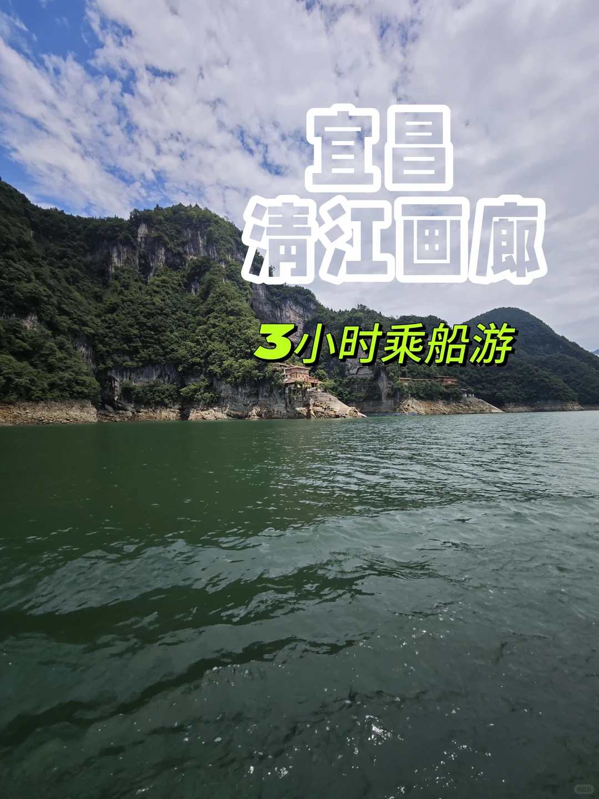
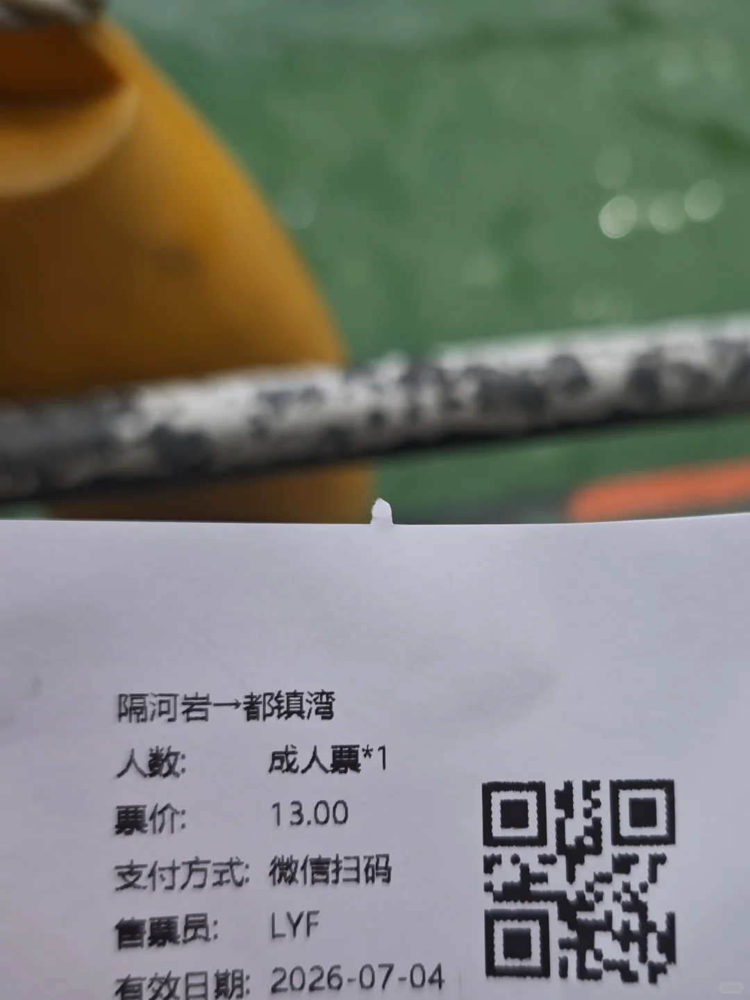
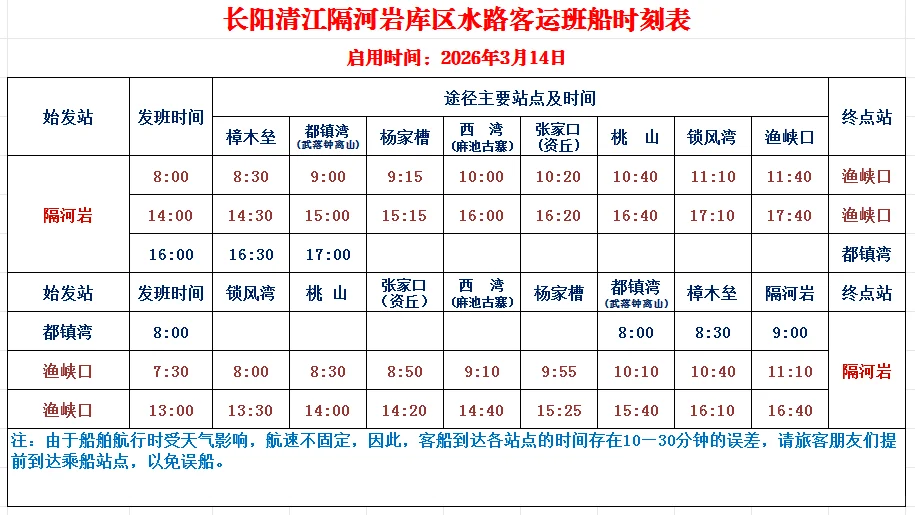
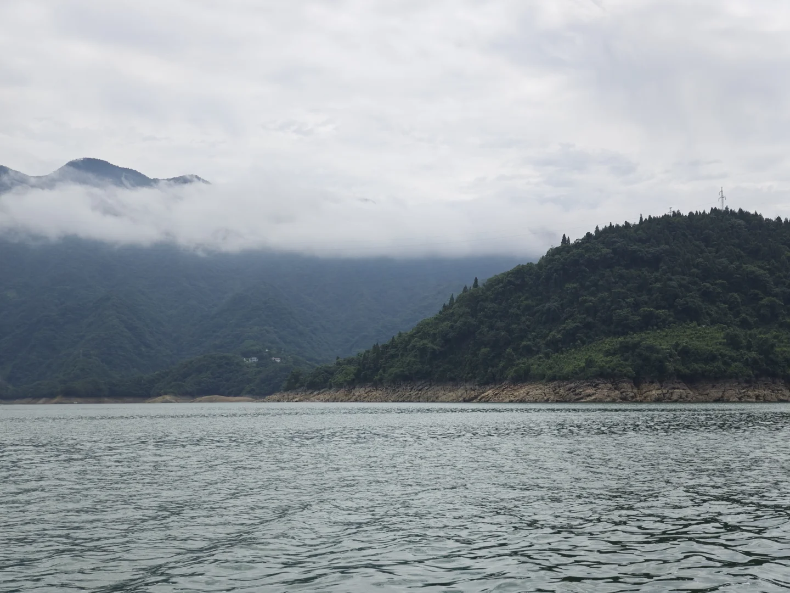
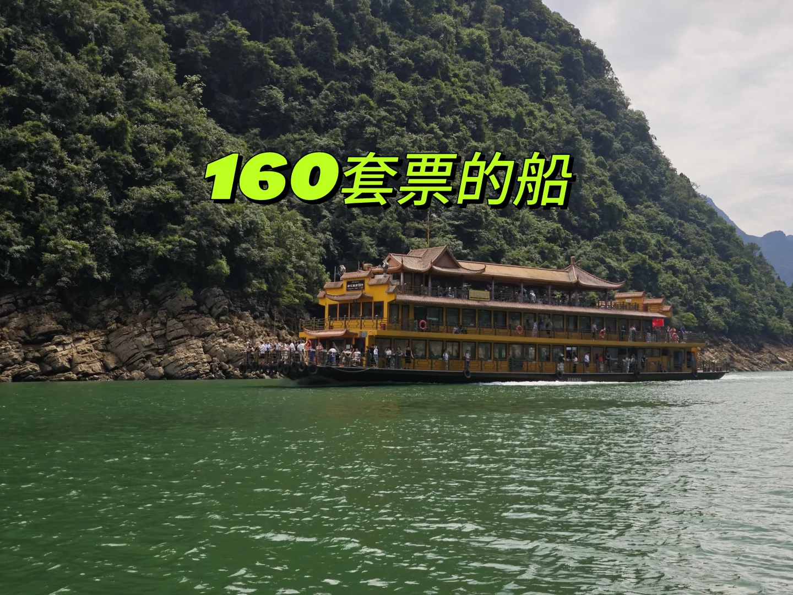
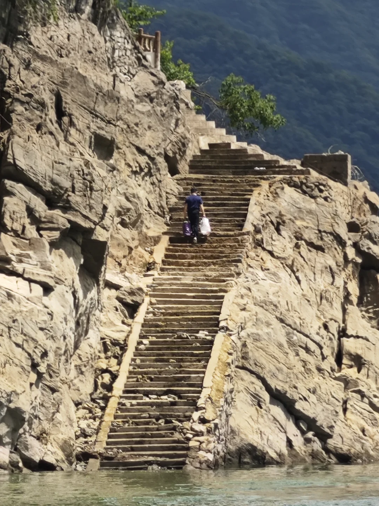
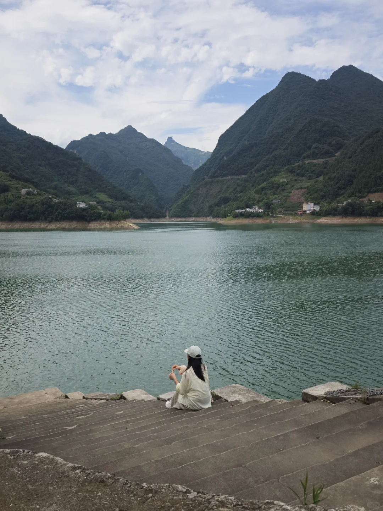
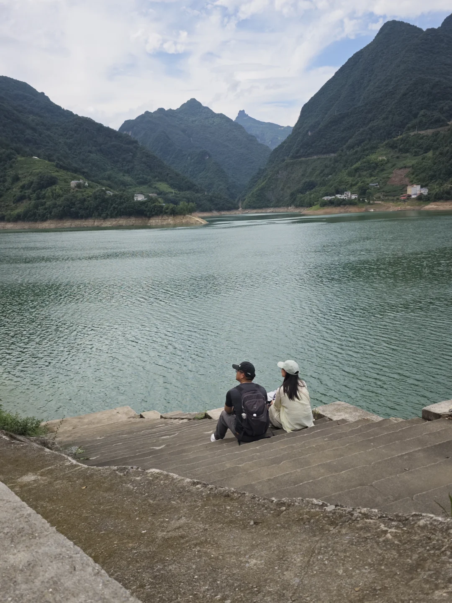
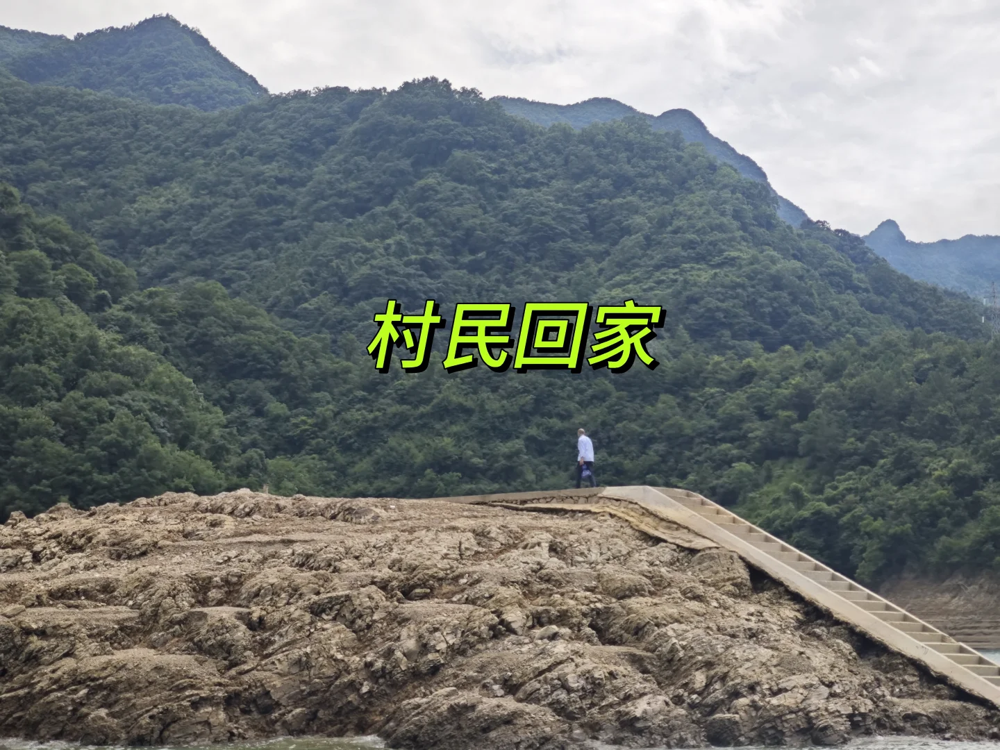

# 宜昌清江画廊不坐游客船

- 作者: 爱吃橙子的织女
- 👍77 · 💬24 · ⭐106 · 图 9
- feed_id: 6a49a439000000001503ef5e

> [OCR] 宜昌
清江画廊
3小时乘船游

> [OCR] 隔河岩→都镇湾
人数: 成人票*1
票价: 13.00
支付方式: 微信扫码
售票员: LYF
有效日期: 2026-07-04

> [OCR] 长阳清江隔河岩库区水路客运班船时刻表

启用时间：2026年3月14日

| 始发站 | 发班时间 | 途径主要站点及时间 | 终点站 |
| --- | --- | --- | --- |
| 樟木垒 | 都镇湾(武落钟高山) | 杨家槽 | 西湾(麻池古寨) | 张家口(资丘) | 桃山 | 锁风湾 | 渔峡口 |
| 隔河岩 | 8:00 | 8:30 | 9:00 | 9:15 | 10:00 | 10:20 | 10:40 | 11:10 | 11:40 | 渔峡口 |
|  | 14:00 | 14:30 | 15:00 | 15:15 | 16:00 | 16:20 | 16:40 | 17:10 | 17:40 | 渔峡口 |
|  | 16:00 | 16:30 | 17:00 |  |  |  |  |  |  | 都镇湾 |
| 始发站 | 发班时间 | 锁风湾 | 桃山 | 张家口(资丘) | 西湾(麻池古寨) | 杨家槽 | 都镇湾(武落钟高山) | 樟木垒 | 隔河岩 | 终点站 |
| 都镇湾 | 8:00 |  |  |  |  |  | 8:00 | 8:30 | 9:00 |  |
| 渔峡口 | 7:30 | 8:00 | 8:30 | 8:50 | 9:10 | 9:55 | 10:10 | 10:40 | 11:10 | 隔河岩 |
| 渔峡口 | 13:00 | 13:30 | 14:00 | 14:20 | 14:40 | 15:25 | 15:40 | 16:10 | 16:40 |  |
| 注：由于船舶航行时受天气影响，航速不固定，因此，客船到达各站点的时间存在10一30分钟的误差，请旅客朋友们提前到达乘船站点，以免误船。 |

> [OCR] system

> [OCR] 160套票的船

> [OCR] [?]

> [OCR] [?]

> [OCR] system

> [OCR] 村民回家

## 正文
清江画廊游客套票160，如果你只是想乘船看一下景色，不想去武落钟离山，可以坐当地住户乘坐的公交船。价格13能欣赏一个小时清江景色。
汽车导航到隔河岩码头，免费停车，我们坐了一个小时到都镇湾，其实到樟木垒半个小时看景色够了，回程还有同样的时间。
每站都有当地居民下船，景色跟浙江安徽那边游船差不多。
	
PS 船班次比去年少了，记得看好时间#清江画廊[话题]#

---