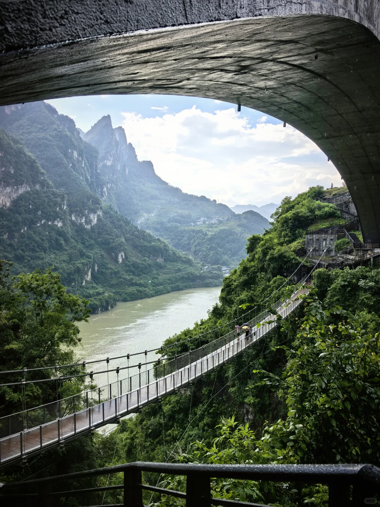
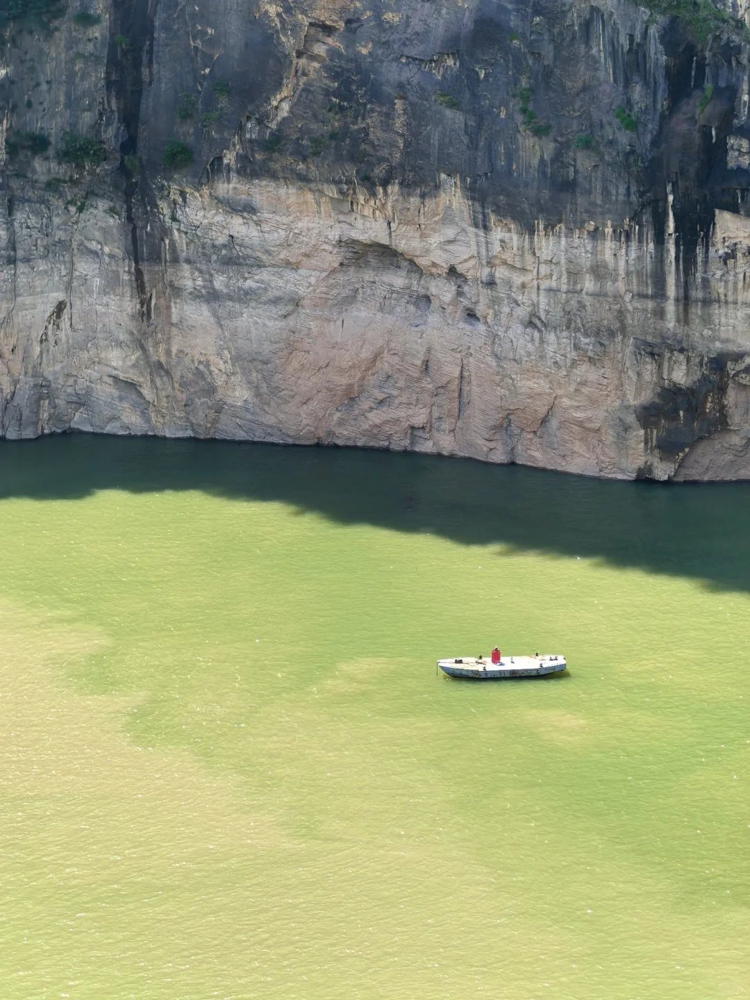
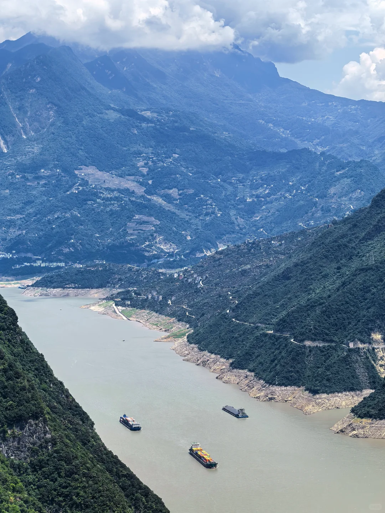
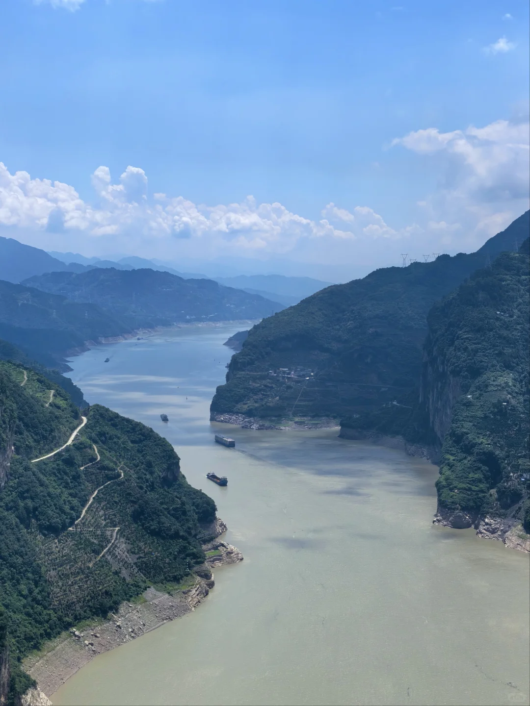
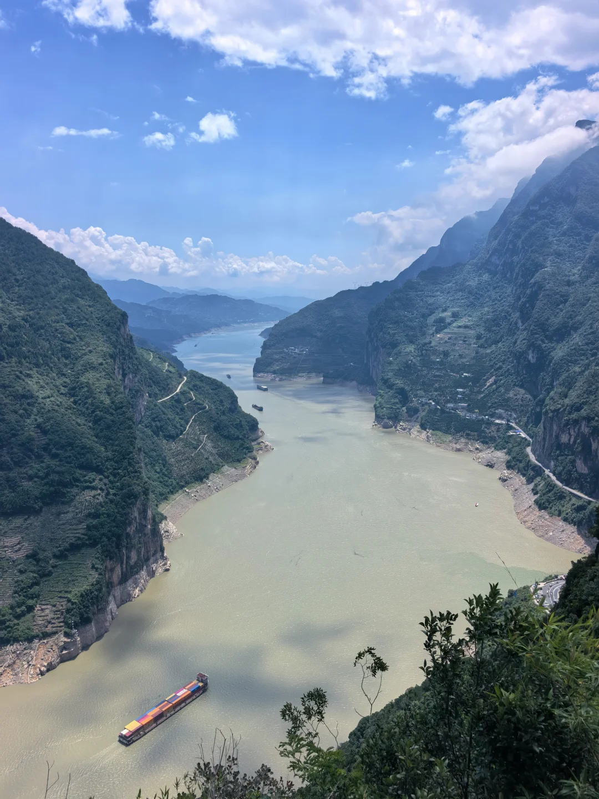
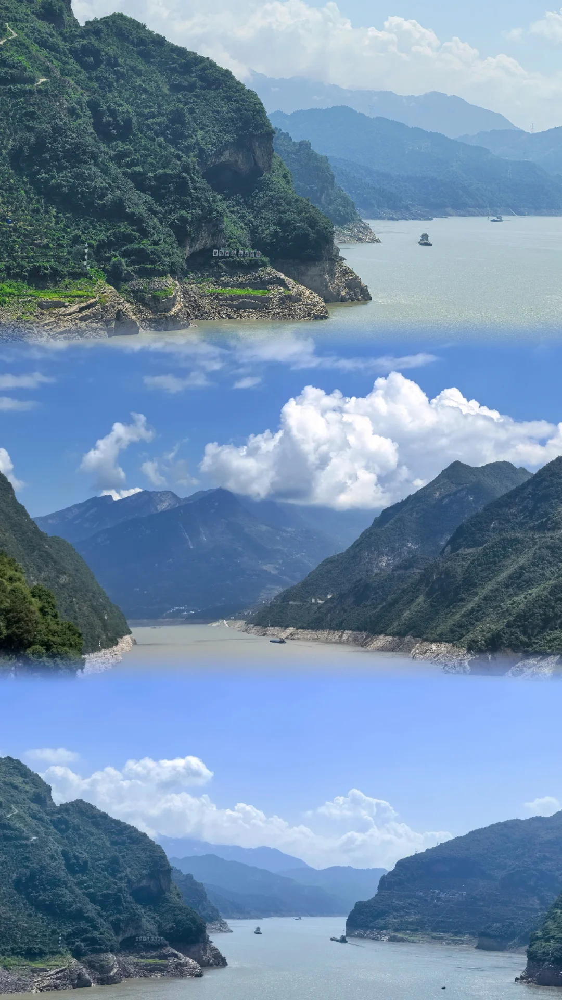
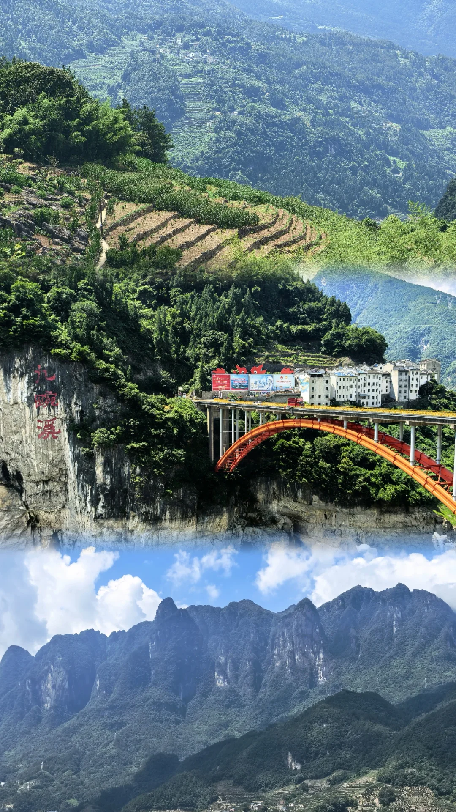
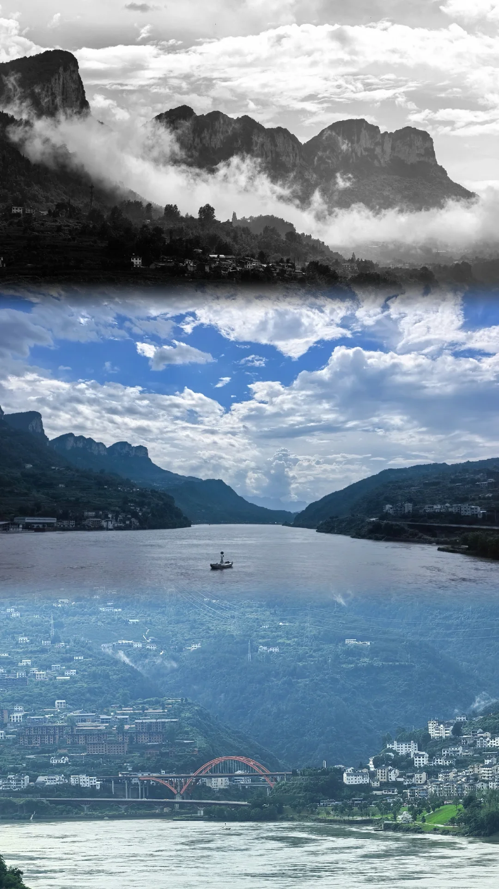

# 后劲怎么这么大😭国家地理诚不欺我😚

- 作者: Kirin
- 👍74 · 💬70 · ⭐78 · 图 8
- feed_id: 6a5f68f4000000001003d53e

> [OCR] INNERS

> [OCR] [?]

> [OCR] [?][?][?]

> [OCR] [?]

> [OCR] system

> [OCR] 3333

> [OCR] 九碗溪

> [OCR] [?][?][?]

## 正文
G348旅行日记，一日游，全程免费！
一边自驾一边赏景，游玩了星空之眼、九畹溪大桥、小狗山、鹰嘴岩、莲沱畔、干沟子大桥、听风谷😍
#宜昌[话题]# #G348[话题]# #小狗山[话题]# #自驾游[话题]# #最美公路[话题]# #长江三峡[话题]#

---