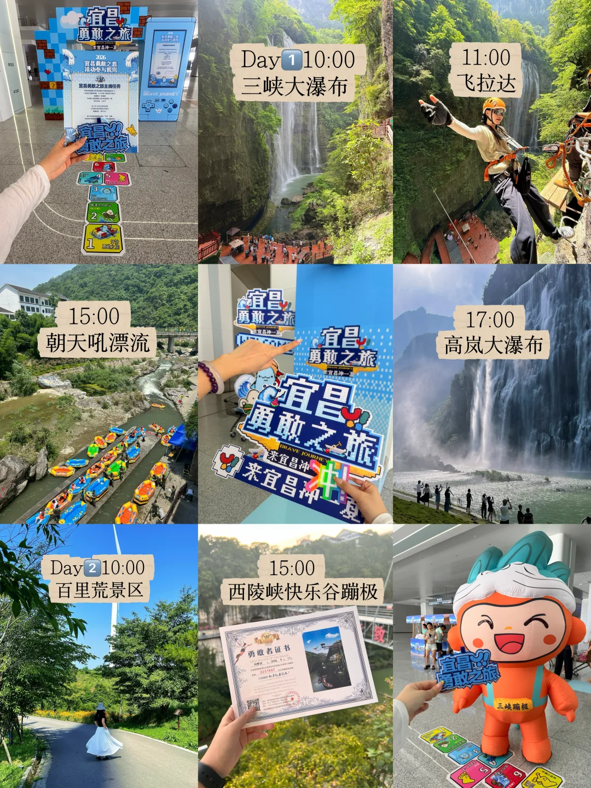
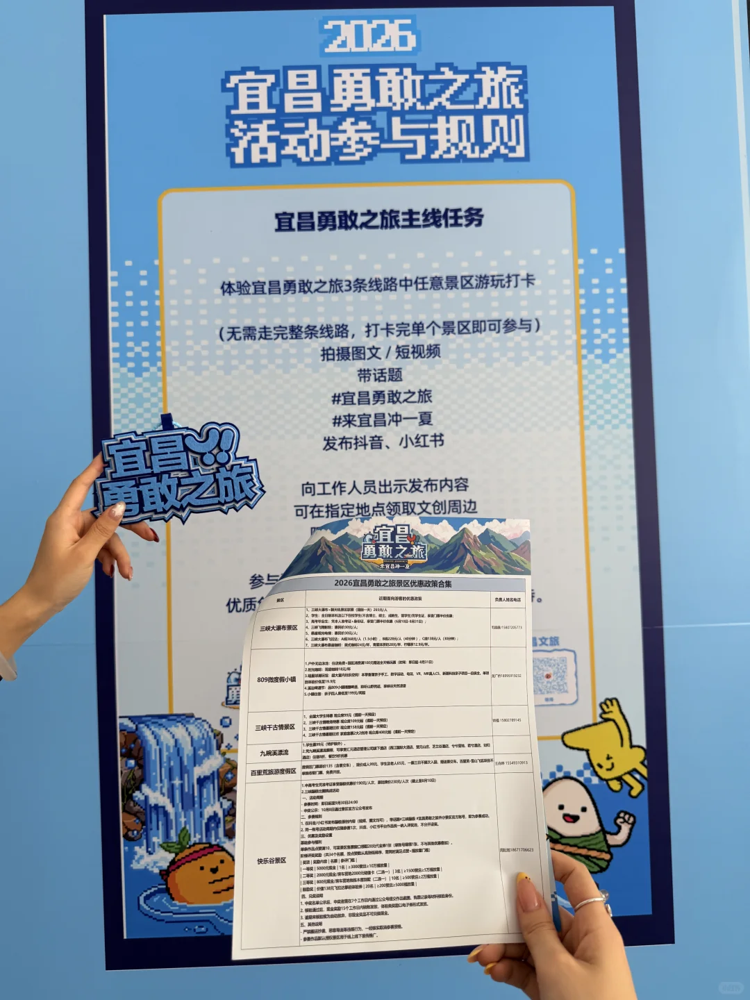
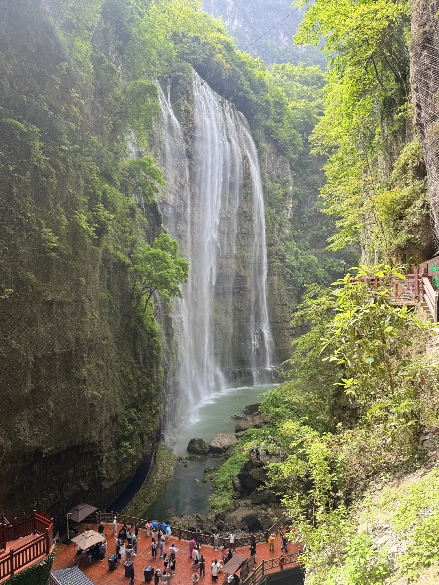
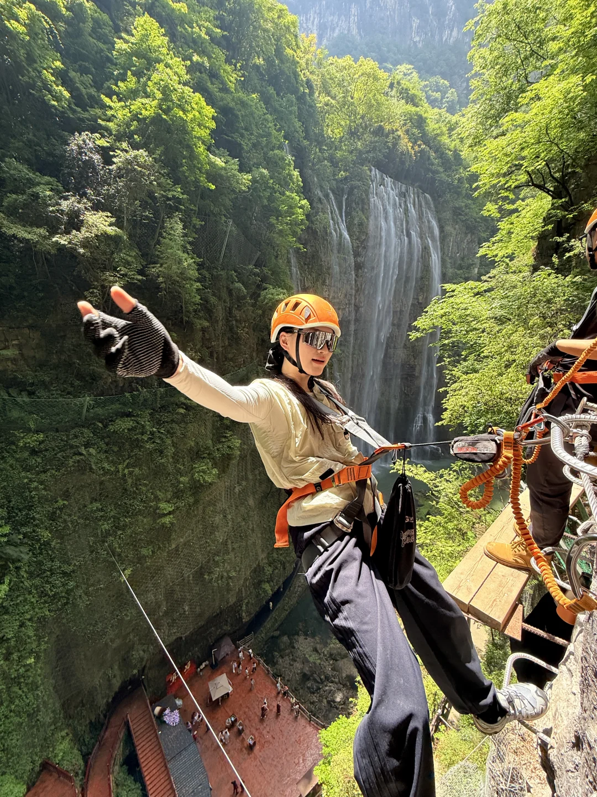
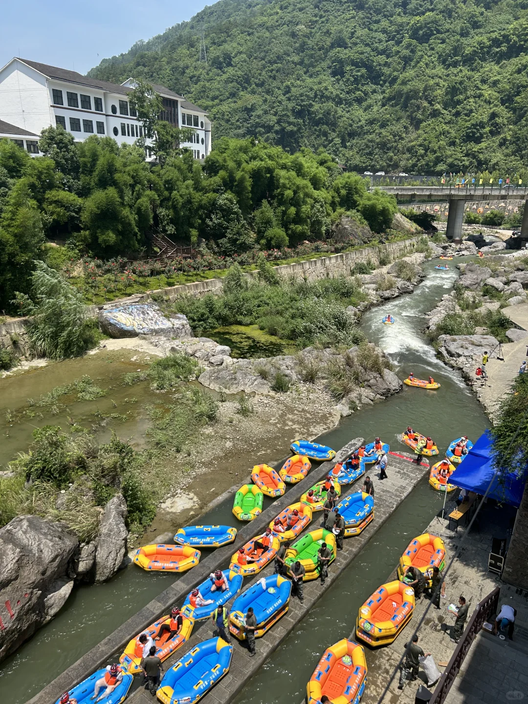
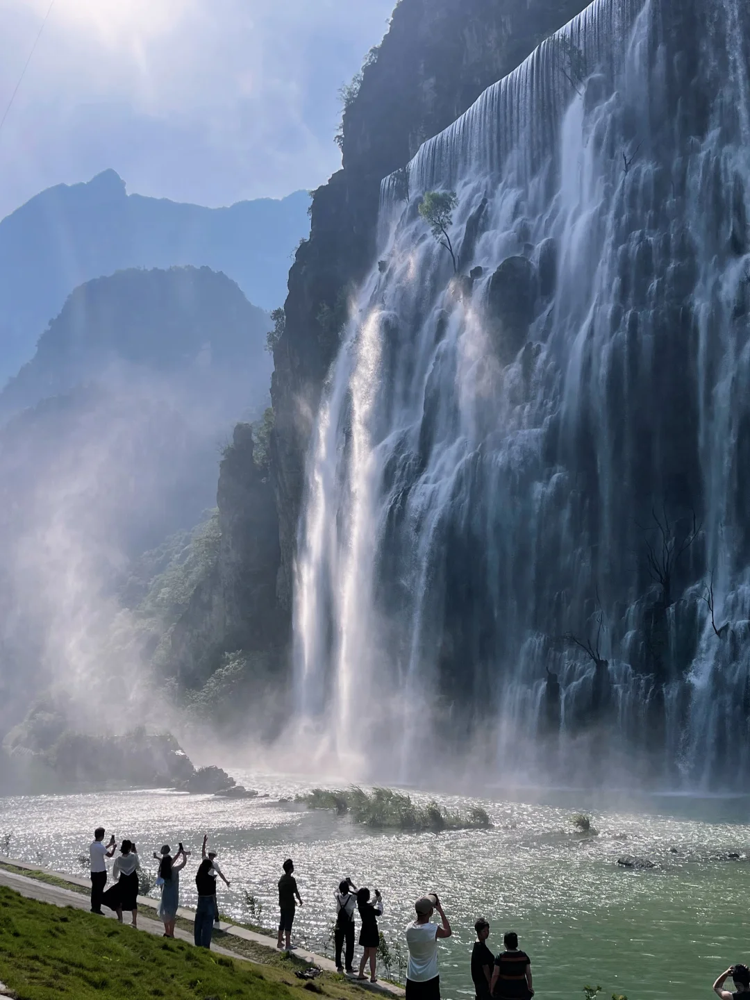
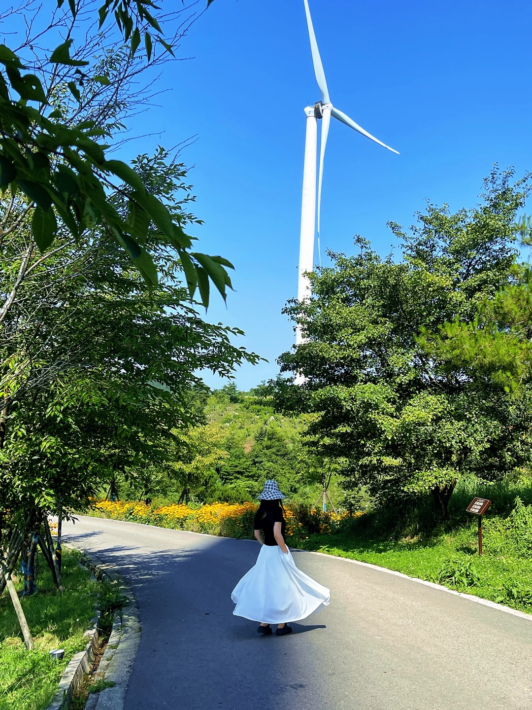
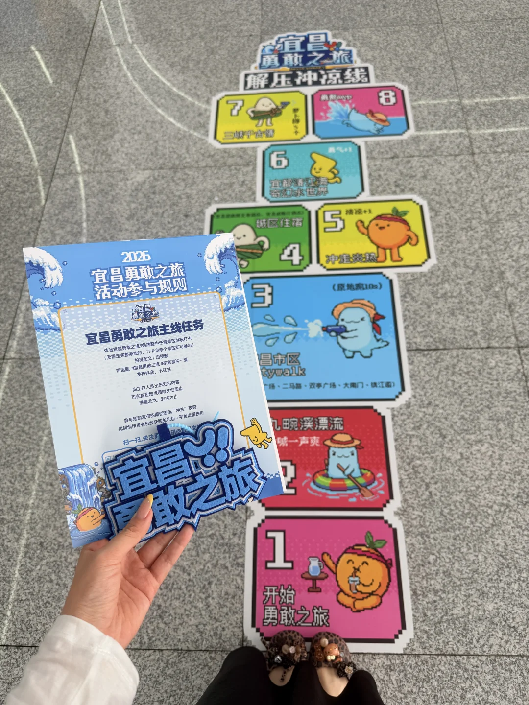
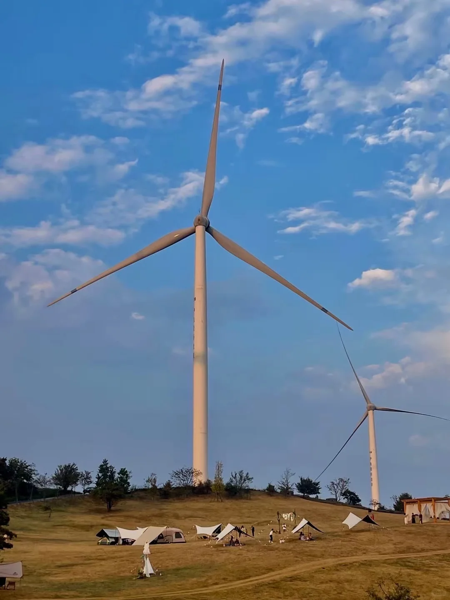
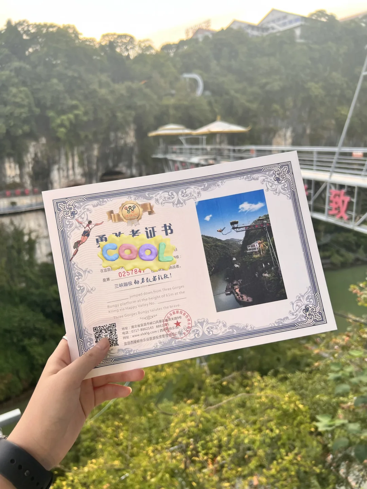

# 宜昌两天一夜！勇敢之旅路线攻略

- 作者: 宜昌开心市民小洁
- 👍65 · 💬5 · ⭐60 · 图 13
- feed_id: 6a65c0a8000000000101e8f3

> [OCR] 宜昌
勇敢之旅

2023
宜昌勇敢之旅活动参与规则
宜昌勇敢之旅主办任务
GRABE JOURNEY

Day1 10:00
三峡大瀑布

11:00
飞拉达

15:00
朝天吼漂流

宜昌
勇敢之旅
宜昌
勇敢之旅
来宜昌冲冲冲

17:00
高岚大瀑布

Day2 10:00
百里荒景区

15:00
西陵峡快乐谷蹦极

> [OCR] 2026
宜昌勇敢之旅
活动参与规则

宜昌勇敢之旅主线任务

体验宜昌勇敢之旅3条线路中任意景区游玩打卡
（无需走完整条线路，打卡完单个景区即可参与）
拍摄图文 / 短视频
带话题
#宜昌勇敢之旅
#来宜昌冲一夏
发布抖音、小红书
向工作人员出示发布内容
可在指定地点领取文创周边

2026宜昌勇敢之旅景区优惠政策合集

三峡大瀑布景区
1. 门票免费（仅限活动期间）：[日期] - [时间]
2. 景区开放时间：[时间]-[时间]
3. 三峽大瀑布景区：[人数]人（[小时数]）
4. 福利政策说明：[福利内容]

809微度假小镇
1.门票免费（仅限活动期间）：[日期] - [时间]
2. 景区开放时间：[时间]-[时间]
3. 三峽大瀑布景区：[人数]人（[小时数]）
4. 福利政策说明：[福利内容]

三峡千古情景区
1.门票免费（仅限活动期间）：[日期] - [时间]
2. 景区开放时间：[时间]-[时间]
3. 三峽大瀑布景区：[人数]人（[小时数]）
4. 福利政策说明：[福利内容]

九畹溪漂流
1.门票免费（仅限活动期间）：[日期] - [时间]
2. 景区开放时间：[时间]-[时间]
3. 三峽大瀑布景区：[人数]人（[小时数]）
4. 福利政策说明：[福利内容]

百里荒旅游度假区
1.门票免费（仅限活动期间）：[日期] - [时间]
2. 景区开放时间：[时间]-[时间]
3. 三峽大瀑布景区：[人数]人（[小时数]）
4. 福利政策说明：[福利内容]

快乐谷景区
1.门票免费（仅限活动期间）：[日期] - [时间]
2. 景区开放时间：[时间]-[时间]
3. 三峽大瀑布景区：[人数]人（[小时数]）
4. 福利政策说明：[福利内容]

宜昌
勇敢之旅

> [OCR] [?]

> [OCR] [?]
[?]

> [OCR] system

> [OCR] 宜昌
勇敢之旅
冲就完事
冲!
冲!
冲!
冲!
冲!
冲!
冲!
冲!
冲!
冲!
冲!
冲!
冲!
冲!
冲!
冲!
冲!
冲!
冲!
冲!
冲!
冲!
冲!
冲!
冲!
冲!
冲!
冲!
冲!
冲!
冲!
冲!
冲!
冲!
冲!
冲!
冲!
冲!
冲!
冲!
冲!
冲!
冲!
冲!
冲!
冲!
冲!
冲!
冲!
冲!
冲!
冲!
冲!
冲!
冲!
冲!
冲!
冲!
冲!
冲!
冲!
冲!
冲!
冲!
冲!
冲!
冲!
冲!
冲!
冲!
冲!
冲!
冲!
冲!
冲!
冲!
冲!
冲!
冲!
冲!
冲!
冲!
冲!
冲!
冲!
冲!
冲!
冲!
冲!
冲!
冲!
冲!
冲!
冲!
冲!
冲!
冲!
冲!
冲!
冲!
冲!
冲!
冲!
冲!
冲!
冲!
冲!
冲!
冲!
冲!
冲!
冲!
冲!
冲!
冲!
冲!
冲!
冲!
冲!
冲!
冲!
冲!
冲!
冲!
冲!
冲!
冲!
冲!
冲!
冲!
冲!
冲!
冲!
冲!
冲!
冲!
冲!
冲!
冲!
冲!
冲!
冲!
冲!
冲!
冲!
冲!
冲!
冲!
冲!
冲!
冲!
冲!
冲!
冲!
冲!
冲!
冲!
冲!
冲!
冲!
冲!
冲!
冲!
冲!
冲!
冲!
冲!
冲!
冲!
冲!
冲!
冲!
冲!
冲!
冲!
冲!
冲!
冲!
冲!
冲!
冲!
冲!
冲!
冲!
冲!
冲!
冲!
冲!
冲!
冲!
冲!
冲!
冲!
冲!
冲!
冲!
冲!
冲!
冲!
冲!
冲!
冲!
冲!
冲!
冲!
冲!
冲!
冲!
冲!
冲!
冲!
冲!
冲!
冲!
冲!
冲!
冲!
冲!
冲!
冲!
冲!
冲!
冲!
冲!
冲!
冲!
冲!
冲!
冲!
冲!
冲!
冲!
冲!
冲!
冲!
冲!
冲!
冲!
冲!
冲!
冲!
冲!
冲!
冲!
冲!
冲!
冲!
冲!
冲!
冲!
冲!
冲!
冲!
冲!
冲!
冲!
冲!
冲!
冲!
冲!
冲!
冲!
冲!
冲!
冲!
冲!
冲!
冲!
冲!
冲!
冲!
冲!
冲!
冲!
冲!
冲!
冲!
冲!
冲!
冲!
冲!
冲!
冲!
冲!
冲!
冲!
冲!
冲!
冲!
冲!
冲!
冲!
冲!
冲!
冲!
冲!
冲!
冲!
冲!
冲!
冲!
冲!
冲!
冲!
冲!
冲!
冲!
冲!
冲!
冲!
冲!
冲!
冲!
冲!
冲!
冲!
冲!
冲!
冲!
冲!
冲!
冲!
冲!
冲!
冲!
冲!
冲!
冲!
冲!
冲!
冲!
冲!
冲!
冲!
冲!
冲!
冲!
冲!
冲!
冲!
冲!
冲!
冲!
冲!
冲!
冲!
冲!
冲!
冲!
冲!
冲!
冲!
冲!
冲!
冲!
冲!
冲!
冲!
冲!
冲!
冲!
冲!
冲!
冲!
冲!
冲!
冲!
冲!
冲!
冲!
冲!
冲!
冲!
冲!
冲!
冲!
冲!
冲!
冲!
冲!
冲!
冲!
冲!
冲!
冲!
冲!
冲!
冲!
冲!
冲!
冲!
冲!
冲!
冲!
冲!
冲!
冲!
冲!
冲!
冲!
冲!
冲!
冲!
冲!
冲!
冲!
冲!
冲!
冲!
冲!
冲!
冲!
冲!
冲!
冲!
冲!
冲!
冲!
冲!
冲!
冲!
冲!
冲!
冲!
冲!
冲!
冲!
冲!
冲!
冲!
冲!
冲!
冲!
冲!
冲!
冲!
冲!
冲!
冲!
冲!
冲!
冲!
冲!
冲!
冲!
冲!
冲!
冲!
冲!
冲!
冲!
冲!
冲!
冲!
冲!
冲!
冲!
冲!
冲!
冲!
冲!
冲!
冲!
冲!
冲!
冲!
冲!
冲!
冲!
冲!
冲!
冲!
冲!
冲!
冲!
冲!
冲!
冲!
冲!
冲!
冲!
冲!
冲!
冲!
冲!
冲!
冲!
冲!
冲!
冲!
冲!
冲!
冲!
冲!
冲!
冲!
冲!
冲!
冲!
冲!
冲!
冲!
冲!
冲!
冲!
冲!
冲!
冲!
冲!
冲!
冲!
冲!
冲!
冲!
冲!
冲!
冲!
冲!
冲!
冲!
冲!
冲!
冲!
冲!
冲!
冲!
冲!
冲!
冲!
冲!
冲!
冲!
冲!
冲!
冲!
冲!
冲!
冲!
冲!
冲!
冲!
冲!
冲!
冲!
冲!
冲!
冲!
冲!
冲!
冲!
冲!
冲!
冲!
冲!
冲!
冲!
冲!
冲!
冲!
冲!
冲!
冲!
冲!
冲!
冲!
冲!
冲!
冲!
冲!
冲!
冲!
冲!
冲!
冲!
冲!
冲!
冲!
冲!
冲!
冲!
冲!
冲!
冲!
冲!
冲!
冲!
冲!
冲!
冲!
冲!
冲!
冲!
冲!
冲!
冲!
冲!
冲!
冲!
冲!
冲!
冲!
冲!
冲!
冲!
冲!
冲!
冲!
冲!
冲!
冲!
冲!
冲!
冲!
冲!
冲!
冲!
冲!
冲!
冲!
冲!
冲!
冲!
冲!
冲!
冲!
冲!
冲!
冲!
冲!
冲!
冲!
冲!
冲!
冲!
冲!
冲!
冲!
冲!
冲!
冲!
冲!
冲!
冲!
冲!
冲!
冲!
冲!
冲!
冲!
冲!
冲!
冲!
冲!
冲!
冲!
冲!
冲!
冲!
冲!
冲!
冲!
冲!
冲!
冲!
冲!
冲!
冲!
冲!
冲!
冲!
冲!
冲!
冲!
冲!
冲!
冲!
冲!
冲!
冲!
冲!
冲!
冲!
冲!
冲!
冲!
冲!
冲!
冲!
冲!
冲!
冲!
冲!
冲!
冲!
冲!
冲!
冲!
冲!
冲!
冲!
冲!
冲!
冲!
冲!
冲!
冲!
冲!
冲!
冲!
冲!
冲!
冲!
冲!
冲!
冲!
冲!
冲!
冲!
冲!
冲!
冲!
冲!
冲!
冲!
冲!
冲!
冲!
冲!
冲!
冲!
冲!
冲!
冲!
冲!
冲!
冲!
冲!
冲!
冲!
冲!
冲!
冲!
冲!
冲!
冲!
冲!
冲!
冲!
冲!
冲!
冲!
冲!
冲!
冲!
冲!
冲!
冲!
冲!
冲!
冲!
冲!
冲!
冲!
冲!
冲!
冲!
冲!
冲!
冲!
冲!
冲!
冲!
冲!
冲!
冲!
冲!
冲!
冲!
冲!
冲!
冲!
冲!
冲!
冲!
冲!
冲!
冲!
冲!
冲!
冲!
冲!
冲!
冲!
冲!
冲!
冲!
冲!
冲!
冲!
冲!
冲!
冲!
冲!
冲!
冲!
冲!
冲!
冲!
冲!
冲!
冲!
冲!
冲!
冲!
冲!
冲!
冲!
冲!
冲!
冲!
冲!
冲!
冲!
冲!
冲!
冲!
冲!
冲!
冲!
冲!
冲!
冲!
冲!
冲!
冲!
冲!
冲!
冲!
冲!
冲!
冲!
冲!
冲!
冲!
冲!
冲!
冲!
冲!
冲!
冲!
冲!
冲!
冲!
冲!
冲!
冲!
冲!
冲!
冲!
冲!
冲!
冲!
冲!
冲!
冲!
冲!
冲!
冲!
冲!
冲!
冲!
冲!
冲!
冲!
冲!
冲!
冲!
冲!
冲!
冲!
冲!
冲!
冲!
冲!
冲!
冲!
冲!
冲!
冲!
冲!
冲!
冲!
冲!
冲!
冲!
冲!
冲!
冲!
冲!
冲!
冲!
冲!
冲!
冲!
冲!
冲!
冲!
冲!
冲!
冲!
冲!
冲!
冲!
冲!
冲!
冲!
冲!
冲!
冲!
冲!
冲!
冲!
冲!
冲!
冲!
冲!
冲!
冲!
冲!
冲!
冲!
冲!
冲!
冲!
冲!
冲!
冲!
冲!
冲!
冲!
冲!
冲!
冲!
冲!
冲!
冲!
冲!
冲!
冲!
冲!
冲!
冲!
冲!
冲!
冲!
冲!
冲!
冲!
冲!
冲!
冲!
冲!
冲!
冲!
冲!
冲!
冲!
冲!
冲!
冲!
冲!
冲!
冲!
冲!
冲!
冲!
冲!
冲!
冲!
冲!
冲!
冲!
冲!
冲!
冲!
冲!
冲!
冲!
冲!
冲!
冲!
冲!
冲!
冲!
冲!
冲!
冲!
冲!
冲!
冲!
冲!
冲!
冲!
冲!
冲!
冲!
冲!
冲!

> [OCR] 宜昌
勇敢之旅
BRAVE JOURNEY
来宜昌冲一夏

诗里画里
屈原故里
九畹溪漂流
来宜昌冲一下

人一路欢笑
人一路尖叫
最去还是九畹溪

宜昌
勇敢之旅
BRAVE JOURNEY
来宜昌冲一夏
START

> [OCR] 宜昌
勇敢之旅
解压冲凉线

7元
三峡千台楼

8
森趣APP

6
宜都清江湾
奇幻水世界

5
清凉+1

4
城区住宿

3
(原地跳10s)

2
九畹溪漂流
[?]一声爽

1
开始
勇敢之旅

宜昌
勇敢之旅活动参与规则

2026
宜昌勇敢之旅
活动参与规则

宜昌勇敢之旅主线任务
体验宜昌勇敢之旅5条线路中任意景区游玩打卡
(无需走完整条线路，打卡完成个景区即可参与)
拍摄图文/短视频
带话题 #宜昌勇敢之旅#来宜昌冲一夏
发布抖音、小红书
向工作人员出示发布内容
可在指定地点领取文创周边
限量发放，发完为止

参与活动发布的原创游玩“冲关”攻略
优质创作者有机会获闯关礼包+平台流量扶持

> [OCR] 风力发电站

> [OCR] 宜昌！
勇敢之旅
三峡蹦极
1
2
3
4
5
6
7

> [OCR] 勇者证书
COOL
0257841
在宜昌市西陵峡快乐谷蹦极平台跳下61米高度
是第[?]
三峡蹦极 向勇敢者致敬！
jumped down from Three Gorges Bungy platform at the height of 61m at the Xiling xia Happy Valley No.
Three Gorges Bungy salutes the brave.
地址：湖北省宜昌市西陵口风景区南津关路9号
电话：0717-8862143 8862[?]
网址：www.xlxlq.com（西陵峡快乐谷）
宜昌西陵峡快乐谷旅游投资管理有限公司

## 正文
宜昌勇敢之旅又开始啦
只有一个周末来宜昌，爱玩刺激项目直接照搬这条路线！
	
Day1️⃣巨顺路（要早起、多带两套衣服）
✅8:00 CBD亚子面馆🍜：本地老牌面馆
✅10:00 三峡大瀑布：打卡巨型水帘，必出片
✅11:00 飞拉达：悬崖徒步超有挑战性
✅15:00 朝天吼漂流：夏日必玩！全程跌宕刺激
✅17:00 高岚大瀑布：漂流终点300m附近，打卡小众瀑布
✅19:00 孙氏特色烤牛肉➕王氏凉虾，补充蛋白质
	
Day2️⃣
✅10:00百里荒风景区：一望无际绿色草甸，山间吹风散步，舒缓前一天疲惫
✅15:00 西陵峡快乐谷蹦极：终极勇敢挑战！跳完还能领到专属勇敢者证书，成就感拉满
	
打卡勇敢之旅3条线路任意景区带话题就可以领文创周边哦（图7）
	
#宜昌勇敢之旅[话题]#  #清凉宜昌勇敢一夏[话题]# #来宜昌冲一夏[话题]# #宜昌[话题]# #宜昌旅游[话题]# #勇敢的人先享受世界[话题]##宜昌吃喝玩乐[话题]#

---