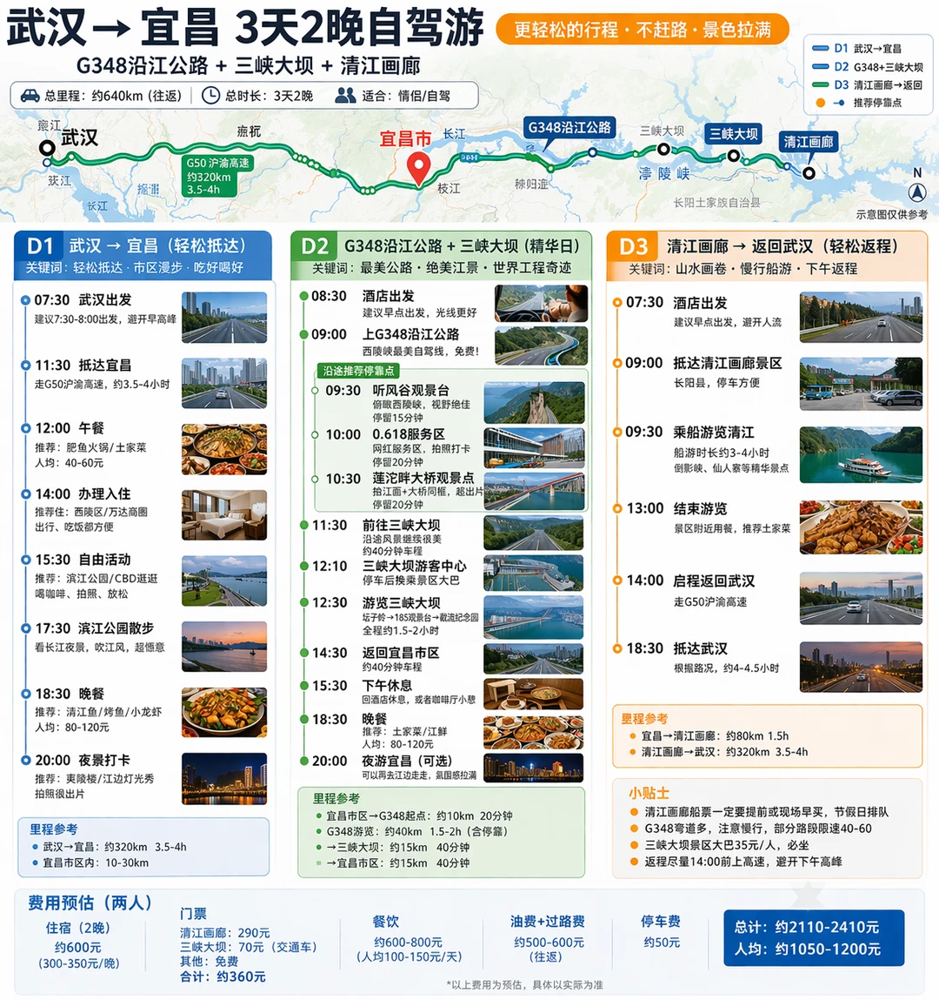
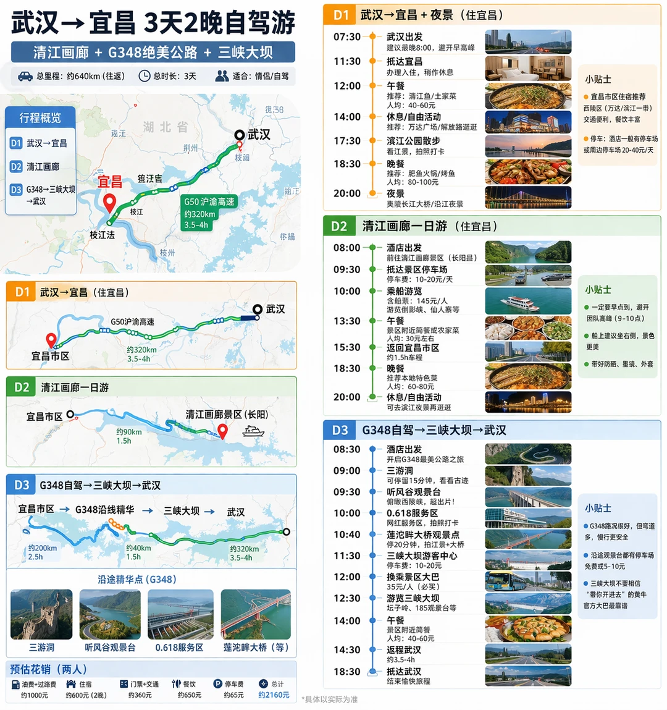

# 🚗武汉→宜昌

- 作者: 🍇
- 👍62 · 💬11 · ⭐41 · 图 2
- feed_id: 69cf511b000000001a0213f9

> [OCR] 武汉→宜昌 3天2晚自驾游
G348沿江公路 + 三峡大坝 + 清江画廊
更轻松的行程·不赶路·景色拉满

总里程：约640km（往返）
总时长：3天2晚
适合：情侣/自驾

D1 武汉→宜昌
关键词：轻松抵达、市区漫步、吃好喝好

07:30 武汉出发
建议7:30-8:00出发，避开早高峰

11:30 抵达宜昌
走G50沪渝高速约3.5~4小时

12:00 午餐
推荐：肥鱼火锅/土家菜
人均：40-60元

14:00 办理入住
推荐住：西陵区/万达商圈出行、吃饭都方便

15:30 自由活动
推荐：滨江公园/CBD逛逛喝咖啡、拍照、放松

17:30 滨江公园散步
看长江夜景，吹江风，超惬意

18:30 晚餐
推荐：清江鱼/烤鱼/小龙虾
人均：80-120元

20:00 夜景打卡
推荐：夷陵楼/江边灯光秀拍照很出片

里程参考
武汉→宜昌：约320km 3.5~4h
宜昌市区内：10-30km

D2 G348沿江公路 + 三峡大坝（精华日）
关键词：最美公路、绝美江景、世界工程奇迹

08:30 酒店出发
建议早点出发，光线更好

09:00 上G348沿江公路
西陵峡最美自驾线，免费！

沿途推荐停靠点
09:30 听风谷观景台
俯瞰西陵峡，视野绝佳停留15分钟
10:00 0.618服务区
网红服务区，拍照打卡停留20分钟
10:30 莲沱畔大桥观景点
拍江面+大桥同框，超出片停留20分钟

11:30 前往三峡大坝
沿途风景继续很美约40分钟车程
12:10 三峡大坝游客中心
停车后换乘景区大巴
12:30 游览三峡大坝
坛子岭→185观景台→截流纪念园全程约1.5~2小时

14:30 返回宜昌市区
约40分钟车程
下午休息，或者咖啡厅小憩

15:30 晚餐
推荐：土家菜/江鲜
人均：80-120元（可选）
可以去江边走走，氛围感拉满

D3 清江画廊→返回武汉（轻松返程）
关键词：山水画卷、慢行船游·下午返程

07:30 酒店出发
建议早点出发，避开人流

09:00 抵达清江画廊景区
长阳县，停车方便

09:30 乘船游览清江
船游时长约3-4小时倒影峡、仙人寨等精华景点

13:00 结束游览
景区附近用餐，推荐土家菜

14:00 启程返回武汉
走G50沪渝高速

18:30 抵达武汉
根据路况，约4-4.5小时

里程参考
宜昌→清江画廊：约80km 1.5h
清江画廊→武汉：约320km 3.5~4h

小贴士
● 清江画廊船票一定要提前或现场早买，节假日排队
● G348弯道多，注意慢行，部分路段限速40-60
● 三峡大坝景区大巴35元/人，必坐
● 返程尽量14:00前上高速，避开下午高峰

费用预估（两人）
住宿（2晚）约600元(300~350元/晚)
门票 清江画廊：290元三峡大坝：70元（交通车）其他：免费合计：约360元
餐饮 约600-800元 (人均100-150元/天)
油费+过路费 约500~600元(往返)
停车费 约50元
总计：约2110-2410元
人均：约1050-1200元

> [OCR] 武汉→宜昌 3天2晚自驾游

清江画廊 + G348绝美公路 + 三峡大坝
总里程：约640km（往返）
时长：3天
适合：情侣/自驾

行程概览
D1 武汉→宜昌 + 夜景（住宜昌）
D2 清江画廊
D3 G348→三峡大坝 →武汉

[地图]

D1 武汉→宜昌 (住宜昌)
G50沪渝高速
约320km 3.5-4h

D2 清江画廊一日游（住宜昌）
宜昌市区
清江画廊景区(长阳) 约90km 1.5h

D3 G348自驾→三峡大坝→武汉
宜昌市区 →G348沿线精华 →三峡大坝 →武汉
约200km 2.5h
约40km 1.5h
约320km 3.5-4h

沿途精华点(G348)
三游洞 听风谷观景台 0.618服务区 莲沱畔大桥（等）

预估花销(两人)
油费+过路费 约1000元
住宿 约600元 (2晚)
门票+交通 约360元
餐饮 约650元
停车费 约65元
总计 约2160元
*具体以实际为准

D1 武汉→宜昌 + 夜景（住宜昌）
07:30 武汉出发 建议最晚8:00，避开早高峰
11:30 抵达宜昌 办理入住，稍作休息
12:00 午餐 推荐：清江鱼/土家菜 人均40-60元
14:00 休息/自由活动 推荐：万达广场/解放路逛逛
17:30 滨江公园散步 看江景，拍照打卡
18:30 晚餐 推荐：肥鱼火锅/烤鱼 人均80-100元
20:00 夜景 女陵长江大桥/沿江夜景

D2 清江画廊一日游（住宜昌）
08:00 酒店出发 前往清江画廊景区(长阳县)
09:30 抵达景区停车场 车费：10-20元/天
10:00 乘船游览 含船票：145元/人 游览倒影峡、仙人寨等
13:30 午餐 景区附近简餐或农家菜 人均30元左右
15:30 返回宜昌市区 约1.5h车程
18:30 晚餐 推荐本地特色菜 人均60-80元
20:00 休息/自由活动 可去滨江夜景再逛逛

D3 G348自驾→三峡大坝→武汉
宜昌市区 →G348沿线精华 →三峡大坝 →武汉
约200km 2.5h
约40km 1.5h
约320km 3.5-4h

沿途精华点(G348)
三游洞 听风谷观景台 0.618服务区 莲沱畔大桥（等）

小贴士
宜昌市区住宿推荐：西陵区(万达/滨江一带)交通便利，餐饮丰富
停车：酒店一般有停车场或周边停车场20-40元/天

小贴士
一定要早点到，避开团队高峰 (9~10点)
船上建议坐右侧，景色更美
带好防晒、墨镜、外套

小贴士
G348路况很好，但弯道多，慢行更安全
沿途观景台都有停车场免费或5-10元
三峡大坝不要相信“带你开进去”的黄牛官方大巴最靠谱

## 正文
清明节临时想出去走走
but.…懒得做攻略
就随便让AI排了一下路线
居然还能直接生成路线图
看了一眼还挺符合我们的节奏
决定照着开啦[自拍R]
明天出发试试看
不踩雷的话回来更新
就是有点怕清明高速…[笑哭R]
#旅游自驾游[话题]# #清明出游记[话题]# #武汉出发旅游[话题]#

---