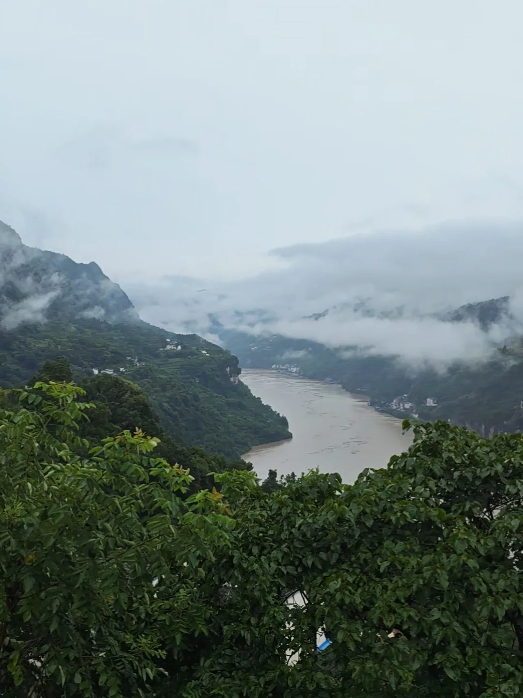

# 8.4三峡人家有惊有险

- 作者: Young.
- 👍60 · 💬72 · ⭐16 · 图 1
- feed_id: 6a71bea90000000022033a8a

> [OCR] [?]

## 正文
早上8:30正常跟团坐大巴从市区前往王家坪，9:25到了以后导游带领换票、换乘景区大巴，随后到码头换成景区摆渡船，但一直未能出发。
11:40左右，显示工作人员通知可以返回游客中心办理退票，随后导游也通知下船，原路返回。
	
但由于人太多，没能挤上（所有人真的是硬挤）前面几趟大巴，结果没想到，我们最后三辆大巴不幸被困半山腰，一直到下午5点40左右，才看到希望，推土机等清障车辆终于到了我们大巴被困的前方。
路上各种碎石被稍微清理后，大巴带我们往前开了300米左右，实在没法继续往前，于是所有乘客按工作人员指示步行上山大约15分钟，终于看到了景区安排的另外的摆渡大巴，乘大巴慢慢回到了王家坪游客中心。
散客和跟团的游客全部都可以办理退票。景区安排了大巴送游客回市区…
	
这一天…绝绝子了[石化R]
	
有一说一：
三峡人家这么大个5A景区，我们从被困到看到救援人员和车辆，整整接近5个小时，也不知道哪里出了问题，应急预案这方面，确实有待提升。
但景区最起码没放弃我们三车人…带到王家坪后每人发了一瓶本地茶水，协助办理退票，协助做疏导…
就这样…算了，过了吧。
	
希望各位小伙伴们出行做好规划（虽然我们做了但没想到依然这么狼狈），一定不会遇到这样恶劣的天气！（当地民宿老板说，两辈子人在这里，见过下大雨，但没见过这种情况，真是倒霉了）[笑哭R]
	
如果不是这种恶劣天气的三峡…应该还是很好看的吧[捂脸R]
	
#三峡人家[话题]# #泥石流[话题]# #暴雨[话题]#

---