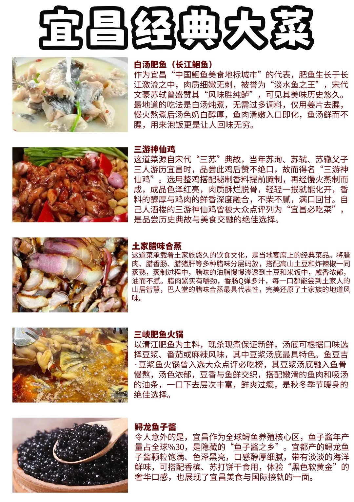
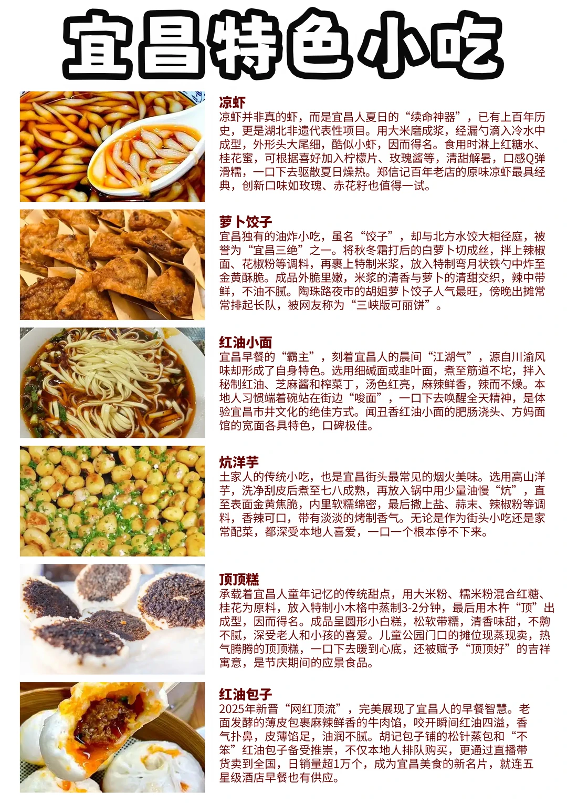
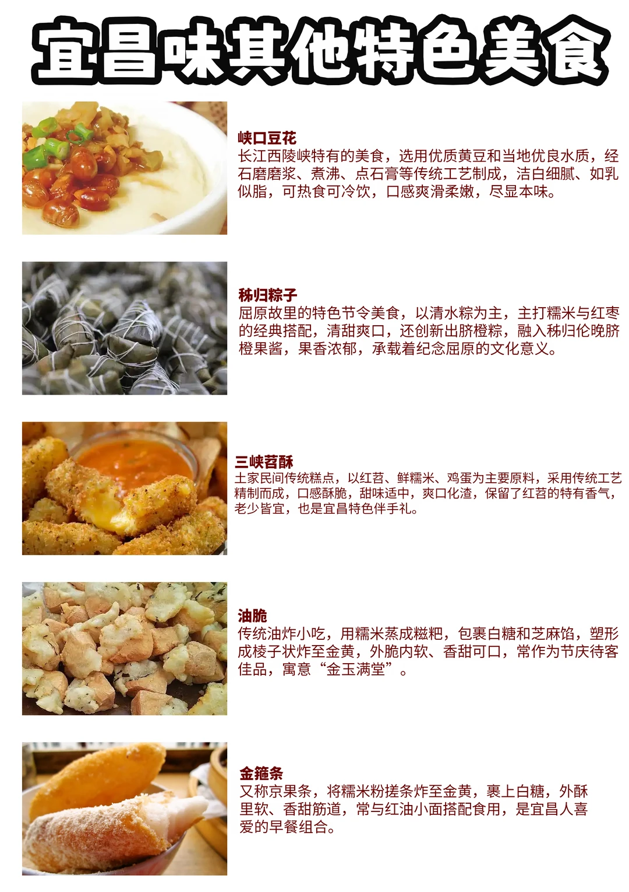

# 宜昌美食

- 作者: 一城一旅一味丨鹏仔
- 👍60 · 💬1 · ⭐53 · 图 3
- feed_id: 69d3a798000000001a02416e

> [OCR] 宜昌经典大菜

白汤肥鱼（长江鮰鱼）
作为宜昌“中国鮰鱼美食地标城市”的代表，肥鱼生长于长江激流之中，肉质细嫩无刺，被誉为“淡水鱼之王”，宋代文豪苏轼曾盛赞其“风味胜纯鲈”，可见其美味历史悠久。最地道的吃法是白汤炖煮，无需过多调料，仅用姜片去腥，慢火熬煮后汤色奶白醇厚，鱼肉滑嫩入口即化，鱼汤鲜而不腥，用来泡饭更是让人回味无穷。

三游神仙鸡
这道菜源自宋代“三苏”典故，当年苏洵、苏轼、苏辙父子三人游历宜昌时，品尝此鸡后赞不绝口，故而得名“三游神仙鸡”。选用整鸡搭配秘制香料提前腌制，再经慢火蒸制而成，成品色泽红亮，肉质酥烂脱骨，轻轻一抿就能化开，香料的醇厚与鸡肉的鲜香深度融合，不柴不腻，满口回甘。自己人酒楼的三游神仙鸡曾被大众点评列为“宜昌必吃菜”，是品尝历史典故与美食交融的绝佳选择。

土家腊味合蒸
这道菜承载着土家族悠久的饮食文化，是当地宴席上的经典菜品。将腊肉、腊香肠、腊猪肝等多种腊味分层码放，搭配高山土豆和炸辣椒一同蒸熟，蒸制过程中，腊味的油脂慢慢渗透到土豆和米饭中，咸香浓郁，油而不腻。腊肉紧实有嚼劲，香肠Q弹多汁，每一口都能尝到土家人的山居智慧，巴人堂的腊味合蒸最具代表性，完美还原了土家族的地道风味。

三峡肥鱼火锅
以清江肥鱼为主料，现杀现煮保证新鲜，汤底可根据口味选择豆浆、番茄或麻辣风味，其中豆浆汤底最具特色。鱼豆吉·豆浆鱼火锅曾入选大众点评必吃榜，其豆浆汤底融入鱼骨慢熬，汤色浓郁，豆香与鱼鲜交织，搭配嫩滑的鱼肉和吸汤的油条，一口下去层次丰富，鲜爽过瘾，是秋冬季节暖身的绝佳选择。

鲟龙鱼子酱
令人意外的是，宜昌作为全球鲟鱼养殖核心区，鱼子酱年产量占全球%30，是隐藏的“鱼子酱之乡”。宜都产的鲟龙鱼子酱颗粒饱满、色泽黑亮，口感醇厚细腻，带有淡淡的海洋鲜味，可搭配香槟、苏打饼干食用，体验“黑色软黄金”的奢华口感，也展现了宜昌美食与国际接轨的一面。

> [OCR] 宜昌特色小吃

凉虾
凉虾并非真的虾，而是宜昌人夏日的“续命神器”，已有上百年历史，更是湖北非遗代表性项目。用大米磨成浆，经漏勺滴入冷水中成型，外形头大尾细，酷似小虾，因而得名。食用时淋上红糖水、桂花蜜，可根据喜好加入柠檬片、玫瑰酱等，清甜解暑，口感Q弹滑糯，一口下去驱散夏日燥热。郑信记百年老店的原味凉虾最具经典，创新口味如玫瑰、赤花籽也值得一试。

萝卜饺子
宜昌独有的油炸小吃，虽名“饺子”，却与北方水饺大相径庭，被誉为“宜昌三绝”之一。将秋冬霜打后的白萝卜切成丝，拌上辣椒面、花椒粉等调料，再裹上特制米浆，放入特制弯月状铁勺中炸至金黄酥脆。成品外脆里嫩，米浆的清香与萝卜的清甜交织，辣中带鲜，不油不腻。陶珠路夜市的胡姐萝卜饺子人气最旺，傍晚出摊常常排起长队，被网友称为“三峡版可丽饼”。

红油小面
宜昌早餐的“霸主”，刻着宜昌人的晨间“江湖气”，源自川渝风味却形成了自身特色。选用细碱面或韭叶面，煮至筋道不坨，拌入秘制红油、芝麻酱和榨菜丁，汤色红亮，麻辣鲜香，辣而不燥。本地人习惯端着碗站在街边“唆面”，一口下去唤醒全天精神，是体验宜昌市井文化的绝佳方式。闻丑香红油小面的肥肠浇头、方妈面馆的宽面各具特色，口碑极佳。

炕洋芋
土家人的传统小吃，也是宜昌街头最常见的烟火美味。选用高山洋芋，洗净刮皮后煮至七八成熟，再放入锅中用少量油慢“炕”，直至表面金黄焦脆，内里软糯绵密，最后撒上盐、蒜末、辣椒粉等调料，香辣可口，带有淡淡的烤制香气。无论是作为街头小吃还是家常配菜，都深受本地人喜爱，一口一个根本停不下来。

顶顶糕
承载着宜昌人童年记忆的传统甜点，用大米粉、糯米粉混合红糖、桂花为原料，放入特制小木格中蒸制3-2分钟，最后用木杵“顶”出成型，因而得名。成品呈圆形小白糕，松软带糯，清香味甜，不齁不腻，深受老人和小孩的喜爱。儿童公园门口的摊位现蒸现卖，热气腾腾的顶顶糕，一口下去暖到心底，还被赋予“顶顶好”的吉祥寓意，是节庆期间的应景食品。

红油包子
2025年新晋“网红顶流”，完美展现了宜昌人的早餐智慧。老面发酵的薄皮包裹麻辣鲜香的牛肉馅，咬开瞬间红油四溢，香气扑鼻，皮薄馅足，油润不腻。胡记包子铺的松针蒸包和“不笨”红油包子备受推崇，不仅本地人排队购买，更通过直播带货卖到全国，日销量超1万个，成为宜昌美食的新名片，就连五星级酒店早餐也有供应。

> [OCR] 宜昌味其他特色美食

峡口豆花
长江西陵峡特有的美食，选用优质黄豆和当地优良水质，经石磨磨浆、煮沸、点石膏等传统工艺制成，洁白细腻、如乳似脂，可热食可冷饮，口感爽滑柔嫩，尽显本味。

秭归粽子
屈原故里的特色节令美食，以清水粽为主，主打糯米与红枣的经典搭配，清甜爽口，还创新出脐橙粽，融入秭归伦晚脐橙果酱，果香浓郁，承载着纪念屈原的文化意义。

三峡苕酥
土家民间传统糕点，以红苕、鲜糯米、鸡蛋为主要原料，采用传统工艺精制而成，口感酥脆，甜味适中，爽口化渣，保留了红苕的特有香气，老少皆宜，也是宜昌特色伴手礼。

油脆
传统油炸小吃，用糯米蒸成糍粑，包裹白糖和芝麻馅，塑形成棱子状炸至金黄，外脆内软、香甜可口，常作为节庆待客佳品，寓意“金玉满堂”。

金箍条
又称京果条，将糯米粉搓条炸至金黄，裹上白糖，外酥里软、香甜筋道，常与红油小面搭配食用，是宜昌人喜爱的早餐组合。

## 正文
来宜昌玩，除了看三峡，吃才是头等大事！
🍲 宜昌经典大菜（必吃硬菜）
白汤肥鱼（长江鮰鱼）
宜昌美食名片！长江活水养的鮰鱼，白汤炖煮奶白醇厚，鱼肉滑嫩无刺，泡饭绝了。
✅打卡：陶珠路美食街、长江肥鱼馆
三游神仙鸡
因苏轼父子点赞得名！慢火蒸制酥烂脱骨，酱香浓郁不柴，是宜昌必吃榜常客。
✅打卡：自己人酒楼（陶珠路店）
土家腊味合蒸
土家宴席硬菜！腊肉、香肠、腊猪肝分层蒸制，油脂渗进土豆米饭，咸香下饭。
✅打卡：巴人堂土家菜馆
三峡肥鱼火锅
秋冬暖身神器！豆浆汤底最有特色，搭配现杀清江鱼，鲜到跺脚。
✅打卡：鱼豆吉・豆浆鱼火锅（CBD 店）
鲟龙鱼子酱
宜昌是全球鱼子酱核心产区！颗颗饱满，配香槟 / 饼干吃，体验 “黑色黄金”。
✅打卡：宜昌高端餐厅、本地特产店
🧋 宜昌特色小吃（街头烟火气）
凉虾
宜昌夏日续命神器！大米磨浆制成，淋红糖水 / 桂花蜜，Q 弹清甜解暑。
✅打卡：郑信记凉虾（陶珠路总店）
萝卜饺子
宜昌三绝之一！白萝卜丝裹米浆炸制，外脆里嫩，被称为 “三峡版可丽饼”。
✅打卡：陶珠路夜市、解放路步行街
红油小面
宜昌早餐霸主！碱水面配秘制红油，麻辣鲜香，站着 “唆” 才地道。
✅打卡：闻丑香红油小面、方妈面馆
炕洋芋
街头最火小吃！高山洋芋炕至金黄，撒蒜辣粉，一口一个停不下来。
✅打卡：陶珠路夜市、CBD 小吃街
顶顶糕
童年回忆杀！大米 + 糯米粉蒸制，松软香甜，寓意 “顶顶好”。
✅打卡：儿童公园门口、西陵一路路边摊
红油包子
2025 新晋网红！薄皮牛肉馅，咬开红油四溢，皮薄馅足。
✅打卡：胡记包子铺（多个分店）
🎁 其他特色美食（伴手礼 / 特色款）
峡口豆花：石磨传统工艺，细腻如乳，可热可冷
✅打卡：峡口景区周边、本地早餐店
秭归粽子：清水粽配红枣，还有创新脐橙粽，承载屈原文化
✅打卡：秭归本地、宜昌特产店
三峡苕酥：红苕做的传统糕点，酥脆香甜，伴手礼首选
✅打卡：宜昌各大超市、特产店
油脆：糯米糍粑炸制，外脆内软，寓意金玉满堂
金箍条：糯米粉炸条裹糖，配红油小面的早餐绝配
📍 美食集中打卡地
陶珠路美食街：一站式吃遍宜昌小吃 + 大菜，夜市氛围拉满
CBD 购物中心周边：本地人气美食聚集地，早中晚都能吃
解放路步行街：老字号扎堆，适合逛吃
西陵一路：早餐圣地，红油小面、包子等应有尽有
#宜昌美食 #宜昌旅游 #宜昌探店 #湖北美食 #宜昌小吃 #三峡美食 #宜昌攻略 #宜昌打卡 #宜昌本地人美食 #宜昌伴手礼

---