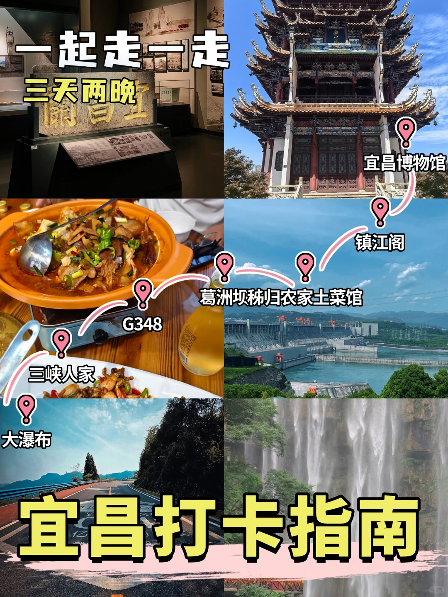
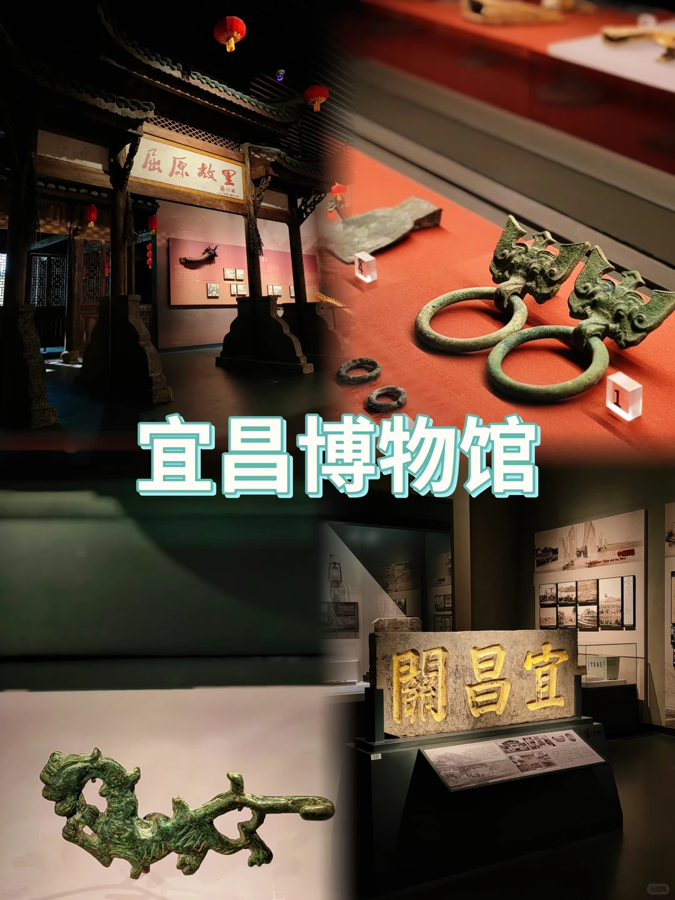
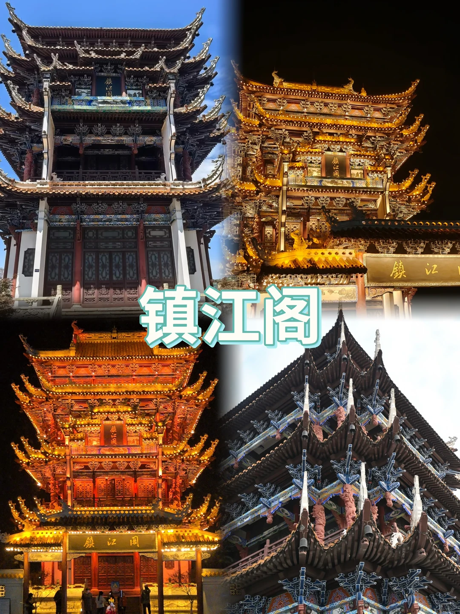
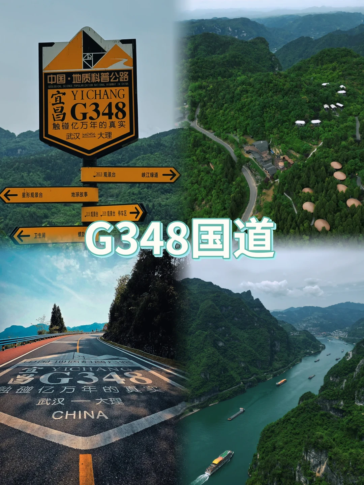

# 宜昌3日深度漫游｜不走回头路专属行程

- 作者: 桃气满满
- 👍59 · 💬2 · ⭐23 · 图 8
- feed_id: 6a75762c0000000028006a49

> [OCR] 一起走一走
三天两晚
宜昌博物馆
镇江阁
葛洲坝秭归农家土菜馆
三峡人家
大瀑布
宜昌打卡指南
G348

> [OCR] 宜昌博物馆
關昌

> [OCR] 镇江阁

> [OCR] 秭归农家土菜馆

> [OCR] 葛洲坝
中国宜昌

> [OCR] 中国·地质科普公路
宜昌 YICHANG
G348
触碰亿万年的真实
武汉 km2456 大理

星形观景台 地球故事
303 观景台 峡江绿道 →
卫生间 螺旋
315 观景台 308 观景台 停车区 →
G348国道

> [OCR] 三峡人家

> [OCR] 大瀑布

## 正文
📍Day1 老城人文·江边烟火局
路线：宜昌博物馆→秭归农家土菜馆→傍晚打卡镇江阁
👉09:00 宜昌博物馆
提前线上预约免费入园，沉浸式翻看巴楚文物、三峡历史展区，先读懂宜昌沉淀千年的江边故事，展馆雅致简约很适合拍照。
	
👉11:30 秭归农家土菜馆｜两道招牌硬菜
✅渣渣牛肉锅
牛肉剁成细碎的肉沫小块，长时间小火焖煮，肉质炖得软乎乎，一口直接抿开。锅底香辣厚重，牛油香味很足，越煮越入味，肉碎裹满汤汁，吃着过瘾下饭，辣度顺口不会呛喉咙。
	
✅农家杀猪菜
他家农家杀猪菜用料满满，选用黑猪瘦肉、肥瘦相间的五花肉、嫩滑猪血、肥肠、鲜肚还有腰条肉一同精心慢炖。整锅鲜香扑鼻，酸辣的滋味特别开胃，猪肚脆嫩、肥肠软糯，猪血滑嫩入口，多种猪肉食材层次丰富，热乎一锅吃起来烟火感十足。
	
👉18:00 镇江阁
等到黄昏入夜，临江古楼亮起灯光，晚风裹挟江风吹拂，古风建筑和江面暮色相融，氛围感夜景直接拉满。
	
📍Day2 沿江自驾｜G348国道峡谷公路一日行
路线：葛洲坝观景台 → 网红G348三峡景观公路全天自驾
👉上午先抵达葛洲坝3号观景平台，等候船只过闸，亲眼见识万里长江第1️⃣坝江水奔涌的壮阔景象。
👉随后驶入封神级沿江G348国道，整条公路紧贴西陵峡江岸，沿路分布多处观景平台。一边是陡峭青山，一边是浩荡长江，沿途随时靠边停下拍照，慢悠悠打卡峡谷风光，一整天沉浸式享受沿江自驾的松弛感。
	
📍Day3 山水秘境｜自然风光双景区
路线：三峡人家 → 三峡大瀑布
👉上午前往5A景区三峡人家，闲逛龙进溪溪水村寨，观赏吊脚楼、江边渔船，等候特色土家婚嫁民俗表演，沉浸式感受峡江原住民的生活气息。
👉下午奔赴三峡大瀑布，国内少见可以穿行的水帘瀑布，百米水流凌空倾泻，穿过水雾清凉舒心，沿途沿路的溪涧小景也十分出片。
	
💡出行干货贴士
1. 博物馆、大坝景区必须携带证件提前预约
2. G348弯道较多，沿江开车减速，观景台短暂停车拍照
	
三峡人家景区范围很大，备好舒适运动鞋；瀑布游玩提前备好雨衣防水袋
	
#宜昌三日游[话题]# #宜昌旅游[话题]# #三峡旅行[话题]# #宜昌美食[话题]##秭归农家土菜馆[话题]# #西坝不夜城[话题]# #三峡大坝攻略[话题]##宜昌周末出游[话题]# #长江夜游[话题]# #湖北短途旅行[话题]#

---