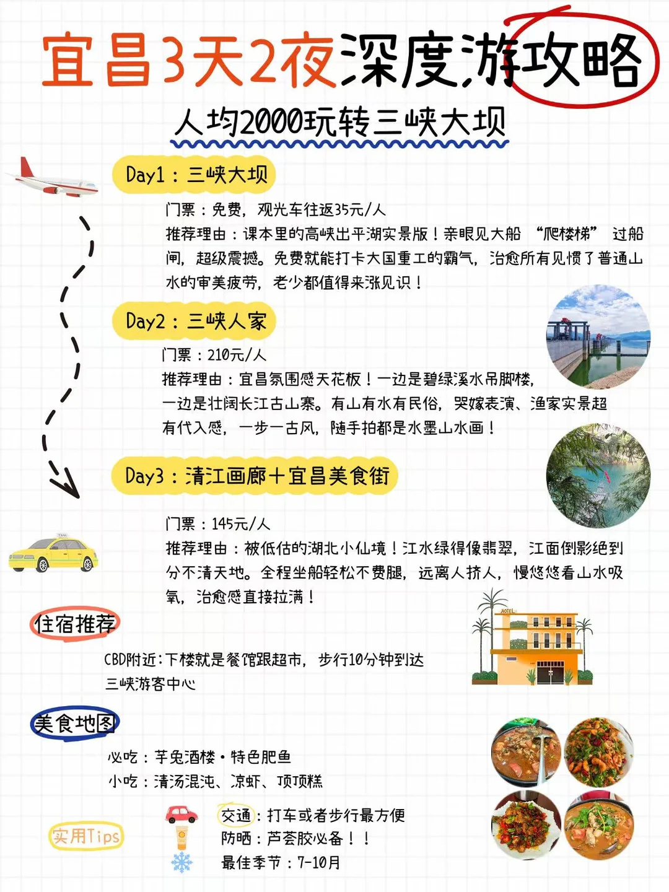
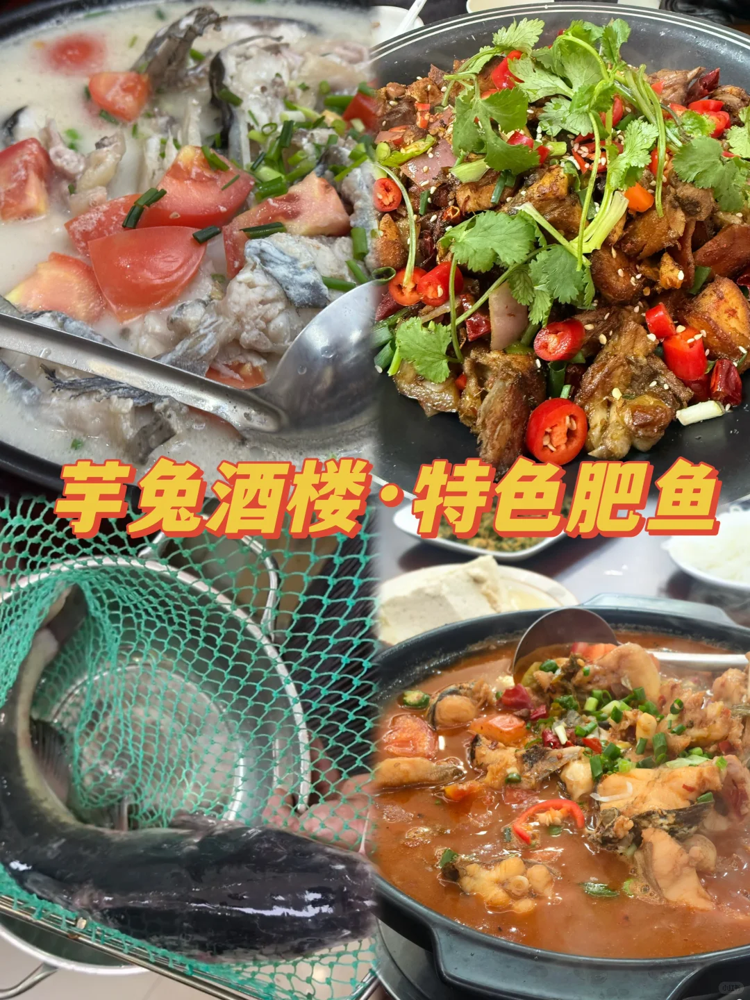

# 宜昌三日慢旅行｜逛三峡山水吃遍地道风味

- 作者: 胖虎爱溜达
- 👍56 · 💬7 · ⭐43 · 图 6
- feed_id: 6a5470a800000000080334e0

> [OCR] 宜昌3天2夜深度游攻略
人均2000玩转三峡大坝

Day1：三峡大坝
门票：免费，观光车往返35元/人
推荐理由：课本里的高峡出平湖实景版！亲眼见大船“爬楼梯”过船闸，超级震撼。免费就能打卡大国重工的霸气，治愈所有见惯了普通山水的审美疲劳，老少都值得来涨见识！

Day2：三峡人家
门票：210元/人
推荐理由：宜昌氛围感天花板！一边是碧绿溪水吊脚楼，一边是壮阔长江古山寨。有山有水有民俗，哭嫁表演、渔家实景超有代入感，一步一古风，随手拍都是水墨山水画！

Day3：清江画廊+宜昌美食街
门票：145元/人
推荐理由：被低估的湖北小仙境！江水绿得像翡翠，江面倒影绝到分不清天地。全程坐船轻松不费腿，远离人挤人，慢悠悠看山水吸氧，治愈感直接拉满！

住宿推荐
CBD附近:下楼就是餐馆跟超市，步行10分钟到达三峡游客中心

美食地图
必吃：芋兔酒楼·特色肥鱼
小吃：清汤混沌、凉虾、顶顶糕

实用Tips
交通：打车或者步行最方便
防晒：芦荟胶必备！！
最佳季节：7-10月

> [OCR] 三峡大坝景区
三峡大坝

> [OCR] 芋兔酒楼·特色肥鱼

> [OCR] 三峡人家

> [OCR] 清江画廊

> [OCR] 宜昌
一座米仓的城市
满意楼
满意楼
宜昌美食街
宜昌

## 正文
解锁宜昌绝美山水！3天2晚纯玩不赶趟，大坝风光、峡江秘境、地道美食一次性拿捏，新手直接抄作业✅
	
Day1 震撼山河线｜三峡大坝
📍第一天直奔三峡大坝，亲眼见证大国重器的磅礴气势🏗️
登顶坛子岭俯瞰整片坝区全景，185观景台平视浩荡长江，行走截流纪念园，近距离感受世纪工程的震撼。江水奔涌、山河壮阔，亲眼所见远比图片更治愈震撼，沉浸式感受宜昌的山水底气。
	
📍游玩结束直奔 芋兔酒楼 特色肥鱼（三峡大坝黑金冠店）
	
逛完三峡大坝，步行就能抵达景区外深巷里开了整整26年的本土老店——芋兔酒楼.特色肥鱼，来三峡旅游吃地道江鲜首选这家！！他们家的肥鱼真的是一绝！！
	
他们家特别真诚，使用开放式透明厨房全程可视化，池子里活鱼现捞、现杀现做，新鲜看得见，老板底气十足承诺不好吃全额退！
	
招牌必点肥鱼的一鱼两吃，鱼头鱼尾搭配番茄慢炖出奶白浓汤，胶质满满鲜甜不腥，饭前连喝三碗都不够；鱼身红烧裹满秘制酱汁，鱼肉紧实肥厚、没有细碎鱼刺，鱼皮软糯Q弹，一口全是峡江江鲜本味。
	
Day2 水墨秘境｜三峡人家
📍全天沉浸式逛三峡人家🍃
青瓦吊脚楼依江而建，溪水潺潺、乌篷船摇曳，随处是江南水墨质感。看土家民俗表演、江畔风情演绎，山野清幽氛围感直接拉满，一步一景皆是诗意。
	
Day3 诗意画廊+烟火美食｜清江画廊➕宜昌美食街
📍上午畅游清江画廊🌿
八百里清江美如画！乘舟漫游江面，碧水青山环绕，两岸峰峦叠翠，云雾缭绕宛若仙境，清风拂面超级治愈，是宜昌最温柔的山水秘境。
	
📍傍晚打卡宜昌美食街
一站式解锁本地特色小吃，软糯凉虾、香辣炕土豆、各色卤味小吃应有尽有，满满市井烟火气，用美食完美收尾整个三峡之旅～
	
💡出行小tips
1. 三峡大坝需提前预约，记得带好身份证
2. 清江画廊建议坐船游览，沉浸式体验山水风光
	
宜昌昼夜温差适中，轻装出行超舒服
#宜昌旅游[话题]# #宜昌三天两夜攻略[话题]# #三峡大坝[话题]# #三峡人家[话题]# #清江画廊[话题]# #宜昌美食[话题]# #芋兔酒楼[话题]# 特色肥鱼（三峡大坝黑金冠店） #湖北旅游攻略[话题]##宜昌自驾游[话题]# #宜昌美食攻略[话题]#

---