# 宜昌一日游三峡大坝+葛洲坝+市区

- 作者: 太師今天儿不滑雪
- 👍56 · 💬2 · ⭐84 · 图 14
- feed_id: 6a3a68a1000000001101f1fb

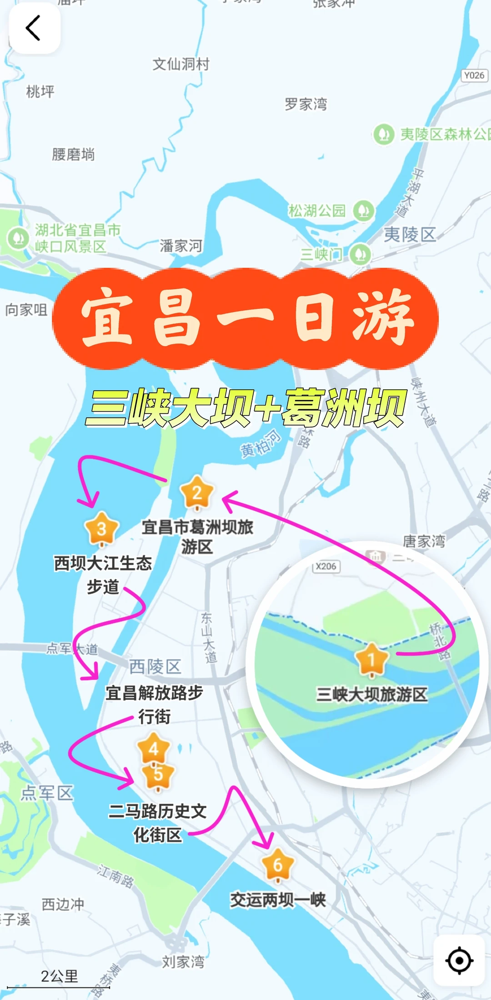
> [OCR] 宜昌一日游
三峡大坝+葛洲坝
1. 三峡大坝旅游区
2. 宜昌市葛洲坝旅游区
3. 西坝大江生态步道
4. 二马路历史文化街区
5. 交运两坝一峡
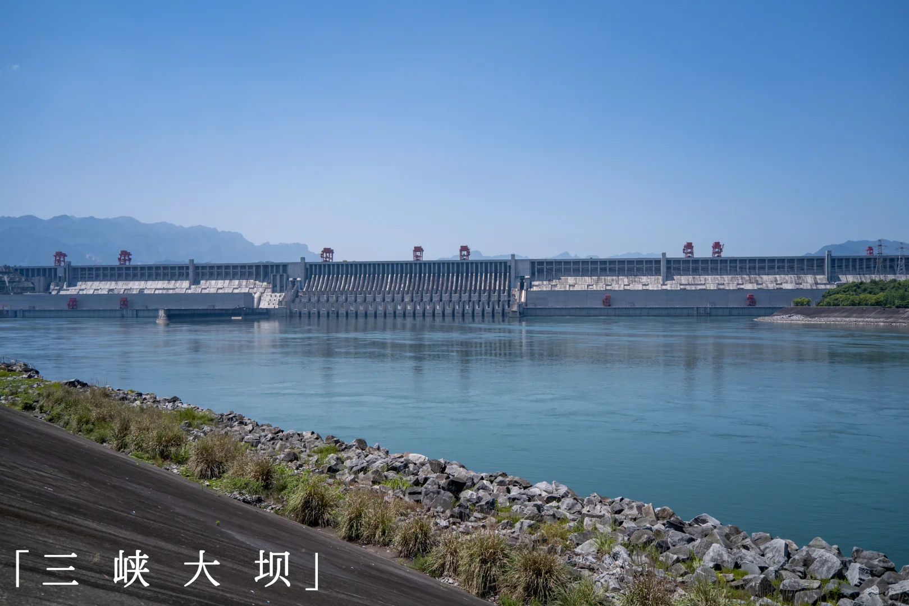
> [OCR] 三峡大坝
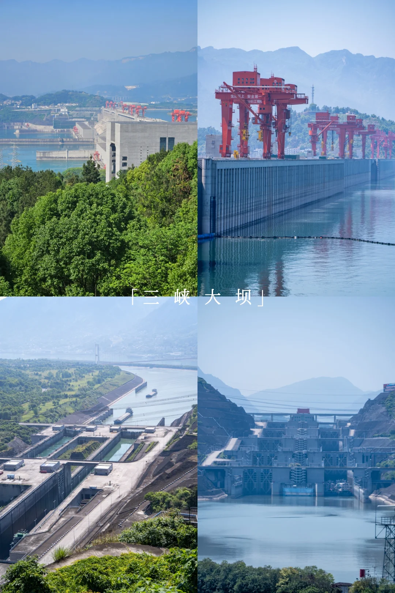
> [OCR] 「三?峡大坝」
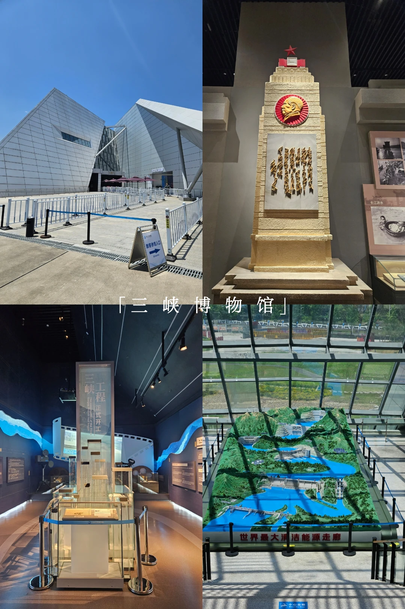
> [OCR] 「三峡博物馆」

世界最大清洁能源走廊
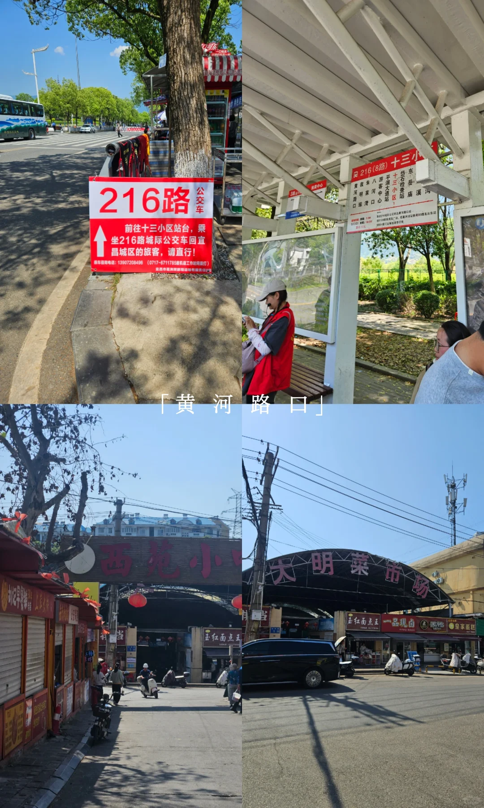
> [OCR] 216路
公交车
前往十三小区站台,乘坐216路城际公交车回宣昌城区的旅客，请直行！
黄 河 路 口
西苑小
大明菜市场
[?]
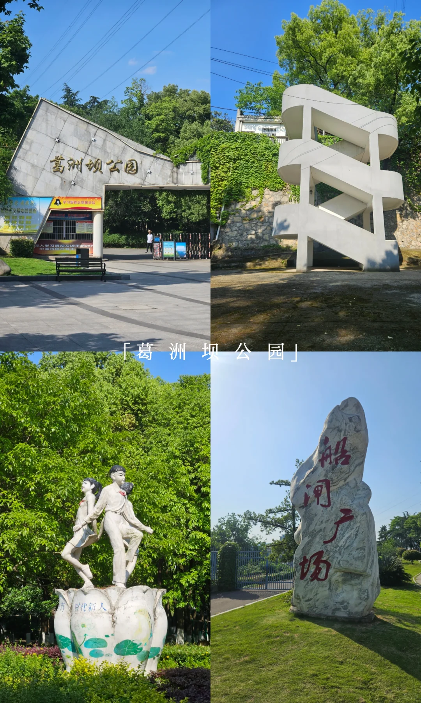
> [OCR] 葛洲坝公园
「葛 洲 坝 公 园」
船闸广场
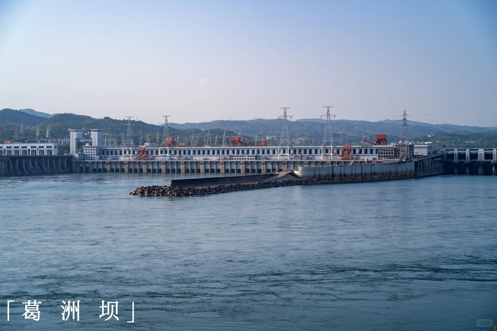
> [OCR] 「葛洲坝」
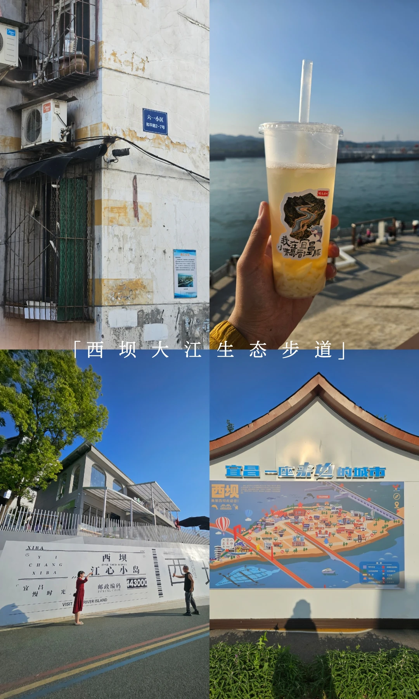
> [OCR] 六一小区
和平路2-7号
「西坝大江生态步道」
XIBA
宜昌慢时光
邮政编码
443000
VISIT
RIVER ISLAND
西坝
江心小岛
宜昌一座未央的城市
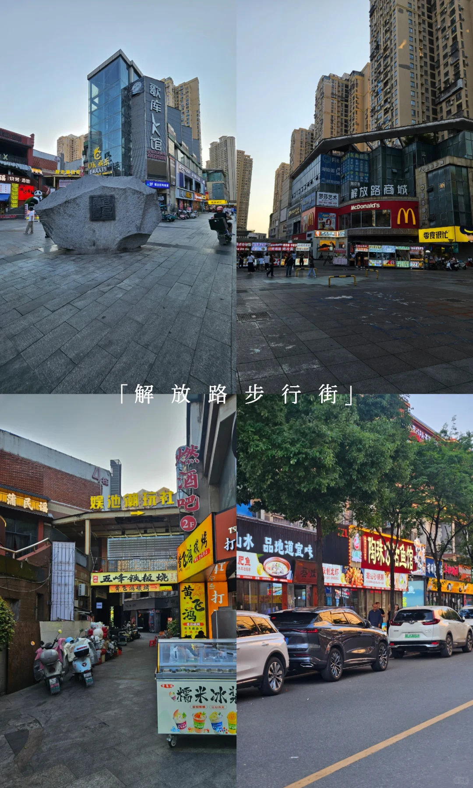
> [OCR] 歌库K馆
OK酷乐
2F
解放路步行街
娱池湖玩社
五峰铁板烧
黄飞鸿
糯米冰茶
燃酒吧
打
肥鱼
山水 品地道宜味
陶珠浴鱼馆
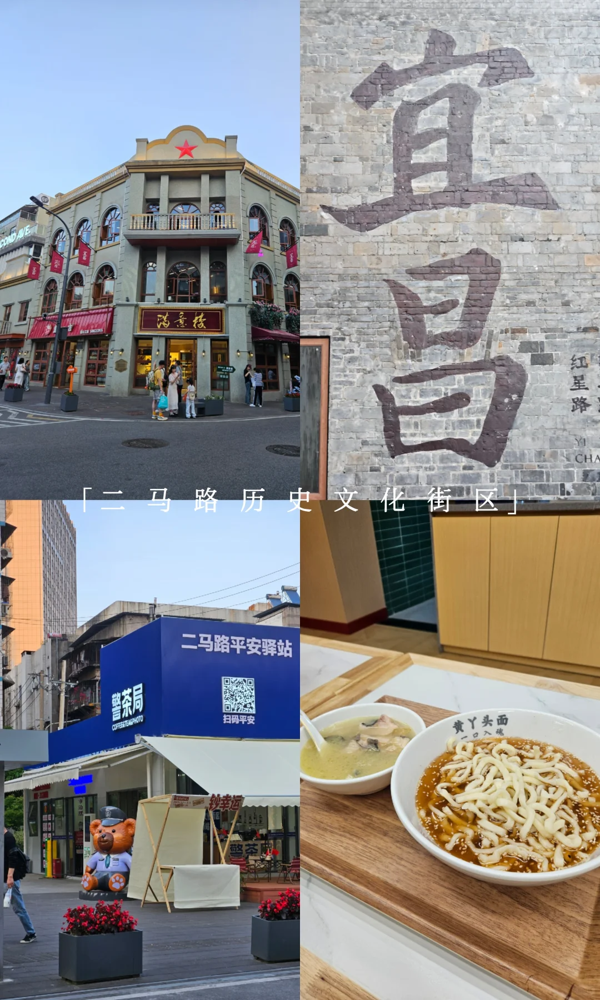
> [OCR] 满意楼
红星路
二马路历史文化街区
警茶局
二马路平安驿站
扫码平安
黄丫头面
一口入魂
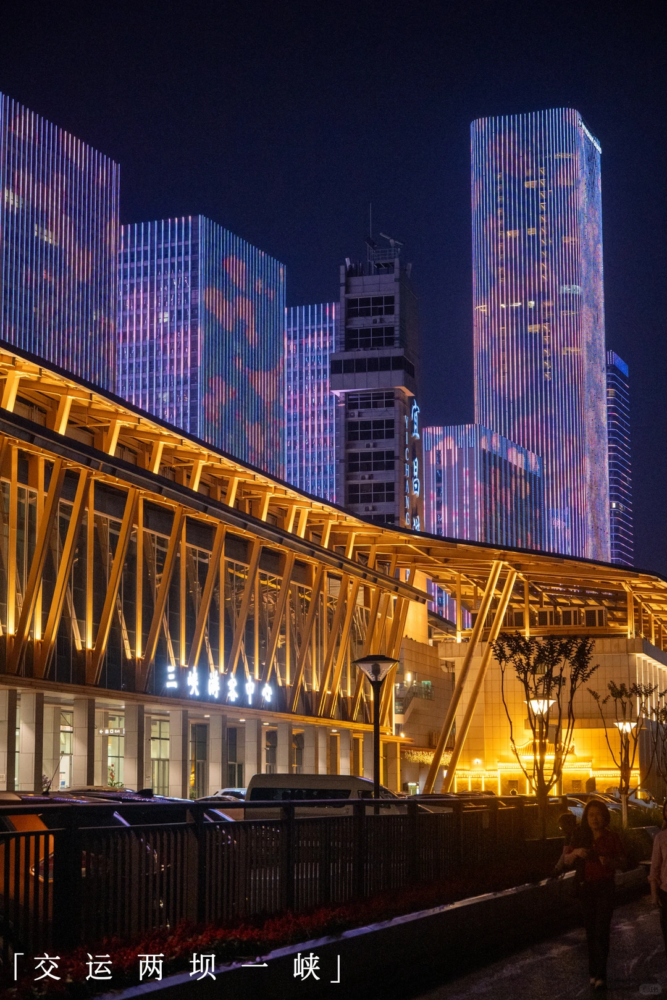
> [OCR] 三峡游客中心
宜昌
「交运两坝一峡」

> [OCR] 「夷陵长江大桥」

> [OCR] 「滨江公园」
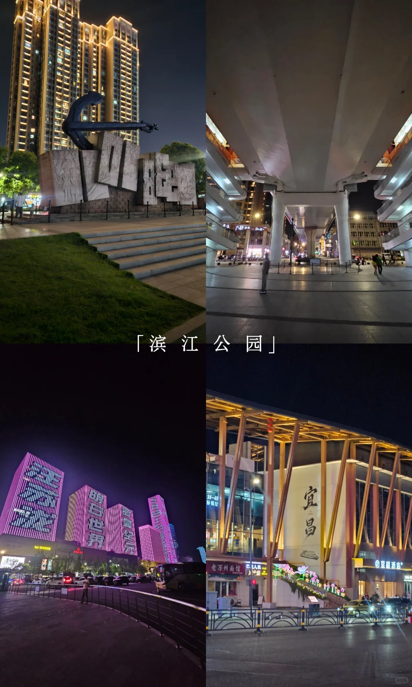
> [OCR] 「滨江公园」
宜昌

## 正文
两坝游分上下午，上午从宜昌东站出来就直接去旁边客运站坐到三峡游客中心换乘点的车下车，下午就到葛洲坝逛逛晚上再去步行街吃东西，总体行程还是比较费腿的，请量力而行
	
🚶‍♀️路线：宜昌东站→三峡大坝→葛洲坝公园→西坝大江生态步道→宜昌解放路步行街→二马路历史文化街→交运两坝一峡
	
🏝三峡大坝[星R][星R][星R] （35r）:游园必须购买35园景区交通票，进去就跟着路线一直走就行了，会先到船闸，然后走到大坝，期间有个小电瓶车不用坐挺近的，看完大坝后最后会把你带到三峡博物馆，里面挺大的把三峡的立项到落地讲的很清楚，我看了挺久的，最后来到截流纪念园，这里是三峡正面最佳观景视角，看完后就坐景区大巴回到入口
⚠️⚠️⚠️走出景区会看到216的牌子，会引导你去站台这个公交一个小时一班，人多的话可能等很久，先去看下人多不，人多的话就从来时下车的地方去拦大巴，只要是回宜昌的就行
🏝葛洲坝公园[星R][星R]：我坐216最后来到黄河路口这周围有菜市和小吃街可以在这吃东西，三峡大坝游客中心门口也有吃的，这边选择多一些，也有零食店可以补给，吃完就去马路对面坐B34到石子岭路演江边走就行了，里面是普通的市政公园，能近距离看船闸下游，走到船闸广场可以看船闸上游
🏝西坝大江生态步道[星R][星R]：葛洲坝是三峡大坝的开建前的演练项目，直接打车到六一小区直走就到江边了，这里是葛洲坝最佳观景点，可以看到江豚，我看到好多只，就是太晒了没遮挡，路边一家咖啡厅和卖凉虾的
🏝解放路步行街[星R]：吃的非常多，晚餐可以在这里解决，大餐馆比较多
🏝二马路历史文化街区[星R]：宜昌打卡墙就在这里了，小吃挺多的可以吧萝卜饺子顶顶糕啥的都试试，还有我第一次见的警茶局，地方不大一会儿就能逛完
🏝交运两坝一峡[星R]：吃完饭就可以根据自己体力来江边散步看夜景了，这边可以飞无人机很友好，走到交运两坝一峡也就是游三峡的宜昌上船点我就坐公交回宜昌了，到这行程就结束啦～
	
#三峡大坝[话题]# #宜昌[话题]# #葛洲坝[话题]# #湖北[话题]# #旅行攻略[话题]# #二马路[话题]# #解放路步行街[话题]#

---