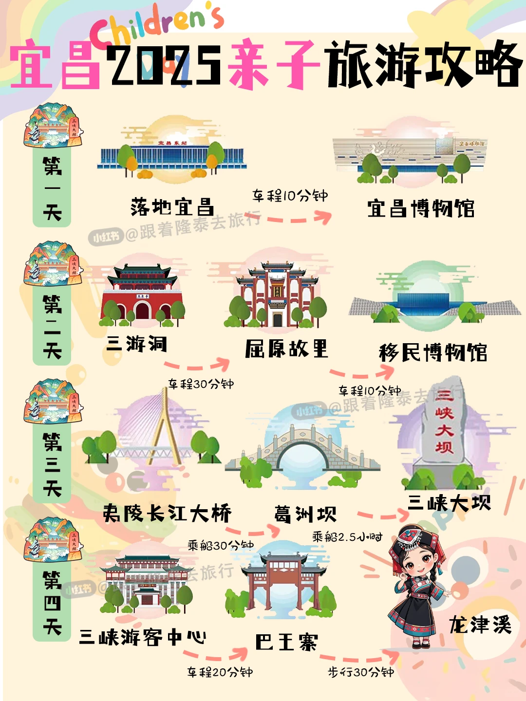
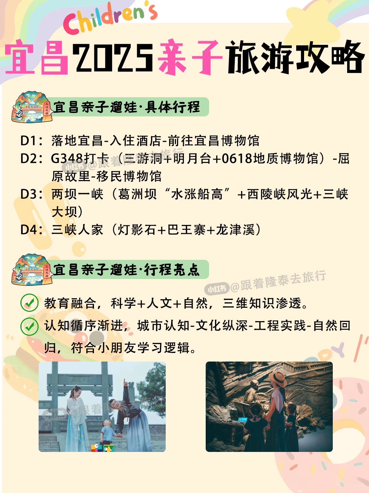
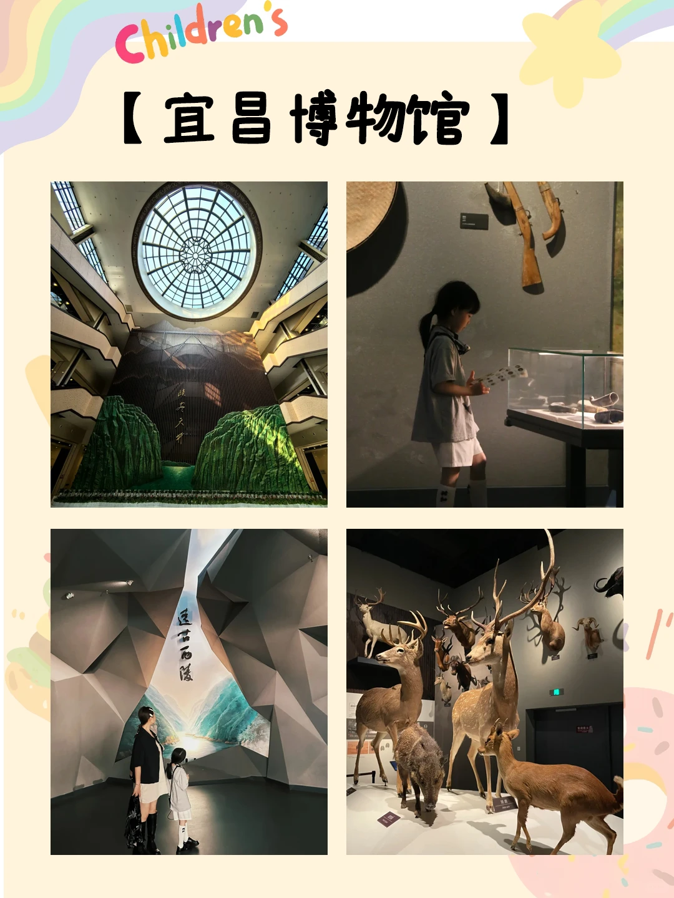
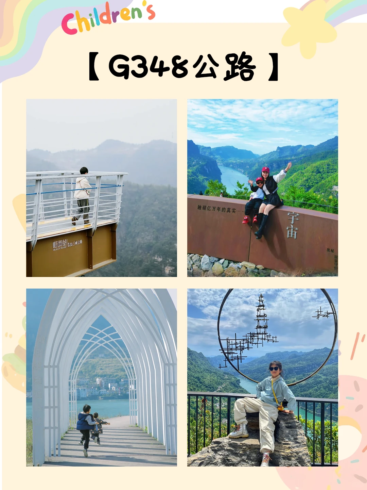
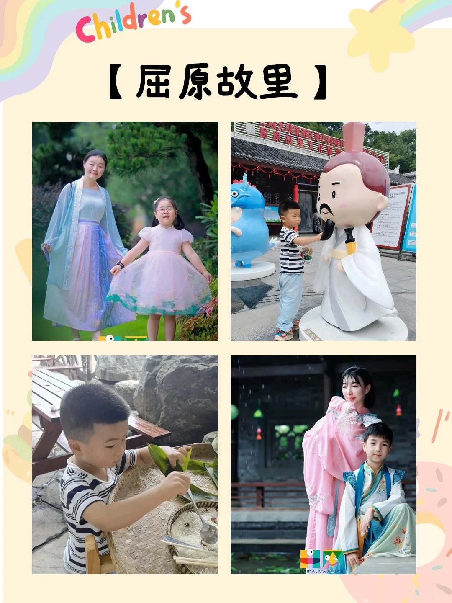
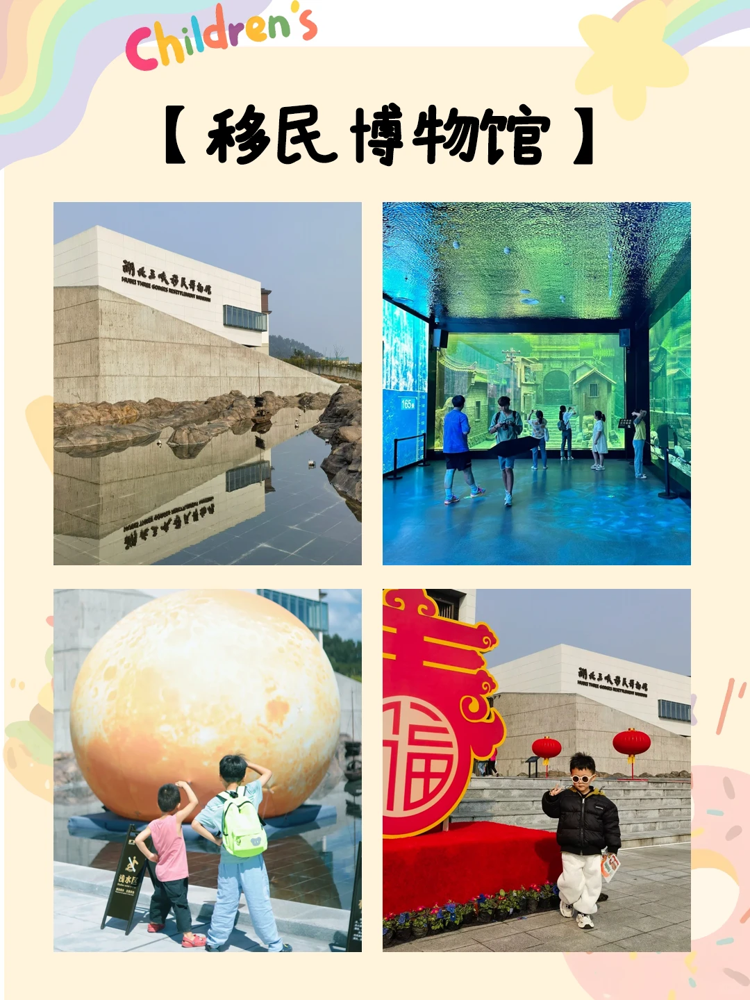
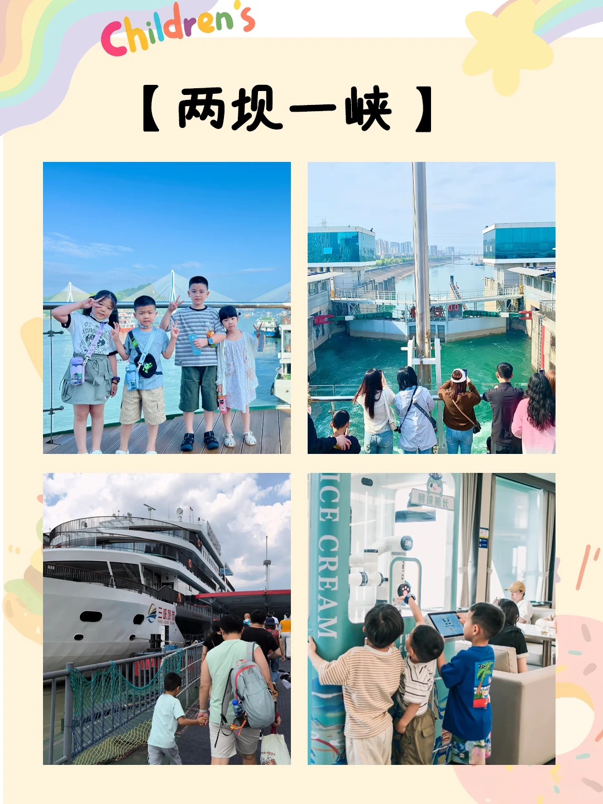
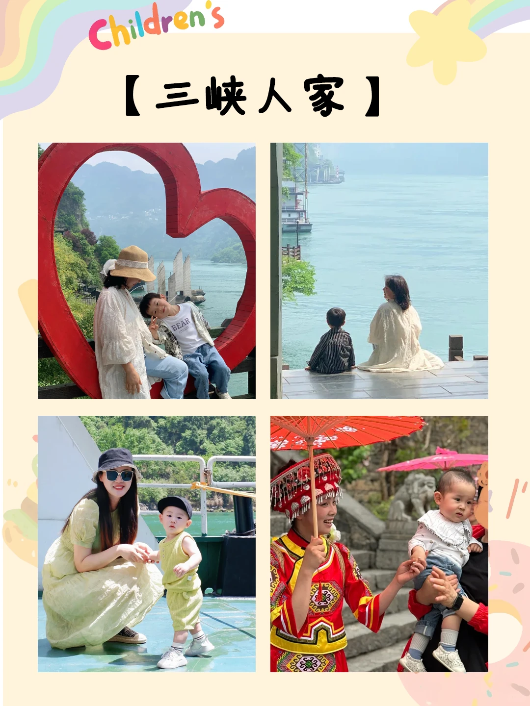

# 宜昌亲子游四天三晚🔥探秘三峡+地质奇观

- 作者: 跟着楚渝行去旅行
- 👍56 · 💬1 · ⭐92 · 图 8
- feed_id: 680761ef000000001c01e1b7

> [OCR] 宜昌2025亲子旅游攻略

第一天
落地宜昌 车程10分钟
宜昌博物馆

第二天
三游洞
屈原故里
移民博物馆

第三天
夷陵长江大桥 乘船30分钟
葛洲坝 乘船2.5小时
三峡大坝

第四天
三峡游客中心 车程20分钟
巴王寨 步行30分钟
龙津溪

> [OCR] 宜昌2025亲子旅游攻略

宜昌亲子遛娃·具体行程

D1：落地宜昌-入住酒店-前往宜昌博物馆
D2：G348打卡（三游洞+明月台+0618地质博物馆）-屈原故里-移民博物馆
D3：两坝一峡（葛洲坝“水涨船高”+西陵峡风光+三峡大坝）
D4：三峡人家（灯影石+巴王寨+龙津溪）

宜昌亲子遛娃·行程亮点

教育融合，科学+人文+自然，三维知识渗透。
认知循序渐进，城市认知-文化纵深-工程实践-自然回归，符合小朋友学习逻辑。

> [OCR] Children's
宜昌博物馆

> [OCR] Children's
【G348公路】
触碰亿万年的真?...
宇宙
奥秘
听雨堂 [武当三桥公路]
原??
??
??
??
??
??
??
??
??
??
??
??
??
??
??
?

> [OCR] Children's
【屈原故里】

> [OCR] Children's
【移民博物馆】

湖北三峡移民博物馆
HUBEI THREE GORSES RESETTLEMENT MUSEUM

165m

湖北三峡移民博物馆
HUBEI THREE GORSES RESETTLEMENT MUSEUM

> [OCR] Children's
【两坝一峡】

> [OCR] Children's
三峡人家

## 正文
🌟 行程优势速览
✅ 城市认知-文化纵深-工程实践-自然回归，符合学习逻辑
✅ 科学+人文+自然，三维启蒙，玩中学知识
.
📅 4天3晚亲子行程
✨D1：接站+城市历史启蒙
⛪️宜昌博物馆
🔹 AR长江漂流：召唤虚拟中华鲟，追踪洄游路线
🔹 码头小货郎：换装体验老城贸易，电子秤互动
🏨夜宿：江景亲子酒店
.
✨D2：地质探秘+文化穿越
⛩️三游洞*
🔹 唐宋摩崖石刻拓印（儿童安全拓版）
🏕️0618地质公园
🔹 集化石纹样换徽章，模拟火山喷发实验
🔹 地震台体验地壳运动（儿童安全模式）
🕋移民博物馆
🔹 光影拼图还原三峡老街，DIY移民行李箱
⛩️屈原故里
🔹 穿楚服接龙《橘颂》，矮枝橘园安全采摘
🔹 夜赏灯光秀，解锁“诗歌存钱罐”彩蛋
.
✨D3：大国重器深度游
🛥️两坝一峡游船（船去车回）
🔹 船闸科学课：记录葛洲坝水位变化，理解连通器原理
🔹 AR悬棺侦察：特制望远镜寻找西陵峡千年悬棺
晚餐：游船“截流纪念饭团”+压力管道造型果汁
.
✨D4：巴楚秘境+自然野趣
三峡人家（全天深度玩）
🔹龙津溪：投喂专用玉米粒与短尾猴握手
🔹巴王寨：软头箭射击、茶叶迷宫采茶赛
返程：乘坐高铁/飞机返程
.
📌 亲子小贴士
1️⃣ 地质公园多台阶，穿防滑运动鞋
2️⃣ 江边温差大，备儿童薄外套+防晒帽
3️⃣ 屈原故里提供婴儿车无障碍通道
.
🚗 交通建议：
G348公路没有公共交通，建议包车（5座车约400元/天）
三峡人家景区内可选缆车+游船联票（儿童1.2m以下免票）
.
🍜 餐饮推荐：
🥯午餐：屈原故里“竹筒蒸饭”、三峡人家“刁子鱼锅”
🍢小吃：铁路坝小吃街凉虾、萝卜饺子
.
🧳 必备物品：
🧢儿童防晒帽、防蚊贴、轻便运动鞋
便携折叠凳（排队等候用）
.
✨ 四天行程，串联城市、自然与人文，让孩子在山水间快乐成长！
跟着攻略走，解锁三峡的100种玩法！🚢🌿
#宜昌[话题]# #宜昌旅游[话题]# #旅游攻略[话题]# #亲子出游[话题]# #亲子旅游[话题]# #三峡大坝[话题]# #三峡人家[话题]# #五一去哪儿[话题]#

---