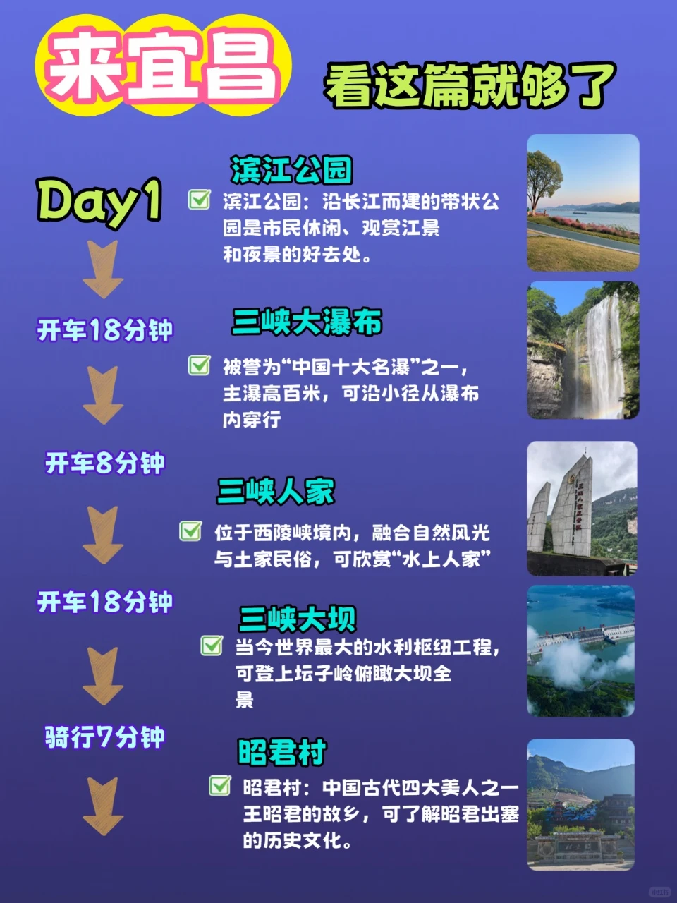
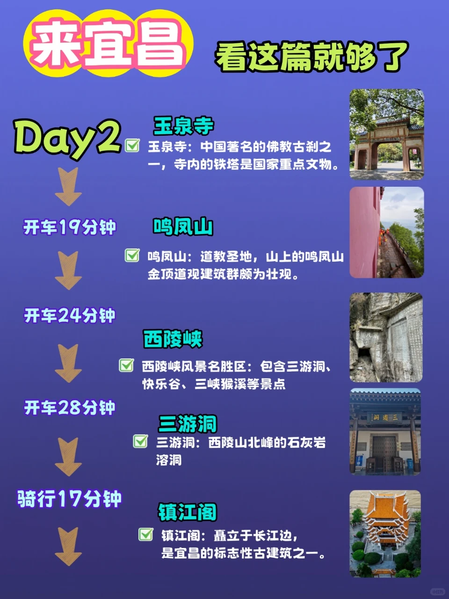
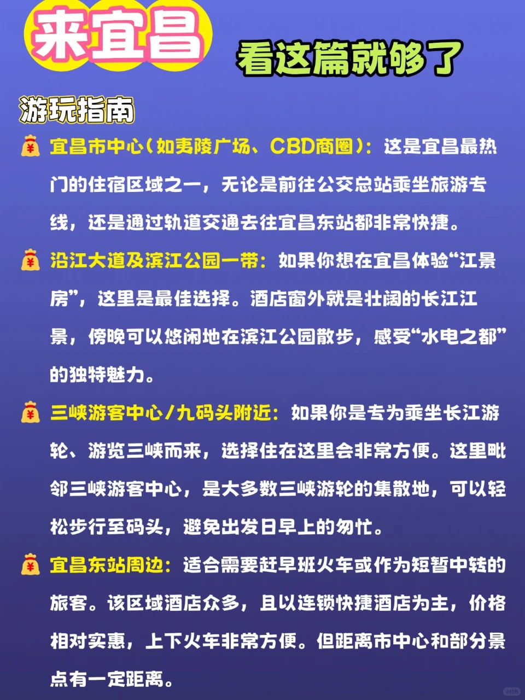
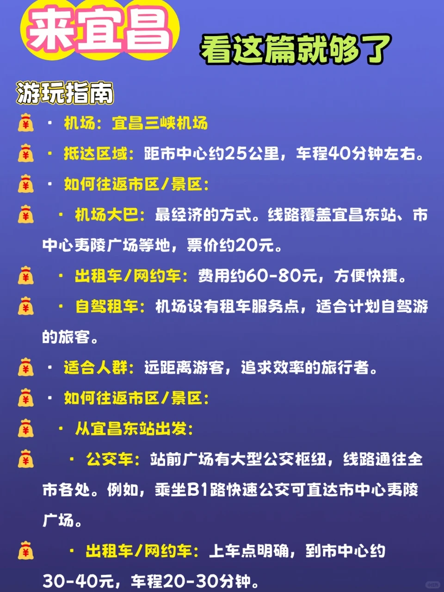
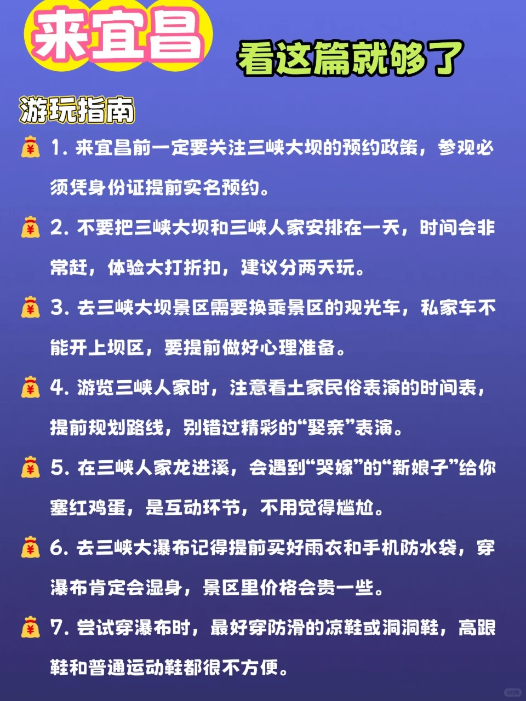
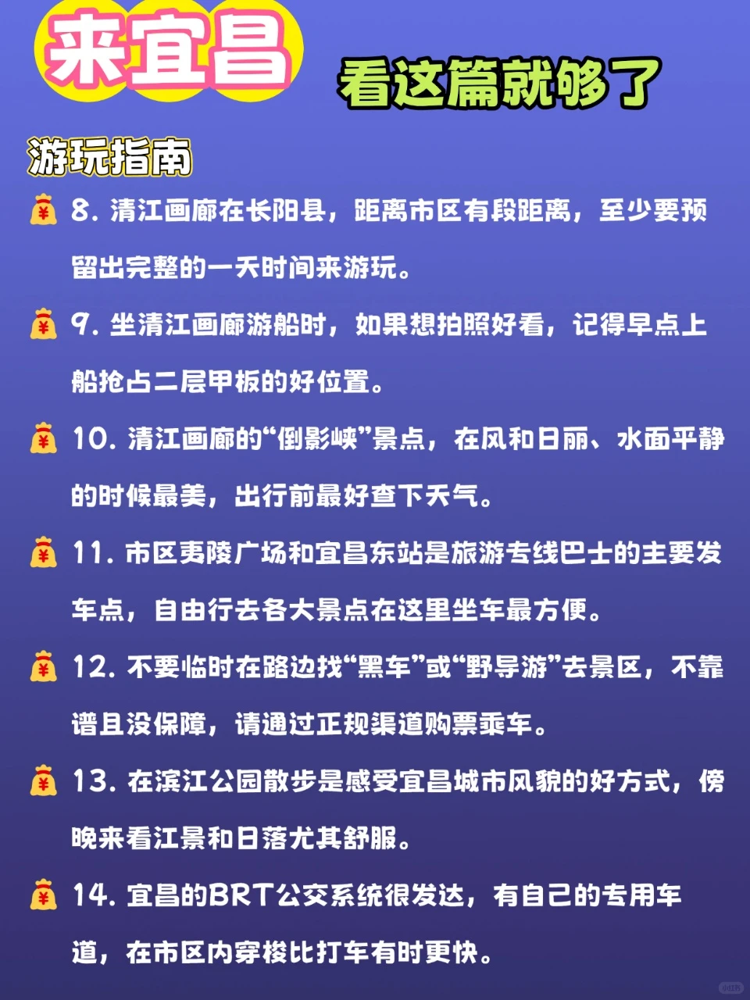

# 宜昌2天暴走攻略｜人均500玩到爽

- 作者: 奶盖小桃
- 👍53 · 💬3 · ⭐83 · 图 6
- feed_id: 6961c94f000000002203226c

> [OCR] 来宜昌 看这篇就够了

Day1
开车18分钟
滨江公园
滨江公园：沿长江而建的带状公园是市民休闲、观赏江景
和夜景的好去处。

三峡大瀑布
被誉为“中国十大名瀑”之一，
主瀑高百米，可沿小径从瀑布
内穿行

三峡人家
位于西陵峡境内，融合自然风光
与土家民俗，可欣赏“水上人家”

三峡大坝
当今世界最大的水利枢纽工程，
可登上坛子岭俯瞰大坝全
景

昭君村
昭君村：中国古代四大美人之一
王昭君的故乡，可了解昭君出塞
的历史文化。

> [OCR] 来宜昌 看这篇就够了

Day2
玉泉寺
玉泉寺：中国著名的佛教古刹之一，寺内的铁塔是国家重点文物。

开车19分钟
鸣凤山
鸣凤山：道教圣地，山上的鸣凤山金顶道观建筑群颇为壮观。

开车24分钟
西陵峡
西陵峡风景名胜区：包含三游洞、快乐谷、三峡猴溪等景点

开车28分钟
三游洞
三游洞：西陵山北峰的石灰岩溶洞

骑行17分钟
镇江阁
镇江阁：矗立于长江边，是宜昌的标志性古建筑之一。

> [OCR] 来宜昌 看这篇就够了

游玩指南

¥ 宜昌市中心(如夷陵广场、CBD商圈): 这是宜昌最热门的住宿区域之一,无论是前往公交总站乘坐旅游专线，还是通过轨道交通去往宜昌东站都非常快捷。

¥ 沿江大道及滨江公园一带: 如果你想在宜昌体验“江景房”,这里是最佳选择。酒店窗外就是壮阔的长江江景,傍晚可以悠闲地在滨江公园散步,感受“水电之都”的独特魅力。

¥ 三峡游客中心/九码头附近: 如果你是专为乘坐长江游轮、游览三峡而来，选择住在这里会非常方便。这里毗邻三峡游客中心,是大多数三峡游轮的集散地,可以轻松步行至码头,避免出发日早上的匆忙。

¥ 宜昌东站周边: 适合需要赶早班火车或作为短暂中转的旅客。该区域酒店众多，且以连锁快捷酒店为主，价格相对实惠，上下火车非常方便。但距离市中心和部分景点有一定距离。

> [OCR] 来宜昌 看这篇就够了

游玩指南

· 机场：宜昌三峡机场

· 抵达区域：距市中心约25公里，车程40分钟左右。

· 如何往返市区/景区：

· 机场大巴：最经济的方式。线路覆盖宜昌东站、市中心夷陵广场等地，票价约20元。

· 出租车/网约车：费用约60-80元，方便快捷。

· 自驾租车：机场设有租车服务点，适合计划自驾游的旅客。

· 适合人群：远距离游客，追求效率的旅行者。

· 如何往返市区/景区：

· 从宜昌东站出发：

· 公交车：站前广场有大型公交枢纽，线路通往全市各处。例如，乘坐B1路快速公交可直达市中心夷陵广场。

· 出租车/网约车：上车点明确，到市中心约30-40元，车程20-30分钟。

> [OCR] 来宜昌 看这篇就够了

游玩指南

1. 来宜昌前一定要关注三峡大坝的预约政策，参观必须凭身份证提前实名预约。

2. 不要把三峡大坝和三峡人家安排在一天，时间会非常赶，体验大打折扣，建议分两天玩。

3. 去三峡大坝景区需要换乘景区的观光车，私家车不能开上坝区，要提前做好心理准备。

4. 游览三峡人家时，注意看土家民俗表演的时间表，提前规划路线，别错过精彩的“娶亲”表演。

5. 在三峡人家龙进溪，会遇到“哭嫁”的“新娘子”给你塞红鸡蛋，是互动环节，不用觉得尴尬。

6. 去三峡大瀑布记得提前买好雨衣和手机防水袋，穿瀑布肯定会湿身，景区里价格会贵一些。

7. 尝试穿瀑布时，最好穿防滑的凉鞋或洞洞鞋，高跟鞋和普通运动鞋都很不方便。

> [OCR] 来宜昌 看这篇就够了

游玩指南

8. 清江画廊在长阳县,距离市区有段距离,至少要预留出完整的一天时间来游玩。

9. 坐清江画廊游船时，如果想拍照好看，记得早点上船抢占二层甲板的好位置。

10. 清江画廊的“倒影峡”景点，在风和日丽、水面平静的时候最美，出行前最好查下天气。

11. 市区夷陵广场和宜昌东站是旅游专线巴士的主要发车点,自由行去各大景点在这里坐车最方便。

12. 不要临时在路边找“黑车”或“野导游”去景区，不靠谱且没保障，请通过正规渠道购票乘车。

13. 在滨江公园散步是感受宜昌城市风貌的好方式，傍晚来看江景和日落尤其舒服。

14. 宜昌的BRT公交系统很发达,有自己的专用车道，在市区内穿梭比打车有时更快。

## 正文
学生党、穷游党速码！宜昌性价比玩法，花小钱看大风景👇
🌟核心玩法（2天紧凑版）
1.	三峡大坝免费区：不用买观光车，导航到杨家湾观景台，俯瞰大坝全貌超震撼，人少还出片！
2.	三游洞：爬绝壁栈道，看长江西陵峡交汇，打卡陆游泉、张飞擂鼓台，人文+自然双满足。
3.	下牢溪：本地人私藏玩水地！溯溪、野餐、拍森系大片，夏天来踩水超清凉，免费无门票。
4.	磨基山森林公园：傍晚爬山，20分钟登顶，俯瞰宜昌全城夜景，吹着江风超舒服。
🚌交通指南
•	外部：高铁到宜昌东站，出站坐B1路直达市区，2元搞定，比打车划算。
•	市内：去三峡大坝坐8路公交到夜明珠站，转坝区专线，全程5元；去下牢溪骑共享单车，沿途风景超美。
•	省钱技巧：景区间拼车人均10-15元，比旅游专线灵活，记得砍价！
🏨住宿指南
•	穷游首选：CBD附近青旅，人均50/晚，楼下小吃街超方便，步行到滨江步道。
•	平价优选：东站周边连锁酒店，人均100/晚，适合赶早班车的游客，含早餐超贴心。
•	特色之选：下牢溪民宿，人均150/晚，住进山水里，清晨被鸟叫唤醒，适合慢游党。
❌避坑指南
1.	三游洞别买联票！单独门票35元足够，里面的快艇、表演性价比低。
2.	下牢溪别去网红收费营地，沿溪往里走，免费野营地超多，水质更好。
3.	别信路边“大坝内部观光”骗局，官方免费观景台完全够用，不花冤枉钱。
4.	夜市别买包装好的“三峡特产”，去本地超市买更正宗，价格便宜一半。
5.	爬山别穿高跟鞋！磨基山、三游洞台阶多，运动鞋才是王道。
人均500玩转宜昌，学生党闭眼冲，性价比直接拉满～
#宜昌穷游攻略[话题]# #学生党旅游[话题]# #湖北平价游[话题]# #周末去哪儿[话题]#

---