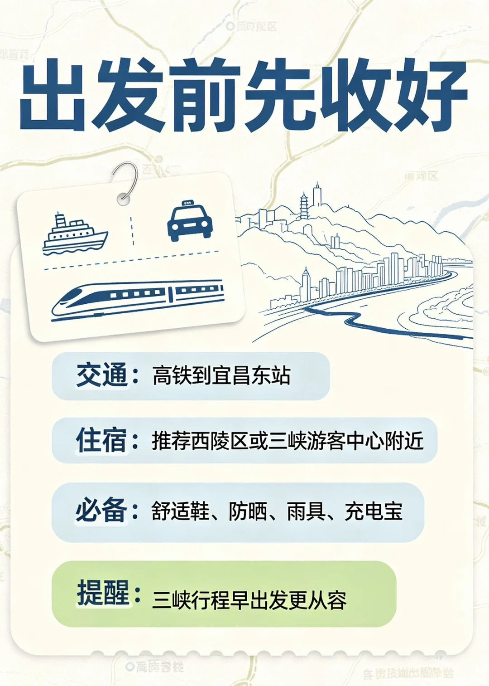
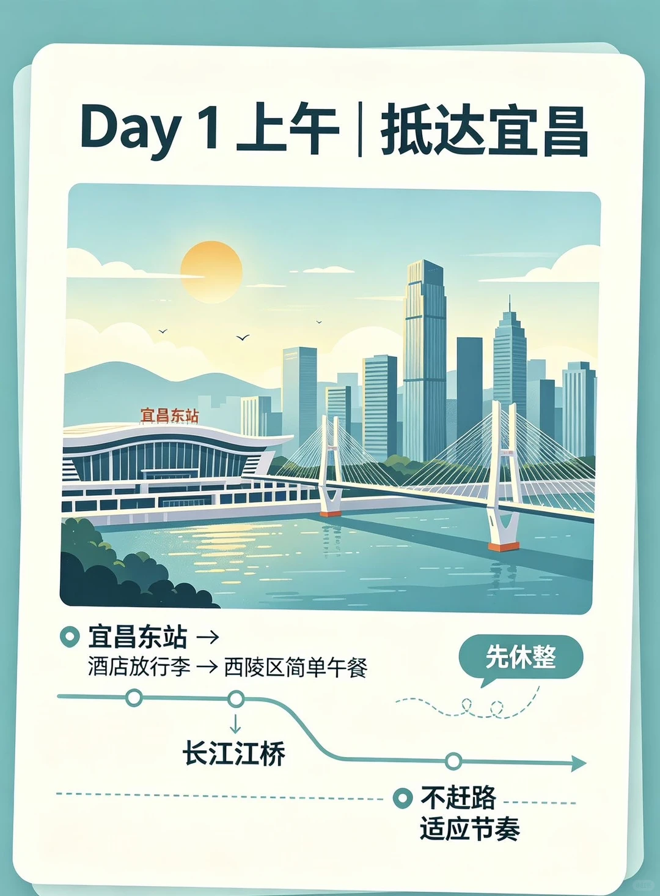
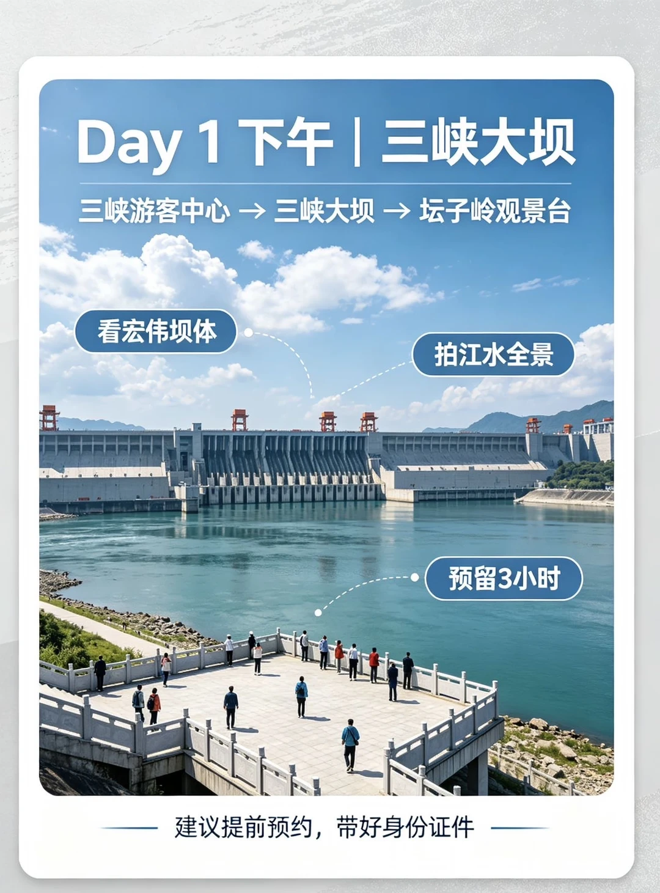
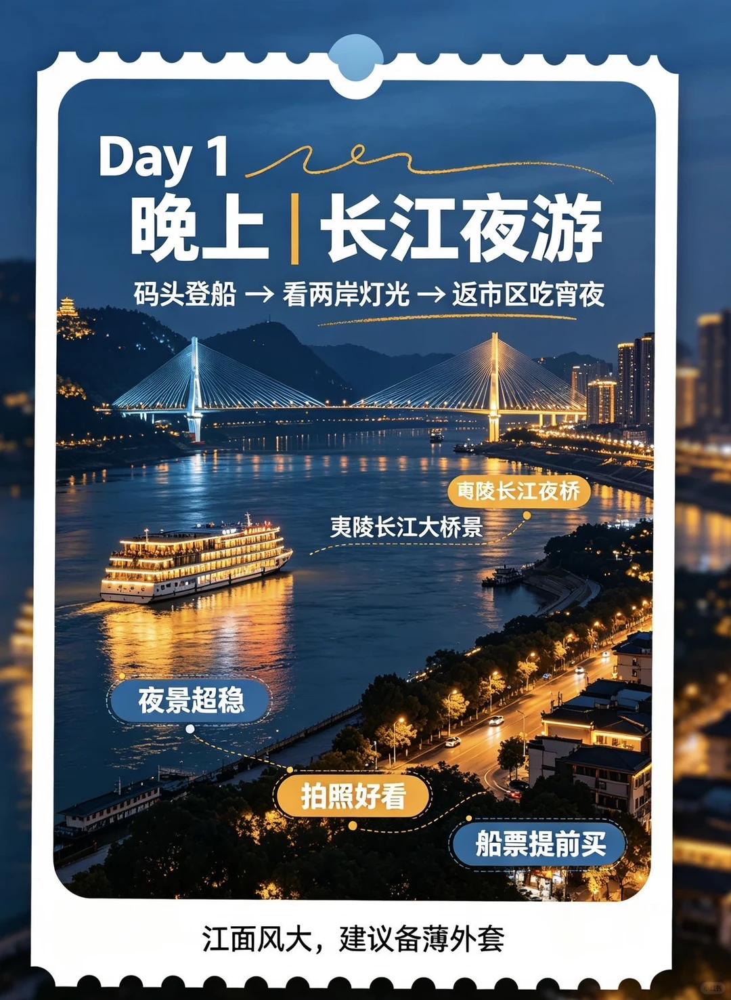
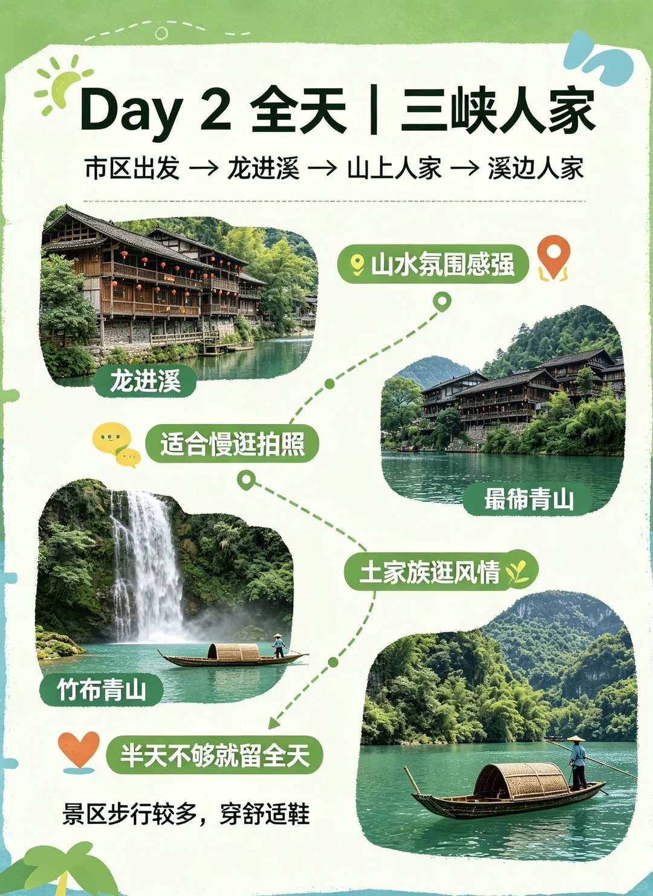
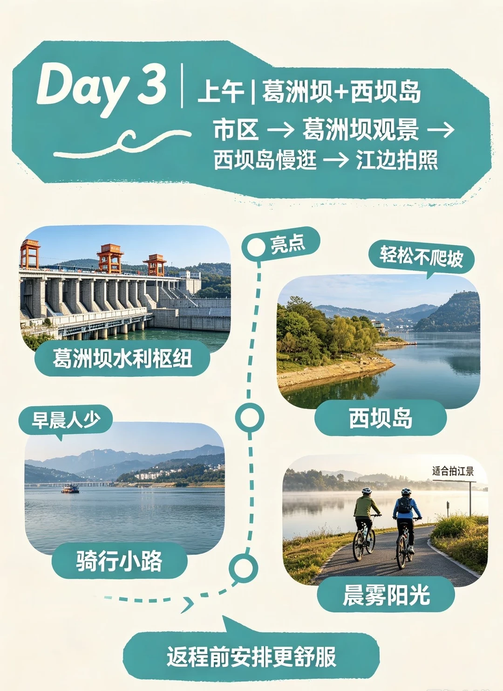
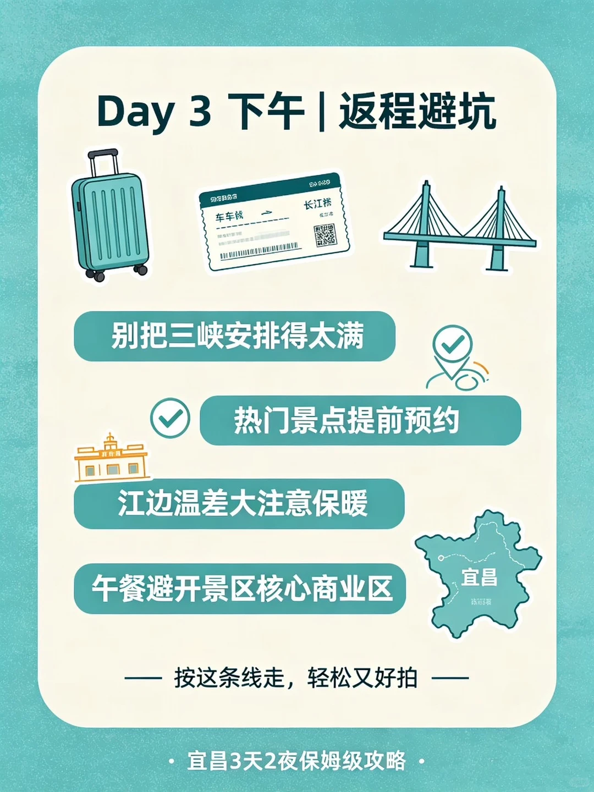

# J人超超超详细版|宜昌三天二夜旅行攻略

- 作者: 奔跑的橙子
- 👍52 · 💬 · ⭐5 · 图 9
- feed_id: 6a6f2c150000000026035a5c

> [OCR] 宜昌3天2夜
保姆级攻略
三峡风光 | 长江夜景 | 本地美食
快码住❤️

> [OCR] 出发前先收好

交通：高铁到宜昌东站

住宿：推荐西陵区或三峡游客中心附近

必备：舒适鞋、防晒、雨具、充电宝

提醒：三峡行程早出发更从容

> [OCR] Day 1 上午 | 抵达宜昌

宜昌东站
宜昌东站 →
酒店放行李 → 西陵区简单午餐
长江江桥
先休整
不赶路
适应节奏

> [OCR] Day 1 下午 | 三峡大坝
三峡游客中心 → 三峡大坝 → 坛子岭观景台

看宏伟坝体
拍江水全景
预留3小时

建议提前预约，带好身份证件

> [OCR] Day 1
晚上 | 长江夜游

码头登船 → 看两岸灯光 → 返市区吃宵夜

禹陵长江夜桥
夷陵长江大桥景

夜景超稳
拍照好看
船票提前买

江面风大，建议备薄外套

> [OCR] Day 2 全天 | 三峡人家
市区出发 → 龙进溪 → 山上人家 → 溪边人家

龙进溪
适合慢逛拍照

竹布青山

最?[青山]
土家族逛风情

山水氛围感强

半天不够就留全天

景区步行较多，穿舒适鞋

> [OCR] 宜昌美食合集
——真茶屋奶茶+本地小吃这样搭——

小火锅配奶茶
·宜昌小火锅·

萝卜饺子配凉虾
·萝卜饺子·

冰凉虾 03
江边烧烤
·江边烧烤·

红油小面
·红油小面·

炸洋芋
·炸洋芋·

烧烤后喝一杯

> [OCR] Day 3 | 上午 | 葛洲坝+西坝岛
市区 → 葛洲坝观景 →
西坝岛慢逛 → 江边拍照

葛洲坝水利枢纽
早晨人少
骑行小路

亮点
轻松不爬坡
适合拍江景
晨雾阳光

返程前安排更舒服

> [OCR] Day 3 下午 | 返程避坑

别把三峡安排得太满
热门景点提前预约
江边温差大注意保暖
午餐避开景区核心商业区

—— 按这条线走，轻松又好拍 ——

宜昌3天2夜保姆级攻略

## 正文
今年的夏天真的热的太离谱了......宜昌真的是玩水+避暑胜地!!
#宜昌旅游[话题]# #宜昌攻略[话题]# #大学生旅游[话题]# #湖北周边游[话题]#  #三峡旅行[话题]#

---