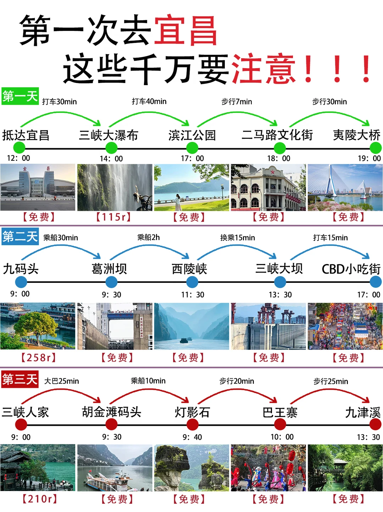
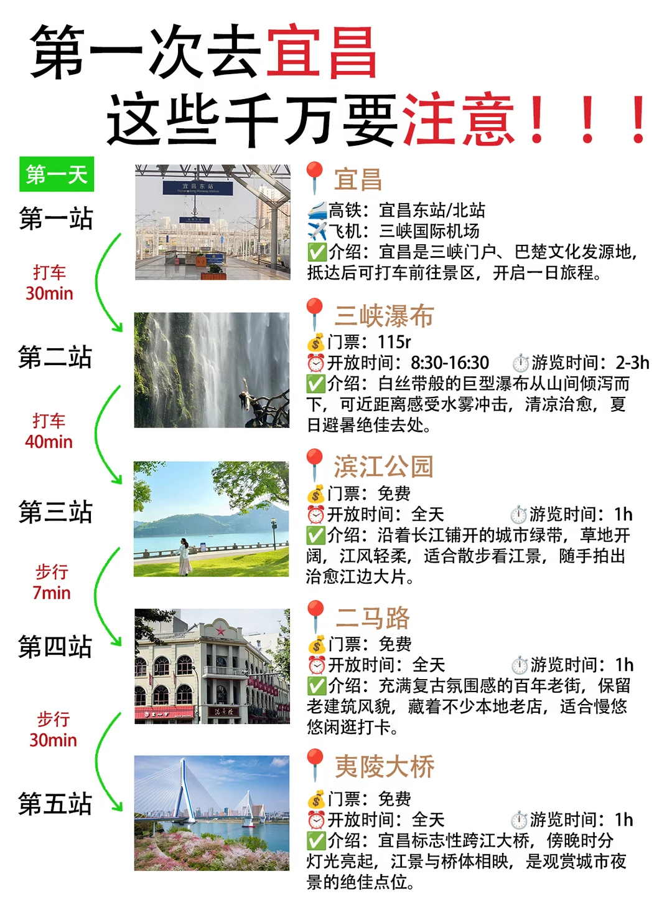
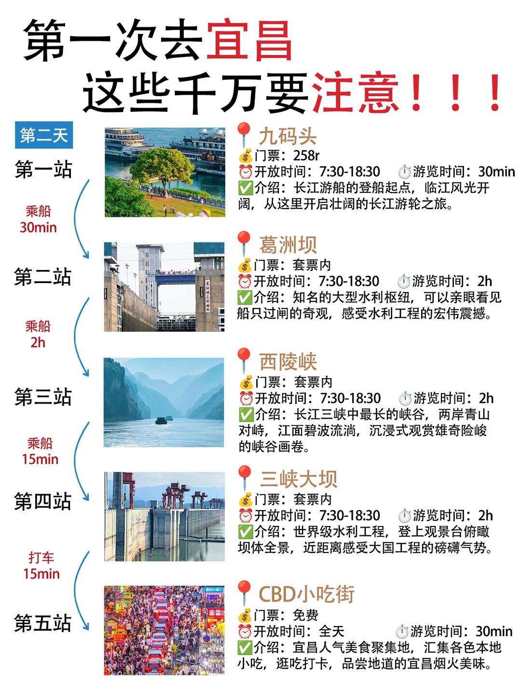
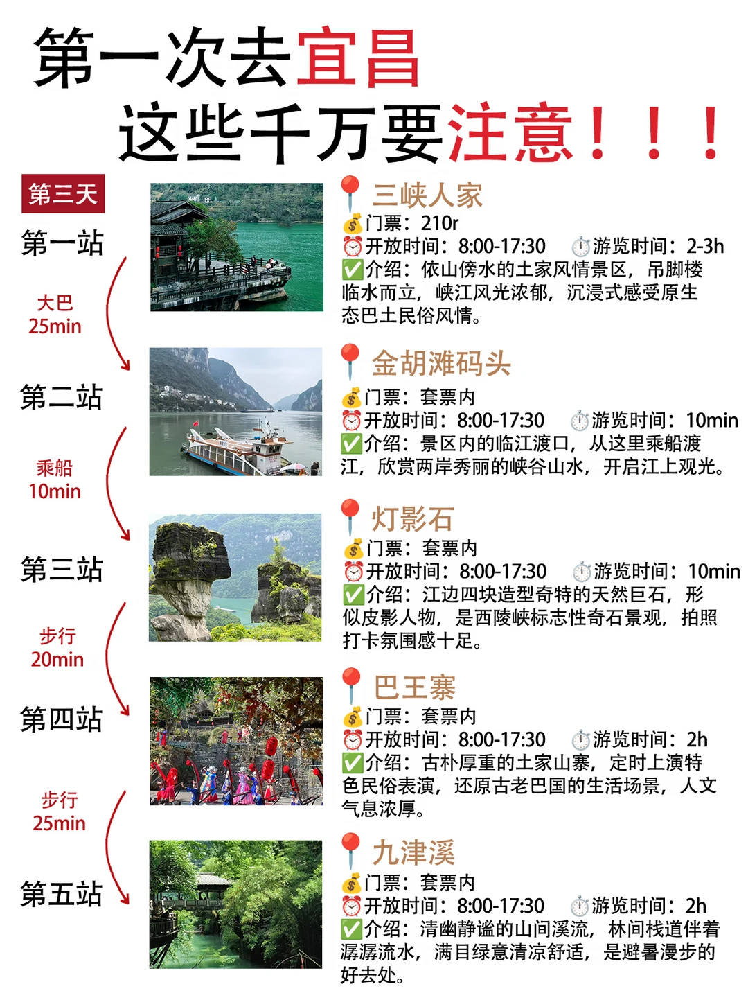
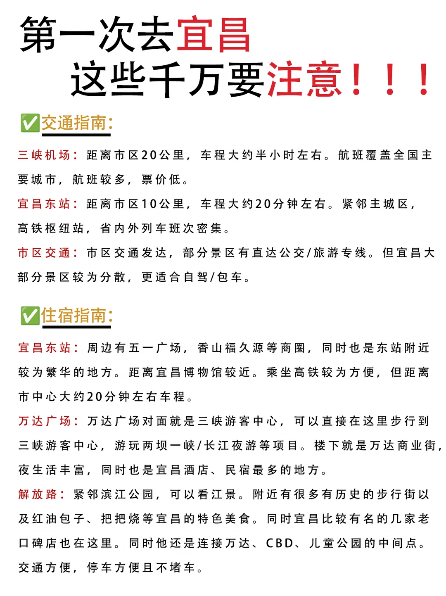

# 第一次去宜昌｜3天丝滑不绕路攻略

- 作者: 跟着楚渝行去旅行
- 👍50 · 💬2 · ⭐96 · 图 6
- feed_id: 6a6d5faf0000000033009e37

> [OCR] 第一次去宜昌
这些千万要注意！！！

第一天 打车30min
抵达宜昌 三峡大瀑布 滨江公园 二马路文化街 夷陵大桥
12:00 14:00 17:00 18:00 19:00

【免费】 【115r】 【免费】 【免费】 【免费】

第二天 乘船30min
九码头 葛洲坝 西陵峡 三峡大坝 CBD小吃街
9:00 9:30 11:30 13:30 17:00

【258r】 【免费】 【免费】 【免费】 【免费】

第三天 大巴25min
三峡人家 胡金滩码头 灯影石 巴王寨 九津溪
9:00 9:30 9:40 10:00 13:30

【210r】 【免费】 【免费】 【免费】 【免费】

> [OCR] 第一次去宜昌
这些千万要注意！！！

第一天

第一站
打车30min

第二站
打车40min

第三站
步行7min

第四站
步行30min

第五站

宜昌
高铁：宜昌东站/北站
飞机：三峡国际机场
介绍：宜昌是三峡门户、巴楚文化发源地，抵达后可打车前往景区，开启一日旅程。

三峡瀑布
门票：115r
开放时间：8:30-16:30 游览时间：2-3h
介绍：白丝带般的巨型瀑布从山间倾泻而下，可近距离感受水雾冲击，清凉治愈，夏日避暑绝佳去处。

滨江公园
门票：免费
开放时间：全天 游览时间：1h
介绍：沿着长江铺开的城市绿带，草地开阔，江风轻柔，适合散步看江景，随手拍出治愈江边大片。

二马路
门票：免费
开放时间：全天 游览时间：1h
介绍：充满复古氛围感的百年老街，保留老建筑风貌，藏着不少本地老店，适合慢悠悠闲逛打卡。

夷陵大桥
门票：免费
开放时间：全天 游览时间：1h
介绍：宜昌标志性跨江大桥，傍晚时分灯光亮起，江景与桥体相映，是观赏城市夜景的绝佳点位。

> [OCR] 第一次去宜昌
这些千万要注意！！！

第二天

第一站
乘船30min

第二站
乘船2h

第三站
乘船15min

第四站
打车15min

第五站

九码头
门票：258r
开放时间：7:30-18:30 游览时间：30min
介绍：长江游船的登船起点，临江风光开阔，从这里开启壮阔的长江游轮之旅。

葛洲坝
门票：套票内
开放时间：7:30-18:30 游览时间：2h
介绍：知名的大型水利枢纽，可以亲眼看见船只过闸的奇观，感受水利工程的宏伟震撼。

西陵峡
门票：套票内
开放时间：7:30-18:30 游览时间：2h
介绍：长江三峡中最长的峡谷，两岸青山对峙，江面碧波流淌，沉浸式观赏雄奇险峻的峡谷画卷。

三峡大坝
门票：套票内
开放时间：7:30-18:30 游览时间：2h
介绍：世界级水利工程，登上观景台俯瞰坝体全景，近距离感受大国工程的磅礴气势。

CBD小吃街
门票：免费
开放时间：全天 游览时间：30min
介绍：宜昌人气美食聚集地，汇集各色本地小吃，逛吃打卡，品尝地道的宜昌烟火美味。

> [OCR] 第一次去宜昌
这些千万要注意！！！

第三天

第一站
大巴25min

第二站
乘船10min

第三站
步行20min

第四站
步行25min

第五站

三峡人家
门票：210r
开放时间：8:00-17:30 游览时间：2-3h
介绍：依山傍水的土家风情景区，吊脚楼临水而立，峡江风光浓郁，沉浸式感受原生态巴土民俗风情。

金胡滩码头
门票：套票内
开放时间：8:00-17:30 游览时间：10min
介绍：景区内的临江渡口，从这里乘船渡江，欣赏两岸秀丽的峡谷山水，开启江上观光。

灯影石
门票：套票内
开放时间：8:00-17:30 游览时间：10min
介绍：江边四块造型奇特的天然巨石，形似皮影人物，是西陵峡标志性奇石景观，拍照打卡氛围感十足。

巴王寨
门票：套票内
开放时间：8:00-17:30 游览时间：2h
介绍：古朴厚重的土家山寨，定时上演特色民俗表演，还原古老巴国的生活场景，人文气息浓厚。

九津溪
门票：套票内
开放时间：8:00-17:30 游览时间：2h
介绍：清幽静谧的山间溪流，林间栈道伴着潺潺流水，满目绿意清凉舒适，是避暑漫步的好去处。

> [OCR] 第一次去宜昌
这些千万要注意！！！

宜昌游玩注意事项

注意1.三峡大坝免费参观，但必须提前实名预约，携带身份证，没有预约无法入园。

注意2.[山区弯道较多]，去往长阳、夷陵区景点容易晕车，建议备好晕车药，不要空腹乘车。

注意3.峡谷、瀑布步道常年潮湿打滑，全程穿防滑运动鞋，游玩玩水项目备好手机防水袋与替换衣物。

注意4.[警惕车站]、景区门口的低价一日游和黑车，尽量选择网约车、官方旅游专线，避免购物套路。

注意5.夏季山区天气多变，午后容易突发阵雨，备好雨衣、防晒用品，游玩前留意暴雨、地质预警。

注意6.游船、清江画廊等项目认准官方游船，不要乘坐私船；留意末班船时间，错过返程会产生高额费用。

注意7.[漂流项目]取下首饰、眼镜做好防护，老人小孩根据身体情况选择项目，全程听从工作人员指引。

注意8.特产建议去市区大型超市购买，景区周边玉石、奇石谨慎购买，吃饭消费前提前确认价格。

注意9.热门景区旺季门票、游船票尽量提前线上预订，现场容易无票，观光车、渡船套票建议正常购买，节省体力。

> [OCR] 第一次去宜昌
这些千万要注意！！！

✅交通指南：
三峡机场：距离市区20公里，车程大约半小时左右。航班覆盖全国主要城市，航班较多，票价低。
宜昌东站：距离市区10公里，车程大约20分钟左右。紧邻主城区，高铁枢纽站，省内外列车班次密集。
市区交通：市区交通发达，部分景区有直达公交/旅游专线。但宜昌大部分景区较为分散，更适合自驾/包车。

✅住宿指南：
宜昌东站：周边有五一广场、香山福久源等商圈，同时也是东站附近较为繁华的地方。距离宜昌博物馆较近。乘坐高铁较为方便，但距离市中心大约20分钟左右车程。
万达广场：万达广场对面就是三峡游客中心，可以直接在这里步行到三峡游客中心，游玩两坝一峡/长江夜游等项目。楼下就是万达商业街，夜生活丰富，同时也是宜昌酒店、民宿最多的地方。
解放路：紧邻滨江公园，可以看江景。附近有很多有历史的步行街以及红油包子、把把烧等宜昌的特色美食。同时宜昌比较有名的几家老口碑店也在这里。同时他还是连接万达、CBD、儿童公园的中间点。交通方便，停车方便且不堵车。

## 正文
【关于交通】
✅市区景点打车、步行都很方便！远一点的山水景区分散，包车/旅游专线更省心，山区弯道多不建议自驾赶路
.
【路线安排】
❤️ DAY1：抵达宜昌 → 三峡大瀑布 → 滨江公园 → 二马路文化街 → 夷陵大桥
❤️ DAY2：九码头乘船 → 葛洲坝 → 西陵峡 → 三峡大坝 → CBD小吃街
❤️ DAY3：三峡人家 → 胡金滩码头 → 灯影石 → 巴王寨 → 九津溪
.
【宜昌美食推荐】
🥢肥鱼火锅
🥢萝卜饺子
🥢红油小面
🥢凉虾
🥢土家抬格子
.
【出行小提醒】
✨三峡大坝免费入园，但一定要提前实名预约带身份证
✨瀑布、峡谷路面湿滑，记得穿防滑运动鞋
✨夏季多雨，备好防晒衣、雨衣，玩水记得带换洗衣物
.
#宜昌旅游团[话题]#  #宜昌三日游[话题]# #三峡[话题]#  #湖北旅游[话题]#  #周末去哪儿[话题]# #湖北周边游[话题]# #本地人做的攻略[话题]# #旅游攻略[话题]# #宜昌[话题]# #湖北[话题]#

---