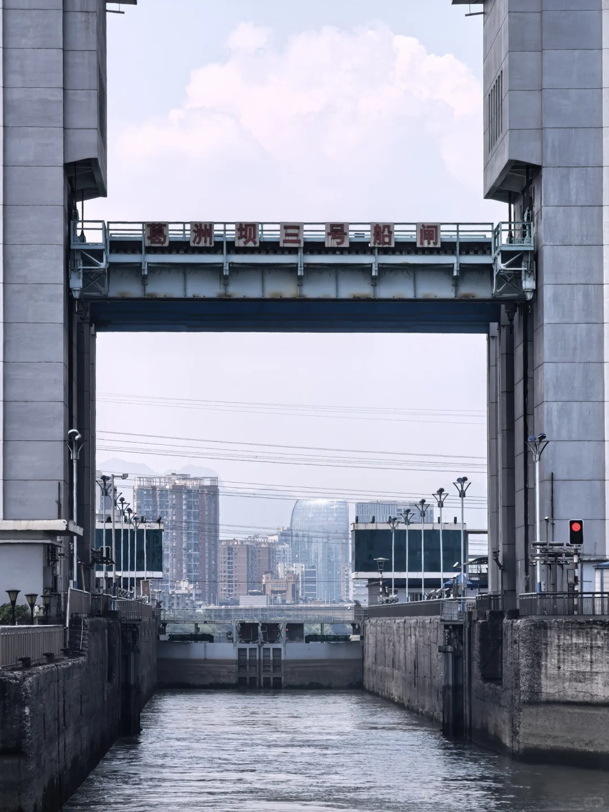

# 宜昌自驾三天两夜｜亲身踩坑总结！

- 作者: 奇奇怪怪
- 👍50 · 💬16 · ⭐79 · 图 1
- feed_id: 6a62d24d00000000110054c3

> [OCR] 葛洲坝三号船闸

## 正文
暑假带家人自驾宜昌，研究一晚上攻略还是踩了小坑，整理真实经验给准备出发的朋友！
🚗自驾出行提前准备
一定要随身携带驾驶证、行驶证
7月三峡大坝线上小程序无法预约车辆通行证，开到检查站人工现场登记，流程很快，不用提前焦虑。
🏨住宿｜首选CBD附近（亲子友好）
✅楼下小吃街，晚上可以散步逛逛
✅隔壁就是【宜昌儿童公园】，适合带小朋友
里面有摩天轮、儿童过山车，娃很喜欢
⚠️关门时间21:30，不要跑空！
🎫各大景区购票指南
▪三峡人家、三峡大瀑布
线上购票无需换纸质票，直接刷身份证入园，纸质票想要可以打印留作纪念。
▪三峡大坝
景区大门免费！只需要购买观光车票35元/人
6周岁以下小朋友免观光车票。
🌊重点！两坝一峡买票大坑（重中之重）
票种分：上午半日游 / 下午半日游 / 完整一日游，一定要看清再下单！
▫半日游上午：不含三峡大坝
▫半日游下午：不含三峡大坝
▫只有一日游行程包含三峡大坝
💡购票建议：优先三峡游客中心线下买票！
线上退票手续麻烦，容易收取手续费。
推荐选【船去车回】路线，上午体验水涨船高，避开正午暴晒。
🛳游船座位干货
免费观景区域：二楼尾部甲板、三楼尾部甲板
上船晚容易抢不到靠窗位置！
四楼露天甲板单独收费：100元/人
如果免费区位置不理想，可以额外付费升级座位，包含茶水+小零食礼包。
👶儿童票划分规则
6岁以下：携童票
6–14岁：儿童票
14岁以上：成人票
🍱船上补给参考
船上小卖部物价和景区持平
半日上午班次不含午餐，建议自带零食、泡面（船上提供热水）
一日游包含盒饭午餐。
长时间坐船比较无聊，可以带零食、扑克牌打发时间。
⚠️重要提醒
两坝一峡有官方导游，全程统一路线，不能中途提前离团，码头位置偏远，自行返程非常不方便。
最后碎碎念：
盛夏气温太高，各大景点基本都是走马观花，大家做好防暑，合理安排行程！

---