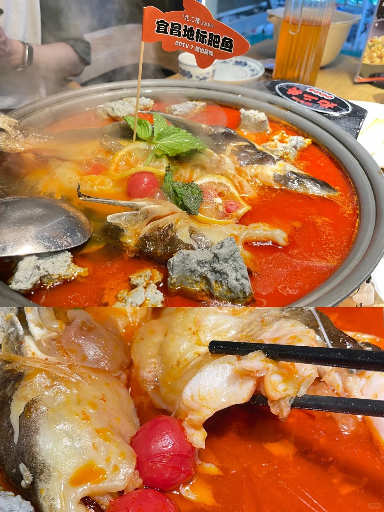
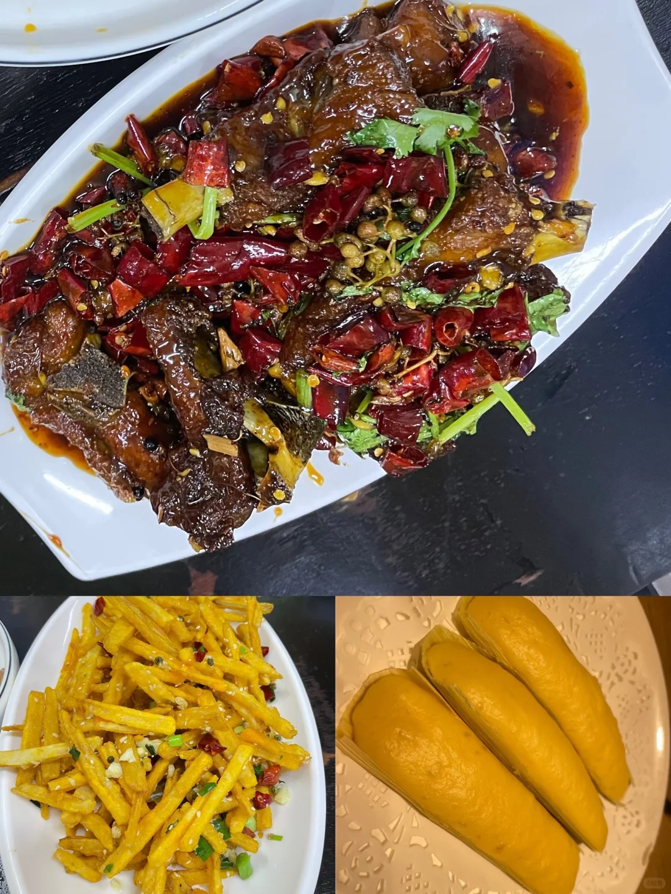
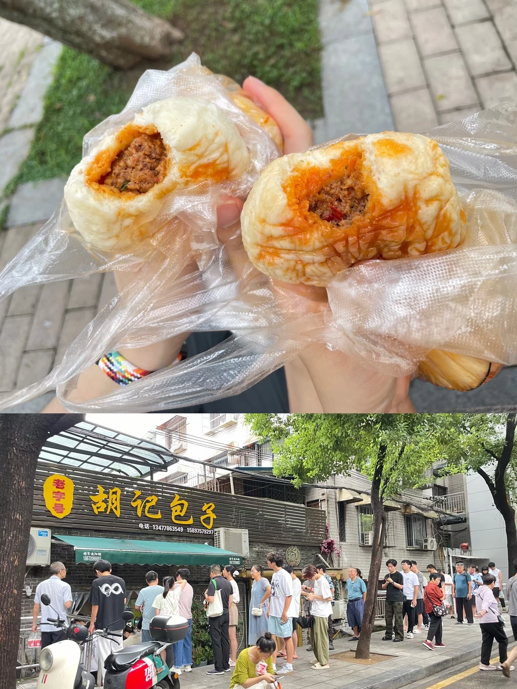
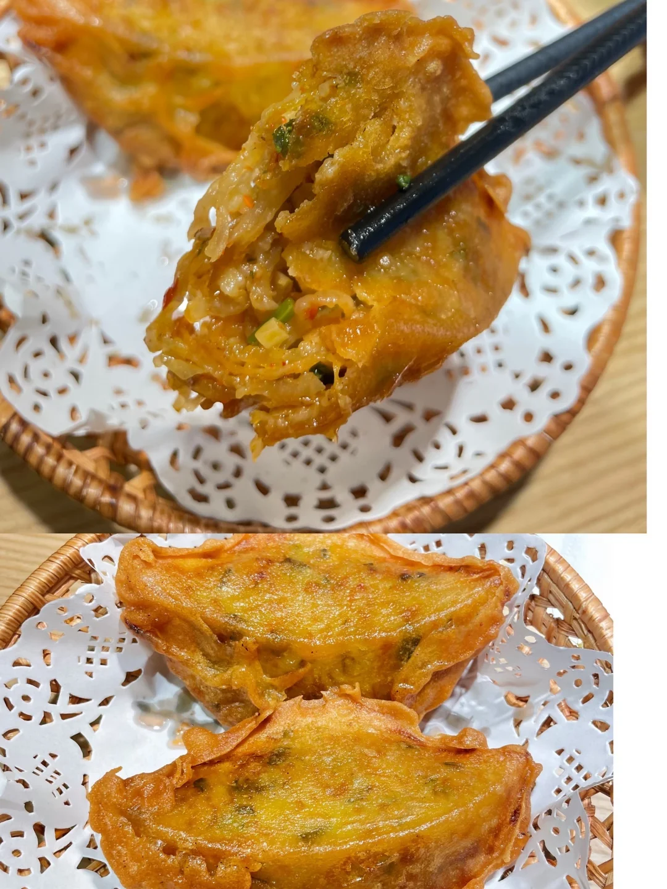
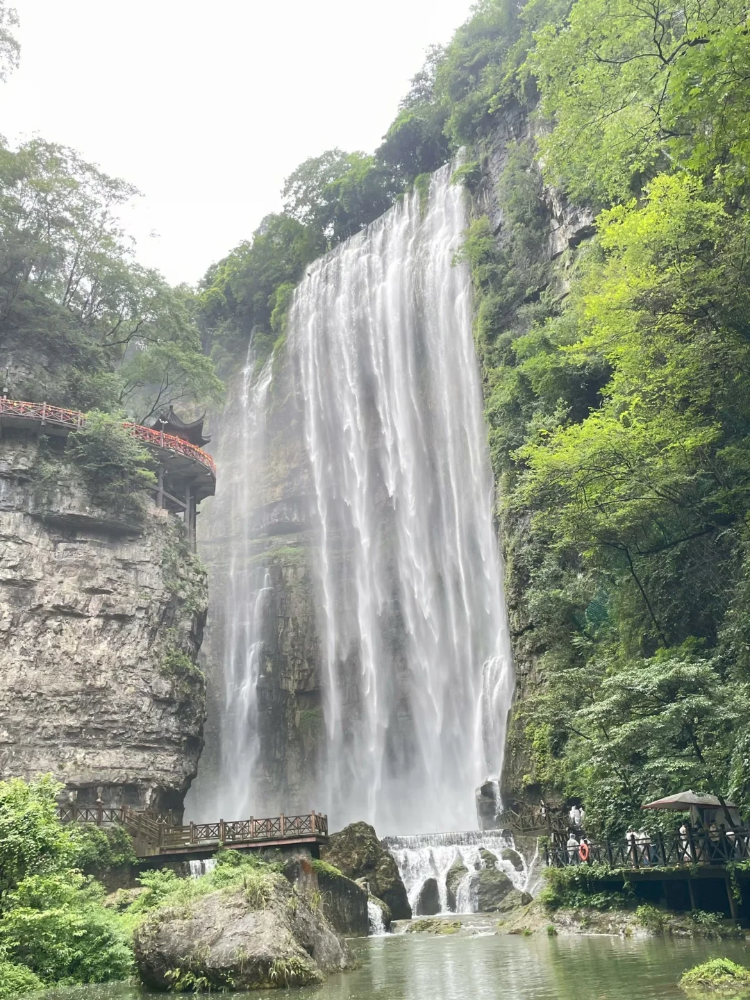
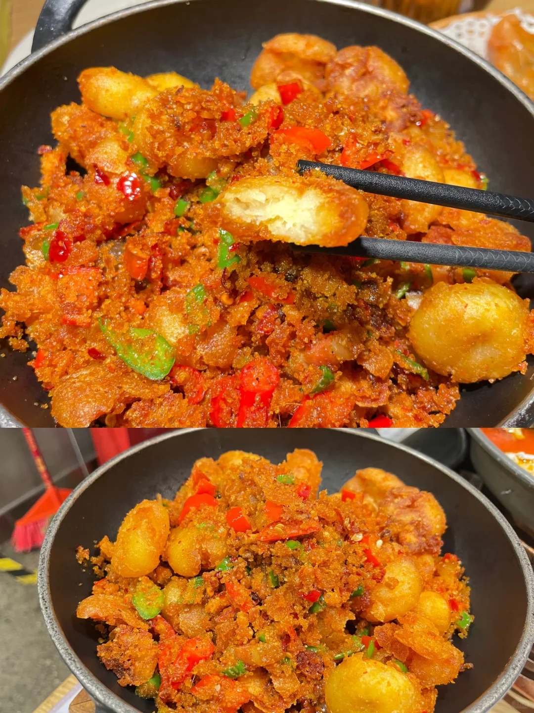
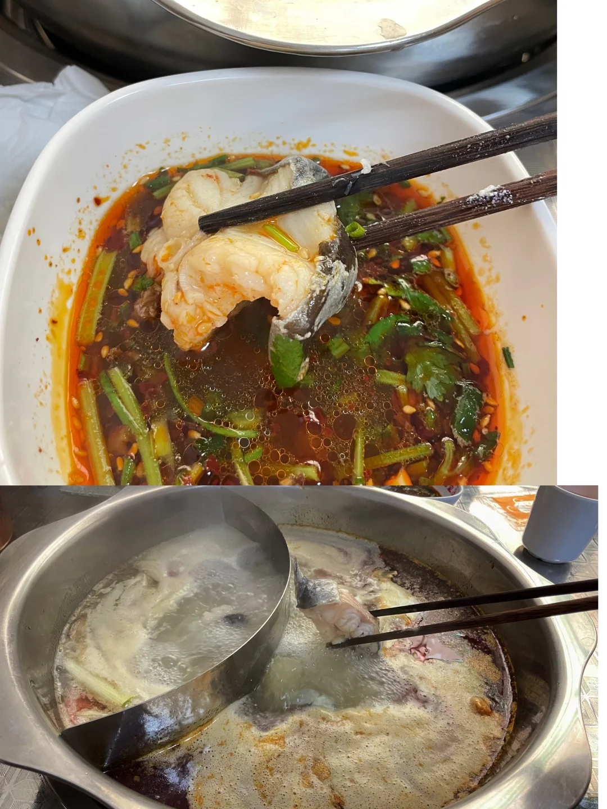
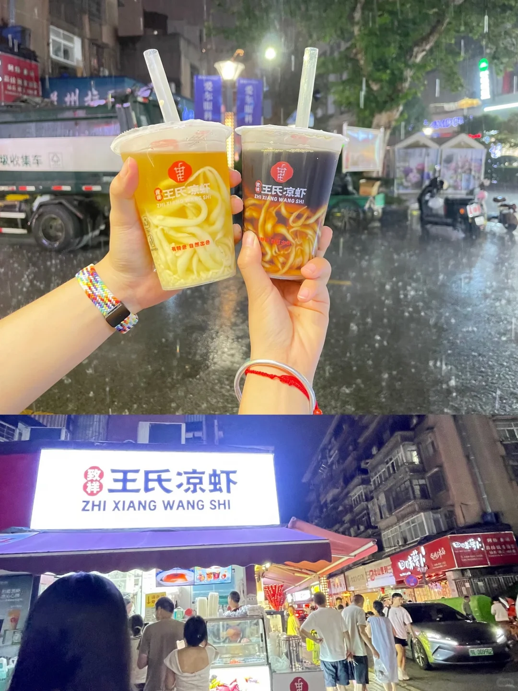
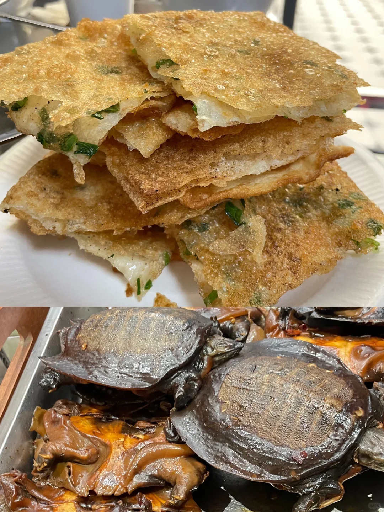

# 宜昌美食个人推荐榜

- 作者: 刘然儿（普普）
- 👍49 · 💬6 · ⭐51 · 图 9
- feed_id: 68bd4aed000000001c011a70

> [OCR] 宜昌地标肥鱼
CCTV 7播出品牌

> [OCR] [
]

> [OCR] 老字号
胡记包子
电话：13477863549 15897579297

> [OCR] system

> [OCR] [?]

> [OCR] [?]

> [OCR] [?]

> [OCR] 王氏凉虾
ZHI XIANG WANG SHI

致祥 王氏凉虾
ZHI XIANG WANG SHI

> [OCR] 8175

## 正文
宜昌推荐榜
❗️强烈推荐⭐️⭐️⭐️：
长江肥鱼（一定要吃，北二楼、憨哥鱼庄家的都很不错）
宜昌炕土豆
慈妈大排档（偏甜口，我个人比较喜欢）
❗️可以推荐⭐️⭐️：
王氏凉虾，炸萝卜饺子（外皮脆脆的，第一次还不错）
❗️一般⭐️：胡记红油包子（排队的人爆炸多，但我个人感觉好像过于夸张了，就是普通包子，吃哪家都一样）
❗️❗️避雷❗️❗️：三峡大瀑布（进入景区要走好长一段路就为看一个瀑布，其他啥也没有，瀑布没有贵州黄果树大瀑布宏伟壮观，个人感觉一般般）

---