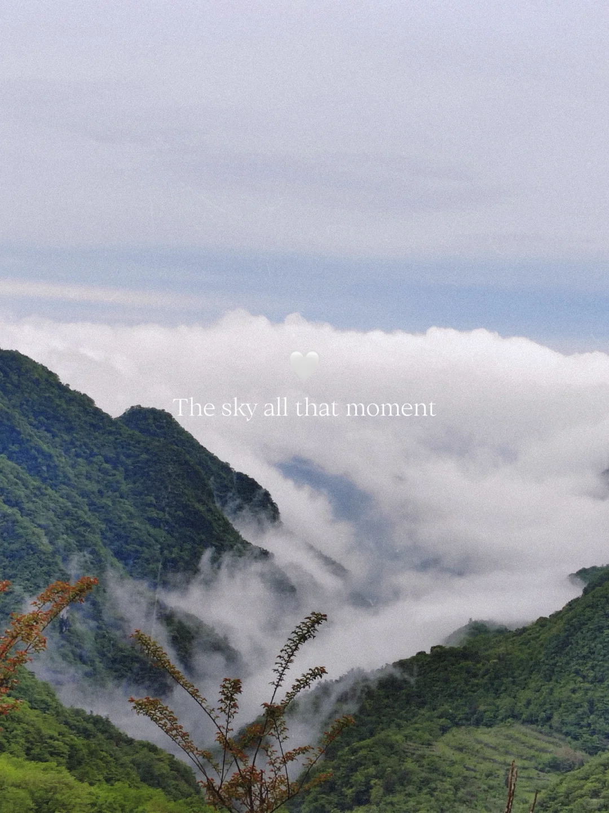
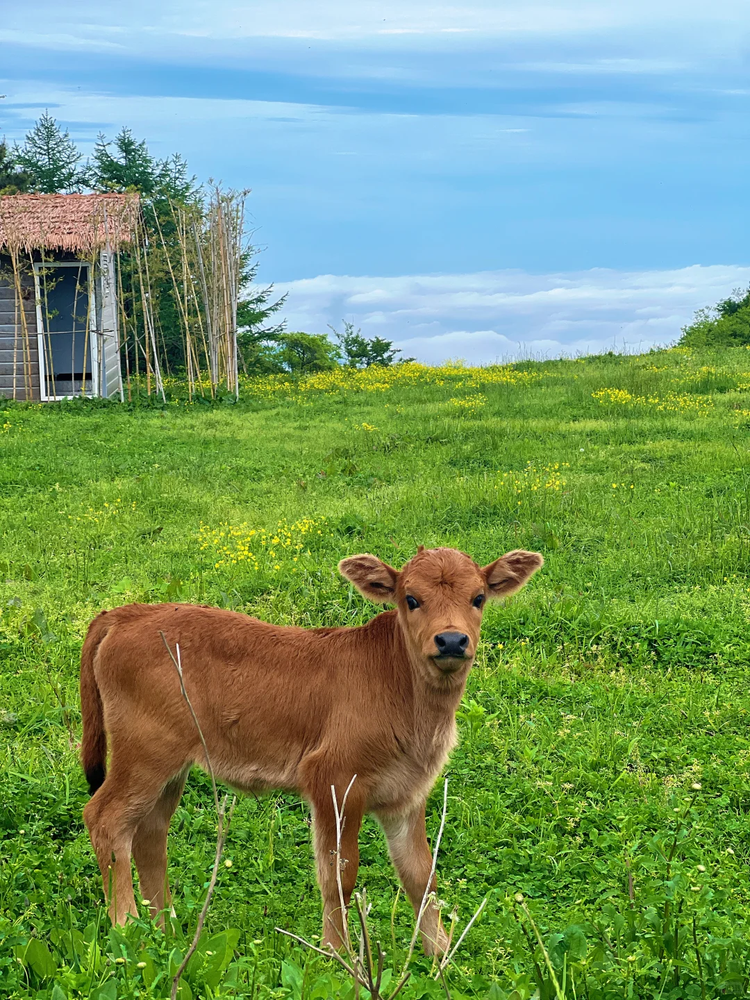
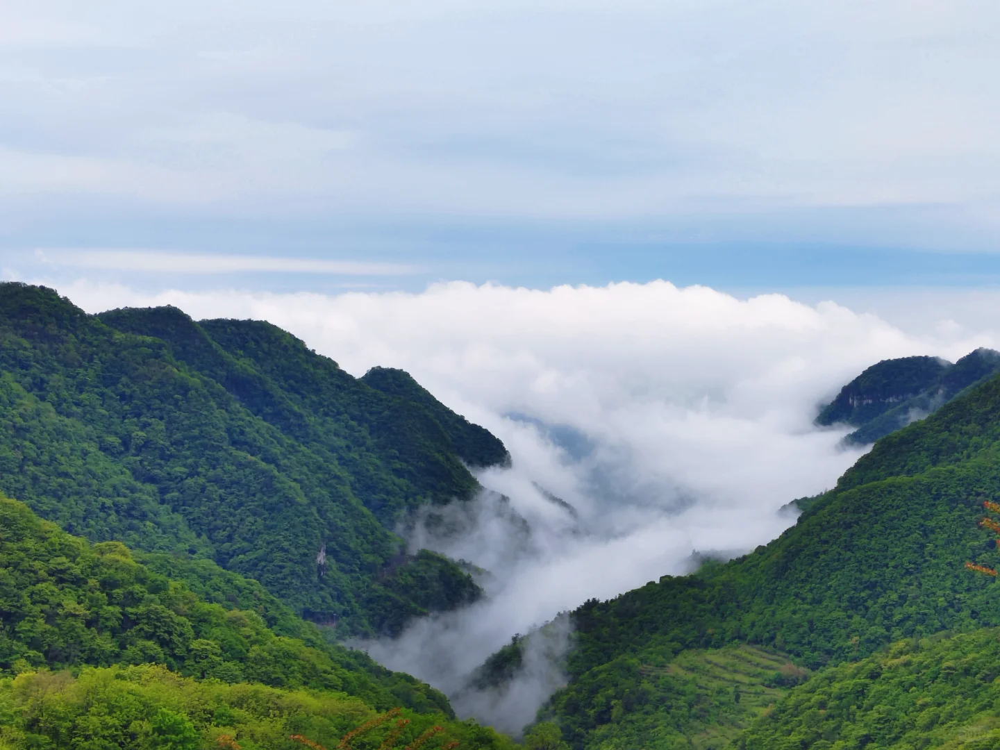
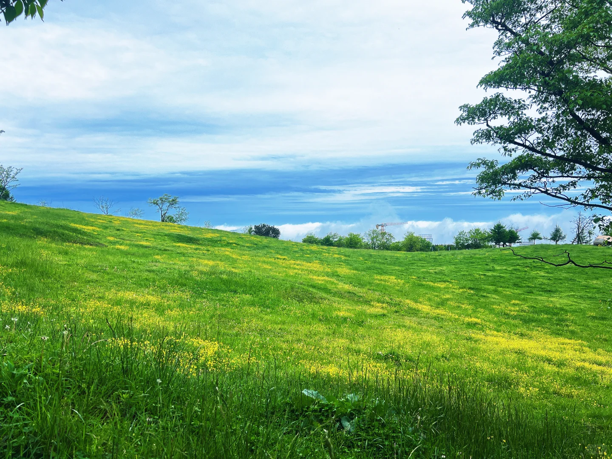
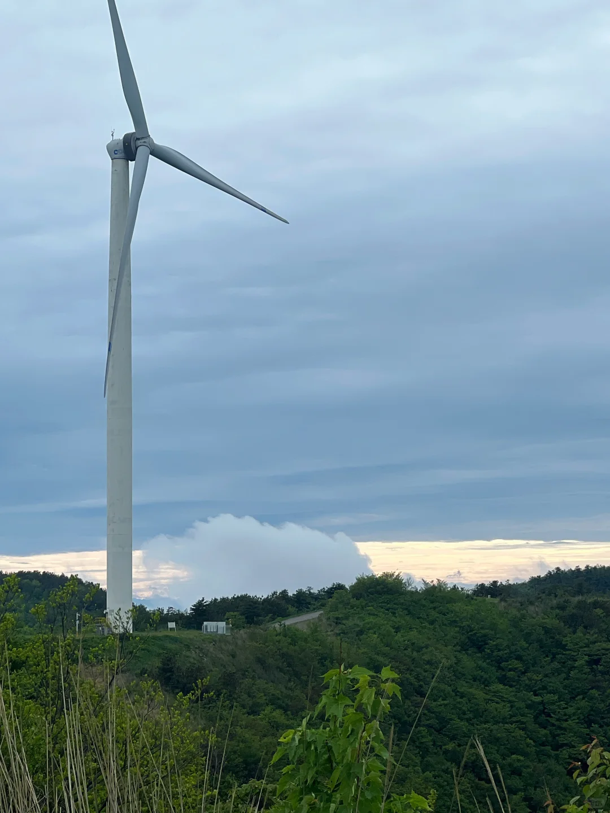
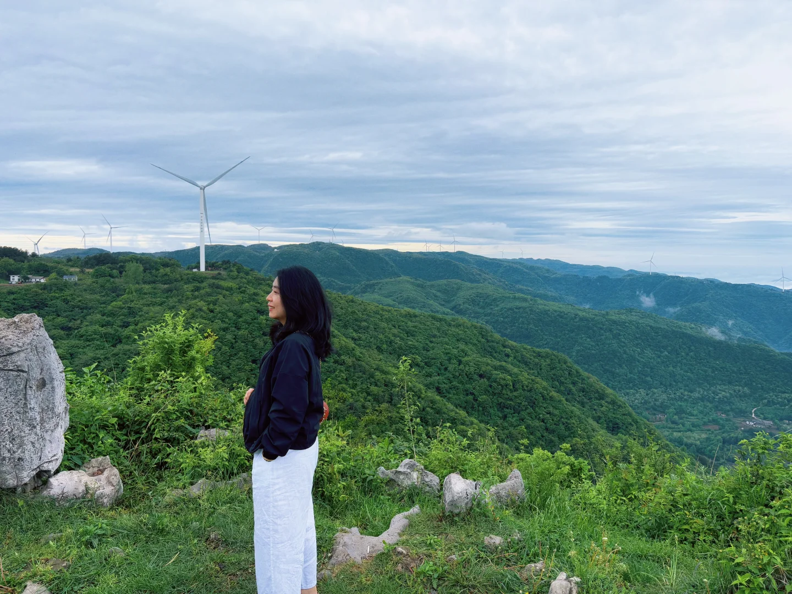

# 湖北人有自己的阿勒泰

- 作者: 刘喪飙
- 👍43 · 💬4 · ⭐74 · 图 6
- feed_id: 69fab950000000003501c9e0

> [OCR] The sky all that moment

> [OCR] system

> [OCR] [?]

> [OCR] system

> [OCR] c?n

> [OCR] 风力发电

## 正文
宜昌真的是宝地，
我都害怕大家知道这里
这高山云海，这青青草地，这遍地牛羊，
这居然免费🆓
	
我真的想不到有什么理由不来
	
位置[打卡R]
百里荒 3公里外
	
搜索🔍
夷陵区龙泉镇柏家坪村五组
（云海公园）
	
交通🚗
应该只能自驾
山路比较多，路修的非常好，不用怕
可以直接开到风车脚下
0爬山，老人小孩宠物友好
	
雨后就有云海！
#谁会拒绝大自然呢[话题]# #草原上的夏天[话题]# #小众避暑地[话题]# #人少景美小众地[话题]# #被大自然治愈了[话题]# #逃离城市喧嚣[话题]# #远离城市拥抱自然[话题]# #去旷野吹自然的风[话题]# #去一些没有天花板的地方[话题]#

---