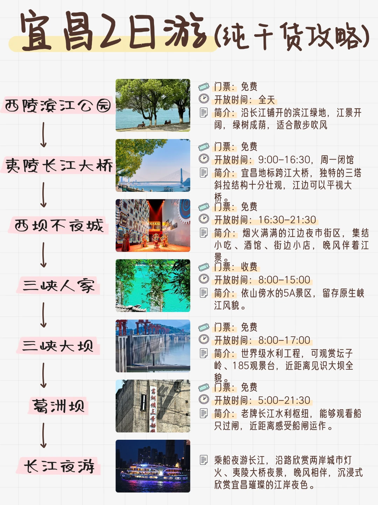
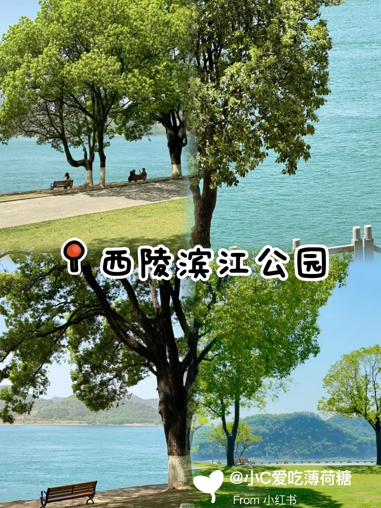
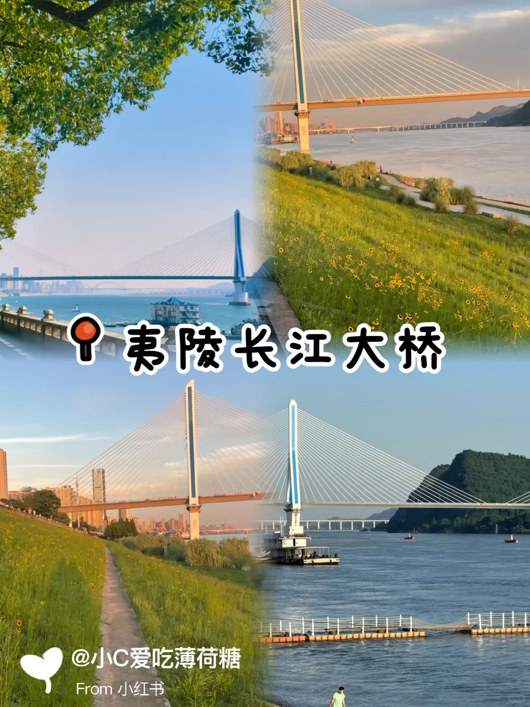
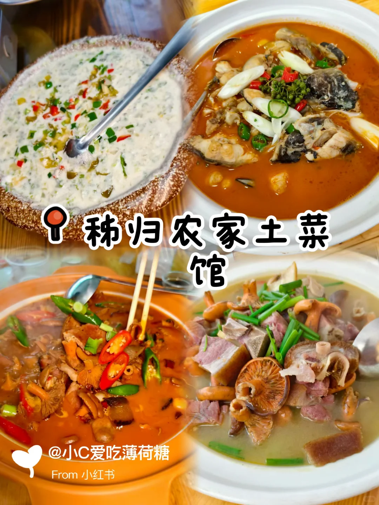
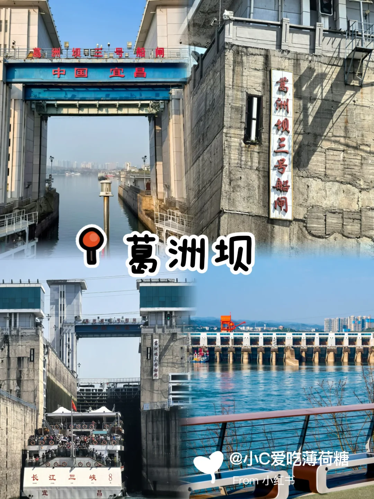

# 宜昌2日完整出行攻略｜山水美食两不误

- 作者: 小C爱吃薄荷糖
- 👍41 · 💬2 · ⭐18 · 图 9
- feed_id: 6a757a5a0000000028002a33

> [OCR] 宜昌2日游(纯干货攻略)

西陵滨江公园
门票：免费
开放时间：全天
简介：沿长江铺开的滨江绿地，江景开阔，绿树成荫，适合散步吹风

夷陵长江大桥
门票：免费
开放时间：9:00-16:30，周一闭馆
简介：宜昌地标跨江大桥，独特的三塔斜拉结构十分壮观，江边可以平视大桥。

西坝不夜城
门票：免费
开放时间：16:30-21:30
简介：烟火满满的江边夜市街区，集结小吃、酒馆、街边小店，晚风伴着江景

三峡人家
门票：收费
开放时间：8:00-15:00
简介：依山傍水的5A景区，留存原生峡江风貌。

三峡大坝
门票：免费
开放时间：8:00-17:00
简介：世界级水利工程，可观赏坛子岭、185观景台，近距离见识大坝全貌

葛洲坝
门票：免费
开放时间：5:00-21:30
简介：老牌长江水利枢纽，能够观看船只过闸，近距离感受船闸运作。

长江夜游
乘船夜游长江，沿路欣赏两岸城市灯火、夷陵大桥夜景，晚风相伴，沉浸式欣赏宜昌璀璨的江岸夜色。

> [OCR] 西陵滨江公园
@小C爱吃薄荷糖
From 小红书

> [OCR] 夷陵长江大桥
@小C爱吃薄荷糖
From 小红书

> [OCR] 秭归农家土菜馆
@小C爱吃薄荷糖
From 小红书

> [OCR] 灯火西坝
LIGHTS IN XIBA
INDUSTRIAL HERITAGE MUSEUM
西坝不夜城
@小C爱吃薄荷糖
From 小红书

> [OCR] 三峡人家
@小C爱吃薄荷糖
From 小红书

> [OCR] 三峡大坝
@小C爱吃薄荷糖
From 小红书

> [OCR] 葛洲坝三号船闸
中国宜昌
葛洲坝三号船闸
长江三峡8
宜昌
@小C爱吃薄荷糖
From 小红书

> [OCR] 长江夜游
@小C爱吃薄荷糖
From 小红书

## 正文
🌤️Day1 沿江慢逛·吃透三峡农家味
	
西陵滨江公园🌊
全天免费开放，绵长的江岸公园绿植繁茂，江风清爽。沿江散步眺望奔腾的长江，静待江边温柔日落，随手一拍都是江景大片。
	
夷陵长江大桥🌉
宜昌地标跨江大桥，结构造型很有特色。白日俯瞰宽阔江水，入夜后桥身灯光亮起，灯带倒映江面，氛围感直接拉满，夜景超级出片。
	
秭归农家土菜馆🥘（必吃重头戏）
来宜昌游玩一定要打卡这家地道秭归农家土菜馆，乡土味道超正宗，味道超级接地气！真心安利三道我吃完念念不忘的菜品✨
🥘腊蹄子炖松菌
柴火熏制的腊蹄砂锅慢炖许久，瘦肉炖得软烂入味，蹄筋Q弹黏牙，带着浓郁醇厚的烟熏咸香。松菌吸饱肉汤，入口脆嫩清甜，厚重腊香撞上山野菌鲜，风味层次直接拉满。
🥓腊肉炖松菌
农家风干老腊肉经过炖煮油脂缓缓化开，油润咸香却一点也不腻。松菌浸透肉汁，咬下去汁水充沛，清新的菌香刚好中和腊肉的厚重，一口尝到大山自带的鲜味儿。
🐟宜昌肥鱼“家常味”
鱼肉厚实细嫩，几乎没有细刺。家常的调味很温和，蕞大程度锁住河鲜本身的鲜甜，鱼肉滑糯软嫩，汤汁鲜润，吃完能够真切感受到长江独有的舌尖滋味。
	
西坝不夜城🏮
热闹的江边夜市街区，小吃、酒馆、街边小店一应俱全。伴着徐徐江风闲逛，沉浸式感受宜昌鲜活的市井烟火。
	
🌙Day2 峡谷大坝·沉浸式长江夜游
三峡人家⛰️
依山傍水的5A景区，青山绿水环绕。打卡古朴土家吊脚楼，观看民俗特色表演，亲身感受峡江独有的风土韵味。
	
三峡大坝🪨
震撼的水利工程，登上坛子岭观景台俯瞰大坝全貌，近距离感受长江工程宏伟壮阔的气场。
	
葛洲坝🚢
老牌长江水利枢纽，在外围观景区等候船只过闸，亲眼见证船只翻越水坝，见识独特的江水奇观。
	
长江夜游🚤
夜幕之后登上游船，沿江缓缓前行，一路观赏滨江公园、夷陵大桥的璀璨夜景，温柔江风收尾两日旅途。
	
#宜昌两日游[话题]# #宜昌旅游[话题]# #三峡旅行[话题]# #宜昌美食[话题]##秭归农家土菜馆[话题]# #西坝不夜城[话题]# #三峡大坝攻略[话题]##宜昌周末出游[话题]# #长江夜游[话题]# #湖北短途旅行[话题]#

---