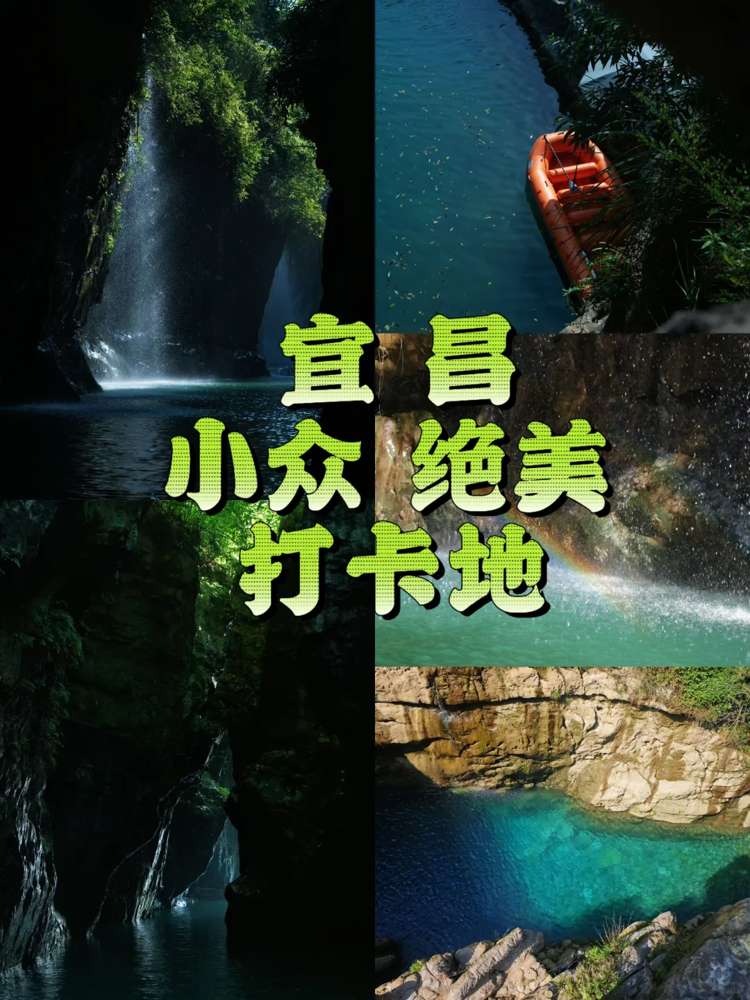
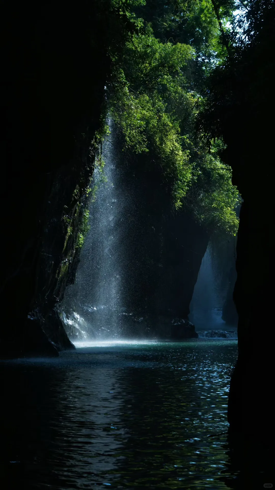
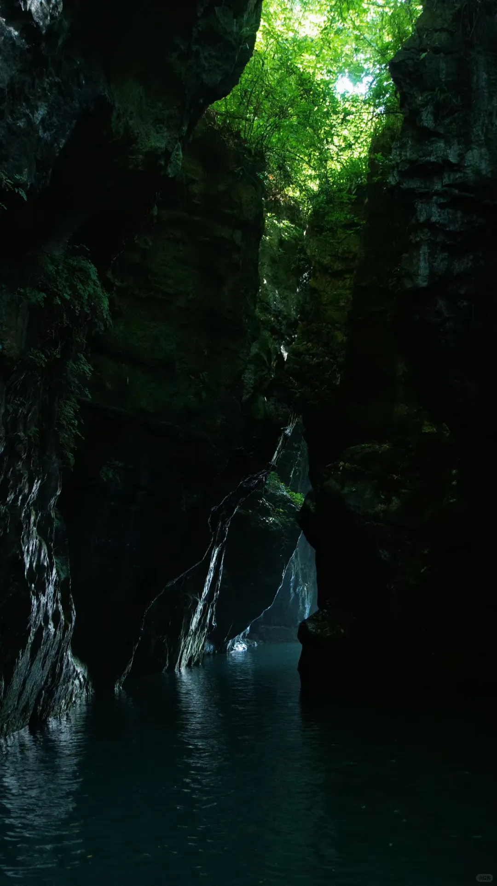
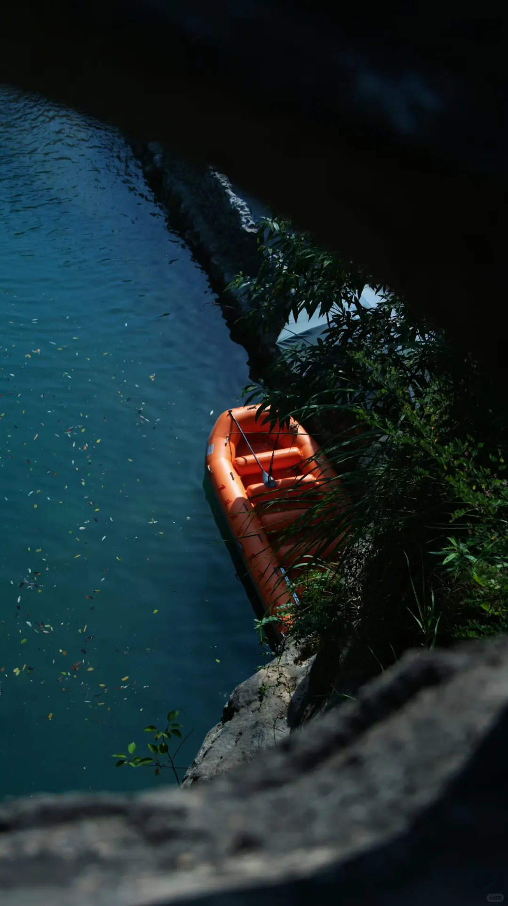
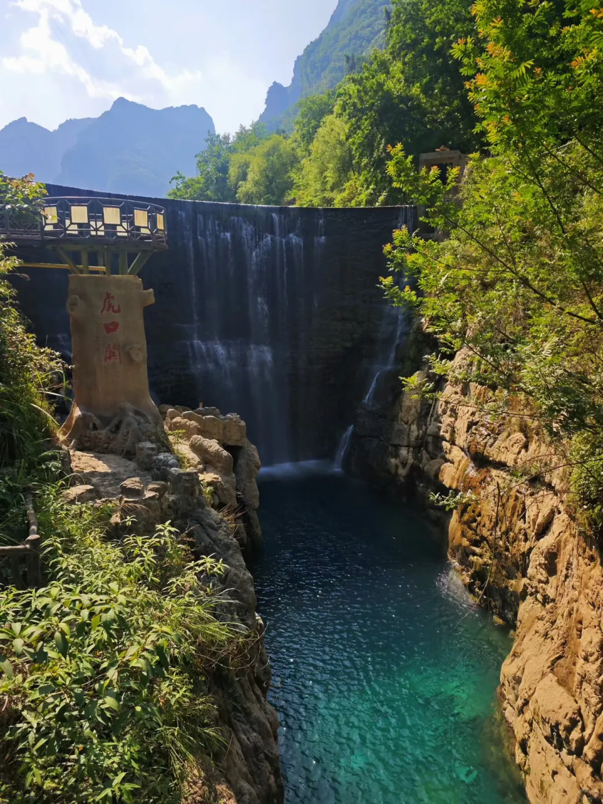
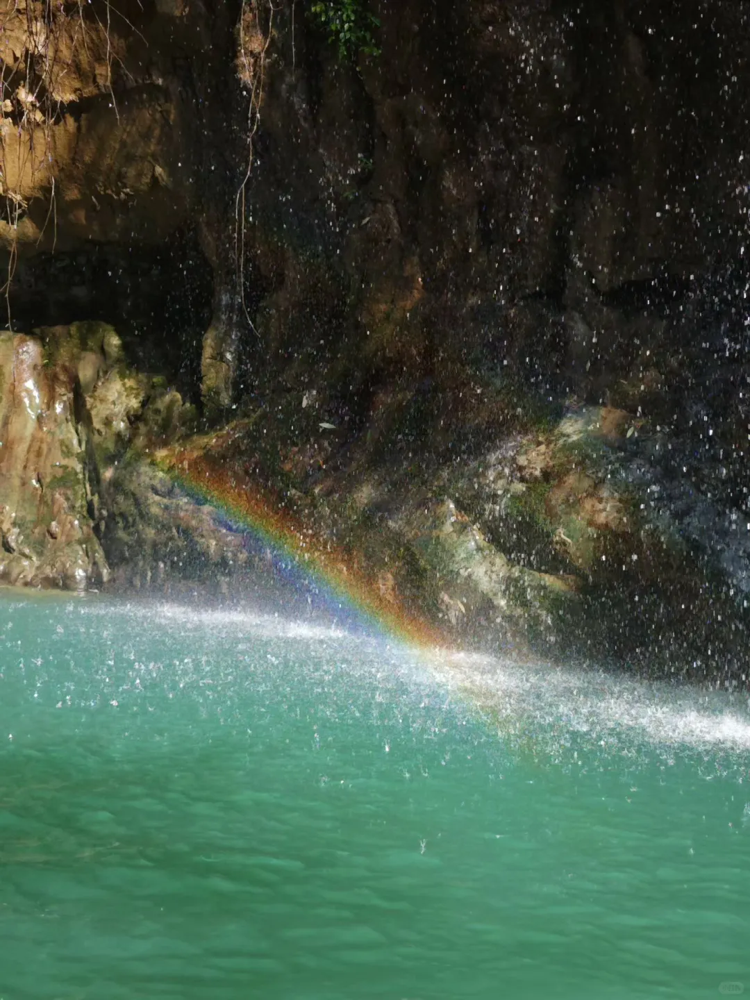
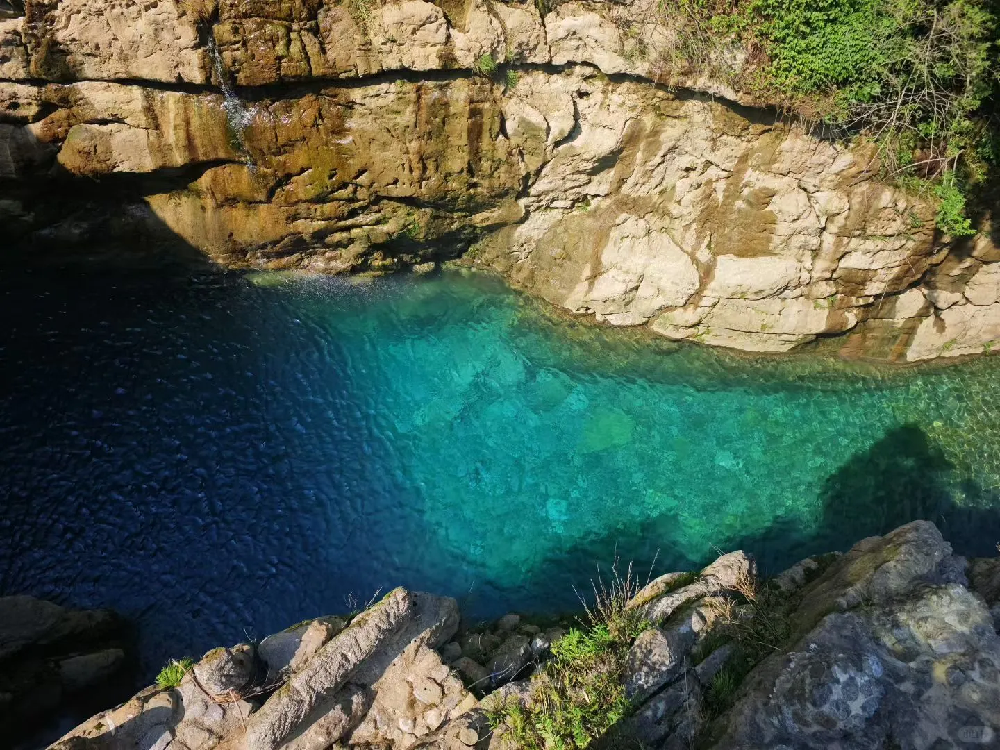
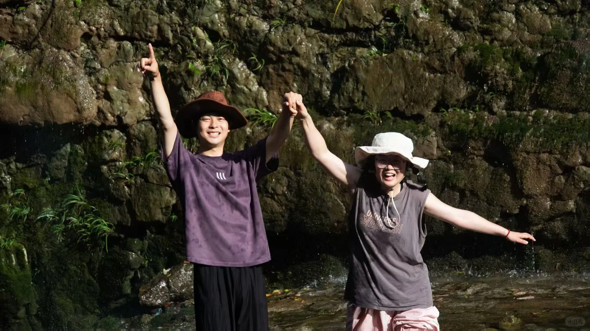
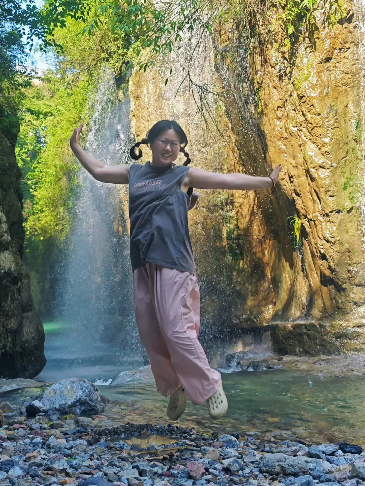
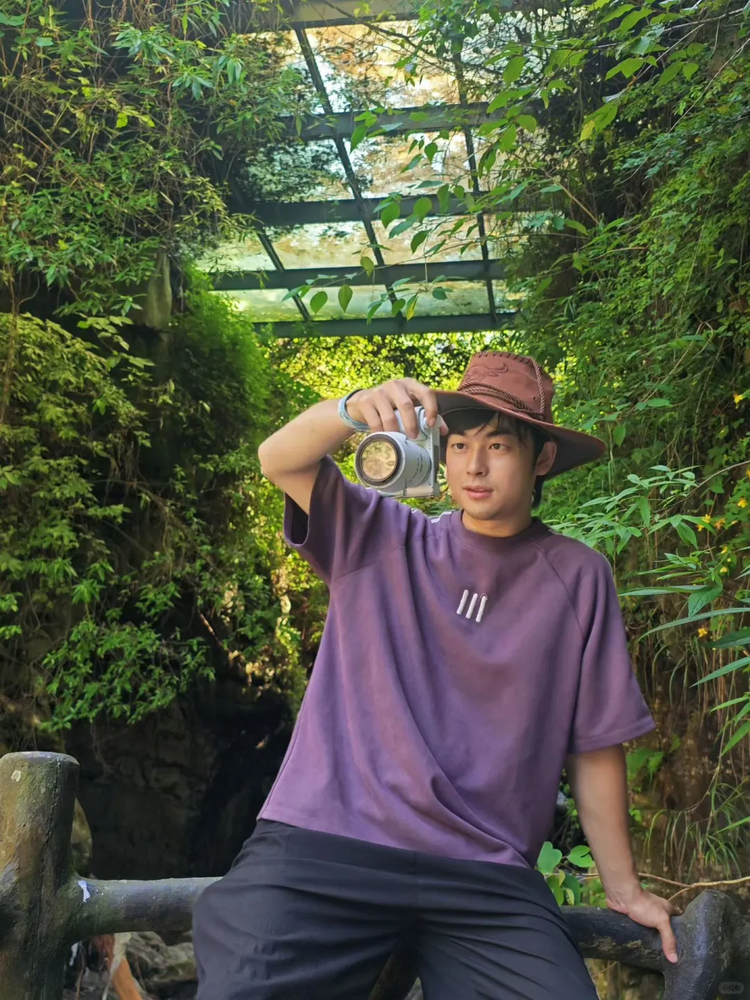

# 我不允许还有人不知道宜昌这个打卡点！！！

- 作者: 秭归凯歌民宿(屈原故里店)
- 👍40 · 💬21 · ⭐64 · 图 10
- feed_id: 6a28fc730000000017028c88

> [OCR] 宜昌
小众绝美
打卡地

> [OCR] HIK

> [OCR] 川江侠

> [OCR] [?]

> [OCR] 虎口关

> [OCR] system

> [OCR] [?]

> [OCR] UNARSEL
SMENELGI

> [OCR] UNWARSFL

> [OCR] [?]

## 正文
“我敢打赌，99%的宜昌人都没这样玩过秭归！”
	
不坐船、不绕路、小孩老人都能去，从秭归县城出发，一天之内同时拥有了：一只趴在长江边的‘小狗山’、一个打卡人生照片的悬崖鹰嘴岩、一个藏在峡谷里的绝美秘境、还有一场海拔1300米的夏日避暑/日落/烧烤……
	
❤️第一站：牛肝马肺峡观景台！一定要去看看那个意外走红网络、萌化人的 “小狗山” ，趴卧在长江边的小狗形态超级真实天然，在牛肝马肺峡观景台这里是最佳打卡点！夏天天气好时能见度高，用长焦拍摄，可以把整个峡谷和江水的雄浑壮阔都框进去。提醒一下各位，虽然这里现在已经贴心提档升级，加装了护栏和停车位，但去往的路上山路蜿蜒，大家开车注意安全哦！
	
❤️第二站：鹰嘴岩！如果在牛肝马肺峡还没拍够，直接导航鹰嘴岩公共停车场，前往这个很多人来宜昌必打卡的三峡悬崖秘境。站在酷似老鹰嘴巴的岩石上，你可以360度俯瞰长江、九畹溪、小狗山和牛肝马肺峡，一览众山小的视觉享受原来可以这么爽！
	
❤️第三站：堂鼓关景区！不要被他AAA景区而小瞧他，融原始、幽静、隐秘于一身，来这里必须体验一下核心划船路线，由虎口关、石壁关、洞天关、苦情关以及堂鼓关五关相扣！在虎口关感受瀑布飞流的壮观，在形成于两亿多年前的石壁关中划船体验柳暗花明，阳光洒下来真的很好看，妥妥的小仙本那，峡谷里水碧绿碧绿的超级出片。（p1~p10出片绝了）
	
重头戏来了——第四站：芝兰谷看夕阳吃烧烤！导航芝兰谷，随着海拔逐步爬升到平均海拔1300多米，温度明显舒服起来。赶在下午夕阳前抵达，看着远方的群山和村落被金黄色的余晖笼罩，远眺还能隐约看到三峡大坝，疲劳一扫而光。晚餐就近在露营区开启一场烧烤趴，绝美日落伴着人间烧烤烟火气，太治愈了！
	
返程必走最美公路：芝茅公路！从芝兰谷出发直接走被称为“三峡最美公路”的芝茅线回秭归县城。这条路全长约56.7公里，海拔从200米一路拉到1200米，沿途各种奇峰、云海、夕阳频频出现，每一个发卡弯都是惊喜，记得提醒司机谨慎驾驶，也别忘了随时停车捕捉沿路大片！
	
💦路线升级预告！等5月到10月左右，九畹溪漂流正式开放，一定一定要把这号称 “中华第一漂” 的峡谷漂流加进你们的旅行计划！
	
这条不坐船、不绕路、一天玩爽的秭归私家路线，你觉得最心动的是哪一站？ 评论区告诉我。
	
如果你也喜欢这种避开人群的深度玩法，记得点赞、收藏、关注。我是和你一样爱瞎逛的阿凯，下条视频，继续带你钻山里、吃好吃的。

---