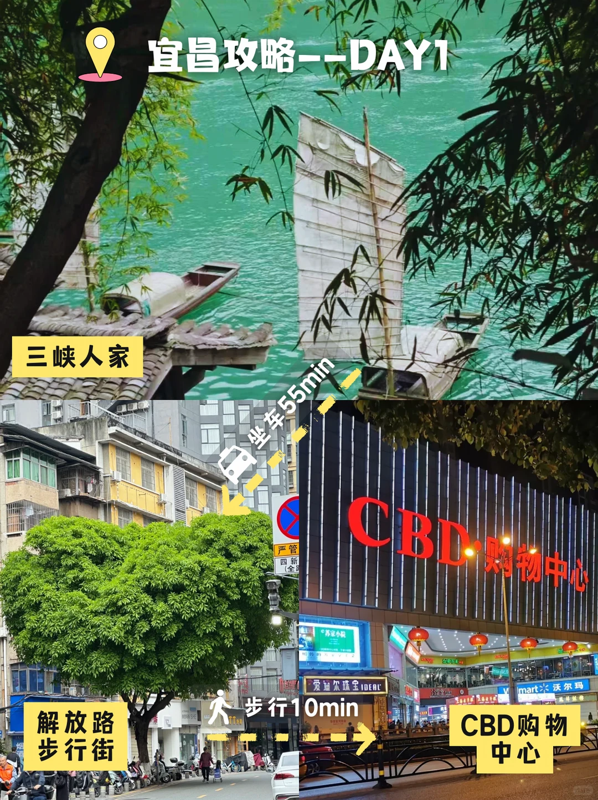
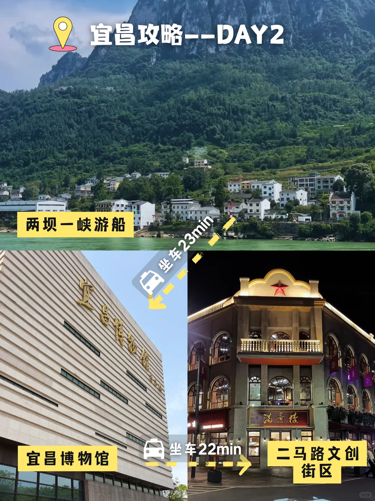
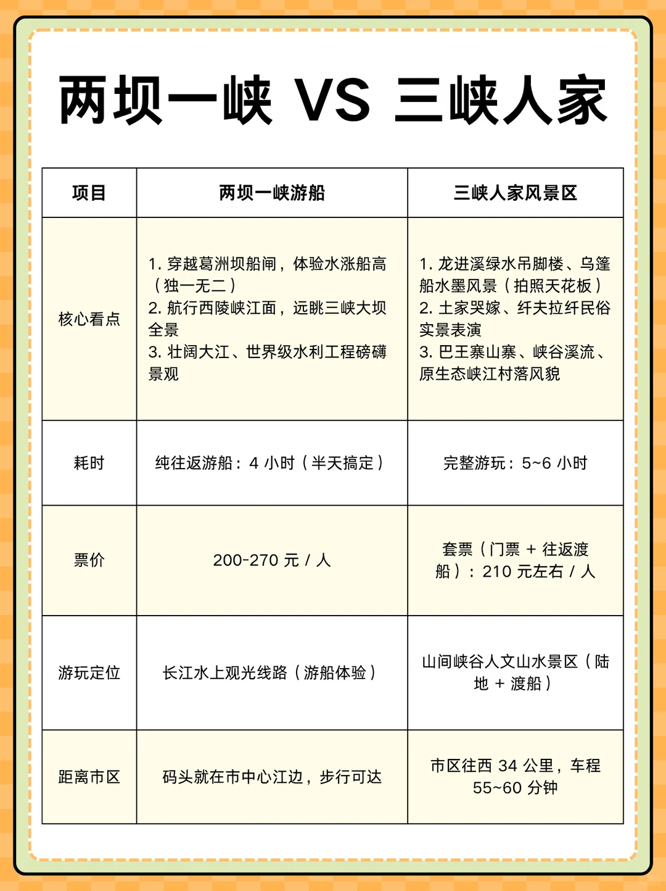
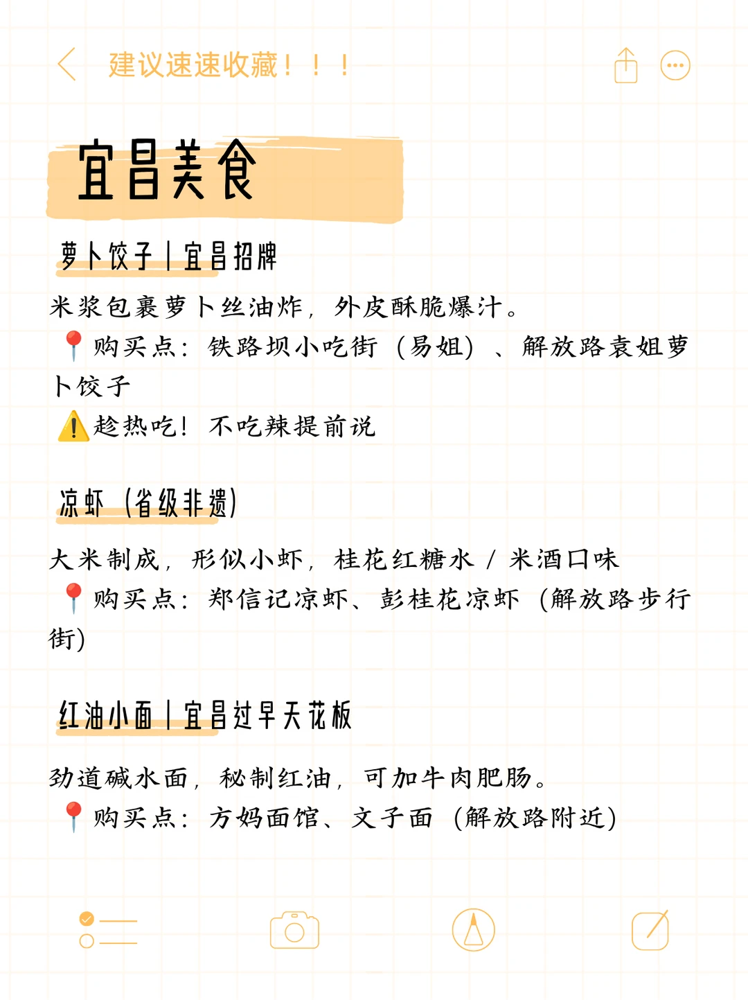
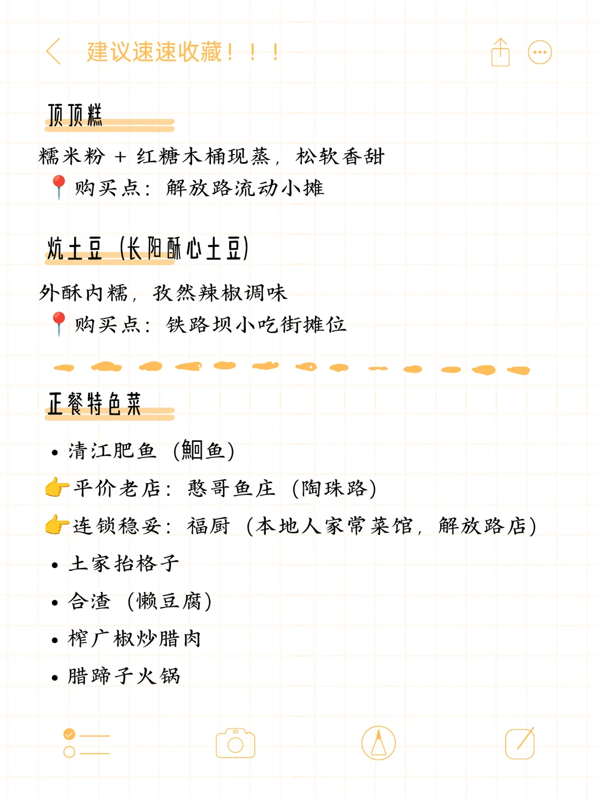
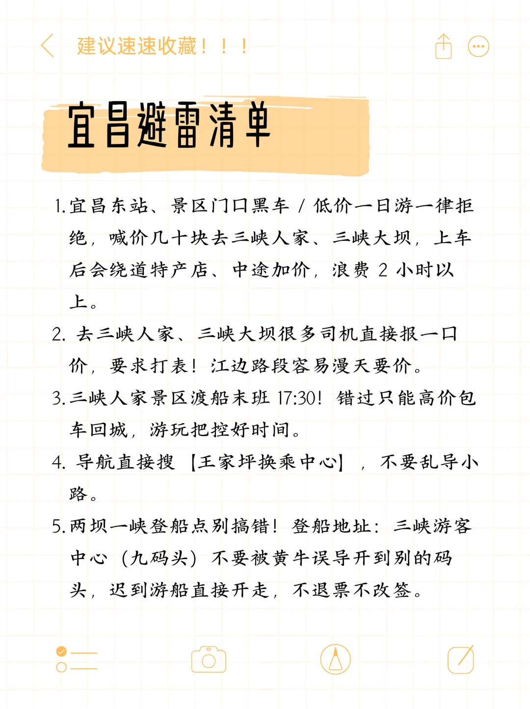
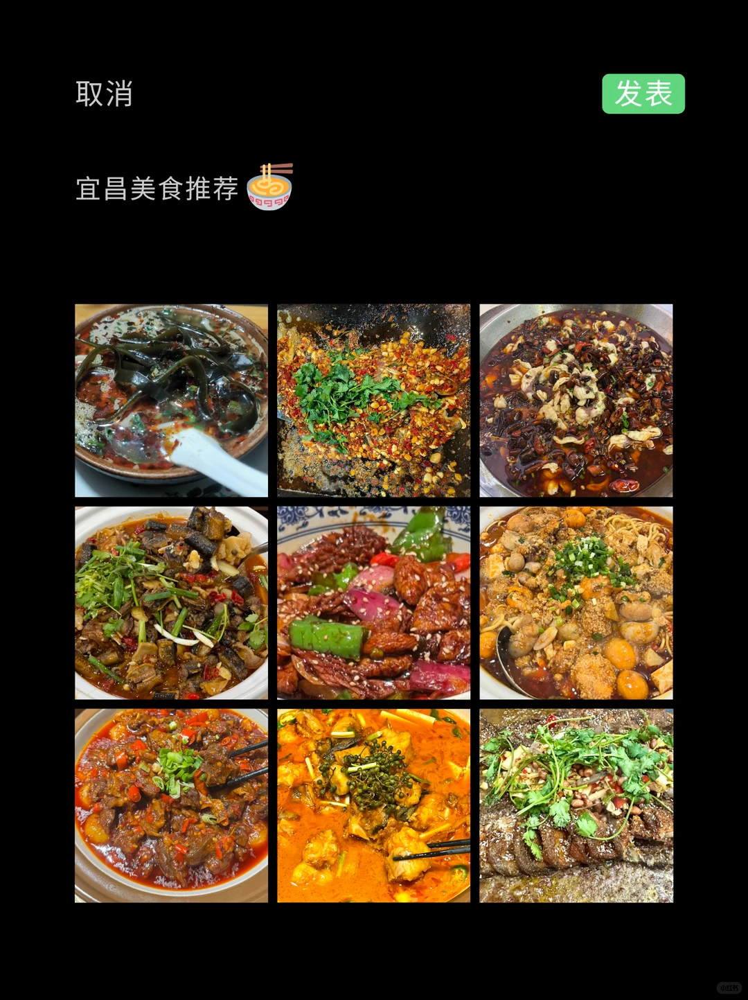

# 周末出逃旅游计划（100/25）—— 宜昌

- 作者: 十三幺(旅游攻略版)
- 👍38 · 💬2 · ⭐31 · 图 8
- feed_id: 6a70522c0000000005028e78

> [OCR] 宜昌
两天一夜特种兵

> [OCR] 宜昌攻略--DAY1
三峡人家
解放路步行街
CBD购物中心
步行10min
坐车55min

> [OCR] 宜昌攻略——DAY2
两坝一峡游船
坐车23min
宜昌博物馆
坐车22min
二马路文创街区

> [OCR] 两坝一峡 VS 三峡人家

| 项目 | 两坝一峡游船 | 三峡人家风景区 |
| --- | --- | --- |
| 核心看点 | 1. 穿越葛洲坝船闸，体验水涨船高（独一无二） 2. 航行西陵峡江面，远眺三峡大坝全景 3. 壮阔大江、世界级水利工程磅礴景观 | 1. 龙进溪绿水吊脚楼、乌篷船水墨风景（拍照天花板） 2. 土家哭嫁、纤夫拉纤民俗实景表演 3. 巴王寨山寨、峡谷溪流、原生态峡江村落风貌 |
| 耗时 | 纯往返游船：4小时（半天搞定） | 完整游玩：5~6小时 |
| 票价 | 200-270元/人 | 套票（门票+往返渡船）：210元左右/人 |
| 游玩定位 | 长江水上观光线路（游船体验） | 山间峡谷人文山水景区（陆地+渡船） |
| 距离市区 | 码头就在市中心江边，步行可达 | 市区往西34公里，车程55~60分钟 |

> [OCR] 宜昌美食

萝卜饺子 | 宜昌招牌
米浆包裹萝卜丝油炸，外皮酥脆爆汁。
购买点：铁路坝小吃街（易姐）、解放路袁姐萝卜饺子
！趁热吃！不吃辣提前说

凉虾 (省级非遗)
大米制成，形似小虾，桂花红糖水 / 米酒口味
购买点：郑信记凉虾、彭桂花凉虾（解放路步行街）

红油小面 | 宜昌过早天花板
劲道碱水面，秘制红油，可加牛肉肥肠。
购买点：方妈面馆、文子面 (解放路附近)

> [OCR] 建议速速收藏！！！

顶顶糕

糯米粉 + 红糖木桶现蒸，松软香甜
购买点：解放路流动小摊

炕土豆（长阳酥心土豆）

外酥内糯，孜然辣椒调味
购买点：铁路坝小吃街摊位

正餐特色菜

- 清江肥鱼（鮰鱼）
平价老店：憨哥鱼庄（陶珠路）
连锁稳妥：福厨（本地人家常菜馆，解放路店）

- 土家抬格子
- 合渣（懒豆腐）
- 榨广椒炒腊肉
- 腊蹄子火锅

> [OCR] 宜昌避雷清单

1. 宜昌东站、景区门口黑车/低价一日游一律拒绝，喊价几十块去三峡人家、三峡大坝，上车后会绕道特产店、中途加价，浪费2小时以上。

2. 去三峡人家、三峡大坝很多司机直接报一口价，要求打表！江边路段容易漫天要价。

3. 三峡人家景区渡船末班17:30！错过只能高价包车回城，游玩把控好时间。

4. 导航直接搜【王家坪换乘中心】，不要乱导小路。

5. 两坝一峡登船点别搞错！登船地址：三峡游客中心（九码头）不要被黄牛误导开到别的码头，迟到游船直接开走，不退票不改签。

> [OCR] 取消
发表
宜昌美食推荐🍜

## 正文
Day1：三峡人家→解放路步行街→CBD购物中心
Day2：两坝一峡游船→宜昌博物馆→二马路文创街区
	
🍜宜昌必吃不踩雷美食清单
🥢 特色小吃
▪️ 萝卜饺子：宜昌招牌！半月造型，现炸现卖，外皮酥脆掉渣，内里萝卜丝清甜微辣，一口沦陷🤤
▪️ 凉虾：夏日解暑神器！软糯Q弹的米浆凉虾，搭配桂花红糖水，清爽解腻，3-5元一杯超平价
▪️ 红油小面：本地人每日过早标配！碱水面筋道爽滑，秘制红油麻香十足，加卤蛋豆干绝了
▪️ 胡记红油包子：任贤齐同款！牛肉包爆汁入味，香辣不腻，早餐必冲
🥢 正餐硬菜
▪️ 清江肥鱼：无细刺肉质细嫩，鱼汤鲜掉眉毛✨ 非遗鱼火锅一定要试！
▪️ 土家郧西肥肠：椒麻风味，嚼劲十足无腥味，重口星人爱惨
▪️ 土鸡汤：汤清味鲜，温润解辣，吃完山水美食超暖胃
	
⚠️旅游小Tips
1. 三峡大坝一定要提前免费预约！不要相信路边高价代办🚫
2. 景区周边拉客吃饭谨慎选择
3. 夏季宜昌偏热，山间蚊虫多，做好防晒防蚊！玩水注意安全💦
4. 无人机在三峡大坝全域禁飞，不要携带起飞
5.不要随意靠近溪水河滩，汛期水流湍急
	
#宜昌旅游[话题]#  #宜昌攻略[话题]#  #三峡大坝[话题]#   #三峡人家[话题]#  #宜昌美食[话题]#  #湖北旅游[话题]#  #周末去哪儿[话题]#  #美食特种兵[话题]# #宜昌两天一夜[话题]#

---