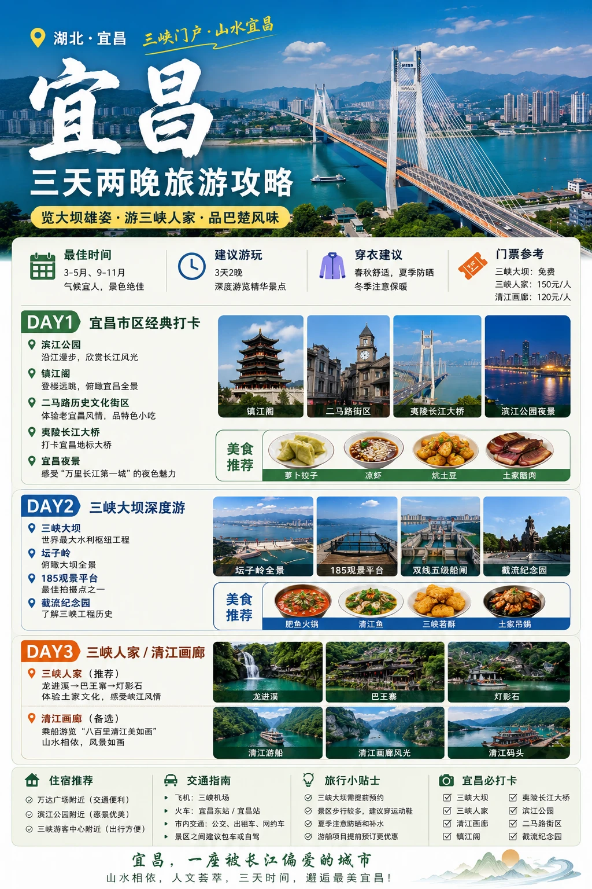
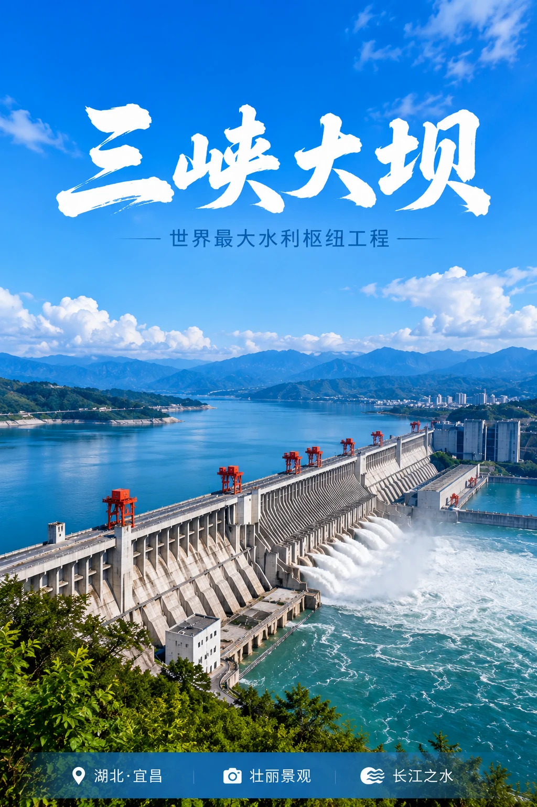
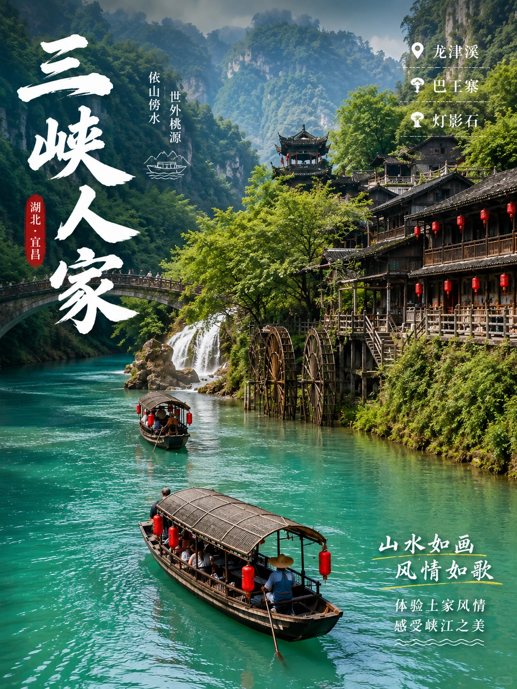
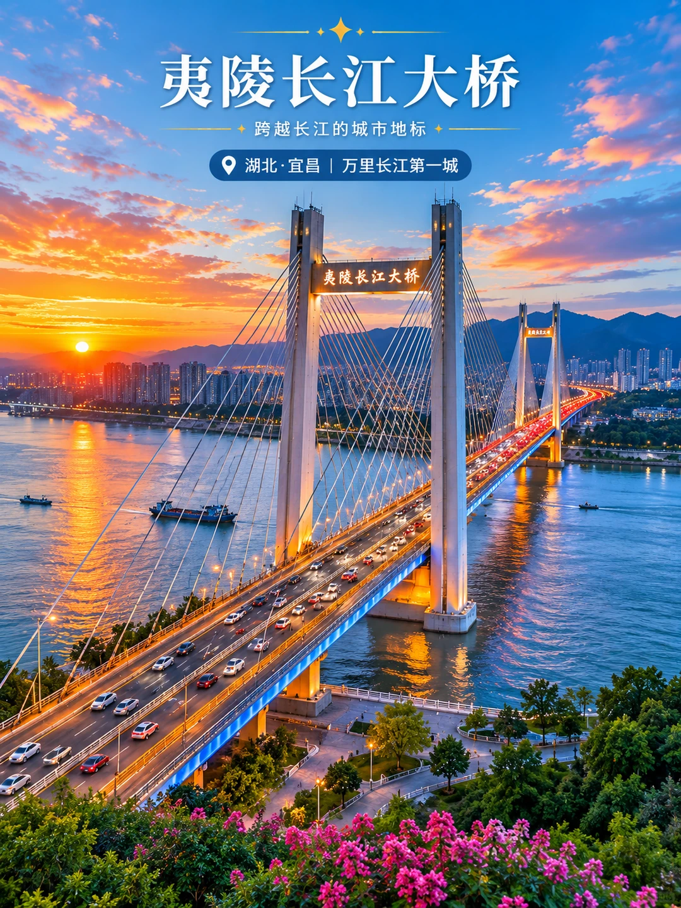

# 宜昌旅游｜第一次来宜昌应该怎么玩？

- 作者: 琛长日记
- 👍38 · 💬 · ⭐27 · 图 5
- feed_id: 6a24c56f000000001603d301

> [OCR] [?]

> [OCR] 湖北·宜昌 三峡门户·山水宜昌
宜昌
三天两晚旅游攻略
览大坝雄姿·游三峡人家·品巴楚风味

最佳时间
3-5月、9-11月
气候宜人，景色绝佳

建议游玩
3天2晚
深度游览精华景点

穿衣建议
春秋舒适，夏季防晒
冬季注意保暖

门票参考
三峡大坝：免费
三峡人家：150元/人
清江画廊：120元/人

DAY1 宜昌市区经典打卡
滨江公园 沿江漫步，欣赏长江风光
镇江阁 登楼远眺，俯瞰宜昌全景
二马路历史文化街区 体验老宜昌风情，品特色小吃
夷陵长江大桥 打卡宜昌地标大桥
宜昌夜景 感受“万里长江第一城”的夜色魅力

美食推荐
萝卜饺子 凉虾 炕土豆 土家腊肉

DAY2 三峡大坝深度游
三峡大坝 世界最大水利枢纽工程
坛子岭 俯瞰大坝全景
185观景平台 最佳拍摄点之一
截流纪念园 了解三峡工程历史

美食推荐
肥鱼火锅 清江鱼 三峡若酥 土家吊锅

DAY3 三峡人家 / 清江画廊
三峡人家（推荐） 龙进溪→巴王寨→灯影石 体验土家文化，感受峡江风情
清江画廊（备选） 乘船游览“八百里清江美如画” 山水相依，风景如画

住宿推荐
万达广场附近（交通便利）
滨江公园附近（落景优美）
三峡游客中心附近（出行方便）

交通指南
飞机：三峡机场
火车：宜昌东站/宜昌站
市内交通：公交、出租车、网约车
景区之间建议包车或自驾

旅行小贴士
三峡大坝需提前预约
景区步行较多，建议穿运动鞋
夏季注意防晒和补水
游船项目提前预订更优惠

宜昌必打卡
三峡大坝 三峡人家 清江画廊
夷陵长江大桥 滨江公园 二马路街区
镇江阁 截流纪念园

宜昌，一座被长江偏爱的城市
山水相依，人文荟萃，三天时间，邂逅最美宜昌！

> [OCR] 三峡大坝
世界最大水利枢纽工程

湖北·宜昌
壮丽景观
长江之水

> [OCR] 三
峡
人
家
湖北·宜昌
依山傍水
世外桃源
龙津溪
巴王寨
灯影石
山水如画
风情如歌
体验土家风情
感受峡江之美

> [OCR] 夷陵长江大桥
跨越长江的城市地标
湖北·宜昌 | 万里长江第一城

## 正文
📅 Day1｜宜昌市区经典打卡
	
📍路线：
滨江公园 → 镇江阁 → 夷陵长江大桥 → 二马路历史文化街区 → 宜昌夜景
	
上午沿长江边漫步，感受“万里长江第一城”的魅力。
	
下午逛二马路历史文化街区，体验老宜昌风情。
	
傍晚在滨江公园欣赏长江日落和城市夜景。
	
📸拍照机位：
	
✔️镇江阁观景台
	
✔️夷陵长江大桥
	
✔️滨江公园江边步道
	
🍜美食推荐：
	
萝卜饺子
	
凉虾
	
炕土豆
	
土家腊肉
	
📅 Day2｜三峡大坝深度游
	
📍路线：
三峡大坝 → 坛子岭 → 185观景平台 → 截流纪念园
	
来到宜昌一定不能错过三峡大坝。
	
这里是世界最大的水利枢纽工程之一，现场远比照片震撼。
	
推荐重点打卡：
	
✅ 坛子岭观景区
	
✅ 185平台
	
✅ 双线五级船闸
	
✅ 截流纪念园
	
📸拍照机位：
	
✔️坛子岭全景平台
	
✔️185观景点
	
✔️船闸观景区
	
🍜美食推荐：
	
肥鱼火锅
	
清江鱼
	
三峡苕酥
	
土家吊锅
	
📅 Day3｜三峡人家或清江画廊
方案一：三峡人家
	
📍龙进溪 → 巴王寨 → 灯影石
	
青山、碧水、吊脚楼共同构成一幅山水画卷。
	
可以体验土家族文化和长江峡谷风光。
	
方案二：清江画廊
	
乘船游览清江，两岸山峰连绵起伏，被誉为“八百里清江美如画”。
	
📸拍照机位：
	
✔️清江游船甲板
	
✔️巴王寨观景台
	
✔️龙进溪码头
	
🏨住宿推荐
	
✔️ 万达广场附近（交通方便）
	
✔️ 滨江公园附近（夜景漂亮）
	
✔️ 三峡游客中心附近（方便出发游船）
	
🎒出行Tips
	
✔️ 最佳旅行时间：3-5月、9-11月
	
✔️ 三峡大坝建议提前预约
	
✔️ 夏季注意防晒和补水
	
✔️ 景区步行较多，建议穿运动鞋
	
✔️ 游船项目提前预订体验更好
	
🌟宜昌必打卡
	
✅ 三峡大坝
	
✅ 三峡人家
	
✅ 清江画廊
	
✅ 镇江阁
	
✅ 滨江公园
	
✅ 夷陵长江大桥
	
✅ 截流纪念园
	
✅ 二马路历史文化街区
	
✨一句话总结：
	
宜昌是一座被长江偏爱的城市，既有世界级工程三峡大坝，也有诗画般的峡江风光。三天时间，足以感受“山水宜昌”的独特魅力。
	
#宜昌旅游攻略[话题]#  #宜昌三天两晚[话题]#  #宜昌旅游[话题]#  #三峡大坝[话题]#  #清江画廊[话题]#  #三峡大学[话题]# #湖北旅游[话题]# #长江三峡[话题]#  #旅游攻略[话题]#  #宜昌美食[话题]#

---