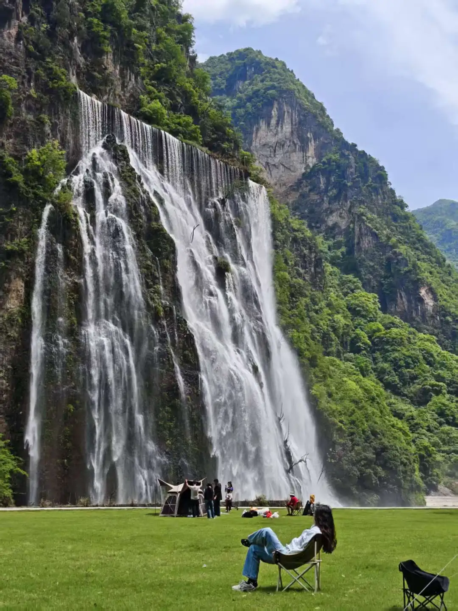
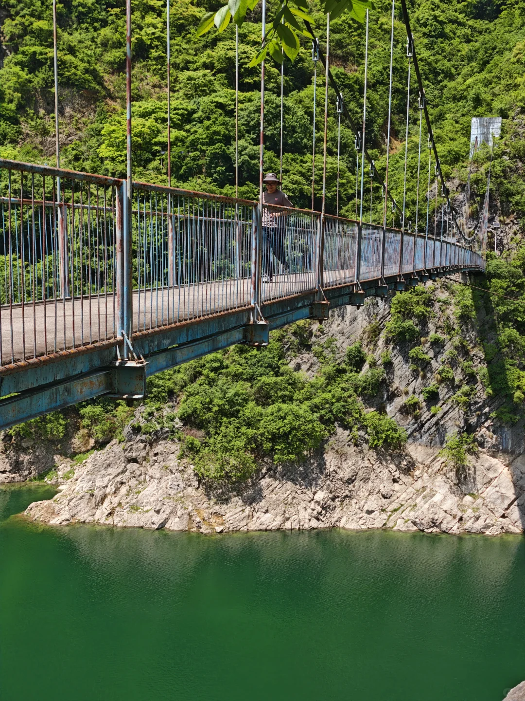
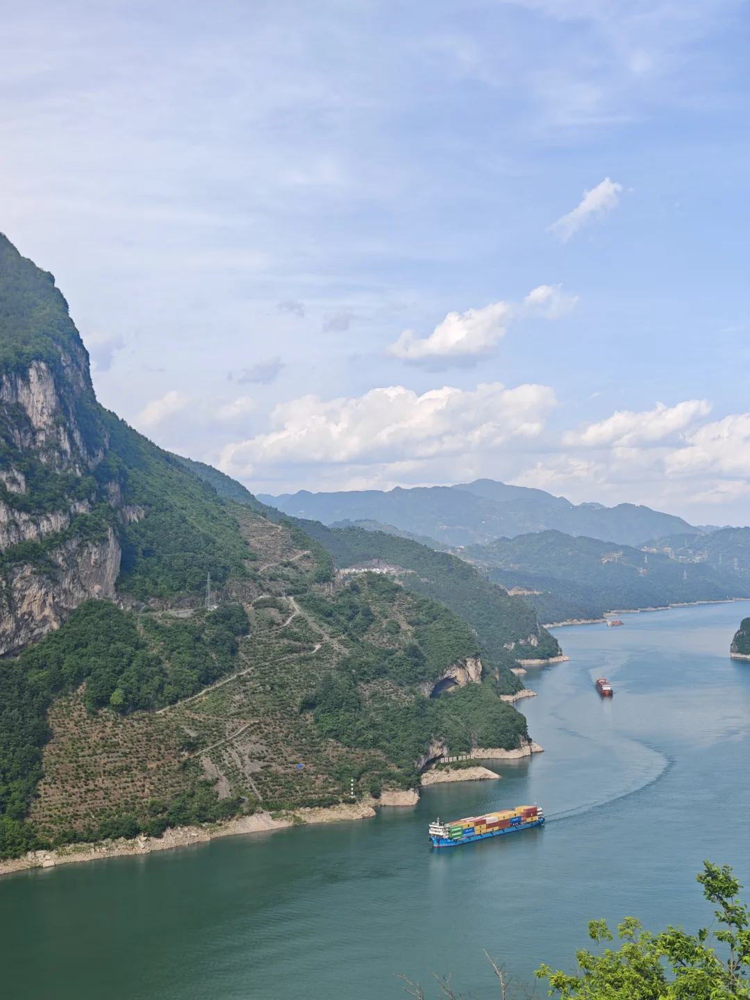
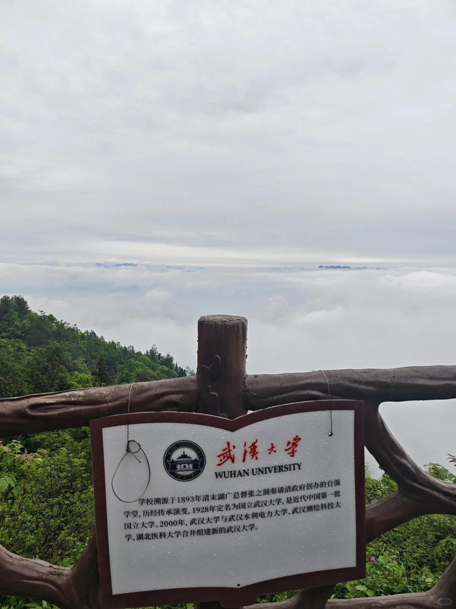
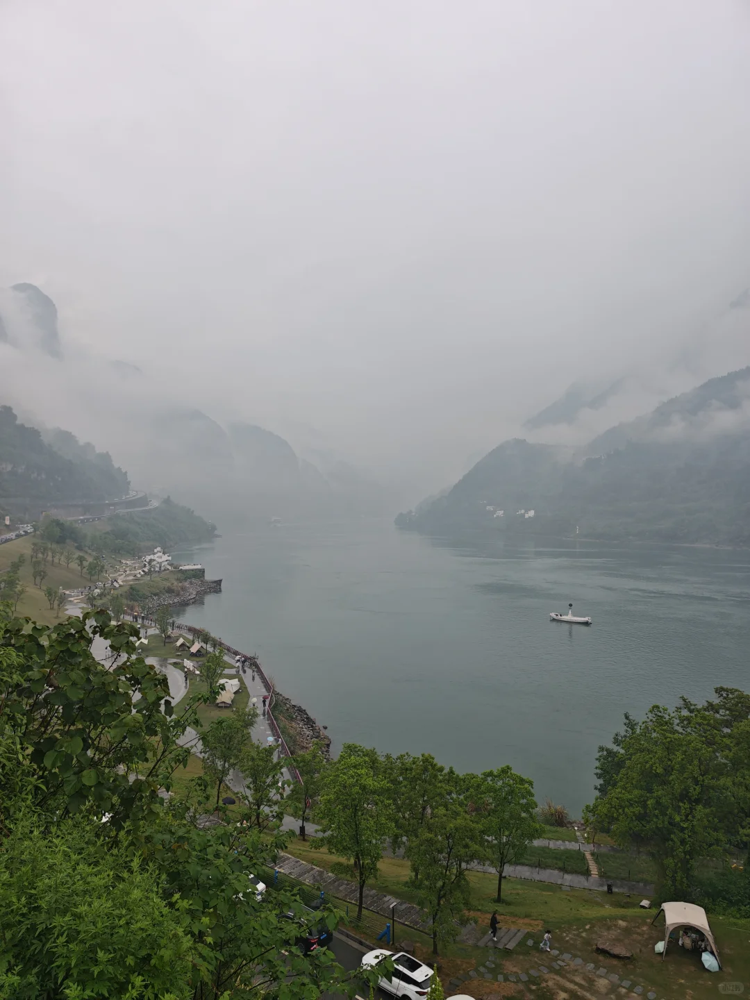
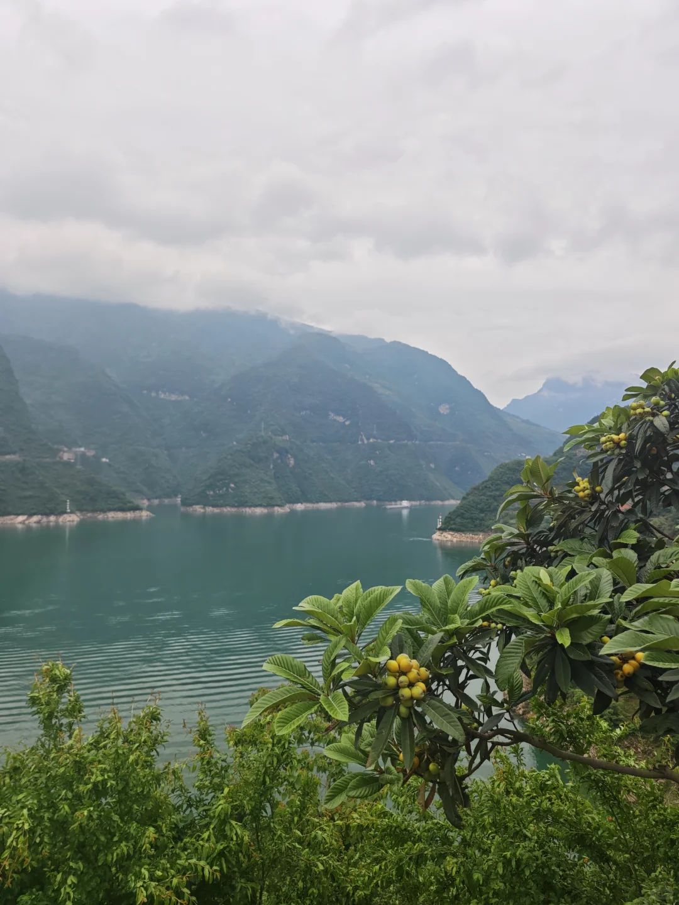
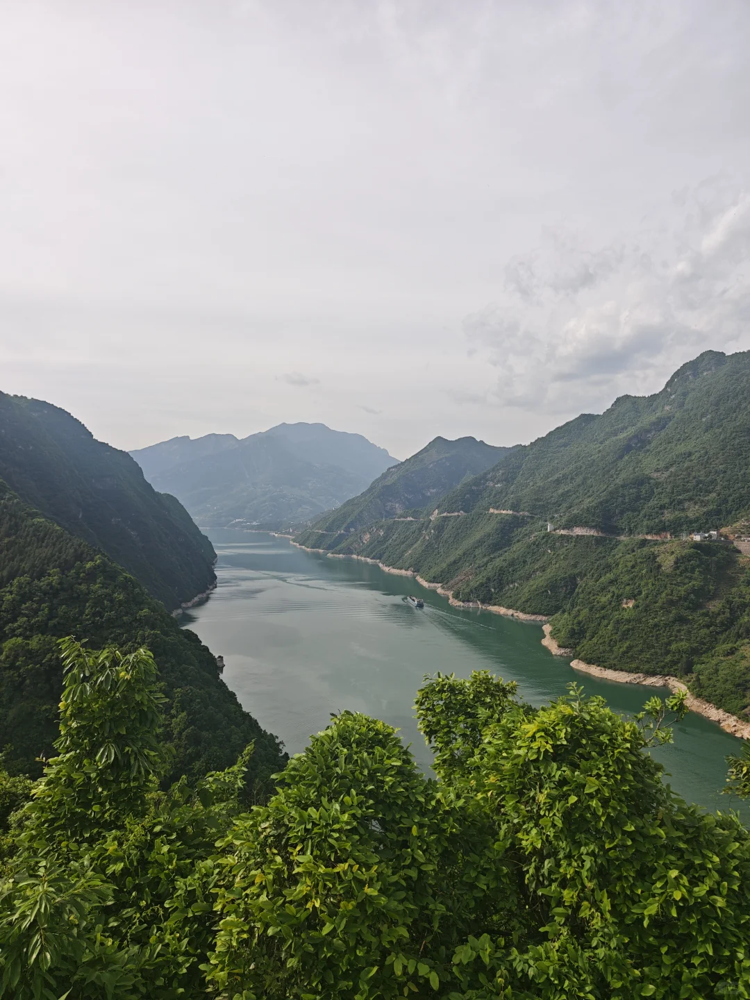
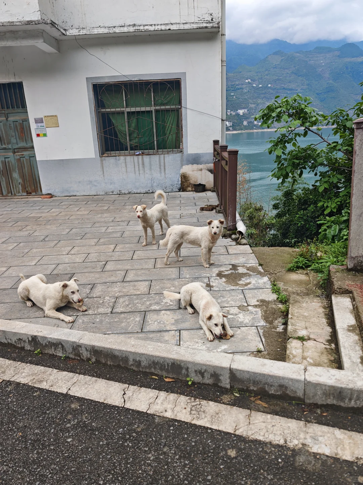
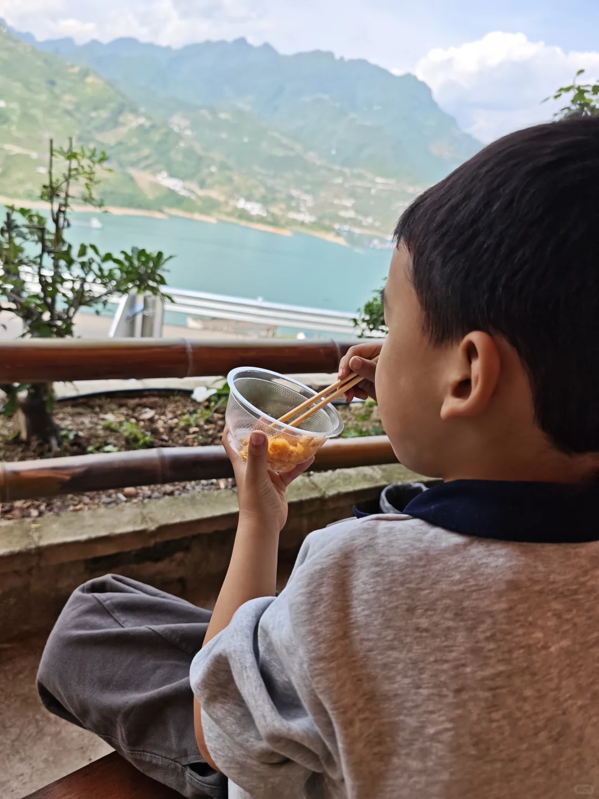

# 🚗告别人从众！G348反向路线，人少景美

- 作者: 大包小包请过安检
- 👍37 · 💬4 · ⭐63 · 图 10
- feed_id: 69fab16600000000350393e6

> [OCR] [?]

> [OCR] [?][?][?]

> [OCR] 武汉大学
WUHAN UNIVERSITY

学校溯源于1893年清末湖广总督张之洞奏请清政府创办的自强学堂,历经传承演变,1928年定名为国立武汉大学,是近代中国第一批国立大学。2000年，武汉大学与武汉水利电力大学、武汉测绘科技大学、湖北医科大学合并组建新的武汉大学。

> [OCR] [?]

> [OCR] system

> [OCR] [?]

> [OCR] [?]

> [OCR] 上岸区

> [OCR] [?L]

## 正文
🏞️ 三刷G348总结出的血泪经验！
谁说五一G348全是人头？那是你没找对路！亲测这条反向路线，不仅人少，风景更是绝绝子！👇
	
🗺️ 【三天两夜·不绕路行程单】
	
Day 1：初见峡谷
📍傍晚进入G348 ➡️ 晚上住莲沱畔附近江边民宿
🧭导航参考：出发地-三游洞-干沟子大桥-0.618
	
Day 2：精华路段（重点！）
📍莲沱畔 ➡️ 三斗坪游客中心 ➡️ 神鱼台 ➡️ 新滩渡口 ➡️ 兵书宝剑峡 ➡️ 兴山昭君镇
💡Tips：没时间可以在昭君镇不停，返程再慢慢逛～
	
Day 3：峡谷探险
📍昭君镇 ➡️ 高岚大瀑布 ➡️ 朝天吼漂流 ➡️ 牛肝马肺峡 ➡️ 宜昌市区
	
⚠️ 【避雷指南·必看！】
❌ 鹰嘴岩慎去！ 最近风很大，人多路堵，如果不是为了拍照打卡，建议直接pass！带娃家庭千万别去凑热闹！
✅ 高岚大峡谷真香！ 回秭归的路上，河水碧绿，还能看到超多鱼，随手拍都是大片！
	
🍊 【隐藏福利】
到了秭归一定要买伦晚！我们在路边买了一筐足足50斤，只要50块钱！这也太划算了吧😭 实现橙子自由！
	
#G348国道 #湖北旅游 #宜昌旅游 #五一去哪玩 #小众旅行地 #自驾游攻略 #反向旅游#人少景美小众地[话题]#

---