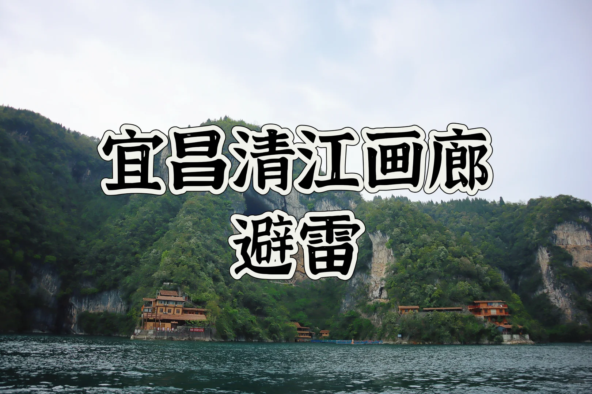
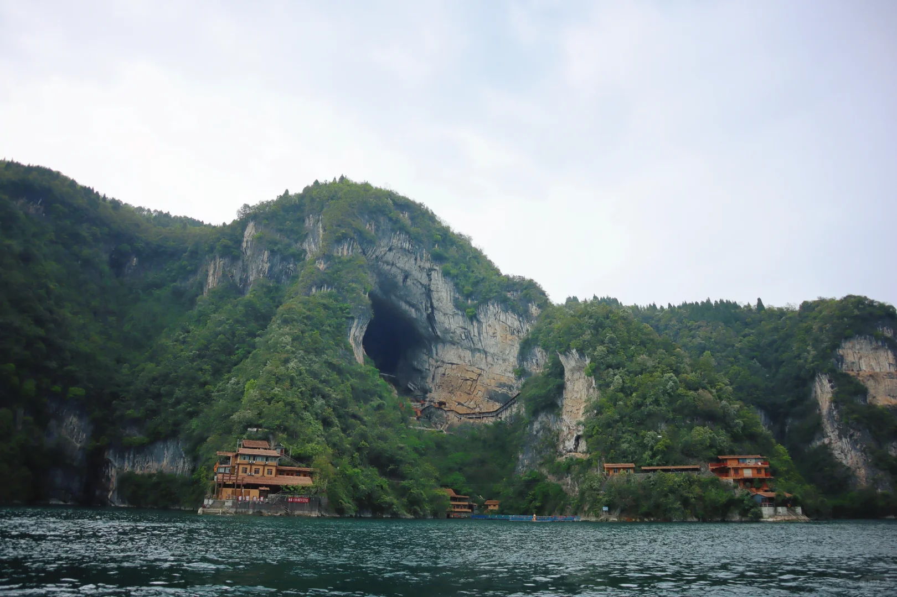
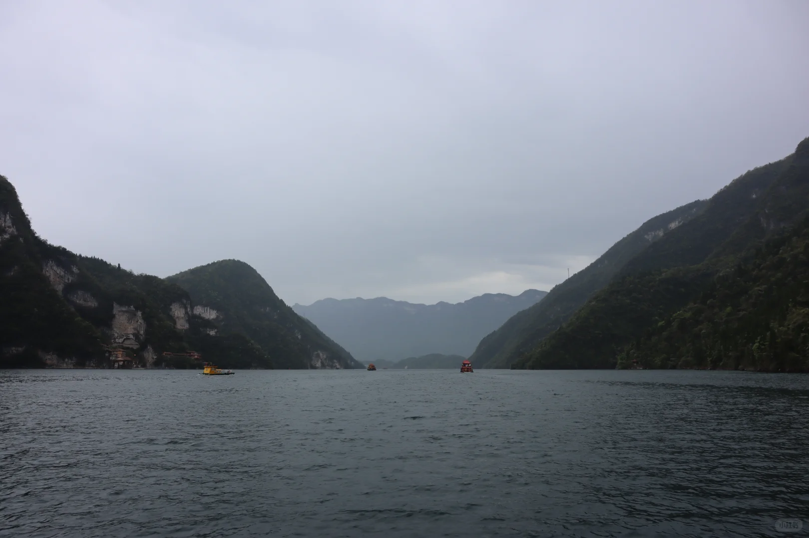

# 宜昌清江画廊避雷 非必去景点

- 作者: 爱旅行的土豆🥔
- 👍36 · 💬72 · ⭐9 · 图 3
- feed_id: 69d61766000000001a02bbd5

> [OCR] 宜昌清江画廊
避雷

> [OCR] [?][?][?]

> [OCR] 小红书

## 正文
首先去宜昌肯定大部分人都会游两坝一峡和三峡人家
我就是先去这两个地方 后面就是还有一天 在 清江画廊、G348国道和三峡瀑布。选一
首先天气不是很好 这点我是可以接受的
打车只能到游客分散中心 要先坐车上去 在走一段路或者电瓶车， 然后再去坐游船 （我选的B线）
这个景点和前面我去的风景雷同 而已那两个景点风景比这个还好
最终重点是仙人寨关了 在维修 说去年就已经关了 有落石，危险。 大部分人来应该都是为了这个景点[哭惹R][哭惹R][哭惹R][哭惹R]

---