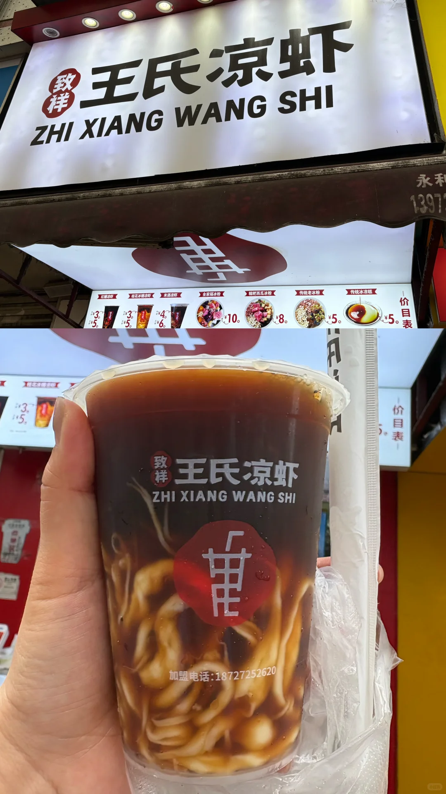
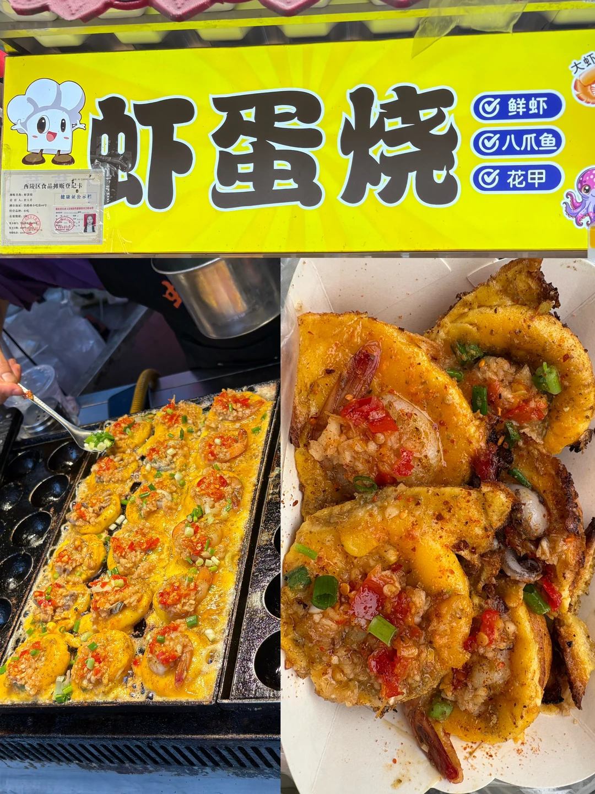
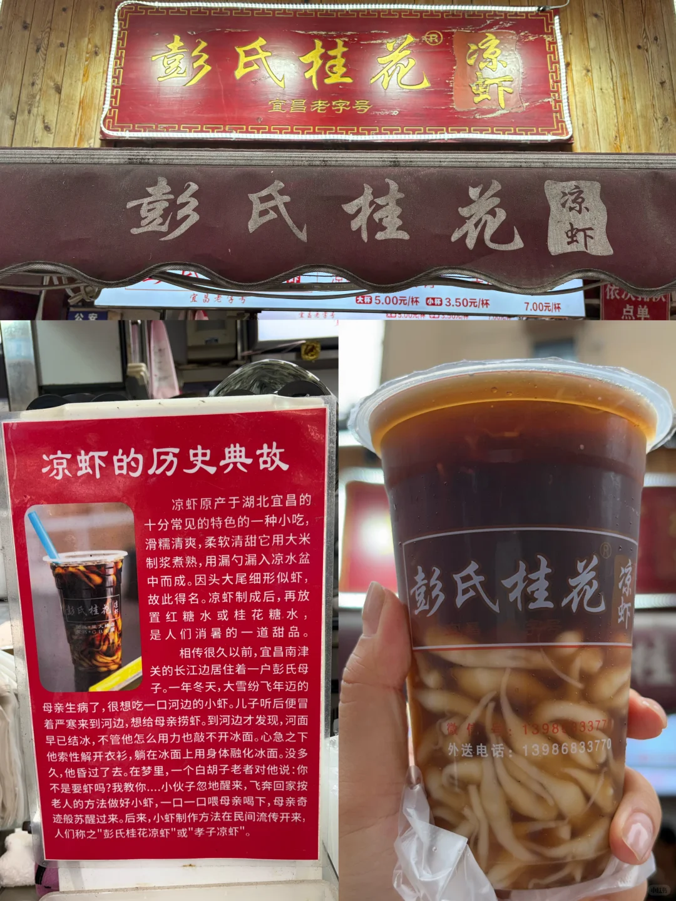
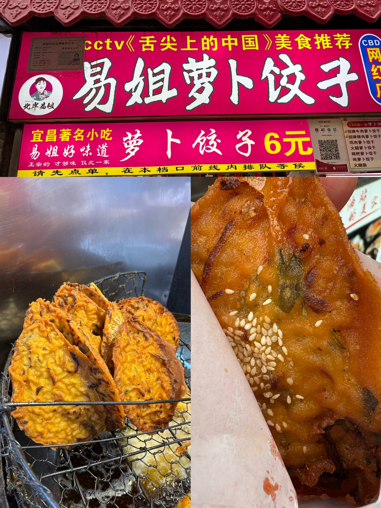
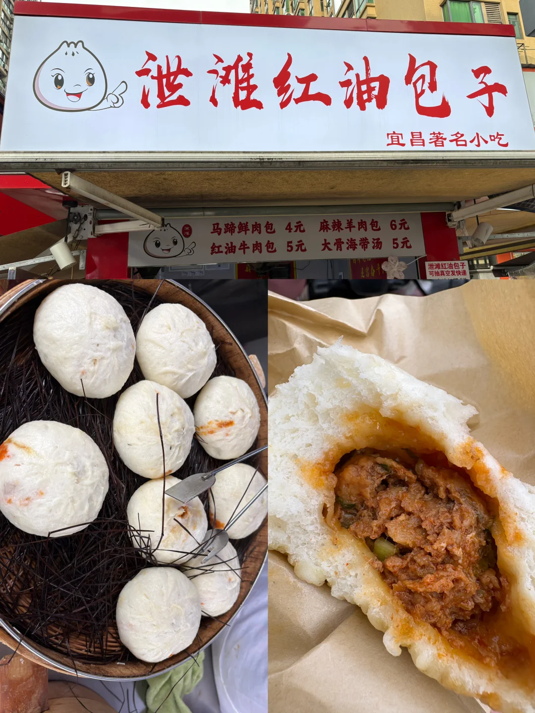

# 📍宜昌 铁路坝美食街

- 作者: 史迪埼
- 👍34 · 💬6 · ⭐14 · 图 6
- feed_id: 6a43a6d2000000002101898d

> [OCR] 致祥王氏凉虾
ZHI XIANG WANG SHI
红糖冰粉 3.5
桂花冰糖凉虾 3.5
米酒冰粉 4.6
全家福冰粉 [?]
粗把西瓜冰粉 10.
传统老冰粉 8.
传统冰凉糕 5.
加盟电话：18727252620

> [OCR] 虾蛋烧
鲜虾
八爪鱼
花甲

> [OCR] 彭氏桂花凉虾
宜昌老字号

彭氏桂花凉虾

凉虾的历史典故

凉虾原产于湖北宜昌的十分常见的特色的一种小吃，
滑糯清爽，柔软清甜它用大米制浆煮熟,
用漏勺漏入凉水盆中而成。因头大尾细形似虾,
故此得名。凉虾制成后,再放置红糖水或桂花糖水,
是人们消暑的一道甜品。

相传很久以前,宜昌南津关的长江边居住着一户彭氏母子。
一年冬天，大雪纷飞年迈的母亲生病了,很想吃一口河边的小虾。
儿子听后便冒着严寒来到河边,想给母亲捞虾。到河边才发现,
河面早已结冰,不管他怎么用力也敲不开冰面。心急之下
他索性解开衣衫,躺在冰面上用身体融化冰面。没多久，
他昏过去了去。在梦里，一个白胡子老者对他说:你不是要虾吗?我教你....小伙子忽地醒来,
飞奔回家按老人的方法做好小虾,一口一口喂母亲喝下,
母亲奇迹般苏醒过来。后来,小虾制作方法在民间流传开来，
人们称之"彭氏桂花凉虾"或"孝子凉虾"。

微信:13986833770
外送电话：13986833770

> [OCR] cctv《舌尖上的中国》美食推荐
易姐萝卜饺子
CBD
北半易姐
宜昌著名小吃 易姐好味道 萝卜饺子6元
正宗的 才够味 仅此一家
请先点单，在本档口前线内排队等候

> [OCR] 泄滩红油包子
宜昌著名小吃

马蹄鲜肉包 4元 麻辣羊肉包 6元
红油牛肉包 5元 大骨海带汤 5元

> [OCR] 铁路坝小吃街

## 正文
P1王氏凉虾⭐️⭐️⭐️⭐️⭐️
🥤宜昌特色饮品 经典红糖味道的水➕凉糕粉制作成的虾形哏啾啾小料，中杯3元大杯5元，超级好喝这个好喜欢
P2虾蛋烧⭐️⭐️⭐️⭐️⭐️
🍤蒜蓉口味 有点点像章鱼小丸子 总之很好吃 15元5个 20元8个
P3彭氏桂花凉虾⭐️⭐️⭐️⭐️⭐️
🥤这次买的是酸梅汁口味的，酸爽可口依旧好喝
P4萝卜饺子⭐️⭐️⭐️
🥟宜昌特色小吃之一 味道还好 无功无过 来了尝一尝不会踩雷12元/个
P5红油包子⭐️
🫓吃不习惯 好咸好咸 牛肉馅腌的太重了 除了咸吃不出其它味道 萝卜饺子里也是这种腌的牛肉 个人不喜欢
P6铁路坝美食街⭐️⭐️⭐️
📍以上是铁路坝美食街的美食，这条路不算长 是一个小夜市，当地美食不算多 品类也多有重复，交通比较方便 总体来逛一逛还是比较chill的～

---