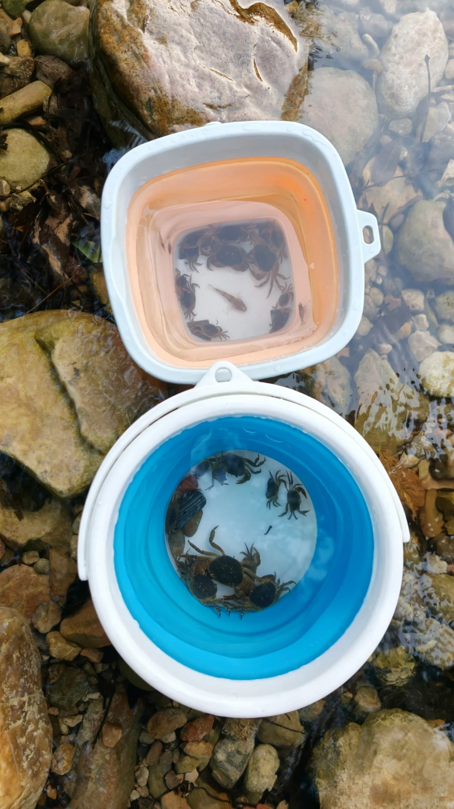
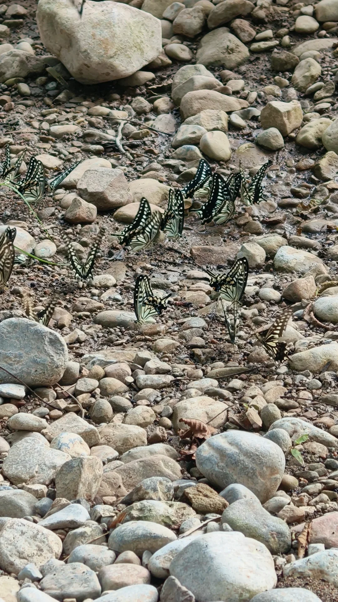
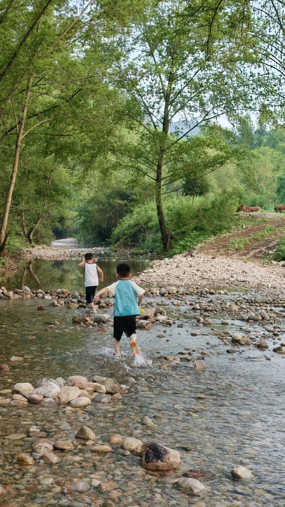
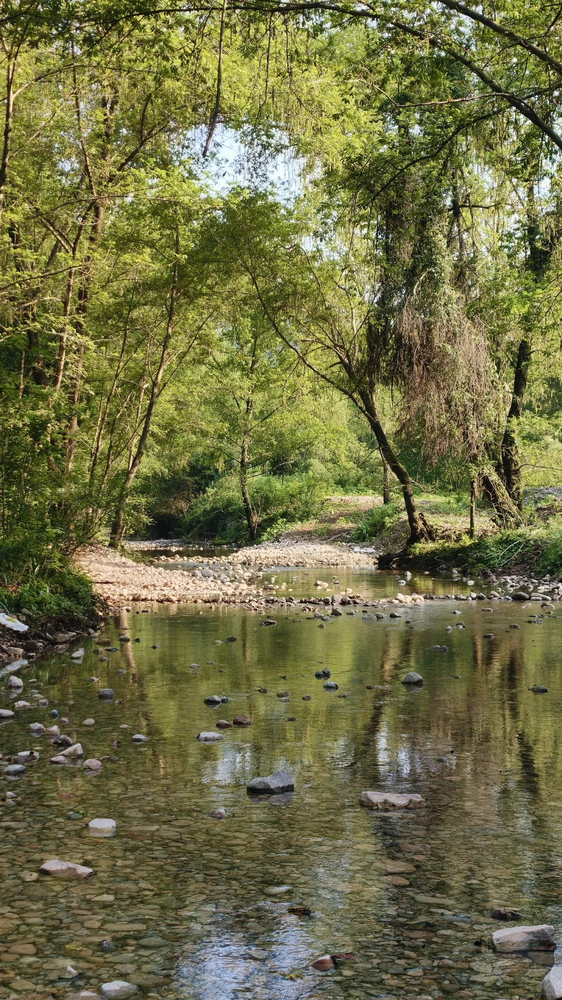
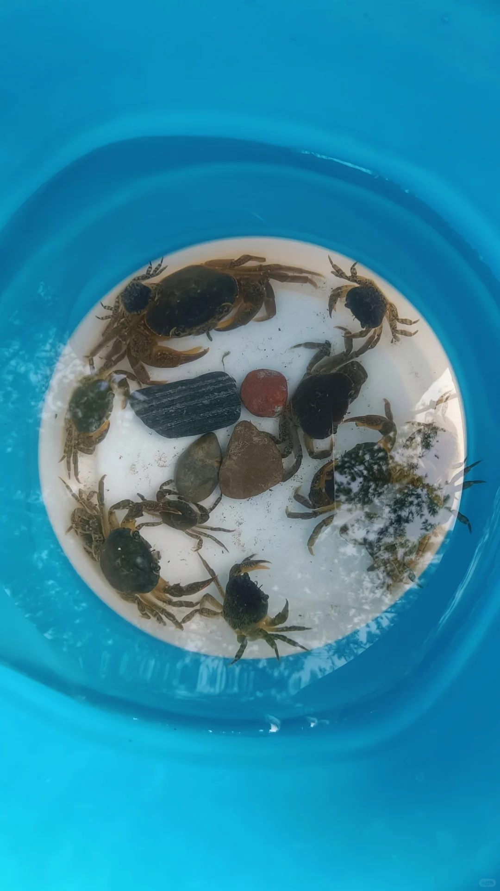
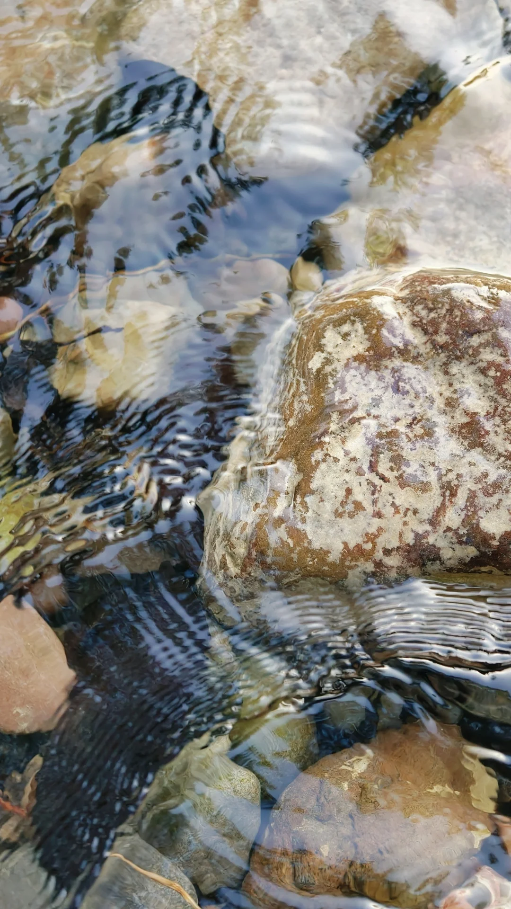
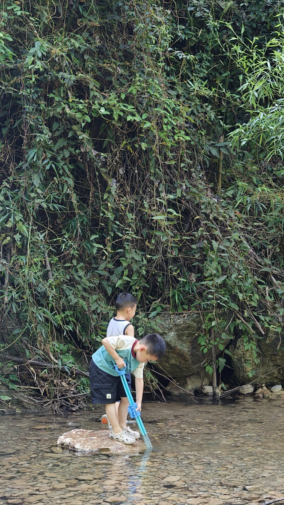
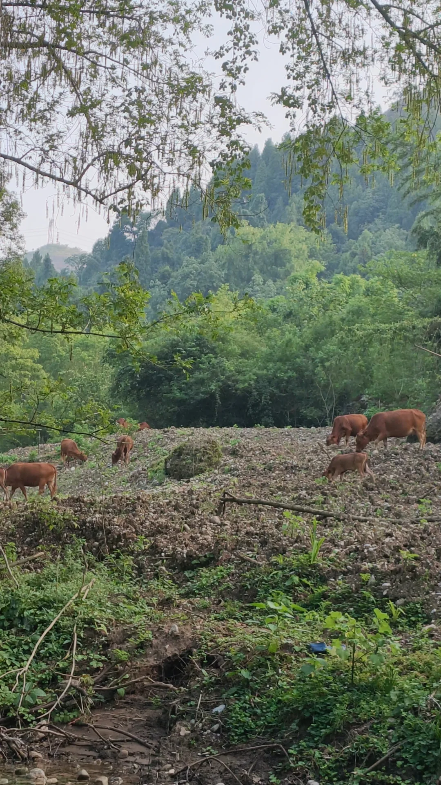
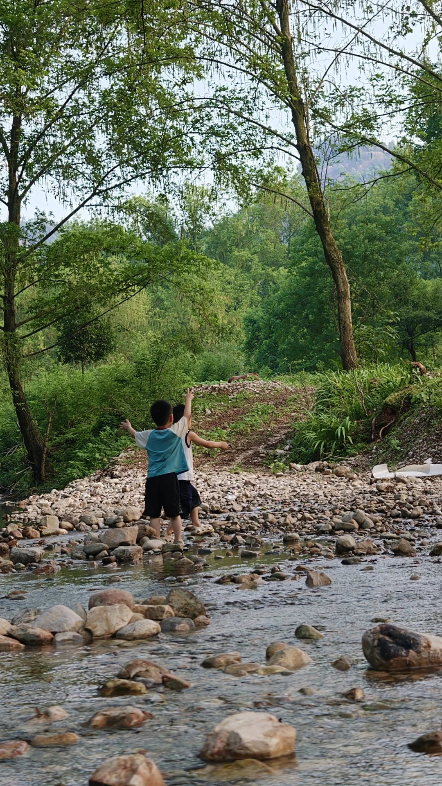

# 宜昌小朋友超适合玩的小溪

- 作者: Shirley思洁
- 👍32 · 💬9 · ⭐41 · 图 9
- feed_id: 6a605db5000000000f0052db

> [OCR] system

> [OCR] system

> [OCR] system

> [OCR] system

> [OCR] system

> [OCR] [?]

> [OCR] system

> [OCR] system

## 正文
夏天必须要玩水呀，发现这处超级适合小朋友玩的小溪，水浅，水清，有阴凉，人少，还有螃蟹小鱼和小虾，6点后山坡上还有小牛，非常治愈的画面啦，唯一的缺点就是蚊子有点多，记得多喷驱蚊水！
	
定位:点军柳林村三颗石
	
到了定位地车可以停了走上去，也可以选择有左手边的泥巴路，走到终点有个铁栅门，继续向前50米就看到小溪啦，底盘高的车子直接可以开到铁栅门，注意这条路很窄只能走一辆车，如果出现会车就要往后倒了
#标记我的玩水地图[话题]# #夏日溯溪[话题]# #宜昌[话题]# #抓螃蟹[话题]# #宜昌打卡[话题]#

---