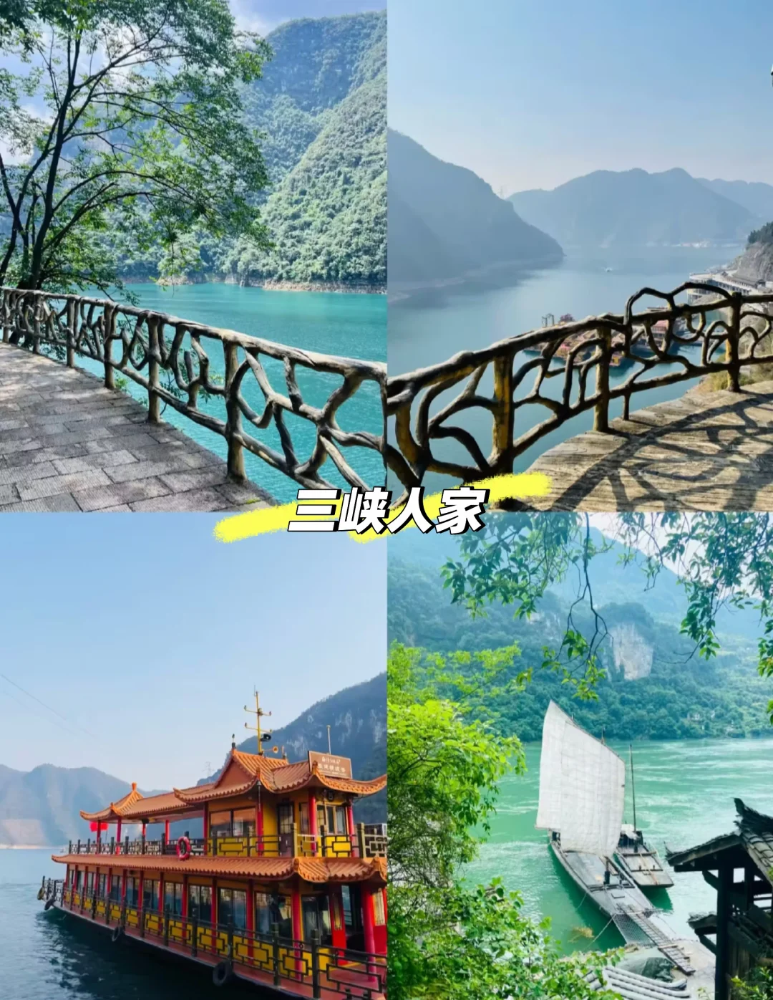
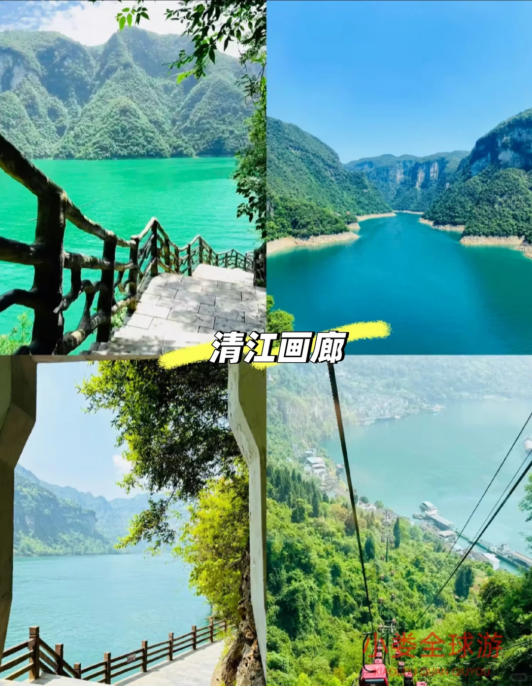
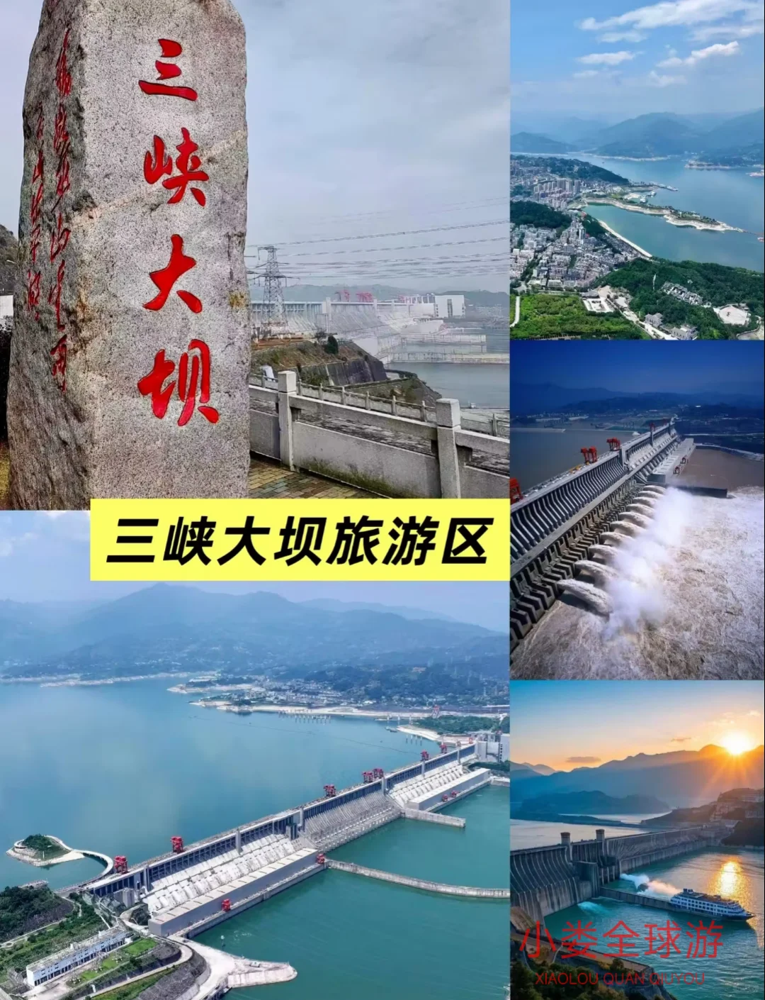
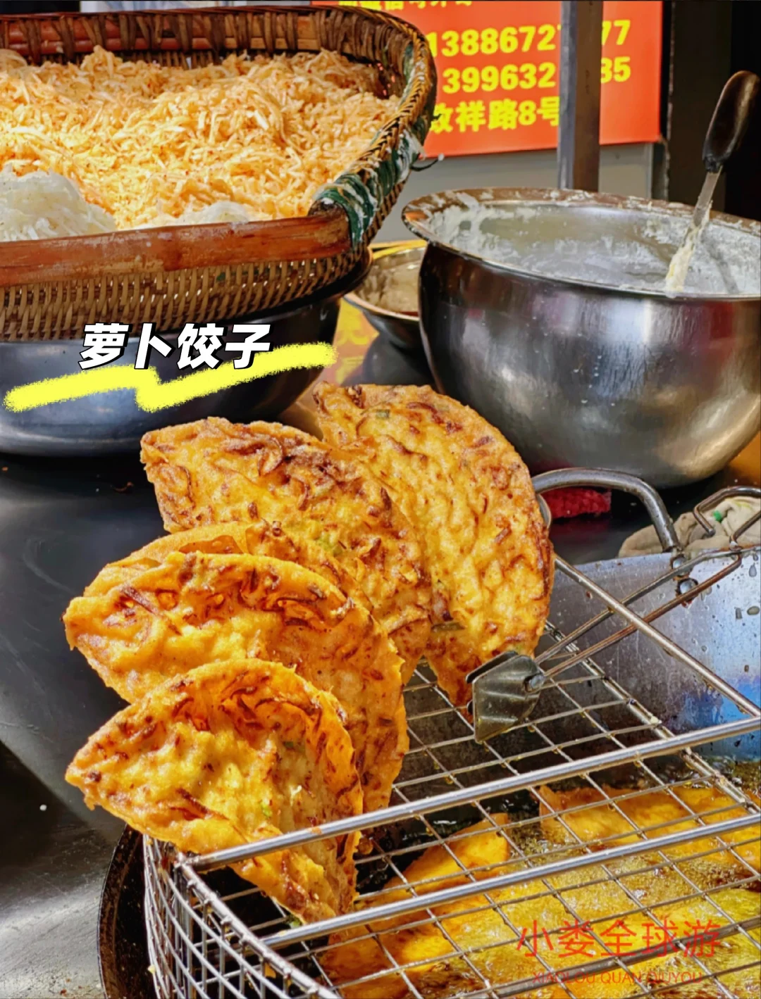

# 

- 作者: 小娄琪
- 👍32 · 💬 · ⭐30 · 图 8
- feed_id: 6913732f00000000070211d4

> [OCR] 三峡人家

> [OCR] 清江画廊
小娄全球游
XIÀO L?U QUÁN GI? YÓU

> [OCR] 三峡大坝
三峡大坝旅游区
小娄全球游
XIAOLOU QUAN QIUYOU

> [OCR] 三峡大坝
宜昌港
大国重器我自豪

> [OCR] [?]
[?]

> [OCR] 萝卜饺子
小娄全球游
XIAOLOU QUAN GUOYOU

> [OCR] 红油小面

> [OCR] 凉虾～
小娄全球游
XIAOLOU QUAN QIUYOU

## 正文
11月宜昌旅游攻略｜3天2晚人均800💰玩转三峡之都
终于打卡了心心念念的宜昌！这座被长江环抱的城市也太适合秋游了吧🍁
11月的天气不冷不热 20度左右超舒服
给大家整理了一份超全攻略 吃喝玩乐都安排上啦✨
🌟【出行篇】
1️⃣高铁直达超方便
武汉出发2h 重庆3.5h
建议选宜昌东站 离市区近打车10分钟
2️⃣市内交通超省钱
公交2元 滴滴起步价7元
建议买张公交卡 3天交通费不到50！
3️⃣必打卡景点交通
三峡大坝：旅游专线大巴30/人
清江画廊：建议包车200/天
🍁【玩乐篇TOP3】
🏆NO.1 三峡大坝
世界级工程太震撼了！
推荐买185观景台门票
可以看到全景 拍照绝绝子📸
🥈NO.2 清江画廊
坐船游览超惬意 水超清！
建议选上午场 雾气缭绕超仙
记得带外套 江风有点凉哦
🥉NO.3 三峡人家
民俗表演太有意思了
土家妹子跳舞超好看
还能体验打糍粑 超好玩！
美食：
TOP 1️⃣	萝卜饺子	胡姐萝卜饺子	江海路与东山大道交叉口	5块一个的快乐！，外皮酥到掉渣，里面萝卜丝辣fufu的，一口入魂！🤤
TOP 2️⃣	红油小面	北门老刘红油面馆	西陵区红星路2号	5块5 就能拿下的灵魂早餐！香迷糊的红油汤底，再加个蛋，立刻解锁“加蛋暴富”的隐藏菜单！🍜
TOP 3️⃣	凉虾	彭桂花凉虾	西陵区致祥路	5块钱 的续命神器！冰爽解辣，妥妥的压轴！🧊
💡 吃货的自我修养
除了上面三家，宜昌还有不少值得一试的面馆和特色菜，可以让您的觅食之旅更加丰富：
体验本地菜：如果想坐下来好好吃一顿地道的宜昌菜，可以前往自己人酒楼。您可以品尝到鲜美的白汤肥鱼或作为宜昌特色的萝卜饺子。
	
希望这份带着详细地址的“吃货地图”能帮你轻松打卡，尽情享受宜昌的美食！如果发现了其他宝藏小店，也记得告诉我哦～
💡小贴士：
1️⃣11月是淡季 酒店超便宜！推荐住万达附近
2️⃣记得带伞 偶尔会下雨
3️⃣学生证门票能打折！
这次旅行真的被宜昌圈粉了
既有壮丽山河 又有烟火气息
快收下这份攻略 约上姐妹出发吧～💕
#宜昌旅游 #三峡旅游 #秋冬旅行计划 #小众旅行地 #旅行攻略11月来宜昌真的太舒服啦！🍂 20℃的天气刚刚好，三峡的秋色美到窒息~ 3天2晚人均800就能玩得超尽兴！🚄高铁直达超方便，武汉2h重庆3.5h就能到。必打卡三峡大坝、清江画廊，坐船看山水超治愈~ 美食推荐当地特色，人均十元不到尝尝鲜！🏨淡季酒店超划算，学生证还能打折！快收下这份攻略，约上闺蜜来场说走就走的旅行吧~✨ #宜昌旅游 #三峡攻略[话题]# #宜昌旅游[话题]#

---