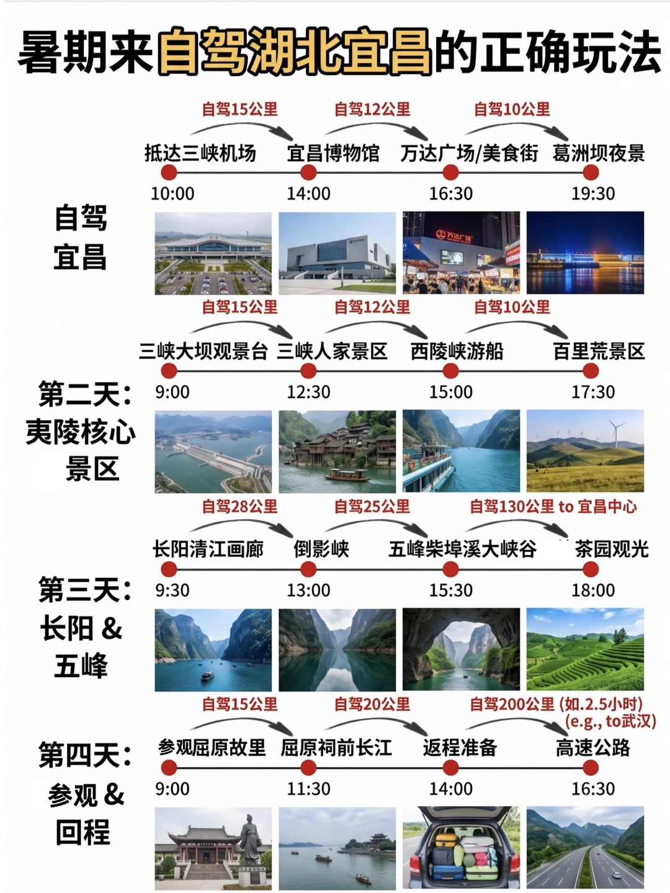
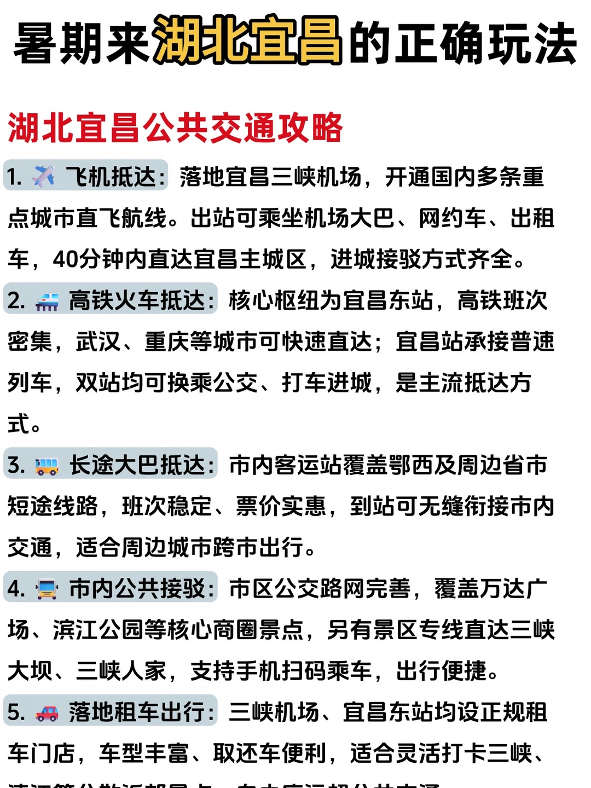
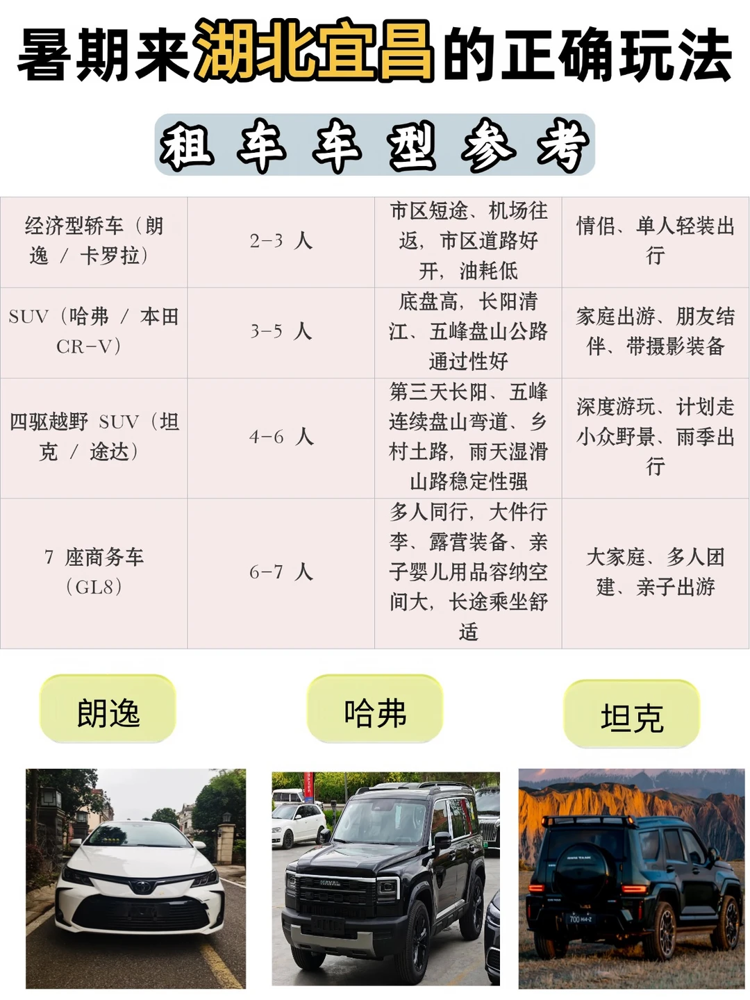
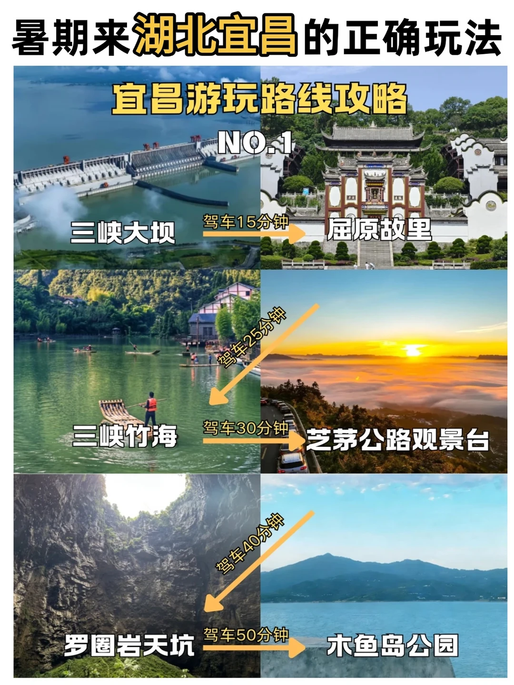
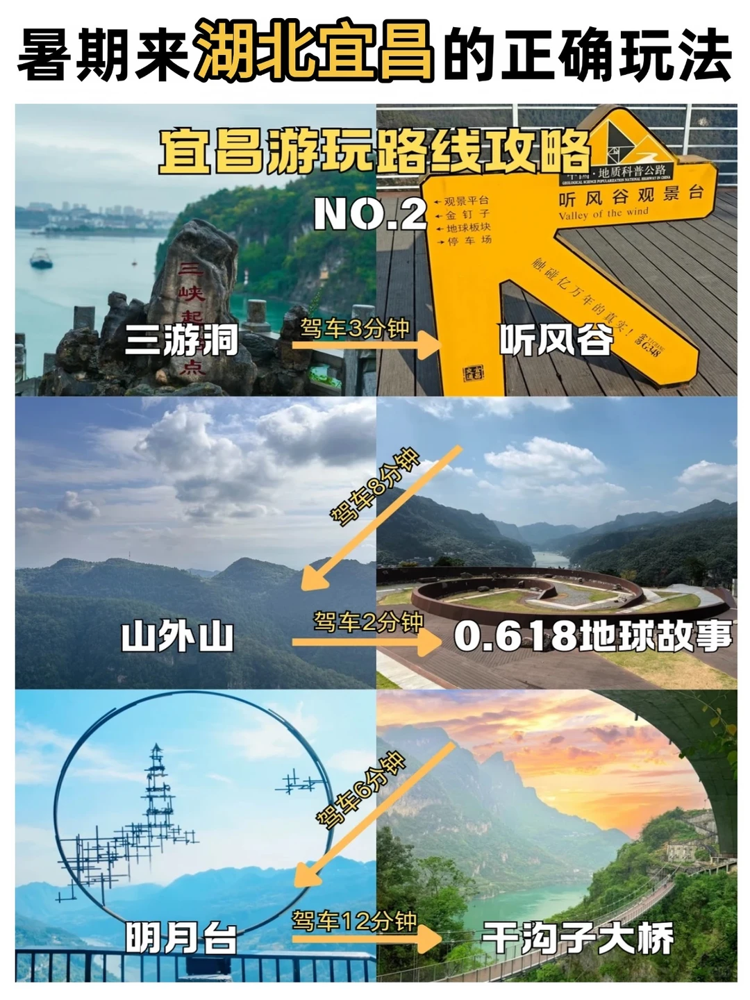

# 暑期来宜昌旅游，这座江边小城真的太舒服了

- 作者: 小驼城市探路版
- 👍32 · 💬 · ⭐32 · 图 5
- feed_id: 6a4503310000000008024acc

> [OCR] 暑期来自驾湖北宜昌的正确玩法

自驾15公里
抵达三峡机场 10:00
自驾12公里
宜昌博物馆 14:00
自驾10公里
万达广场/美食街 16:30
葛洲坝夜景 19:30

自驾
宜昌

第二天：
夷陵核心景区

自驾28公里
三峡大坝观景台 9:00
自驾12公里
三峡人家景区 12:30
自驾10公里
西陵峡游船 15:00
百里荒景区 17:30

第三天：
长阳 & 五峰

自驾25公里
倒影峡 13:00
自驾130公里 to 宜昌中心
五峰柴埠溪大峡谷 15:30
茶园观光 18:00

第四天：
参观 & 回程

自驾15公里
长阳清江画廊 9:30
自驾20公里
屈原祠前长江 11:30
返程准备 14:00
高速公路 16:30

> [OCR] 暑期来湖北宜昌的正确玩法

湖北宜昌公共交通攻略

1. 飞机抵达：落地宜昌三峡机场，开通国内多条重点城市直飞航线。出站可乘坐机场大巴、网约车、出租车，40分钟内直达宜昌主城区，进城接驳方式齐全。

2. 高铁火车抵达：核心枢纽为宜昌东站，高铁班次密集，武汉、重庆等城市可快速直达；宜昌站承接普速列车，双站均可换乘公交、打车进城，是主流抵达方式。

3. 长途大巴抵达：市内客运站覆盖鄂西及周边省市短途线路，班次稳定、票价实惠，到站可无缝衔接市内交通，适合周边城市跨市出行。

4. 市内公共接驳：市区公交路网完善，覆盖万达广场、滨江公园等核心商圈景点，另有景区专线直达三峡大坝、三峡人家，支持手机扫码乘车，出行便捷。

5. 落地租车出行：三峡机场、宜昌东站均设正规租车门店，车型丰富、取还车便利，适合灵活打卡三峡、清江等分散旅游景点，在市内远距离公共交通

> [OCR] 暑期来湖北宜昌的正确玩法
租车车型参考

经济型轿车（朗逸 / 卡罗拉）
2-3 人
市区短途、机场往返，市区道路好开，油耗低
情侣、单人轻装出行

SUV（哈弗 / 本田 CR-V）
3-5 人
底盘高，长阳清江、五峰盘山公路通过性好
家庭出游、朋友结伴、带摄影装备

四驱越野 SUV（坦克 / 途达）
4-6 人
第三天长阳、五峰连续盘山弯道、乡村土路，雨天湿滑山路稳定性强
深度游玩、计划走小众野景、雨季出行

7 座商务车（GL8）
6-7 人
多人同行，大件行李、露营装备、亲子婴儿用品容纳空间大，长途乘坐舒适
大家庭、多人团建、亲子出游

朗逸
哈弗
坦克

> [OCR] 暑期来湖北宜昌的正确玩法
宜昌游玩路线攻略
NO.1
三峡大坝
驾车15分钟
屈原故里
三峡竹海
驾车25分钟
芝茅公路观景台
罗圈岩天坑
驾车40分钟
木鱼岛公园

> [OCR] 暑期来湖北宜昌的正确玩法

宜昌游玩路线攻略
NO.2
三游洞
驾车3分钟
听风谷
山外山
驾车8分钟
0.618地球故事
驾车2分钟
明月台
驾车6分钟
干沟子大桥
驾车12分钟

## 正文
提到宜昌，很多人第一反应就是三峡大坝。但真正来了才发现，这里山水和烟火气结合得刚刚好，适合慢慢逛、慢慢吃。
📍必打卡景点
三峡大坝：国之重器，亲眼看到还是很震撼的。登坛子岭俯瞰全景，185观景台与坝顶齐平，随手拍都很大气。景区门票免费（需带身份证），接驳车35元。
三峡人家：5A级景区，依山傍水的吊脚楼很有味道。龙津溪看猕猴嬉戏、渔家撒网，还能参与土家婚嫁民俗表演，沉浸感很强。
清江画廊：八百里清江美如画。乘船穿行在倒影峡、仙人寨之间，两岸青山如黛，碧水澄澈。土家山歌和南曲一路相伴。
市区漫游：傍晚去滨江公园看日落，江面浮光跃金很治愈。二马路历史文化街区承载百年商埠记忆，适合慢慢逛。
🚗自驾贴士
G348三峡风景公路被不少自驾玩家称为长江最美驾车线路。沿途设有听风谷、明月台等多个免费停车观景平台。全程免费，景色不输收费景区。部分路段坡陡弯多，建议春秋季前往。
宜昌共有72家A级景区（其中5A级4家），选择很丰富。市内公交方便，去周边景点建议自驾或包车。
🍜地道美食
红油包子：宜昌早餐“顶流”，日销量超30万份。面皮劲道，馅料麻辣，一口下去满嘴红油汤汁。推荐胡记包子、仙一品。
宜昌肥鱼：明朝皇家贡品，鱼肉嫩滑无刺，奶白鱼汤鲜到舔锅。价格约90-110元/斤，本地人常去楚韵小镇、憨哥鱼庄。想体验特别的可以去三游洞旁的悬崖餐厅。
街头小吃：萝卜饺子外酥里糯；凉虾滑糯清爽，是夏日消暑神器；炕土豆撒上辣椒粉和酸萝卜丁，一口一个停不下来。
宜昌是一座适合放慢脚步感受的城市，有机会值得专门去一趟。
#宜昌旅游[话题]#  #宜昌美食[话题]#  #三峡大坝[话题]#  #清江画廊[话题]#  #三峡人家[话题]#  #自驾游[话题]#  #湖北周边游[话题]#

---