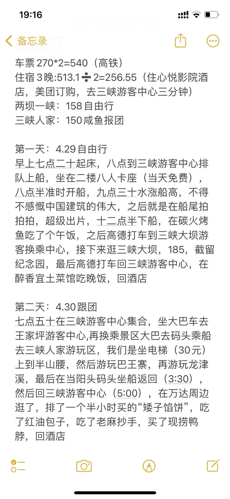
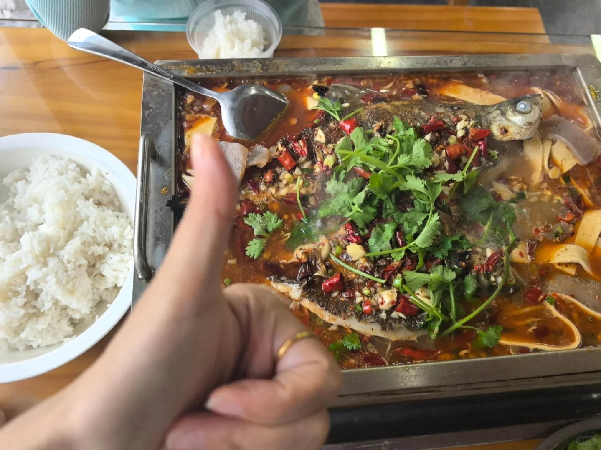
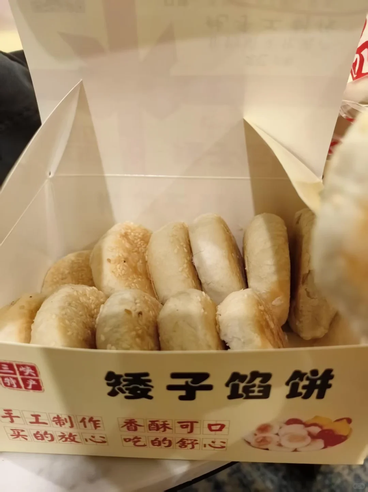
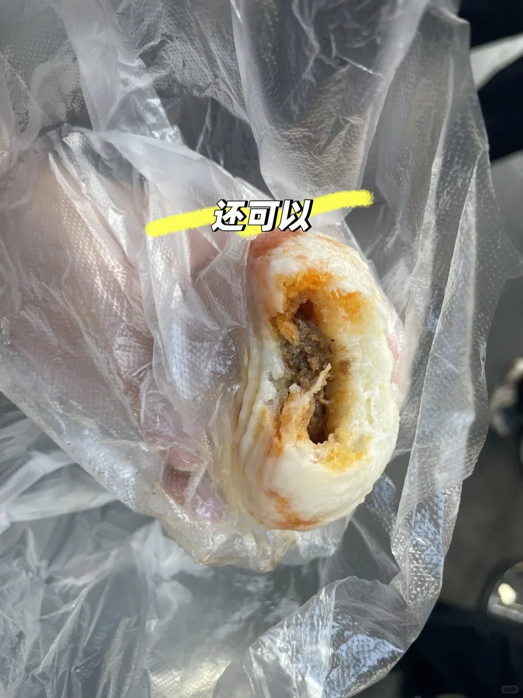
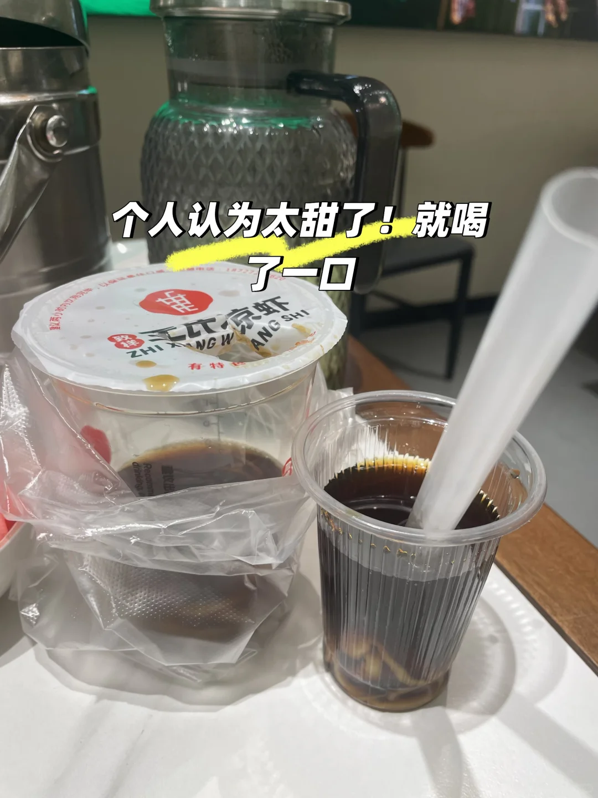

# 宜昌两日游

- 作者: 加减
- 👍31 · 💬2 · ⭐36 · 图 10
- feed_id: 6a09a530000000000803c7d6

> [OCR] 车票 270*2=540（高铁）
住宿 3晚:513.1÷2=256.55（住心悦影院酒店,美团订购，去三峡游客中心三分钟)
两坝一峡：158自由行
三峡人家：150咸鱼报团

第一天：4.29自由行
早上七点二十起床，八点到三峡游客中心排队上船，坐在二楼八人卡座（当天免费），八点半准时开船，九点三十分水涨船高，不得不感慨中国建筑的伟大，之后就是在船尾拍拍拍拍，超级出片，十二点半下船，在碳火烤鱼吃了个午饭，之后高德打车到三峡大坝游客换乘中心，接下来逛三峡大坝，185，截留纪念园，最后高德打车回三峡游客中心，在醉香宜土菜馆吃晚饭，回酒店

第二天：4.30跟团
七点五十在三峡游客中心集合，坐大巴车去王家坪游客中心,再换乘景区大巴去码头乘船去三峡人家游玩区，我们是坐电梯（30元）上到半山腰，然后游玩巴王寨，再游玩龙津溪，最后在当阳头码头坐船返回(3:30)，然后回三峡游客中心(5:00)，在万达周边逛了，排了一个半小时买的“矮子馅饼”，吃了红油包子，吃了老麻抄手，买了现捞鸭脖，回酒店

> [OCR] THIS IS MY DOG

> [OCR] 大拇指👍

> [OCR] 现捞鸭脖
宜昌·万达店
王七
可以
宜佳篷业
15629359399
招聘
边架网推一名
营业员一名
工作时间：
18:00-14:52
[?] [?] 鸭脖 鸭翅 鸭肝 鸭腿
鸭架 35元/斤
鸭头鸡腿鸡翅尖 38元/斤
鸭爪 45元/斤
莲藕………15元/斤
黄瓜………12元/斤
土豆………12元/斤
海带………15元/斤
西兰花……20元/斤
豆芽………20元/斤
石花菜……15元/斤
豆皮………12元/斤
花生………15元/斤
兔头………15元/个
田螺………15/20元/份
芸豆………20元/斤
魔芋干……45元/斤
鸭肠…………60元/斤
鸭菌把………60元/斤
牛肉………95元/斤
猪尾巴………90元/斤
猪肚………90元/斤
牛筋………95元/斤
猪蹄………50元/斤
猪舌头………60元/斤
排骨………60元/斤
猪耳朵………50元/斤
脑花………15元/个

> [OCR] 大拇指👍
红豆居家
矮子馅饼
程记

> [OCR] 三峡特产
矮子馅饼
手工制作 买的放心 香酥可口 吃的舒心

> [OCR] 大拇指👍

> [OCR] 大拇指👍

> [OCR] 还可以

> [OCR] 个人认为太甜了！就喝了一口
ZHI XING WANG SHI

## 正文
#旅游攻略[话题]# #宜昌旅游[话题]# #特种兵旅行[话题]# #吃遍美食[话题]#

---