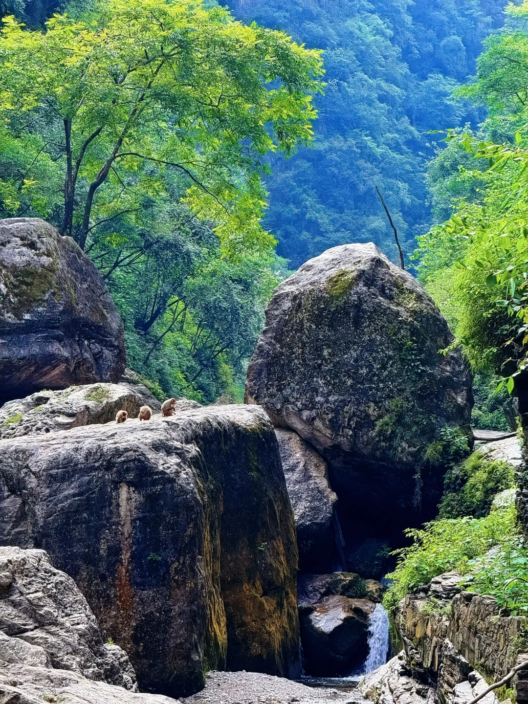
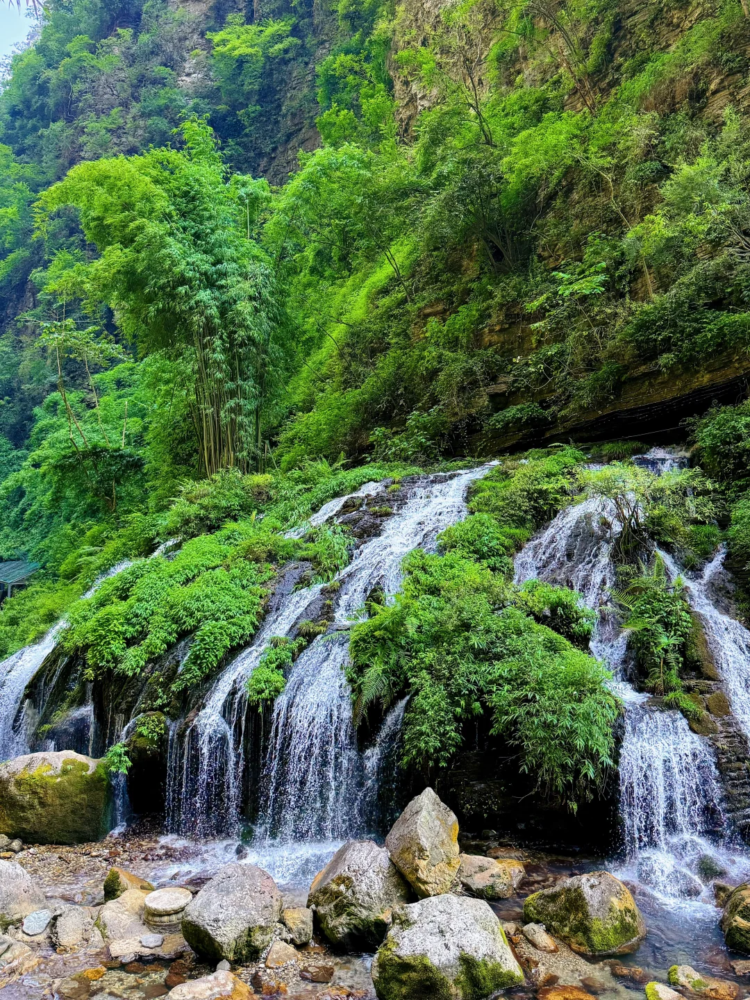
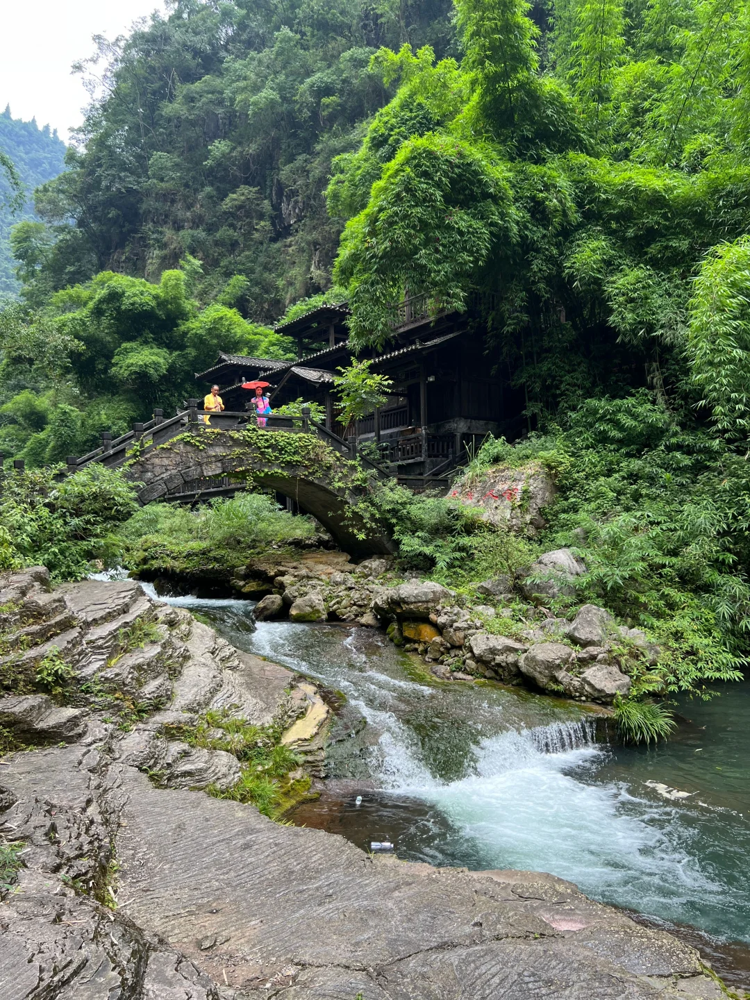
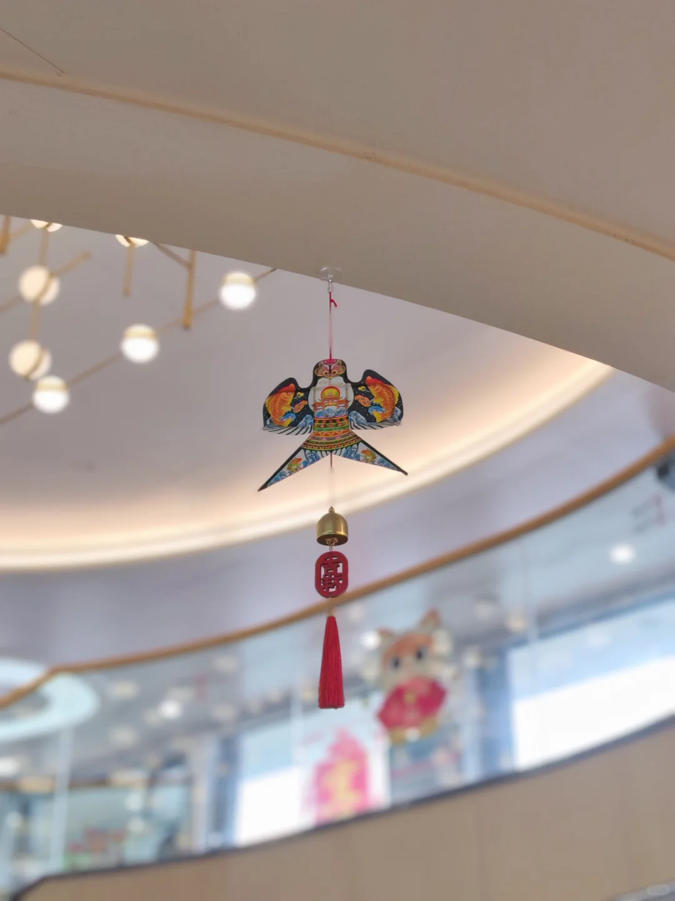

# 逃离酷暑！快来26℃三峡人家避暑

- 作者: 柠檬🍋
- 👍30 · 💬18 · ⭐27 · 图 5
- feed_id: 6a7193b50000000022030236

> [OCR] system

> [OCR] [?]

> [OCR] 小红书

## 正文
武汉最近温度真的好高，周末到三峡人家温度太太太舒服了❄️
	
🗺️一日游不绕路路线（亲测5-6h）
三峡人家游客中心王家坪换乘中心→景区大巴→胡金滩码头→渡船过江→龙津溪→黄龙瀑→婚嫁楼看土家婚嫁→峡江号子→巴王寨→茶盐古道→太极猫洞→返程
	
🌊核心避暑点位
✔龙津溪·亲水平台：
林荫全覆盖不晒，溪水清到能看见底，浅滩能直接踩水溯溪，好多带娃捞鱼抓螃蟹。栈道平坦适合慢慢逛，累了就在溪边石凳上坐着泡脚放空，山野慢生活✅
	
✔黄龙瀑：
飞瀑水雾站边上瞬间降温❄️去的时候是晴天还看到了彩虹~全程平缓观景步道不费力，记得要去📸嘎嘎出片儿~
	
✔太极猫洞：
恒温的天然溶洞！从室外高温一步入洞暑气全消。喀斯特地貌钟乳石造型奇特，洞内步道平缓不用高强度登山，全龄友好～
	
🎭🆓民俗表演（看好时间表哈）
✔巴王寨·土家歌舞：
360°环形实景大舞台，摆手舞、茅古斯原汁原味。演出时间11:30、13:30、14:30
	
✔婚嫁楼·土家婚嫁：
完整哭嫁表演+抛绣球，能上台当“新郎”。在龙津溪附近，👆🏻场次很多~
	
✔峡江号子：
国家级非遗，江上木帆船实景演出，雄浑号子响彻峡谷还原原生船工场景，场次很多~
	
✔茶盐古道：
千年巴楚商贸原址复原，沿路皮影戏、南曲、三棒鼓边走边看~这里很多吊脚楼，可以穿民族服饰来打卡😃😃😃
	
⚠️避坑提醒
❶一定要穿防滑鞋！青石板路多
❷带驱蚊液！溪边植被茂密
❸末班渡船17:00左右注意时间哈
❹15:30停止售票！早点出发
❺景区内有15R平价快餐带瓶水就够了
	
📍地址：宜昌夷陵区三斗坪镇三峡人家风景区
🎫门票：
成人套票210r（门票150往返换乘30渡船30）
学生/60-69岁老人135r，70岁+免门票
⏰开放：旺季8:00-17:30，15:30停止售票
🚗交通：自驾导航“三峡人家游客中心（王家坪）”，停车15r/天；公交夷陵广场坐10-1路直达
	
#三峡人家[话题]# #三峡人家旅游攻略[话题]# #宜昌旅游[话题]# #暑假去哪儿玩[话题]# #湖北周边游[话题]# #清凉一夏[话题]# #旅游万粉扶持计划[话题]##避暑[话题]##旅游[话题]#

---