# 宜昌两日游怎么安排？详细细节看这里！

- 作者: 旺仔小喵头🐱🐭
- 👍30 · 💬16 · ⭐49 · 图 12
- feed_id: 6a660bea000000001f01ca73

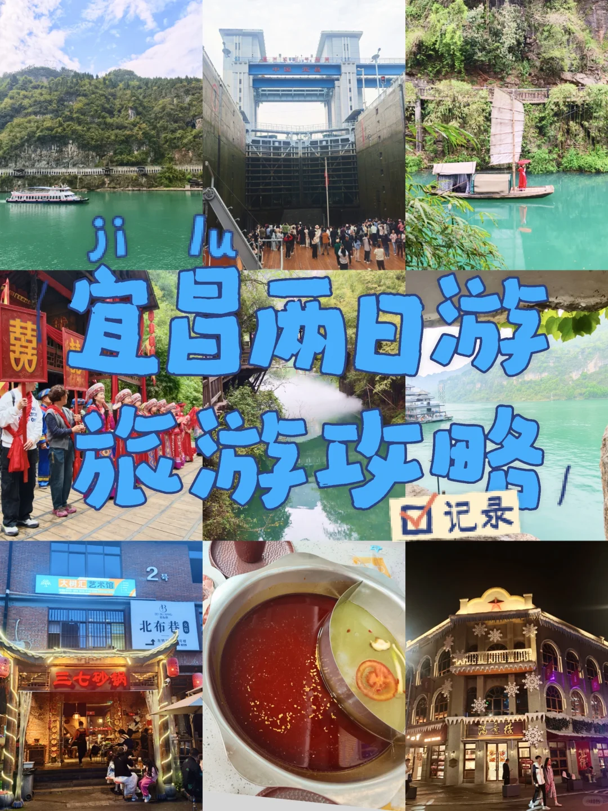
> [OCR] ji lu
宜昌两日游
旅游攻略
记录
2号
北布巷
三七砂锅
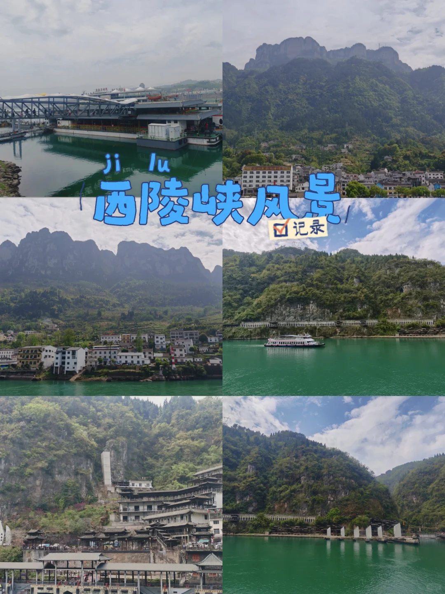
> [OCR] ji lu
西陵峡风景
记录
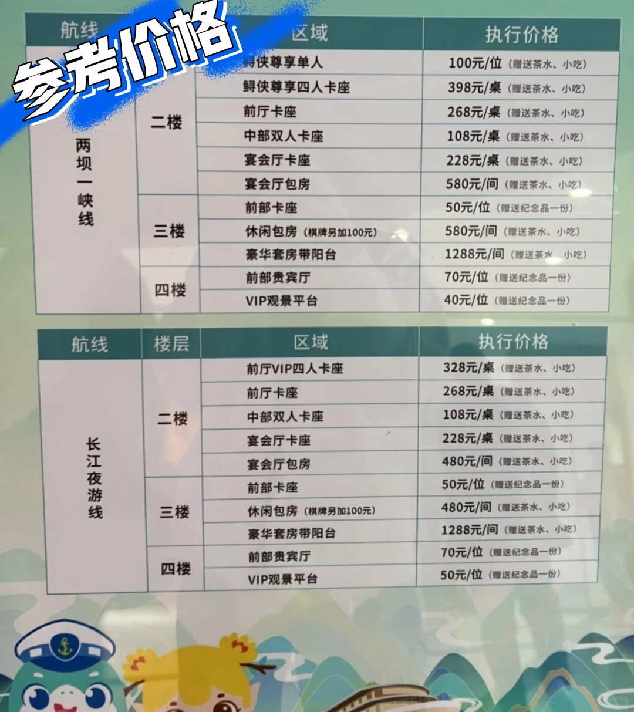
> [OCR] 两坝一峡线
航线
区域
执行价格

参考价格
二楼
鲟侠尊享单人
100元/位（赠送茶水、小吃）
前厅卡座
268元/桌（赠送茶水、小吃）
中部双人卡座
108元/桌（赠送茶水、小吃）
宴会厅卡座
228元/桌（赠送茶水、小吃）
宴会厅包房
580元/间（赠送茶水、小吃）
三楼
前部卡座
50元/位（赠送纪念品一份）
休闲包房(棋牌另加100元)
580元/间（赠送茶水、小吃）
豪华套房带阳台
1288元/间（赠送茶水、小吃）
四楼
前部贵宾厅
70元/位（赠送纪念品一份）
VIP观景平台
40元/位（赠送纪念品一份）

长江夜游线
航线
楼层
区域
执行价格

二楼
前厅VIP四人卡座
328元/桌（赠送茶水、小吃）
前厅卡座
268元/桌（赠送茶水、小吃）
中部双人卡座
108元/桌（赠送茶水、小吃）
宴会厅卡座
228元/桌（赠送茶水、小吃）
宴会厅包房
480元/间（赠送茶水、小吃）
三楼
前部卡座
50元/位（赠送纪念品一份）
休闲包房(棋牌另加100元)
480元/间（赠送茶水、小吃）
豪华套房带阳台
1288元/间（赠送茶水、小吃）
四楼
前部贵宾厅
70元/位（赠送纪念品一份）
VIP观景平台
50元/位（赠送纪念品一份）
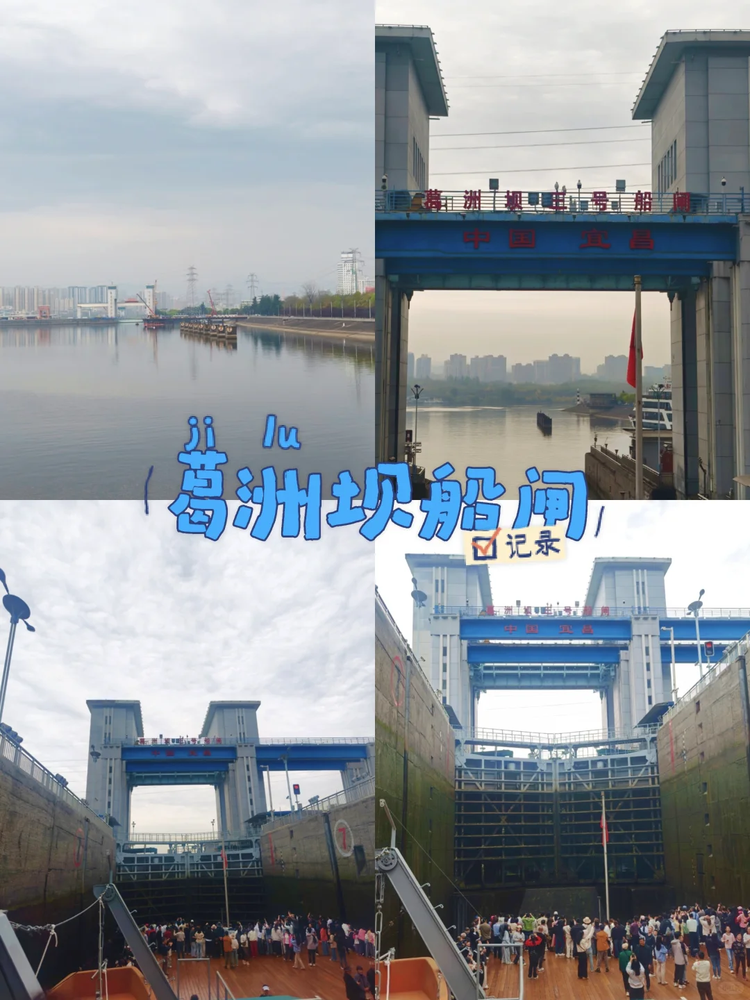
> [OCR] 葛洲坝船闸
中国宜昌
葛洲坝船闸
记录
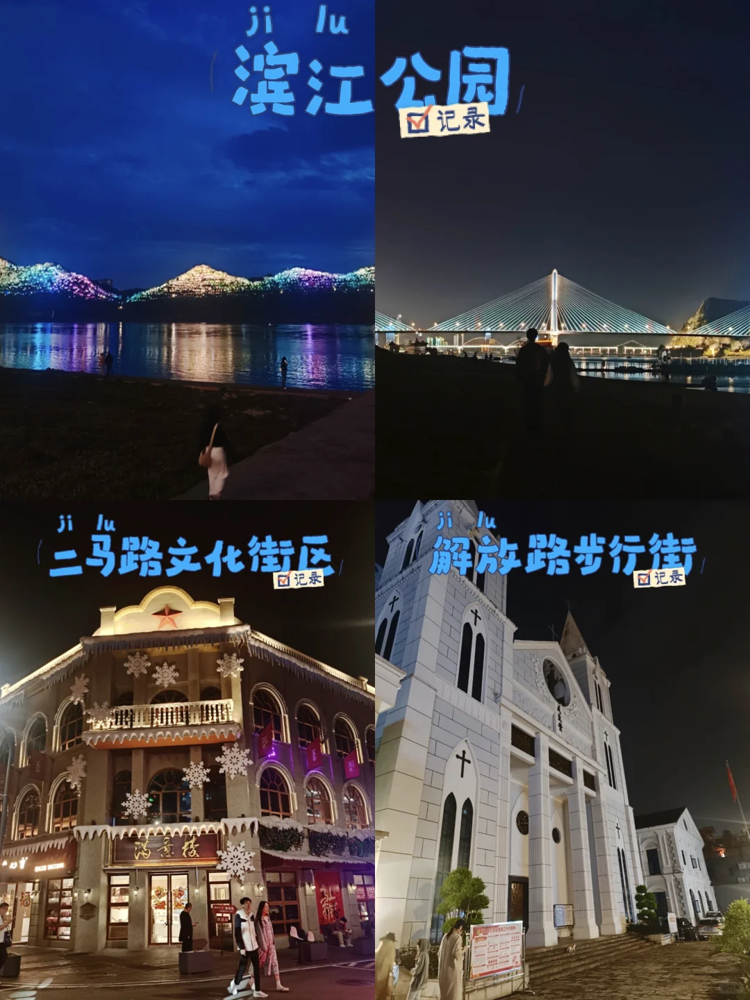
> [OCR] 滨江公园
记录

二马路文化街区
记录

解放路步行街
记录
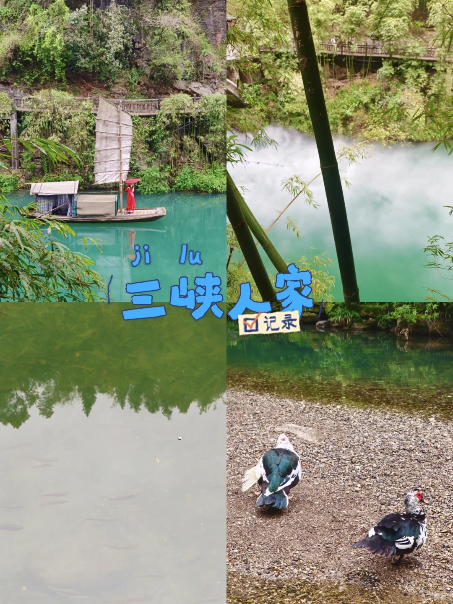
> [OCR] ji lu
三峡人家
记录
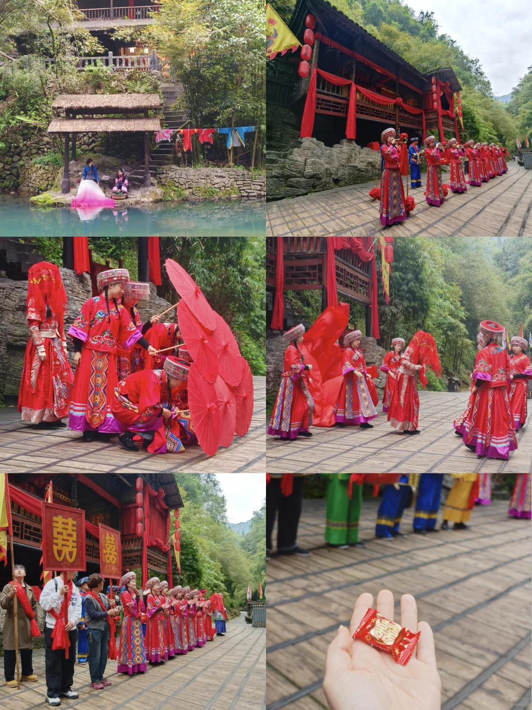
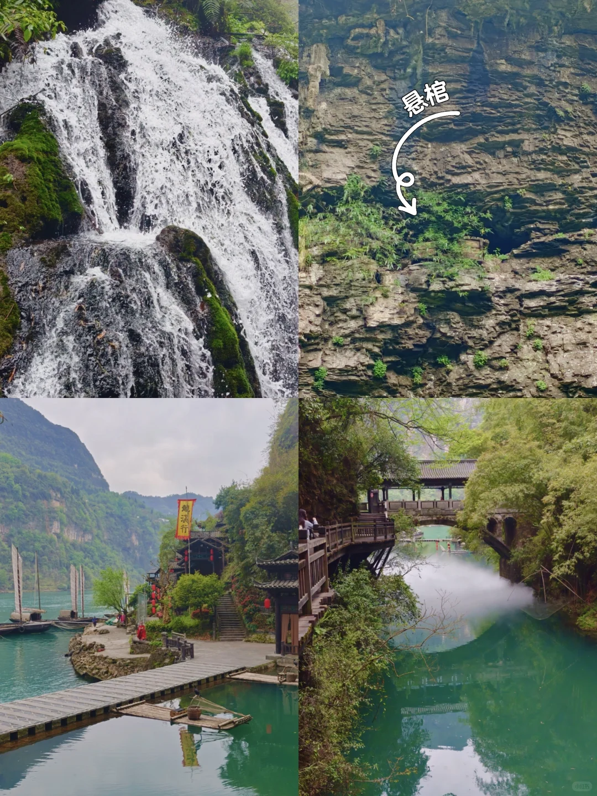
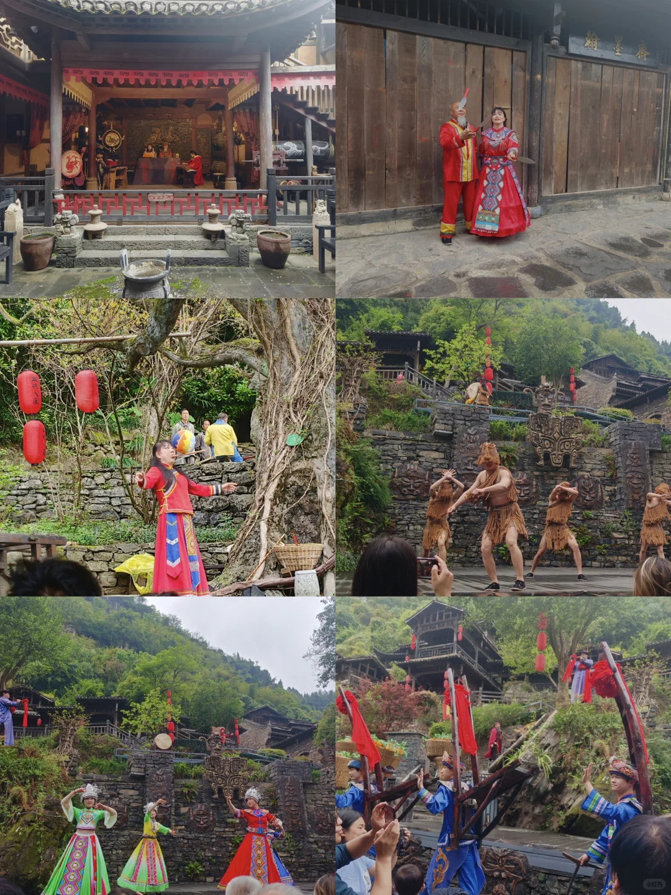
> [OCR] [?]
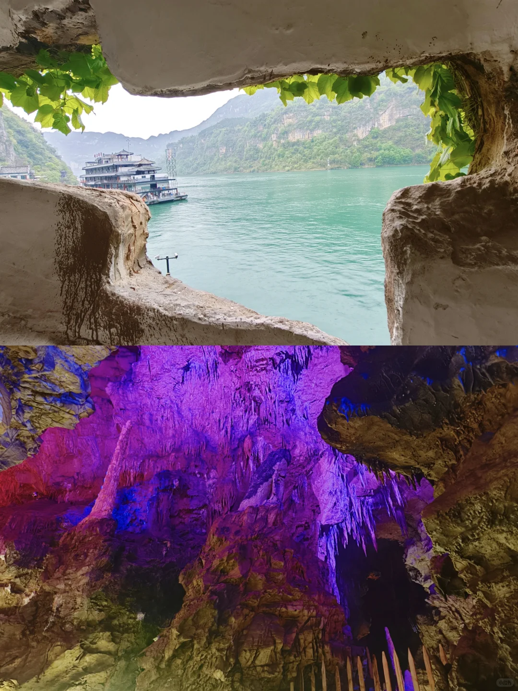
> [OCR] 小红书
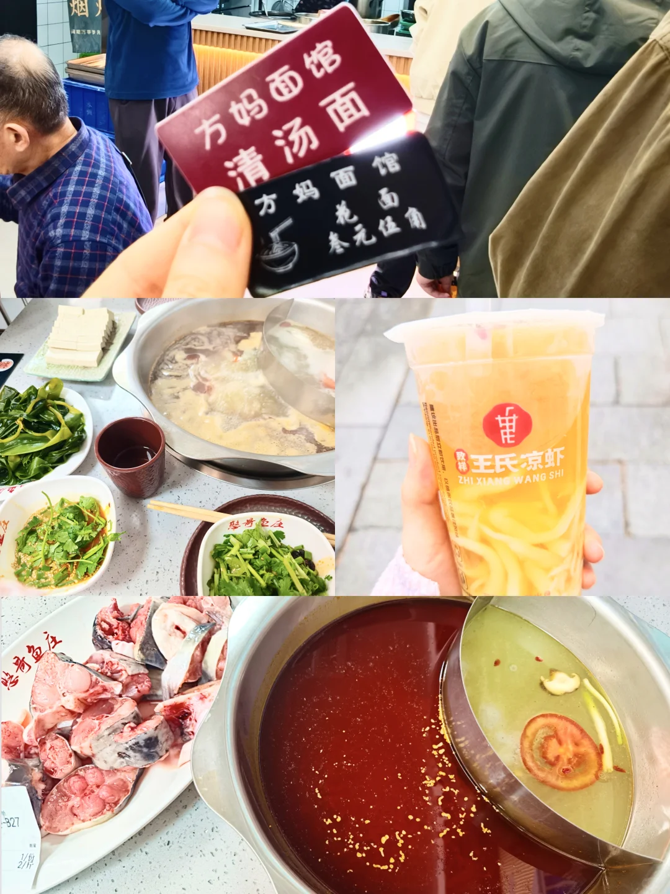
> [OCR] 方妈面馆
清汤面

方妈面馆
花面
叁元伍角

王氏凉虾
ZHI XIANG WANG SHI
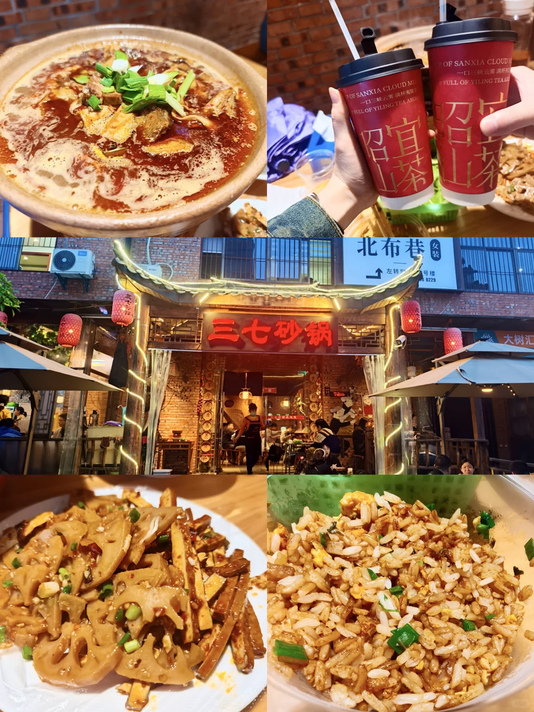
> [OCR] 一口三峡云雾满杯茶香
招宜山茶
北布巷女装
大树汇
三七砂锅

## 正文
宜昌两天一夜怎么玩，吃点什么？给大家分享一下我的旅游规划~
	
❤️旅行篇❤️
Day 1   两坝一峡🌉
我们早上坐高铁抵达宜昌。中午吃过饭，从西陵区打车前往三斗坪港，途中会经过G348最美公路，车程约1h。
根据发船时间，我们距发船前1h到达港口，排队检票，随后陆续上船。
	
1️⃣观赏西陵峡风光🚢
船内一楼是密闭空间，需要占座（免费），其余收费标准可参考p3
⚠️二楼最便宜的卡座数量很少，先到先🉐
我们最后只剩4楼观景平台，那里视野开阔，船开起来的时候非常凉爽👍🏻。
tips：船上会有免费拍照📸但照片打印还要花💰
2️⃣葛洲坝船闸⛴️
水涨船高寓意比较好，节假日要提前购票！
我们坐了降船机，从高水位降到低水位，亲身感受了三峡工程的震撼！
最终到站点是三峡游客中心。
	
游船全程大约3h，可以提前备点零食，边吃边看风景，很惬意～
	
3️⃣滨江公园
4️⃣解放路步行街+二马路文化街区
这三个景点离得很近，可以一起逛完，感受宜昌夜晚的自然和人文风光🌃
	
Day 2   三峡人家
在清江画廊和三峡人家之间纠结了半天[抓狂R]，还是选了推荐更多的三峡人家[哇R]。
直接买套票，包含往返船票和景区内中转票。
	
三峡人家真的太太太太好玩了！
沿途移步换景，处处藏着精心设计的场景！[赞R]时而是船夫悠然撑篙，时而是浣衣妇人俯身江边，水波轻漾间，笛声隐约从江面飘来……仿佛真的走进了三峡人家的旧时光里☺️☺️
沉浸式表演也有很多（具体看时间表）。
演员会热情地拉你互动，像是被拽进了当地人的故事里[派对R][派对R]
tips：景区里有很多私人小店，卖的冰箱贴便宜又好看，物美价廉～
	
❤️饮食篇❤️
1️⃣方妈面馆
品尝特色花面！
2️⃣憨哥鱼庄
宜昌肥鱼真的超级鲜美细嫩😋😋
晚上结束大约17:15排队，一个小时差不多就叫号了（很多过号的）人真的超级多
3️⃣王氏凉虾
很奇怪的口感，第一次吃，红糖的和桂花的都还不错！
4️⃣三七砂锅
当地的必吃榜了[吧唧R]我们点了牛肉砂锅，炒饭和卤味拼盘
砂锅味道麻麻辣辣的，还不错，但一定要搭配饮品解辣[捂脸R][捂脸R]！
5️⃣昭宜山茶
点了推荐款，昭宜山茶和宜红故事，个人更喜欢昭宜山茶[害羞R][害羞R]
6️⃣红油肉包
	
总之，两天时间较为紧张，景区之间比较分散，还有些景点没逛到，只能下次去探索啦~
#宜昌[话题]# #宜昌美食[话题]# #三峡[话题]# #三峡人家[话题]# #宜昌旅游[话题]# #宜昌肥鱼[话题]# #三峡游[话题]# #葛洲坝[话题]# #西陵峡[话题]# #武汉周边游[话题]#

---