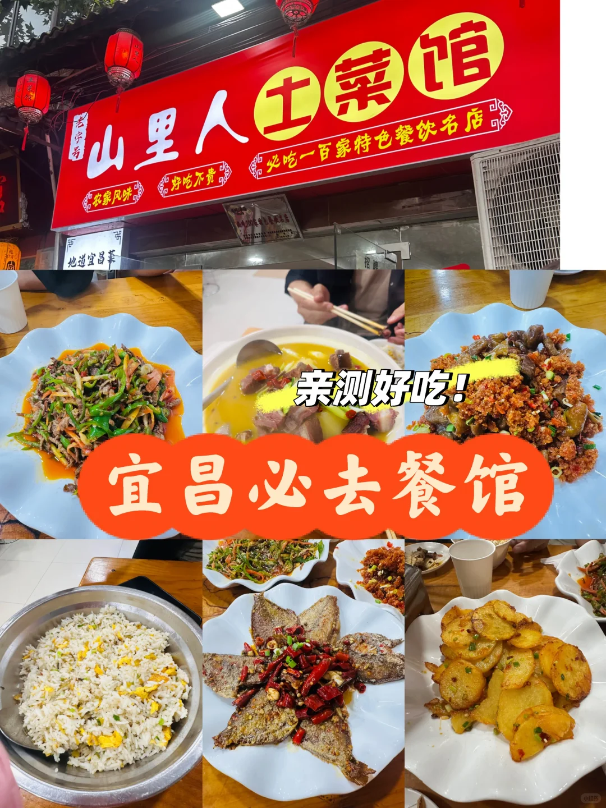
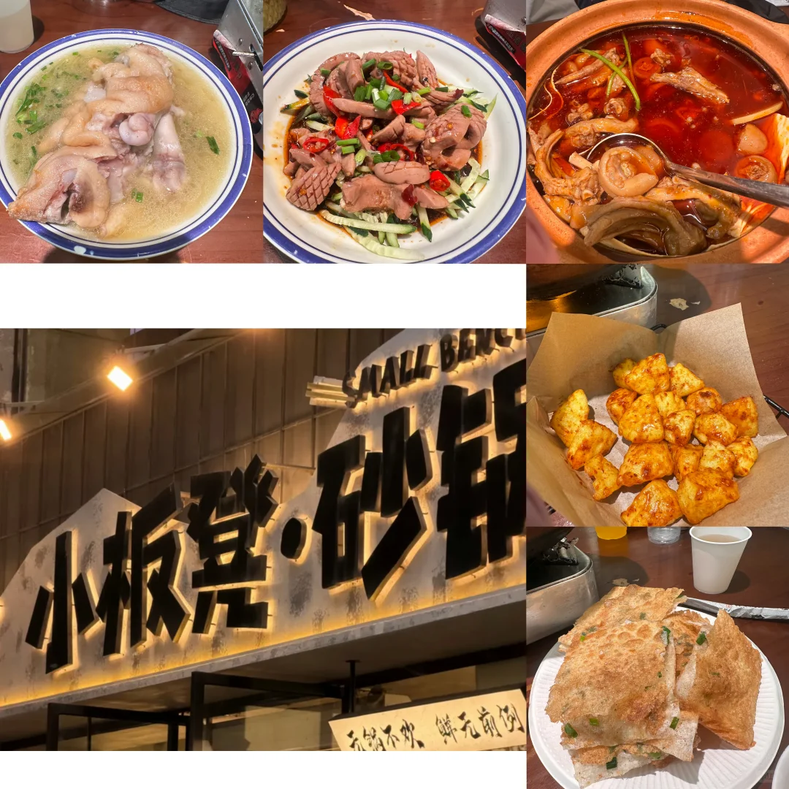
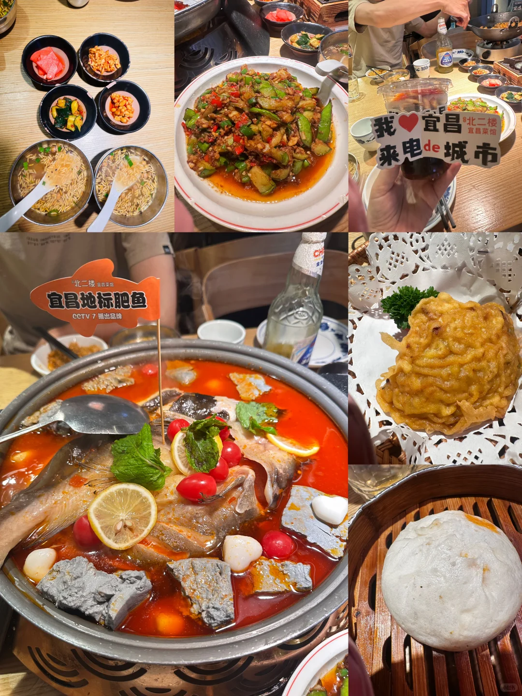
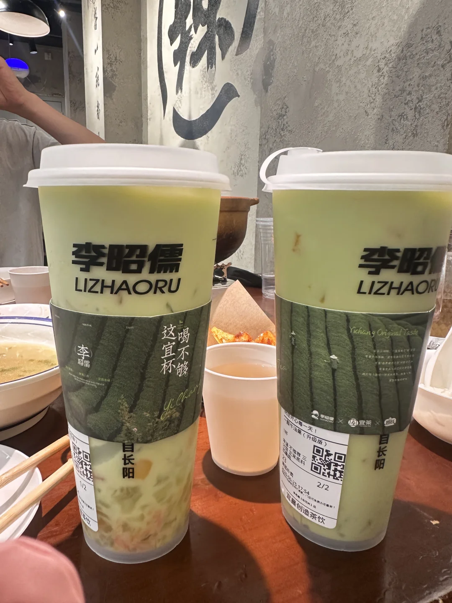
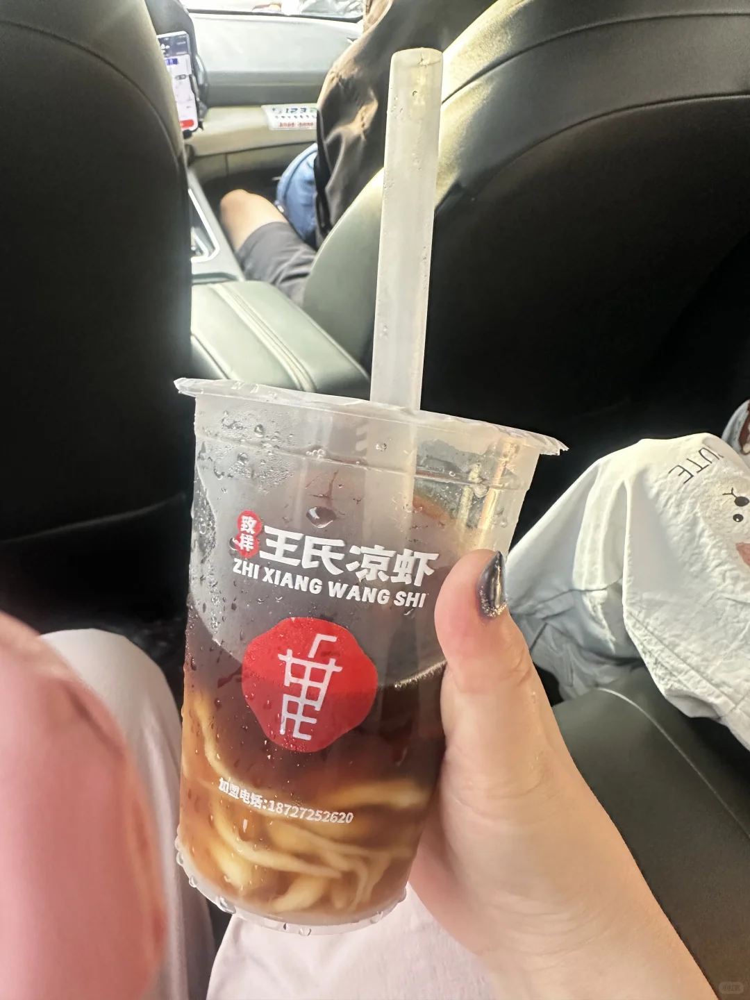

# 宜昌真是太好吃了！

- 作者: 馨梦然
- 👍30 · 💬 · ⭐25 · 图 5
- feed_id: 6a408254000000001c025b63

> [OCR] 山里人土菜馆
好吃不贵
农家风味
地道宜昌菜
亲测好吃！
宜昌必去餐馆

> [OCR] 小板凳·砂锅
不锅不吹 鲜无前例

> [OCR] 我❤宜昌来电de城市
北二楼 宜昌菜馆
宜昌地标肥鱼
CCTV 7 播出品牌

> [OCR] 李昭儒
LIZHAORU
喝不够
这宜杯
自长阳
Yichang Original Taste
1/2
2/2

> [OCR] 致祥王氏凉虾
ZHI XIANG WANG SHI
加盟电话：18727252620

## 正文
在宜昌玩了三天，后悔行程没多留几天，宜昌美食真是太多了，菜的份量大！性价比高，还没有一家踩雷！因为我是结合了导游、司机和朋友的推荐，每天去一条美食街，随机选一家，结果都超好吃[点赞R]
[向右R]Top 1 山里人土菜馆
（图1）在福绥路，腊排骨汤、炒牛肉丝、榨广椒肥肠…每个菜都好吃，我老公想吃炒饭（当地叫花饭），菜单上没有，老板给炒了一份，上桌的量惊呆了，妥妥一大盆，是我们一家三口正常吃三顿的量[笑哭了R]最后结账才10块钱！这家上菜是一桌的菜都炒完了再炒下一桌的，所以要有耐心等[笑哭了R]
[庆祝R]惊喜：打车到这家店的路上发现很多网上推荐的店：屈妈腌菜馆（当地导游和司机都推荐的小店，就在隔壁），瑜儿腊货馆、慈妈腌菜馆、关妈……这条路基本都是小餐馆，烟火气十足
[向右R]Top 2 小板凳砂锅
（图2）因为看到网上对这家店褒贬不一，原本计划去柒柒砂锅，到的早了发现附近一条美食街，就是当地有名的“陶珠路大排档”一条街，憨哥鱼庄、新武汉都在这里，看人多就选了小板凳，鸭掌猪尾巴份量十足，猪蹄软糯入味（据说限量），凉拌腰花一点异味都没有，最惊喜的是炸土豆，甜辣口，好吃到我们已经吃不下的情况下还又点了一份！
[庆祝R]惊喜：有位大姐端着到店里卖的饼，说叫甩饼，一份20元，也超好吃！
[向右R]Top 3 吾在北二楼.宜昌肥鱼
原本是去铁坝路小吃街找那些网红小吃的，奈何老公要吃正餐，也是附近找的当地菜，竟也很不错！酸汤鱼新鲜入味，上桌的时候是半熟的，要在桌上煮熟了再吃，是能看得见的新鲜，作为我们到了宜昌的第一顿饭，炒菜的份量和口味也是给了我们一点震惊[笑哭了R]后来几天发现当地都是这个份量。服务是非常好的，但是萝卜饺子、红油包子我们不爱吃，可能是口味差异。这家凉虾不好吃（虽然是送的），还是王氏凉虾好吃！
	
总结一下[偷笑R]宜昌的网红小吃没什么特色，但是当地的餐馆基本都是现炒的，烟火气十足，份量也大，价格实惠，好吃不贵，还是建议去吃正餐！
忘记说了，当地奶茶品牌李昭儒家的一颗牛油果真的超好喝！
	
#舌尖上的小城[话题]# #宜昌[话题]##宜昌美食[话题]# #宜昌美食店[话题]##值得为吃而去的小城[话题]# #宜昌吃喝玩乐[话题]##美食特种兵[话题]##本地人爱吃的餐厅[话题]#

---