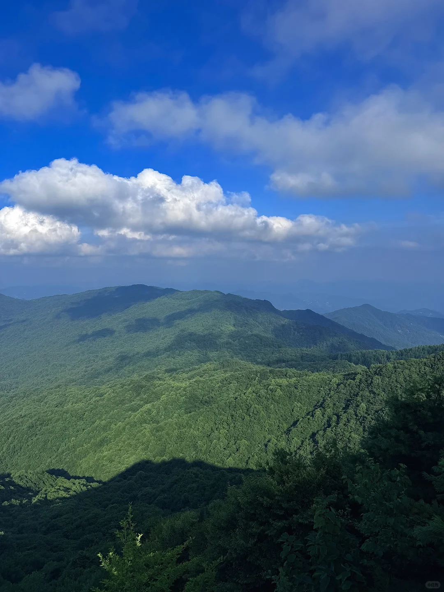
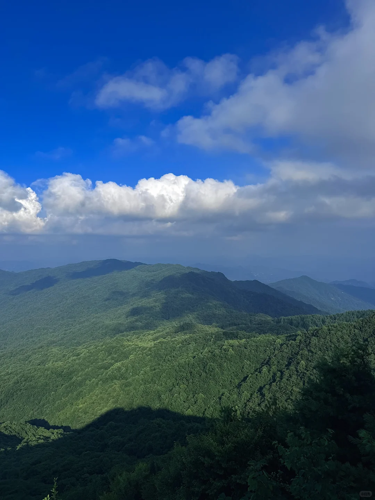
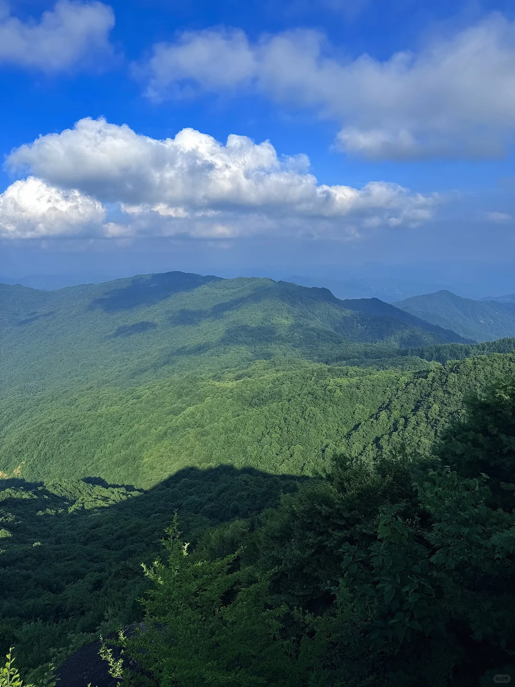
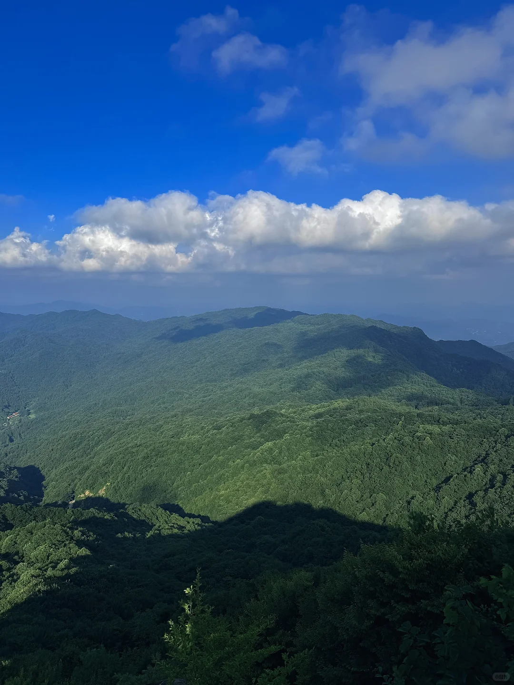
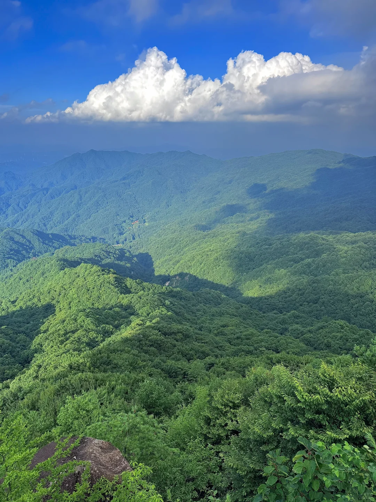
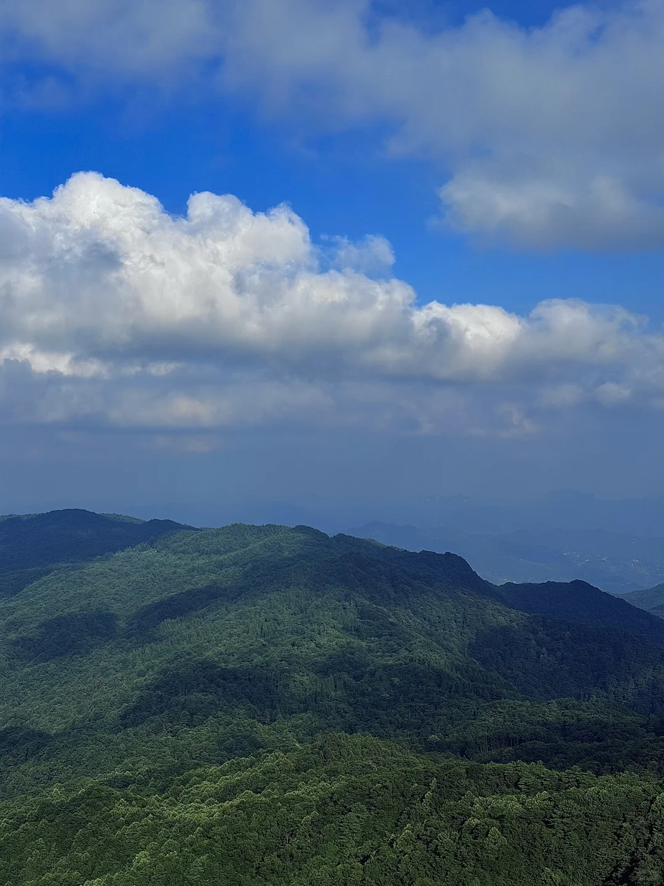
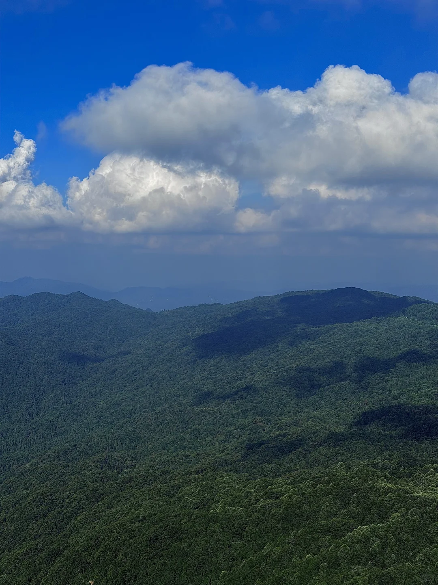
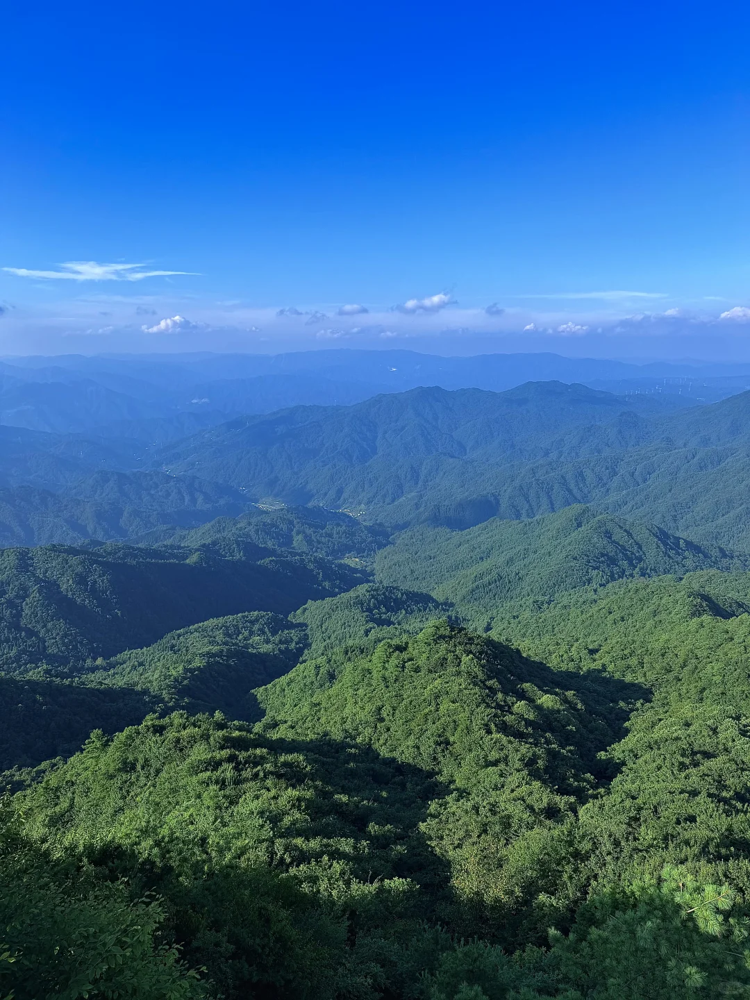
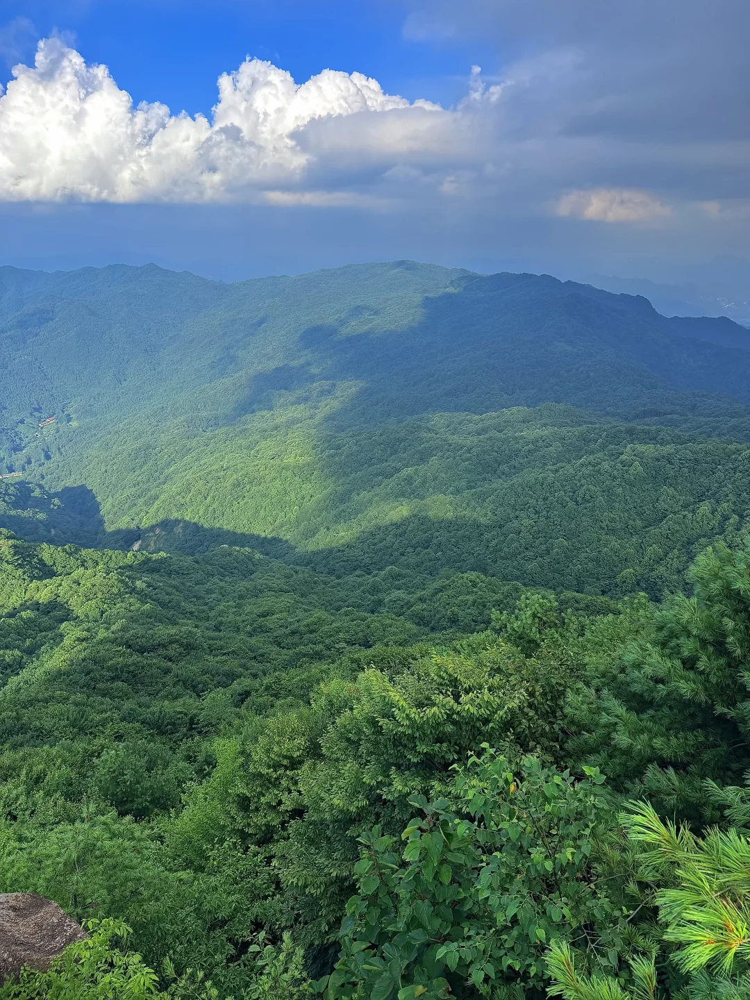
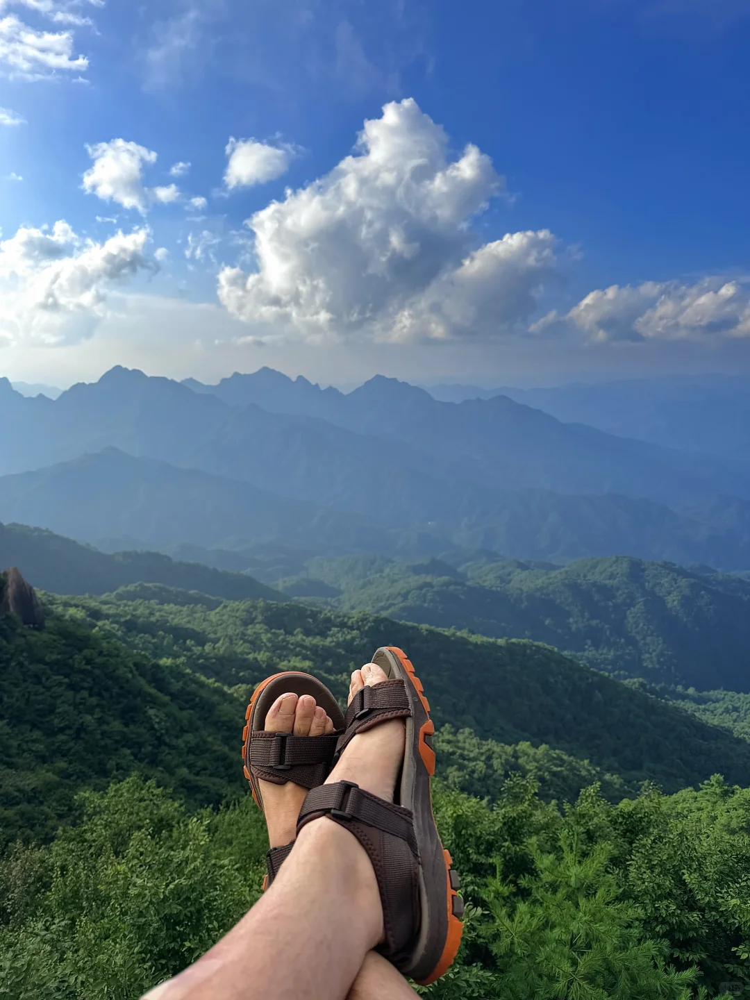

# 沉浸式体验宜昌20℃的夏天🌲🌲🌲

- 作者: 风之子
- 👍29 · 💬4 · ⭐22 · 图 12
- feed_id: 6a6990b5000000001101e4d3

> [OCR] 小米12Pro

> [OCR] 小红书

> [OCR] [?]

> [OCR] system

> [OCR] system

> [OCR] system

> [OCR] system

> [OCR] system

> [OCR] system

> [OCR] 小米相机

> [OCR] system

## 正文
大老岭，三峡库区第一高峰，日出、云海、高山湖泊、森林暮色，在这里完整相遇。
📍导航：大老岭国家森林公园·三峡云顶
🚗自驾：宜昌市区出发约2.5h，盘山弯道较多，谨慎慢行
🎫门票：免费
⏰开放：全天
	
📸必打卡点位
▫️三峡云顶（天柱峰）
海拔2008m，步行20分钟登顶。
日出云海、黄昏蓝调时刻最佳机位，无遮挡俯瞰群山与长江。
想看日出建议凌晨5:30前抵达。
	
▫️情人湖
静谧高山湖泊，环湖平缓步道，森林倒影，适合安静放空。
	
▫️原始森林步道
参天古树，林间溪流，森系极简氛围感。
	
⚠️重要提醒
▪️山区昼夜温差巨大！哪怕盛夏，山顶必备薄冲锋衣/抓绒
▪️山顶无小卖部，自带饮用水、干粮
▪️电车务必在邓村镇充满电，上山无充电桩
▪️雨后初晴更容易遇见云海
▪️蓝调时刻：日落前后30分钟，天空低饱和冷调，出片天花板
#宜昌旅游[话题]# #宜昌[话题]##湖北旅游[话题]# #治愈系风景[话题]# #摄影[话题]# #手机摄影[话题]# #夏日避暑好去处[话题]# #森林[话题]# #徒步[话题]##避暑[话题]#

---