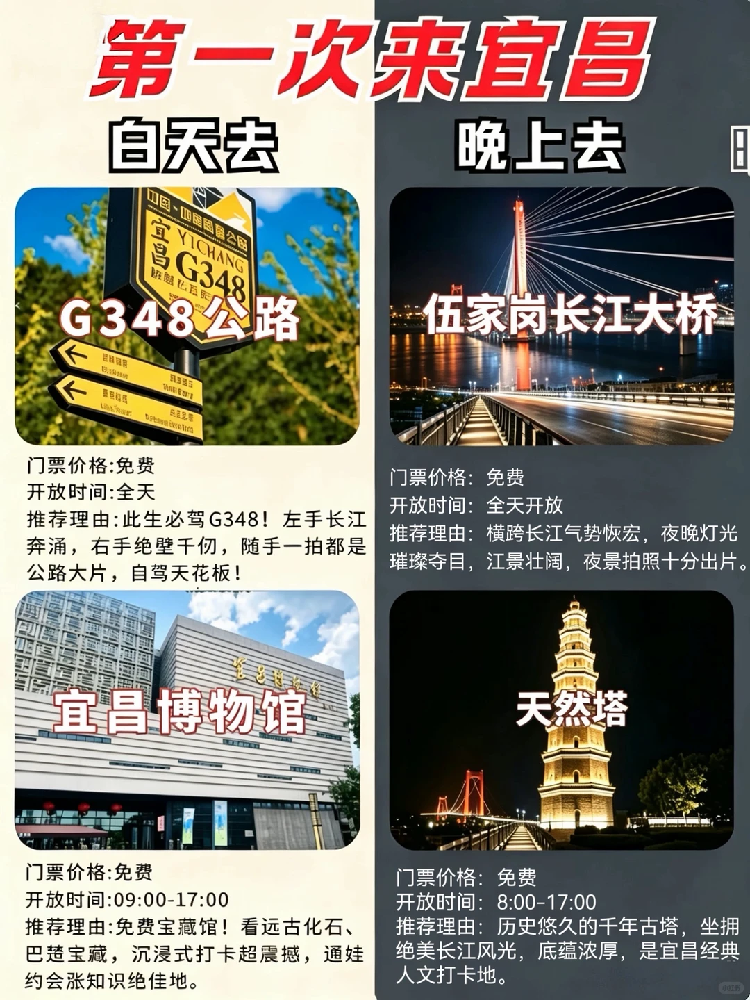
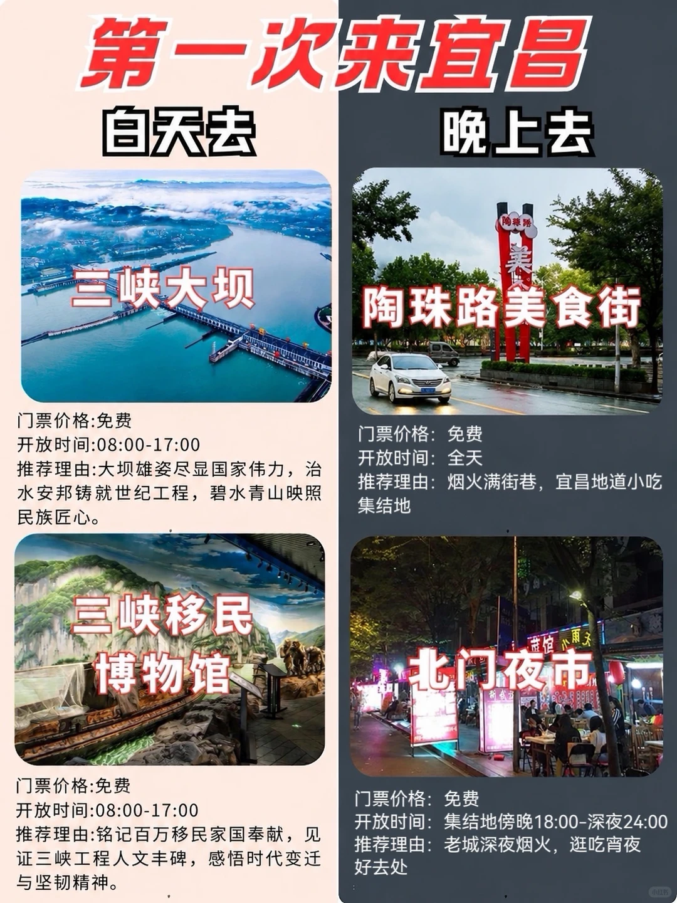
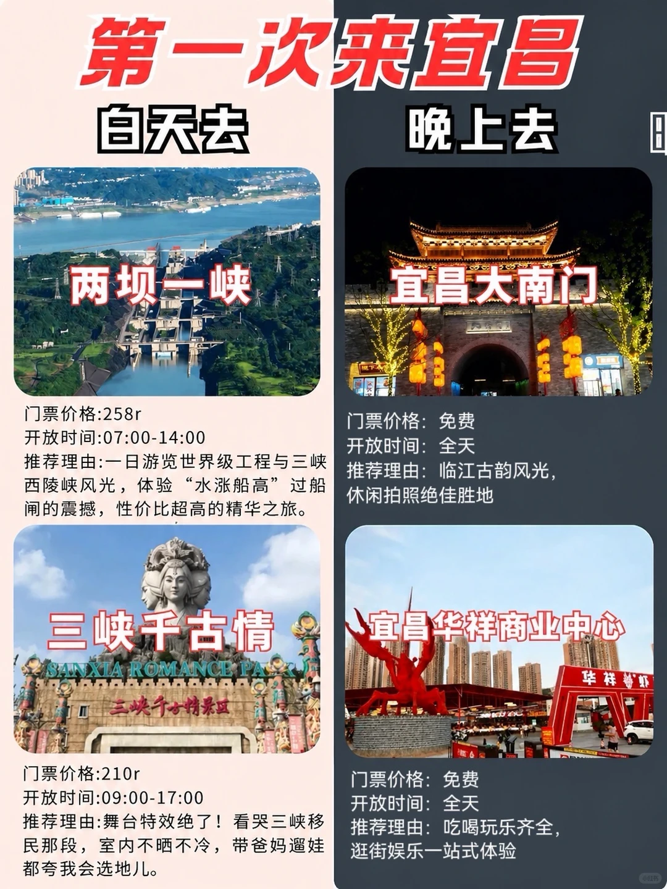
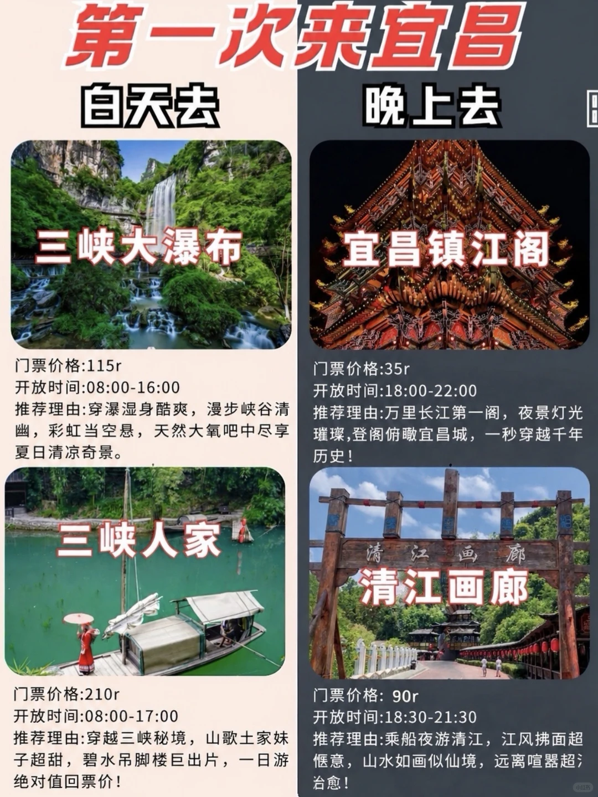
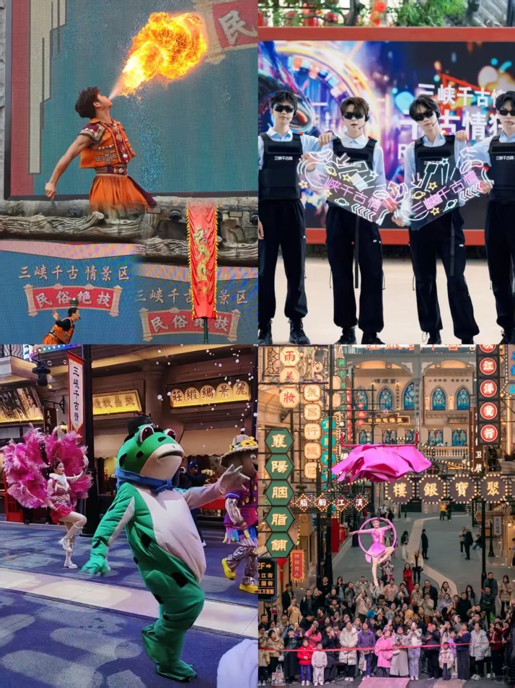
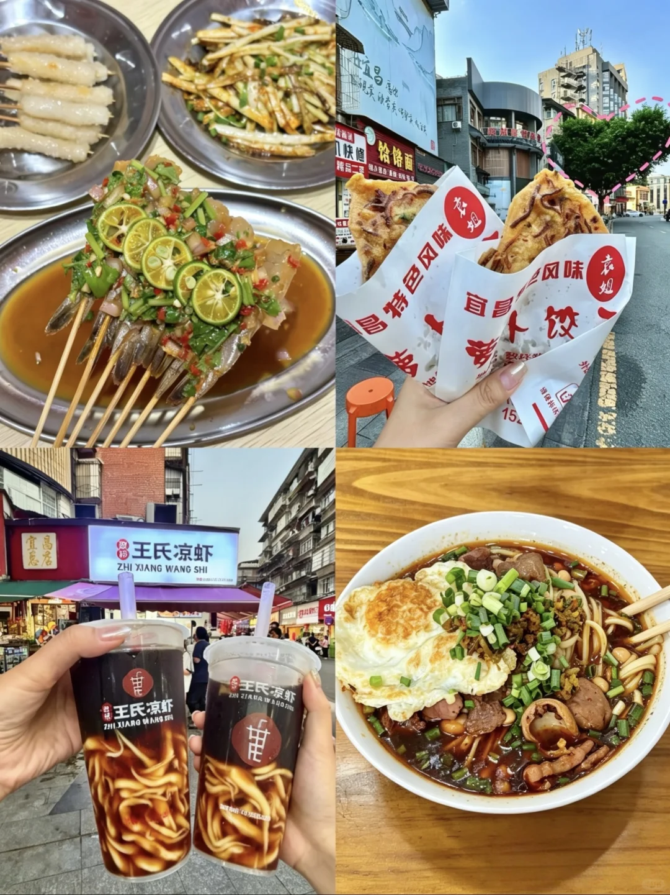

# 宜昌土著一次说 第一次去宜昌白天晚上去哪

- 作者: 宜昌土著 本地攻略版
- 👍28 · 💬 · ⭐38 · 图 6
- feed_id: 6a0da38e000000003600183f

> [OCR] 第一次来宜昌
白天去 晚上去

G348公路
门票价格:免费
开放时间:全天
推荐理由:此生必驾G348！左手长江奔涌，右手绝壁千仞，随手一拍都是公路大片，自驾天花板！

伍家岗长江大桥
门票价格：免费
开放时间：全天开放
推荐理由：横跨长江气势恢宏，夜晚灯光璀璨夺目，江景壮阔，夜景拍照十分出片。

宜昌博物馆
门票价格:免费
开放时间:09:00-17:00
推荐理由:免费宝藏馆！看远古化石、巴楚宝藏，沉浸式打卡超震撼，通娃约会涨知识绝佳地。

天然塔
门票价格：免费
开放时间：8:00-17:00
推荐理由：历史悠久的千年古塔，坐拥绝美长江风光，底蕴浓厚，是宜昌经典人文打卡地。

> [OCR] 第一次来宜昌

白天去
三峡大坝
门票价格:免费
开放时间:08:00-17:00
推荐理由:大坝雄姿尽显国家伟力，治水安邦铸就世纪工程，碧水青山映照民族匠心。

晚上
陶珠路美食街
门票价格：免费
开放时间：全天
推荐理由：烟火满街巷，宜昌地道小吃集结地

三峡移民博物馆
门票价格:免费
开放时间:08:00-17:00
推荐理由:铭记百万移民家国奉献，见证三峡工程人文丰碑，感悟时代变迁与坚韧精神。

北门夜市
门票价格：免费
开放时间：傍晚18:00-深夜24:00
推荐理由：老城深夜烟火，逛吃宵夜好去处

> [OCR] 第一次来宜昌
白天去
两坝一峡

门票价格:258r
开放时间:07:00-14:00
推荐理由:一日游览世界级工程与三峡西陵峡风光，体验“水涨船高”过船闸的震撼，性价比超高的精华之旅。

三峡千古情
SANXIA ROMANCE PA
三峡千古情景区

门票价格:210r
开放时间:09:00-17:00
推荐理由:舞台特效绝了！看哭三峡移民那段，室内不晒不冷，带爸妈遛娃都夸我会选地儿。

晚上去
宜昌大南门

门票价格:免费
开放时间:全天
推荐理由:临江古韵风光，
休闲拍照绝佳胜地

宜昌华祥商业中心

门票价格:免费
开放时间:全天
推荐理由:吃喝玩乐齐全,
逛街娱乐一站式体验

> [OCR] 第一次来宜昌
白天去
三峡大瀑布

门票价格:115r
开放时间:08:00-16:00
推荐理由:穿瀑湿身酷爽，漫步峡谷清幽，彩虹当空悬，天然大氧吧中尽享夏日清凉奇景。

晚上
宜昌镇江阁

门票价格:35r
开放时间:18:00-22:00
推荐理由:万里长江第一阁，夜景灯光璀璨,登阁俯瞰宜昌城，一秒穿越千年历史！

三峡人家

门票价格:210r
开放时间:08:00-17:00
推荐理由:穿越三峡秘境，山歌土家妹子超甜，碧水吊脚楼巨出片，一日游绝对值回票价！

清江画廊

门票价格:90r
开放时间:18:30-21:30
推荐理由:乘船夜游清江，江风拂面超惬意，山水如画似仙境，远离喧嚣超治愈！

> [OCR] 三峡千古情景区
民俗绝技 三峡千古情景区 民俗绝技

三?千古情
雨妆
襄阳胭脂铺
楼银宝聚

> [OCR] 宜昌
袁姐
宜昌特色风味
袁姐
宜昌特色风味
王氏凉虾
ZHI XIANG WANG SHI
王氏凉虾
ZHI XIANG WANG SHI

## 正文
🏡打卡景点
🗺️白天去：g348公路自驾、宜昌博物馆、三峡大坝、三峡移民博物馆、两坝一峡、三峡大瀑布、三峡人家、三峡千古情
晚上去：长江大桥、天然塔、陶珠路美食街、北门夜市、宜昌大门口、去宜昌镇江阁、清江画廊
🍗美食滴滴
步行街美食：袁姐萝卜饺子、王氏凉虾、鲁包包、红油小面、阿贝砂锅
国贸美食：负一楼美食聚集地，麒麟大口茶茶、转转火锅、赵氏传承、麦记牛奶
715美食：37砂锅、小厨匠、天上飞、云上贵州、牛腱子面、马姐卤菜
以上路线非常适合休闲游，适合懒人逛吃一整天
	
#宜昌行步行[话题]# #宜昌旅游[话题]# #宜昌攻略[话题]# #宜昌散步[话题]# #宜昌吃喝玩乐[话题]# #宜昌一日游[话题]#  #慢人友好旅行[话题]# #宜昌美食[话题]#  #宜昌充电路线[话题]#  #宜昌宠物友好[话题]# #三峡千古情[话题]#

---