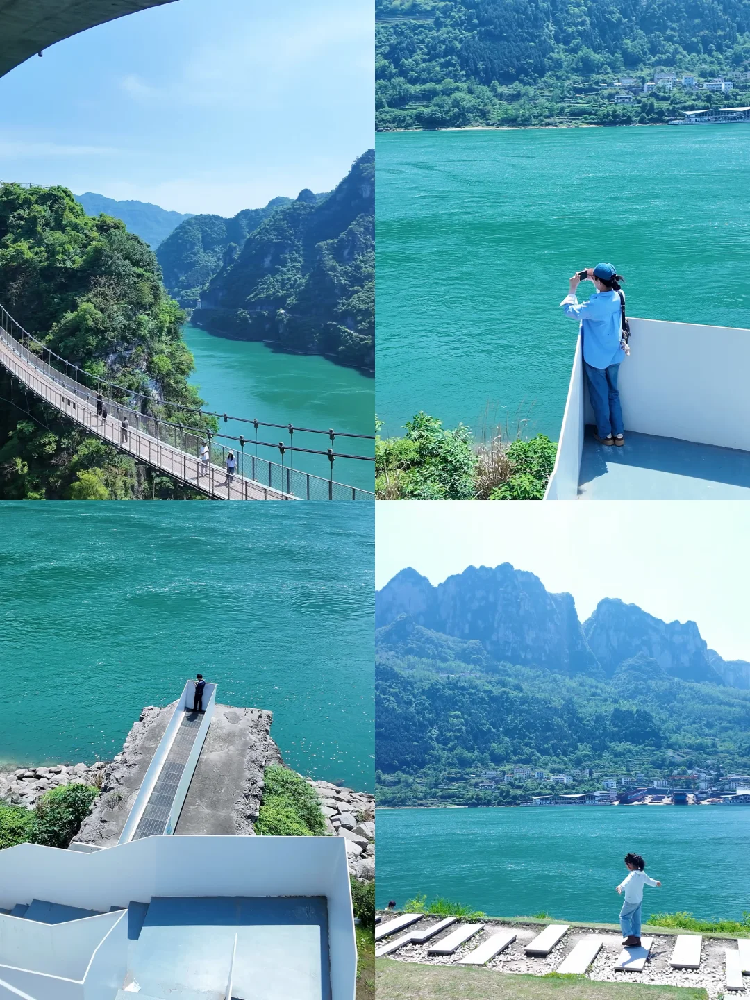
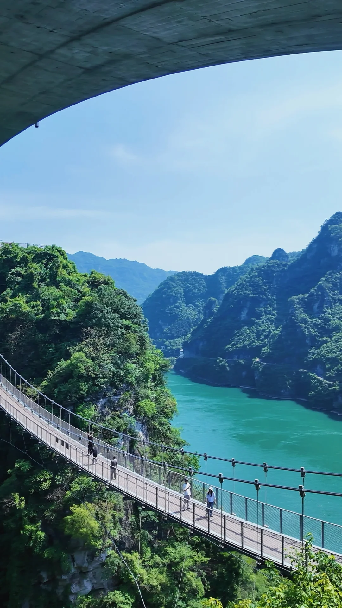
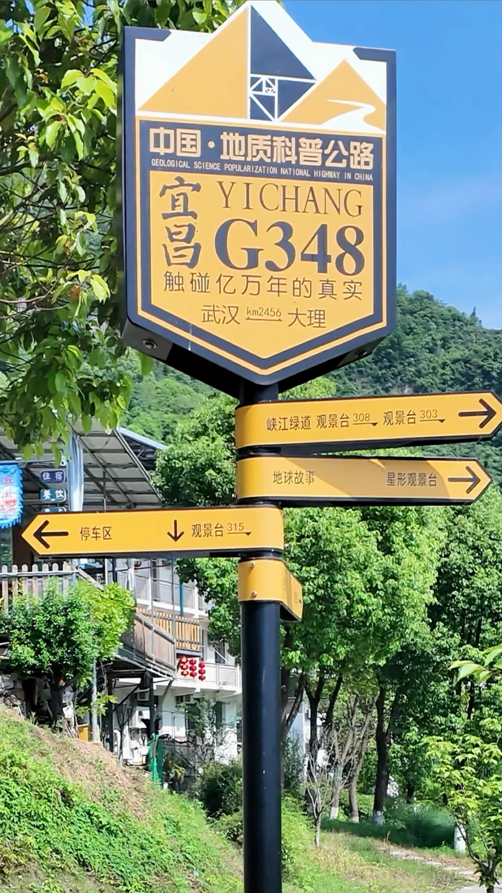
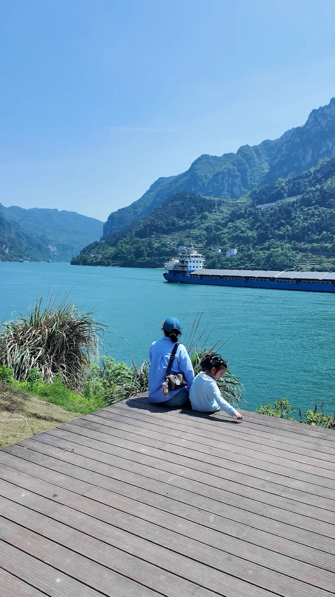
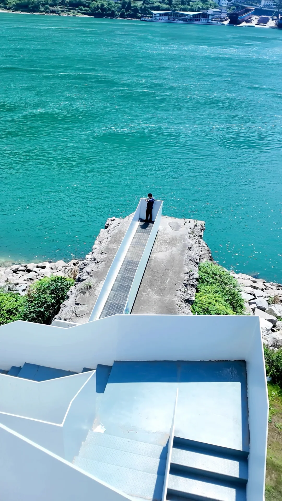
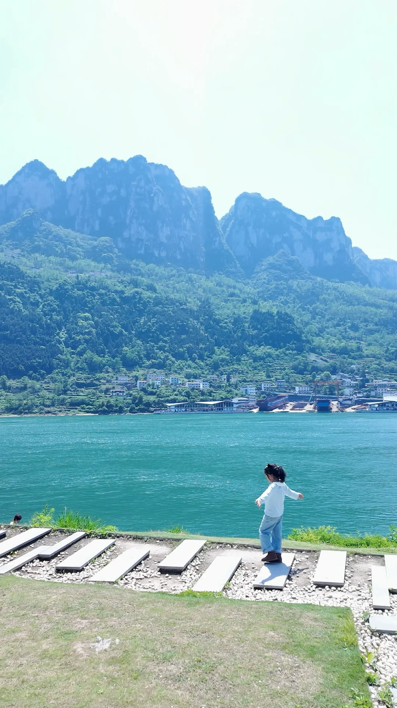
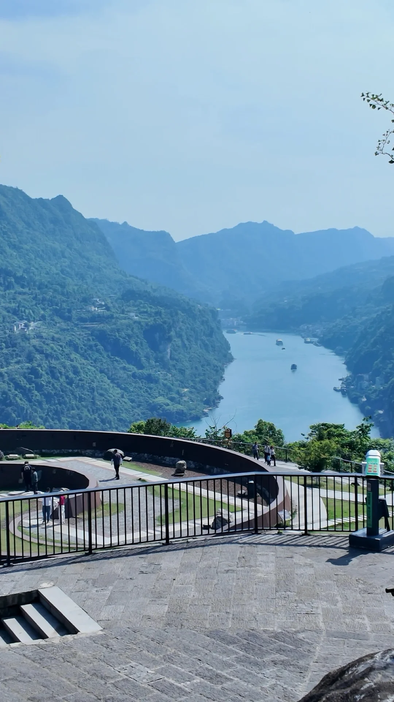
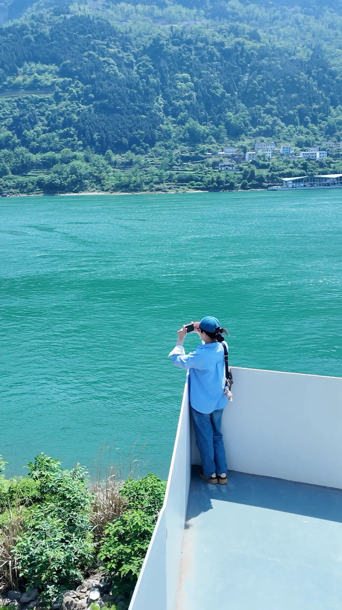

# 宜昌免费景点｜三峡最美公路国道G348

- 作者: 爱玩的妮妮酱✨
- 👍27 · 💬12 · ⭐27 · 图 9
- feed_id: 6a77406b0000000021021f22

> [OCR] 悬索桥
湖边拍照
湖边拍照
山景

> [OCR] system

> [OCR] [?][?]

> [OCR] 中国·地质科普公路
GEOLOGICAL SCIENCE POPULARIZATION NATIONAL HIGHWAY IN CHINA
宜昌 YICHANG G348
触碰亿万年的真实
武汉 km2456 大理

峡江绿道 观景台 308 → 观景台 303 →
地球故事 星形观景台 →
← 停车区 ↓ 观景台 315 →

> [OCR] [?][?][?]

> [OCR] [?]

> [OCR] [?]

> [OCR] [?][?]

> [OCR] system

## 正文
宜昌三峡最美自驾公路
全程免费不花一分钱💰
从宜昌市区出发仅半小时
一路都设有观景平台及停车位🅿️
	
🧭导航定位可定
听风谷➡️明月台➡️0.618地质公园➡️干沟子大桥➡️莲沱畔服务区➡️三峡大坝➡️牛肝马肺峡
前5个观景点距离较近，后面两个景点路程都间隔1️⃣个多小时
我们是从宜昌市直接上三峡大道从莲沱畔服务区开始反向游玩
⚠️（三峡大道需申请通行证🪪）
	
第一站
莲沱畔服务区🌟🌟🌟🌟🌟🌟
可挖沙玩水，是离江边最近的亲水栈道
停车场🅿️有充电桩、🚾、咖啡小吃店
	
第二站
干沟子大桥🌉🌟🌟🌟🌟
拱桥下面是悬桥，游玩大概半小时
适合拍照打卡
	
第三站
0.618地质公园🌟🌟🌟
小型地质科普公园
	
明月台、听风谷车上远观了一下
适合打卡拍个照，景色不如莲沱畔和干沟子大桥
#宜昌旅游[话题]# #宜昌g348[话题]# #宜昌免费景点[话题]# #莲沱畔[话题]# #干沟子大桥[话题]#

---