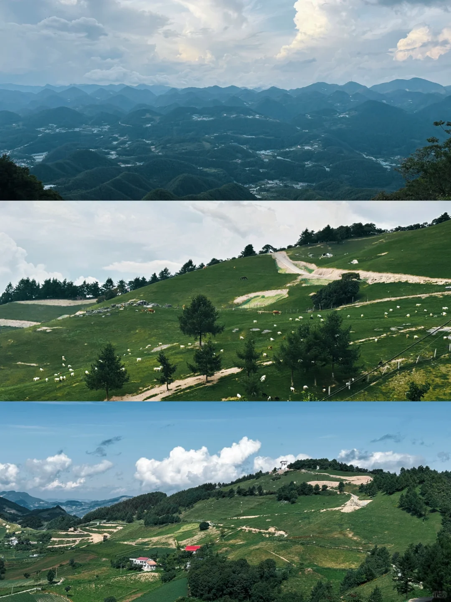
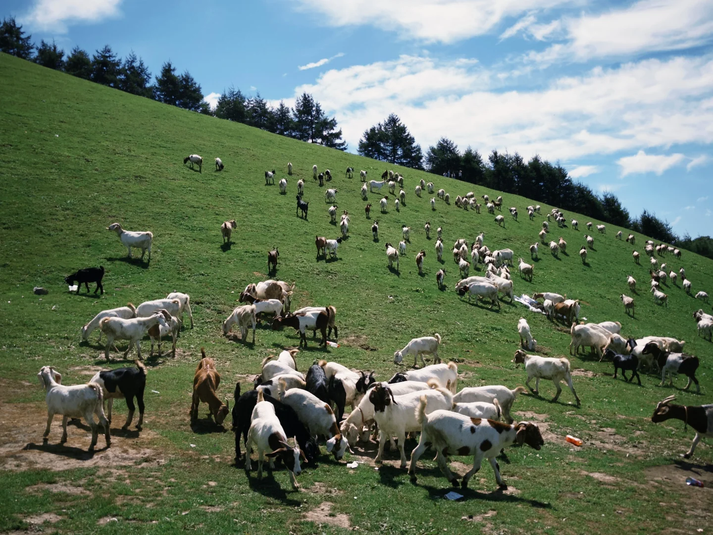
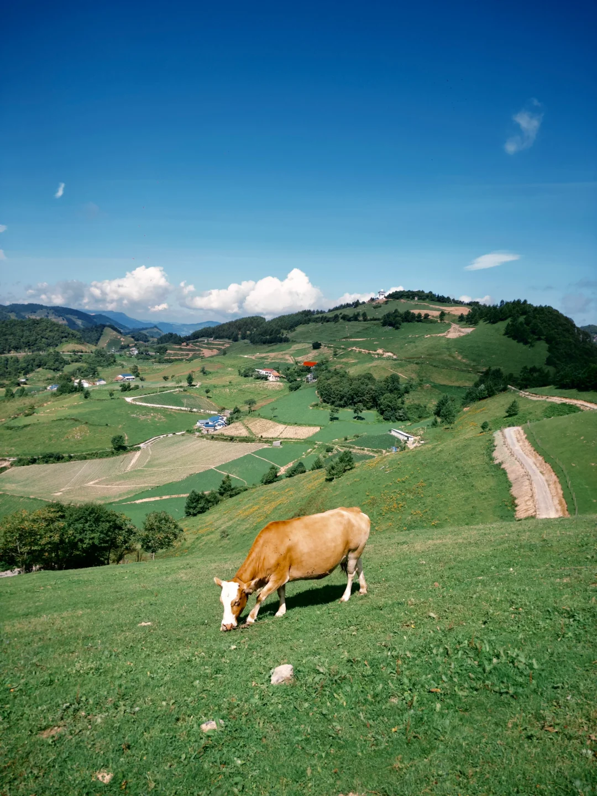
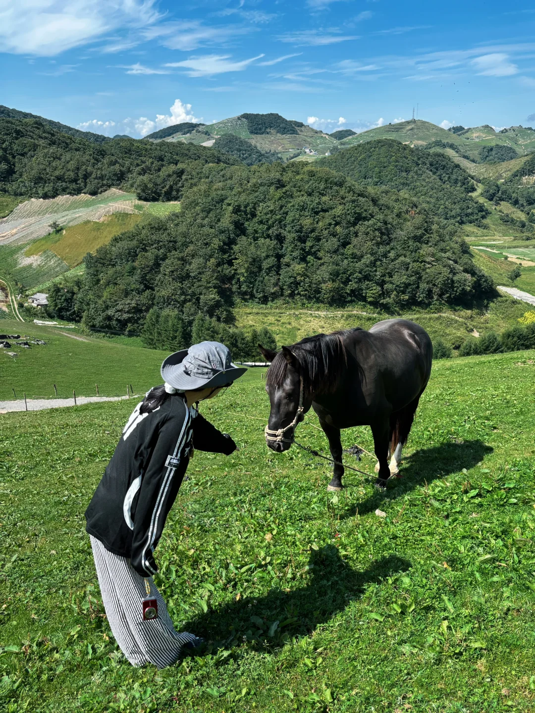
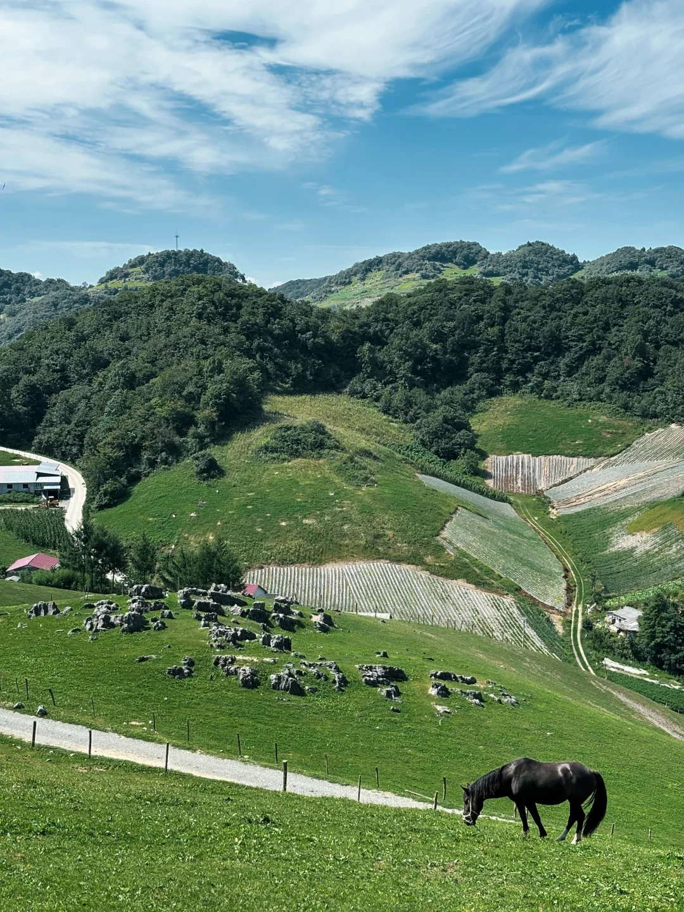
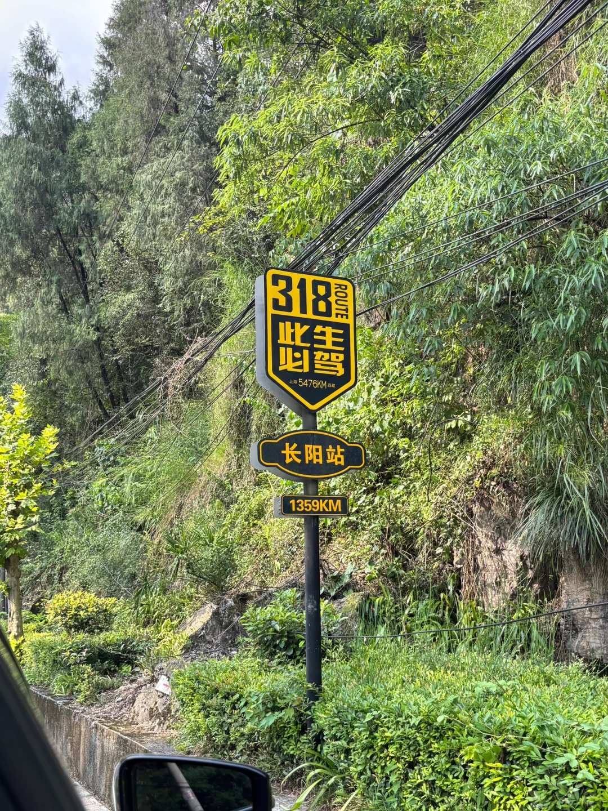

# 湖北“阿勒泰”⛰️

- 作者: Zhouyn.
- 👍27 · 💬6 · ⭐10 · 图 8
- feed_id: 68af0382000000001d00a57a

> [OCR] [图片文字]

> [OCR] system

> [OCR] system

> [OCR] ABBLOOM

> [OCR] FAIRFLOO
GOODZCLAU

> [OCR] [?]

> [OCR] system

> [OCR] 318 ROUTE
此生必驾
长阳站
1359KM

## 正文
喜欢只有26度的夏天，火烧坪山上太凉快了
在云上望角和牛羊马随手拍拍都很出片
#避暑胜地[话题]# #宜昌[话题]# #长阳[话题]# #火烧坪[话题]#

---