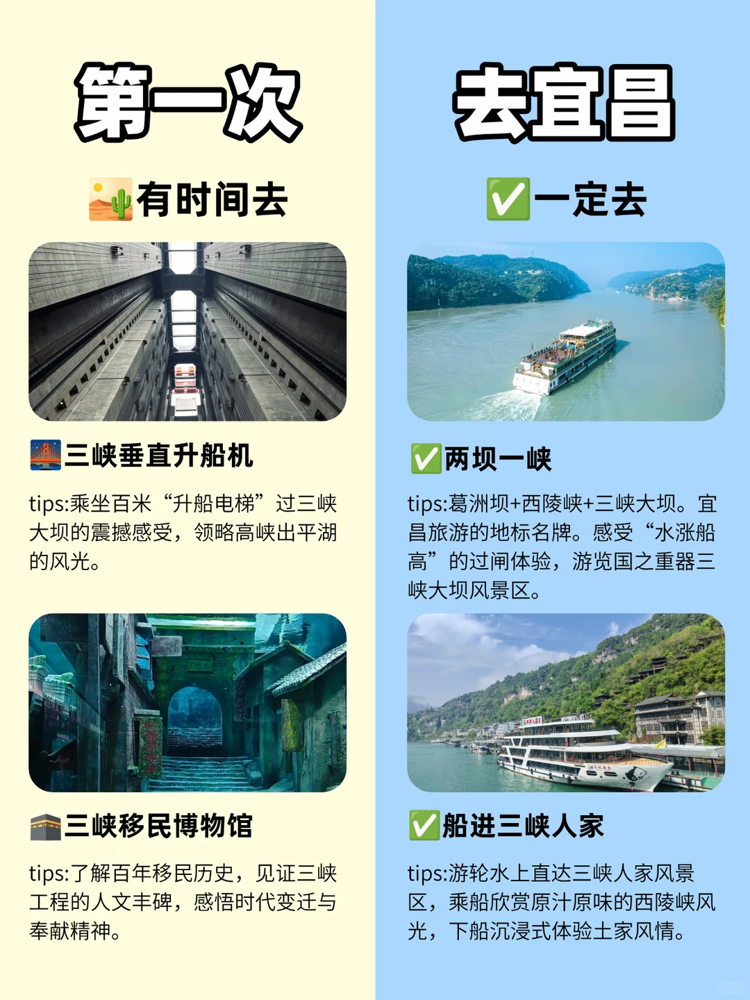
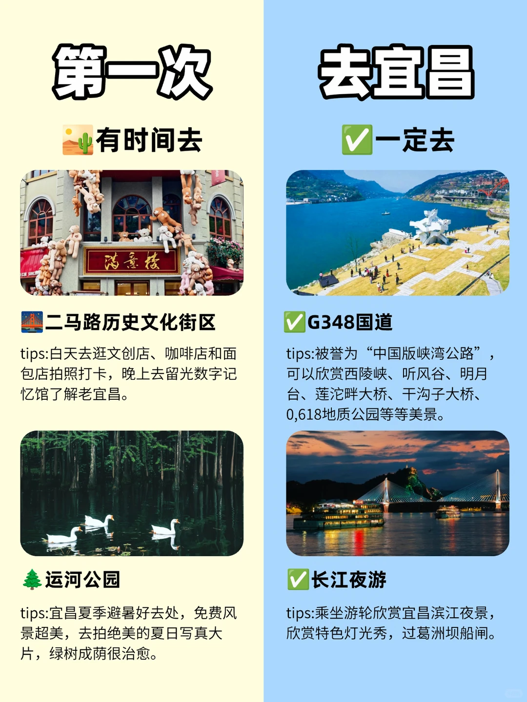
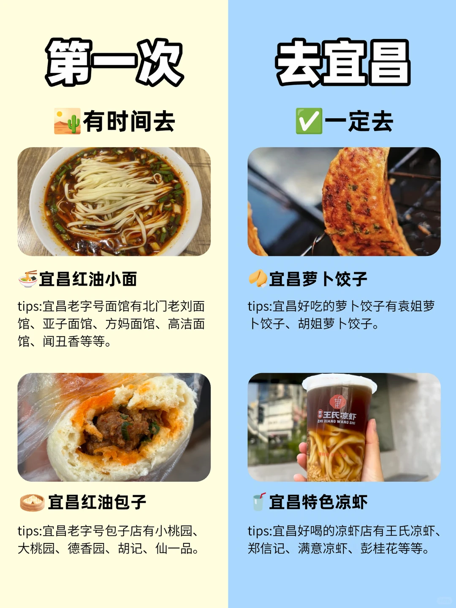
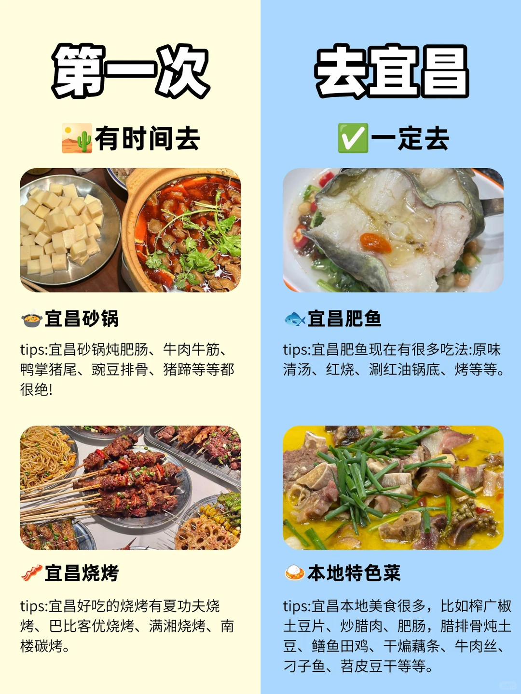

# 谁说宜昌旅游不值得去？！第一次去就夯爆了

- 作者: 船进三峡人家
- 👍26 · 💬 · ⭐26 · 图 4
- feed_id: 6a5ec98b000000002201a76f

> [OCR] 第一次
有时间去

三峡垂直升船机
tips:乘坐百米“升船电梯”过三峡大坝的震撼感受，领略高峡出平湖的风光。

三峡移民博物馆
tips:了解百年移民历史，见证三峡工程的人文丰碑，感悟时代变迁与奉献精神。

去宜昌
一定去

两坝一峡
tips:葛洲坝+西陵峡+三峡大坝。宜昌旅游的地标名牌。感受“水涨船高”的过闸体验，游览国之重器三峡大坝风景区。

船进三峡人家
tips:游轮水上直达三峡人家风景区，乘船欣赏原汁原味的西陵峡风光，下船沉浸式体验土家风情。

> [OCR] 第一次
有时间去

二马路历史文化街区
tips:白天去逛文创店、咖啡店和面包店拍照打卡，晚上去留光数字记忆馆了解老宜昌。

运河公园
tips:宜昌夏季避暑好去处，免费风景超美，去拍绝美的夏日写真大片，绿树成荫很治愈。

去宜昌
一定去

G348国道
tips:被誉为“中国版峡湾公路”，可以欣赏西陵峡、听风谷、明月台、莲沱畔大桥、干沟子大桥、0,618地质公园等等美景。

长江夜游
tips:乘坐游轮欣赏宜昌滨江夜景，欣赏特色灯光秀，过葛洲坝船闸。

> [OCR] 第一次
有时间去

宜昌红油小面
tips:宜昌老字号面馆有北门老刘面馆、亚子面馆、方妈面馆、高洁面馆、闻丑香等等。

宜昌红油包子
tips:宜昌老字号包子店有小桃园、大桃园、德香园、胡记、仙一品。

去宜昌
一定去

宜昌萝卜饺子
tips:宜昌好吃的萝卜饺子有袁姐萝卜饺子、胡姐萝卜饺子。

宜昌特色凉虾
tips:宜昌好喝的凉虾店有王氏凉虾、郑信记、满意凉虾、彭桂花等等。

> [OCR] 第一次
有时间去

宜昌砂锅
tips:宜昌砂锅炖肥肠、牛肉牛筋、鸭掌猪尾、豌豆排骨、猪蹄等等都很绝!

宜昌烧烤
tips:宜昌好吃的烧烤有夏功夫烧烤、巴比客优烧烤、满湘烧烤、南楼碳烤。

去宜昌
一定去

宜昌肥鱼
tips:宜昌肥鱼现在很多吃法:原味清汤、红烧、涮红油锅底、烤等等。

本地特色菜
tips:宜昌本地美食很多，比如榨广椒土豆片、炒腊肉、肥肠，腊排骨炖土豆、鳝鱼田鸡、干煸藕条、牛肉丝、刁子鱼、苕皮豆干等等。

## 正文
“第一次去宜昌，有时间去，一定去—船进三峡人家” ！
告别大巴颠簸，直接从水上驶入山水画卷。这份精华攻略，先🐎住！
	
🚢 为什么一定要“船进”？
从三峡游轮中心·夜明珠港登船，航行约1小时，饱览西陵峡原始风光，远观葛洲坝，途经明月湾、灯影峡。江水碧绿，两岸奇峰对峙，人在画中游。
	
🗺️ 一日游精华路线（精简版）
山上人家打卡石令牌、巴王宫、茶盐古道，别错过三棵树广场的巴土风情表演。下山沿龙津溪漫步，去溪边人家溯溪玩水、看婚嫁楼“哭嫁”互动表演，再赏黄龙瀑和猴山，最后听峡江号子非遗演出。全程约4-6小时，边走边玩不累～
	
✨ 宜昌还可以这样玩（时间充裕的话）
· 两坝一峡或长江夜游：夏天建议选车去船回，上午参观三峡大坝，没那么热，下午在船上吹空调欣赏三峡风光。对“水涨船高”特别感兴趣的宝子，可以选择长江夜游哦～
· 三峡移民博物馆：了解秭归人民百年移民历史，舍小家为大家的奉献精神。
· G348国道：中国版峡湾公路，沿途风景绝美～
· 二马路历史文化街区：逛满意楼文创店，咖啡店、面包店等等，晚上去留光数字记忆馆美美拍照。
· 宜昌美食：红油小面（北门老刘、方妈等）、萝卜饺子（袁姐、胡姐）、王氏凉虾、红油包子（小桃园等）……好吃到不想走！
宜昌，真的值得第一次、第二次、第N次！ 🌊
#船进三峡人家[话题]# #吃货友好旅行[话题]# #攻略[话题]# #湖北旅游[话题]# #旅游攻略[话题]# #本地人做的攻略[话题]# #跟着本地人不踩雷[话题]# #穷游攻略[话题]# #小众游玩路线[话题]# #无滤镜旅行攻略[话题]#

---