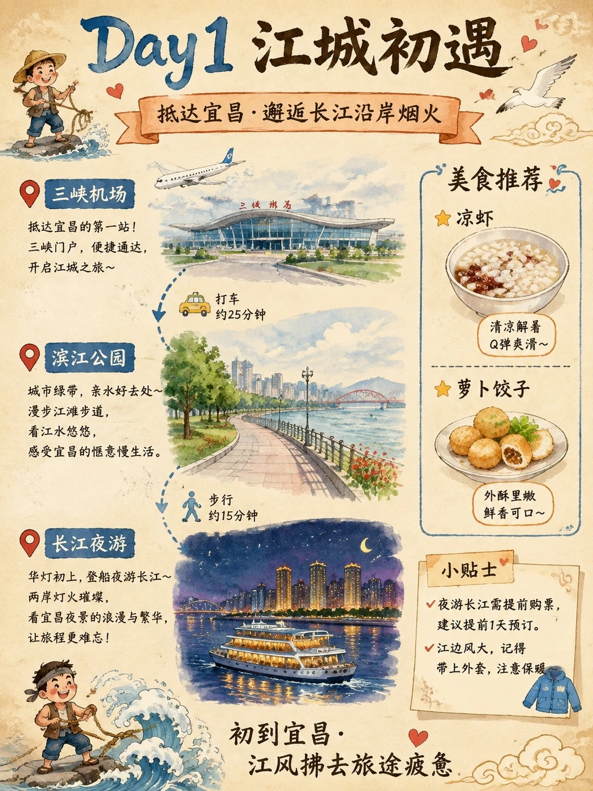
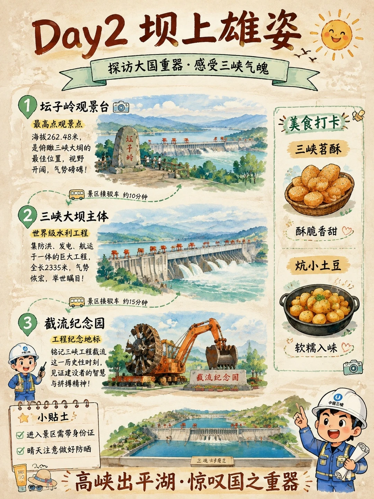
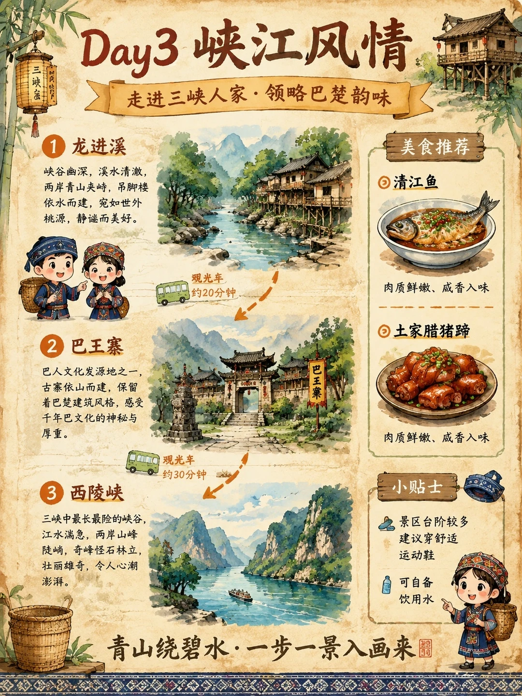
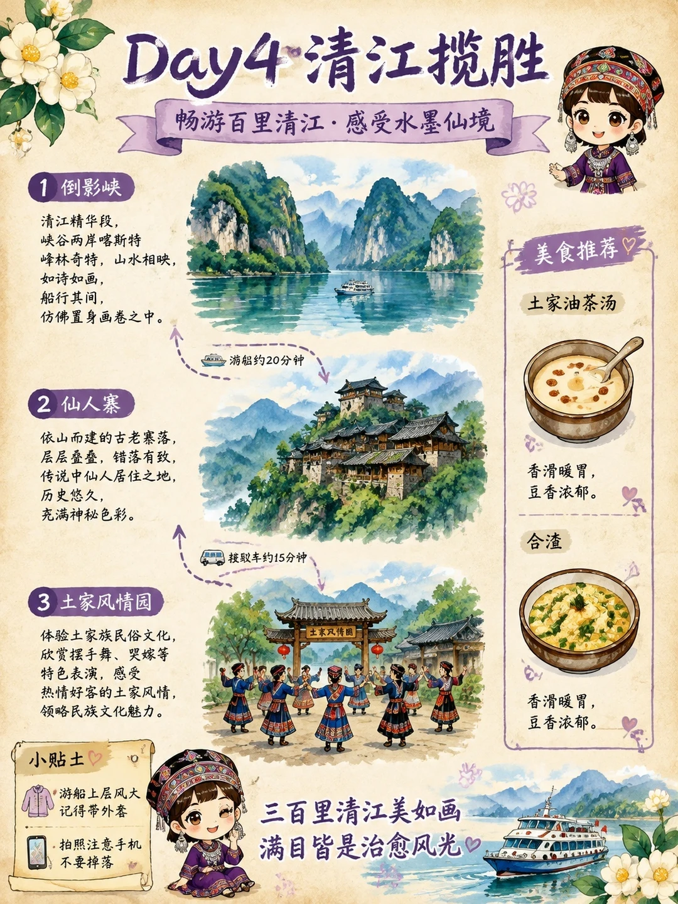
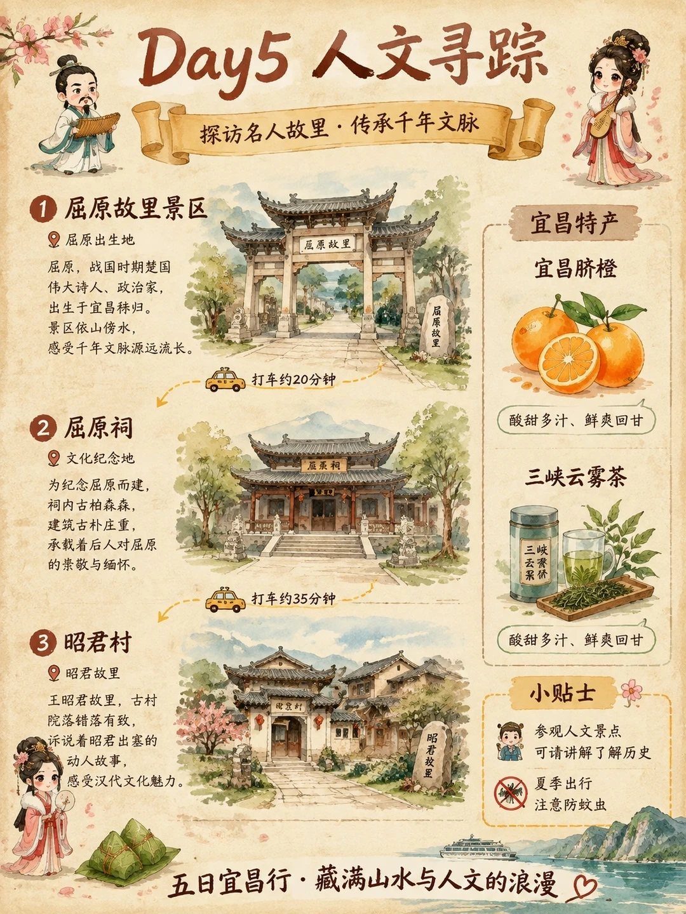

# 宜昌5日游旅行攻略手绘游玩攻略

- 作者: 王安全的富贵儿
- 👍25 · 💬2 · ⭐18 · 图 5
- feed_id: 6a702e660000000032031ae4

> [OCR] Day1 江城初遇
抵达宜昌·邂逅长江沿岸烟火

三峡机场
抵达宜昌的第一站！
三峡门户，便捷通达，
开启江城之旅～
打车约25分钟

滨江公园
城市绿带，亲水好去处～
漫步江滩步道，
看江水悠悠，
感受宜昌的惬意慢生活。
步行约15分钟

长江夜游
华灯初上，登船夜游长江～
两岸灯火璀璨，
看宜昌夜景的浪漫与繁华，
让旅程更难忘！
小贴士
✓ 夜游长江需提前购票，
建议提前1天预订。
✓ 江边风大，记得
带上外套，注意保暖

美食推荐
★ 凉虾
清凉解暑
Q弹爽滑～
★ 萝卜饺子
外酥里嫩
鲜香可口～

初到宜昌·
江风拂去旅途疲惫

> [OCR] Day2 坝上雄姿
探访大国重器·感受三峡气魄

1. 坛子岭观景台
最高点观景点
海拔262.48米，
是俯瞰三峡大坝的最佳位置，视野开阔，气势磅礴！

景区接驳车 约10分钟

2. 三峡大坝主体
世界级水利工程
集防洪、发电、航运于一体的巨大工程，
全长2335米，气势恢宏，举世瞩目！

景区接驳车 约15分钟

3. 截流纪念园
工程纪念地标
铭记三峡工程截流这一历史性时刻，
见证建设者的智慧与拼搏精神！

小贴士
进入景区需带身份证
晴天注意做好防晒

美食打卡
三峡茗酥
酥脆香甜

炕小土豆
软糯入味

高峡出平湖·惊叹国之重器

> [OCR] Day3 峡江风情
走进三峡人家·领略巴楚韵味

1 龙进溪
峡谷幽深，溪水清澈，
两岸青山夹峙，吊脚楼依水而建，
宛如世外桃源，静谧而美好。

2 巴王寨
巴人文化发源地之一，
古寨依山而建，保留着巴楚建筑风格，
感受千年巴文化的神秘与厚重。

3 西陵峡
三峡中最长最险的峡谷，
江水湍急，两岸山峰陡峭，
奇峰怪石林立，壮丽雄奇，
令人心潮澎湃。

美食推荐
① 清江鱼
肉质鲜嫩、咸香入味

② 土家腊猪蹄
肉质鲜嫩、咸香入味

小贴士
景区台阶较多
建议穿舒适运动鞋
可自备饮用水

青山绕碧水·一步一景入画来

> [OCR] Day4 清江揽胜
畅游百里清江·感受水墨仙境

1 倒影峡
清江精华段，
峡谷两岸喀斯特
峰林奇特，山水相映，
如诗如画，
船行其间，
仿佛置身画卷之中。

2 仙人寨
依山而建的古老寨落，
层层叠叠，错落有致，
传说中仙人居住之地，
历史悠久，
充满神秘色彩。

3 土家风情园
体验土家族民俗文化，
欣赏摆手舞、哭嫁等
特色表演，感受
热情好客的土家风情，
领略民族文化魅力。

小贴士
游船上层风大
记得带外套
拍照注意手机
不要掉落

美食推荐
土家油茶汤
香滑暖胃，
豆香浓郁。
合渣
香滑暖胃，
豆香浓郁。

三百里清江美如画
满目皆是治愈风光

> [OCR] Day5 人文寻踪
探访名人故里·传承千年文脉

1 屈原故里景区
屈原出生地
屈原，战国时期楚国伟大诗人、政治家，
出生于宜昌秭归。
景区依山傍水，
感受千年文脉源远流长。

打车约20分钟

2 屈原祠
文化纪念地
为纪念屈原而建，
祠内古柏森森，
建筑古朴庄重，
承载着后人对屈原的崇敬与缅怀。
打车约35分钟

3 昭君村
昭君故里
王昭君故里，古村院落错落有致，
诉说着昭君出塞的动人故事，
感受汉代文化魅力。

宜昌特产
宜昌脐橙
酸甜多汁、鲜爽回甘

三峡云雾茶
三峡云雾果侨
酸甜多汁、鲜爽回甘

小贴士
参观人文景点
可请讲解了解历史
夏季出行
注意防蚊虫

五日宜昌行·藏满山水与人文的浪漫

## 正文
来宜昌玩真的不用赶时间呀🍃
这份手绘攻略整理了超多值得停留的小细节
顺着舒服的节奏逛就好
山清水秀的治愈感直接拉满
懒得做功课的宝子直接参考就OK
#手绘地图[话题]# #旅游攻略[话题]# #带着手账去旅行[话题]# #城市速写[话题]# #宜昌旅行[话题]# #湖北旅游[话题]#

---