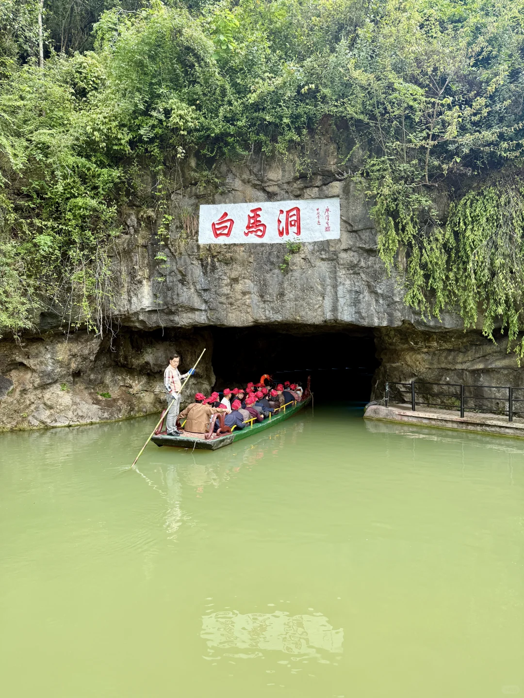
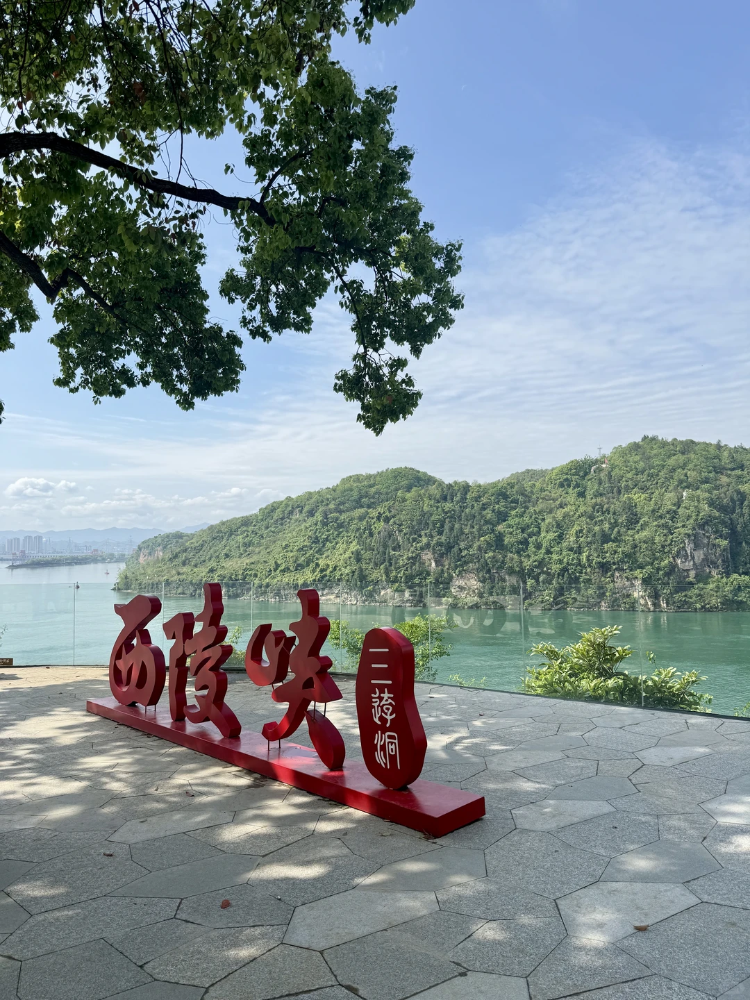
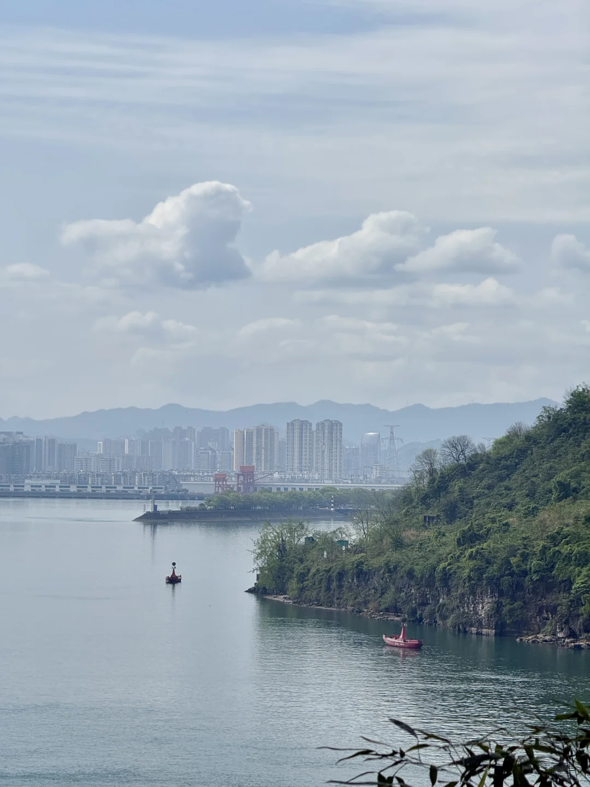
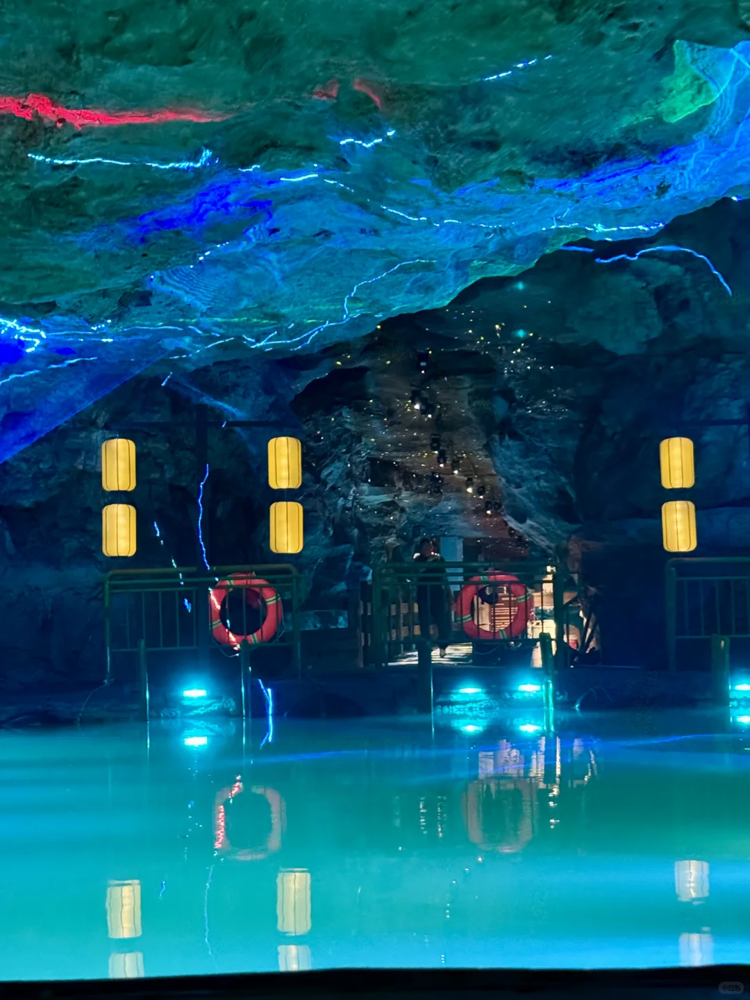
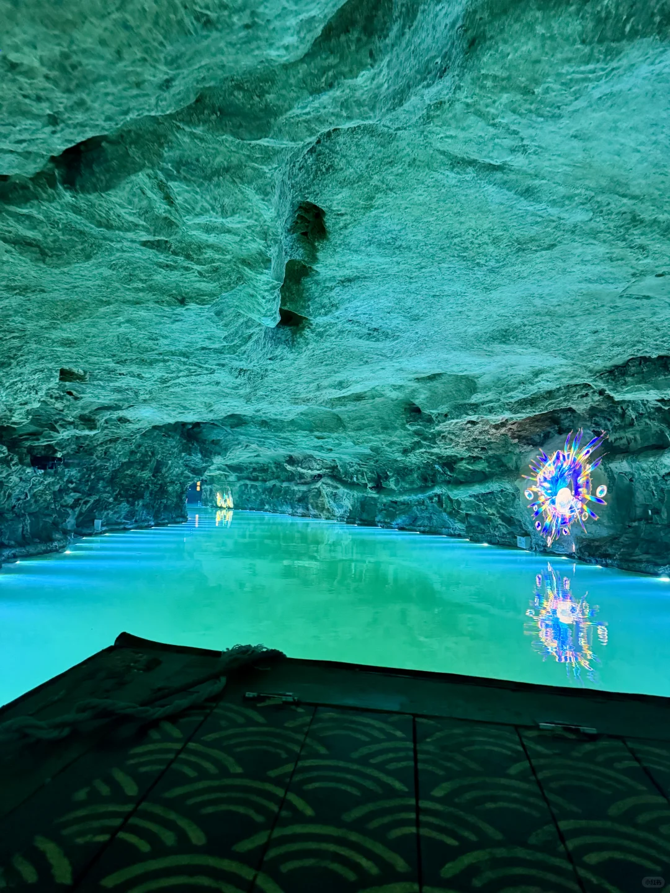
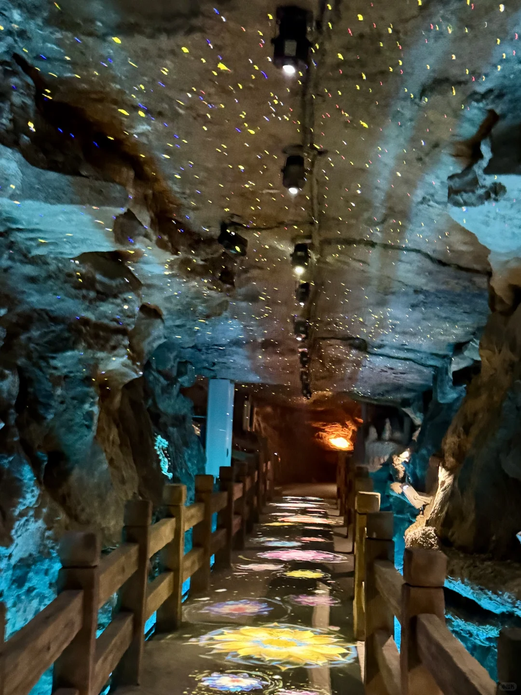
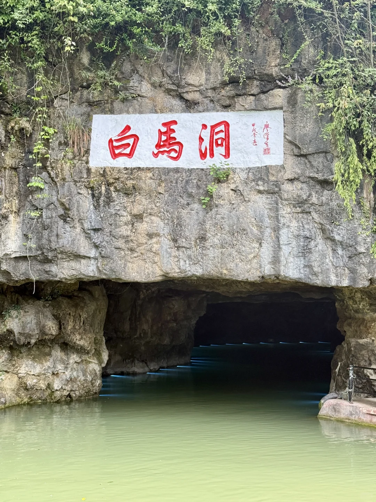

# 五一周边游，宜昌白马洞保姆攻略

- 作者: 在在
- 👍24 · 💬2 · ⭐24 · 图 8
- feed_id: 69f5a0970000000023007e59

> [OCR] 白馬洞

> [OCR] 西陵峡
三游洞

> [OCR] [?]

> [OCR] INERS

> [OCR] 小红书

> [OCR] HIERS

> [OCR] WALTERS

> [OCR] 洞馬白

## 正文
📍位置：西陵峡口·世外桃源景区内
🎫门票+船票：现场或平台购
⏱️游览时间：1.5–2小时
交通
自驾：市区30分钟，导航“世外桃源景区”，停车10元/天。
公交：BRT10路至“世外桃源站”，下车即到。
路线
入口→白马牌楼→下山至洞口→乘木船入洞（6分钟）→下船步行：滴水观音→小雷音寺→白马石（核心打卡）→出洞→葛洲坝观景台→巴人村落
实用贴士
✅洞内地面湿滑，穿防滑运动鞋。
✅温度约18℃，带薄外套。
✅灯光偏暗，拍照开闪光灯，白马石和船景最出片。
✅建议9:00前入园，避开人流；夏季10:00–15:00洞内避暑绝佳。
✅出洞后右手边观景台可同时看葛洲坝和三峡，别错过。
适合亲子、情侣、一日游，离市区近，性价比高
	
#节假日小众的旅游景点[话题]# #探洞[话题]# #溶洞天花板[话题]# #感受大自然的鬼斧神工[话题]# #周边游好去处[话题]# #白马洞[话题]# #宜昌旅游[话题]# #武汉周边游[话题]# #湖北旅游[话题]# #五一出行问活人[话题]#

---