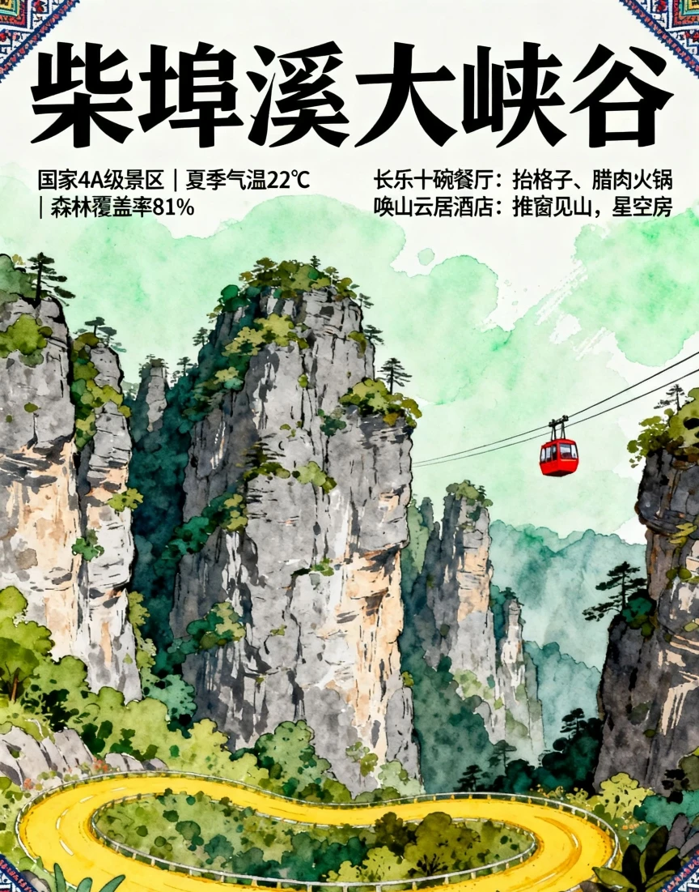
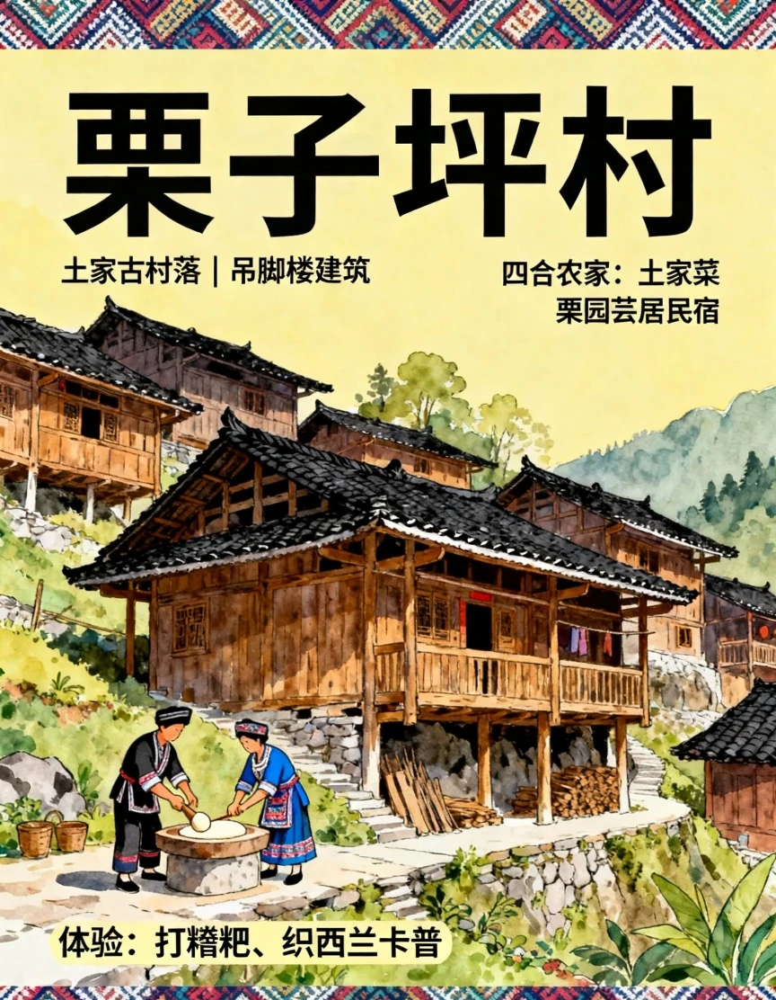

# 

- 作者: 歩于此
- 👍24 · 💬4 · ⭐33 · 图 6
- feed_id: 68ff27770000000005013e84

> [OCR] 五峰7-9月避暑全攻略
天然氧吧×避暑圣地
保姆级教程，说走就走！

> [OCR] 柴埠溪大峡谷
国家4A级景区 | 夏季气温22℃
| 森林覆盖率81%
长乐十碗餐厅：抬格子、腊肉火锅
唤山云居酒店：推窗见山，星空房

> [OCR] 后河天门峡
负氧离子12800个/cm³ | 稀有植物群落

推荐徒步路线：沿溪谷而上，途经珍稀植物区
体验：林药蜂基地参观

离子12800个/cm³ | 稀有植物群落

> [OCR] 栗子坪村
土家古村落 | 吊脚楼建筑
四合农家：土家菜
栗园芸居民宿

体验：打糍粑、织西兰卡普

> [OCR] @樊独岭云顶
夏季气温18℃ | 云海日出
云顶酒店：集装箱/木屋住宿
体验：彩虹滑道、山地越野车

2050米
独生赛道
海岭云栈
2050米

> [OCR] @G351景观廊道
自驾路线 | 沿途采摘：猕猴桃、八月瓜
• 青岗岭农庄：茶餐
• 五峰国际大酒店
青岗岭农酒庄

## 正文
🌿22℃凉到不想走！湖北私藏的土家秘境被我挖空了！
🔥3h直达的天然氧吧｜🏞81%森林覆盖率｜✨人均500玩转云端仙境
#五峰避暑圣地[话题]# #土家族文化[话题]# #暑假逃离计划[话题]# #自驾湖北[话题]#
柴埠溪大峡谷
🚠坐1608米索道穿越云海！这里比空调房还爽！
✅负氧离子10000+/cm³｜🌡夏季恒温22℃｜💥越野车+非遗南曲套票198元
👉🏻Tips：索道上站拍云海逆光绝了！
后河天门峡
🌲北纬30°原始森林徒步！洗肺攻略大公开！
🦋稀有植物王国｜💦清溪峡谷溯溪｜⚠必带驱蚊液+防滑鞋
⏰建议游玩：3-4小时（傍晚的丁达尔光束美哭！）
栗子坪村
吊脚楼里住一晚！土家阿妹教我织西兰卡普！
🏡四合农家民宿200元/晚含早晚餐｜🖌非遗体验：打糍粑+织锦
📸拍照点：村口百年银杏树下（穿浅色衣服更出片）
独岭云顶
🌅海拔2050米追日出！彩色集装箱民宿太绝了！
🌌星空房躺看银河｜🚜彩虹滑道+山地越野车通票128元
🌡凌晨气温12℃！记得带羽绒服拍氛围感大片！
G351自驾
🍑边开车边摘猕猴桃！这条景观道美到违法！
📌必停点：八月瓜采摘园（5元/斤）｜青岗岭茶园（免费采茶体验）
🚗车型建议：SUV（部分路段碎石较多）#小众避暑地[话题]# #避暑好地方[话题]# #自然与文化之旅[话题]#

---