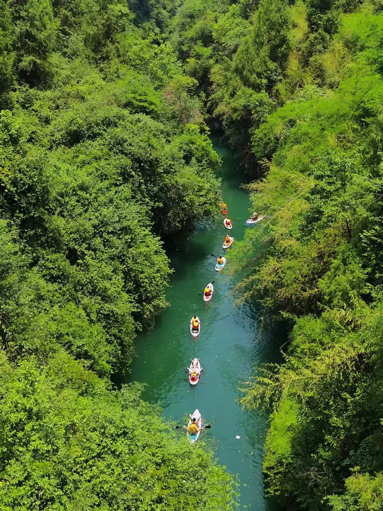
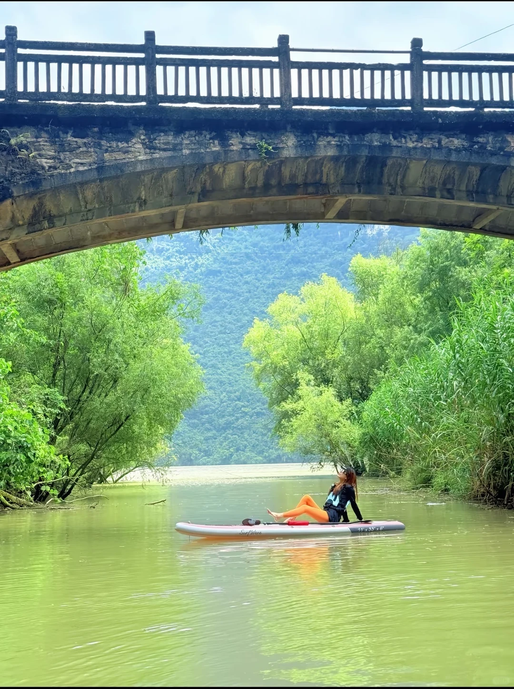
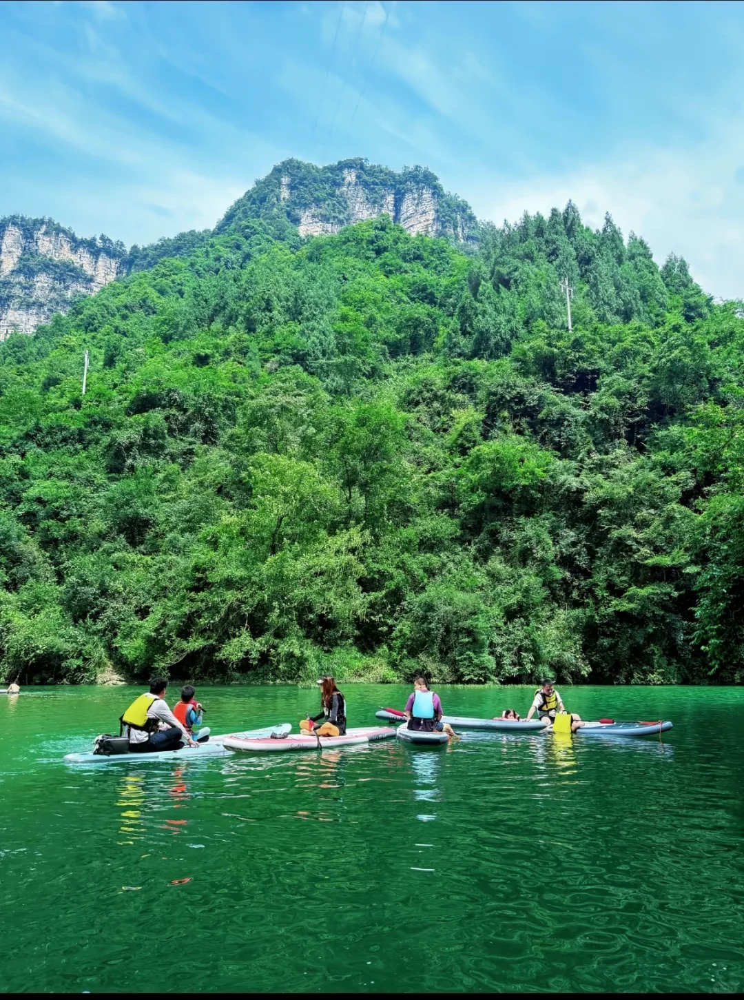
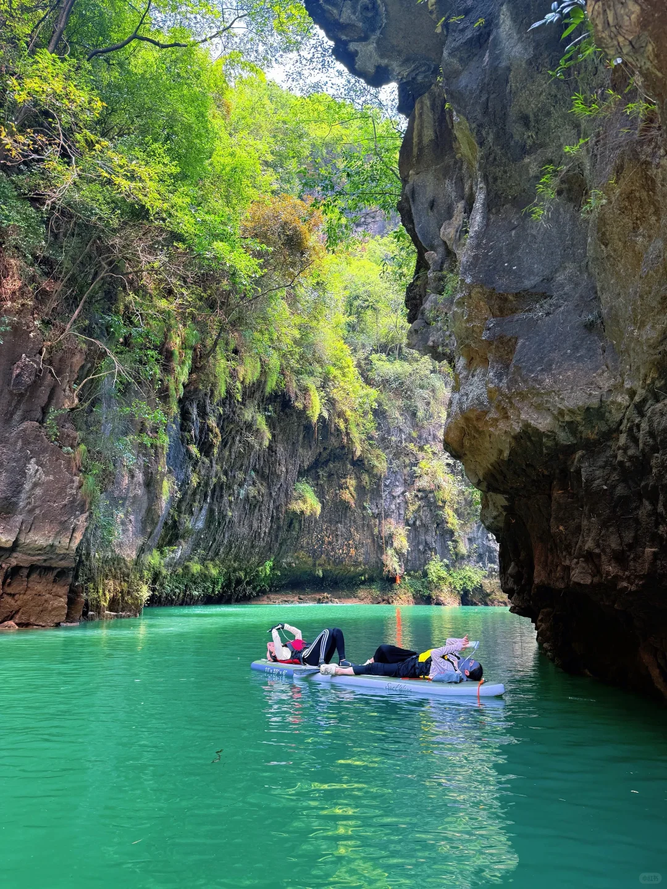
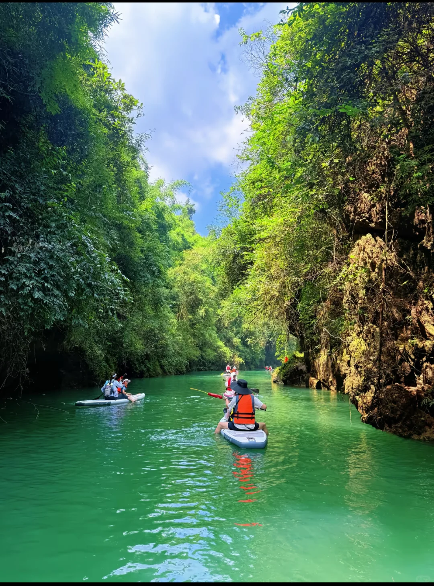
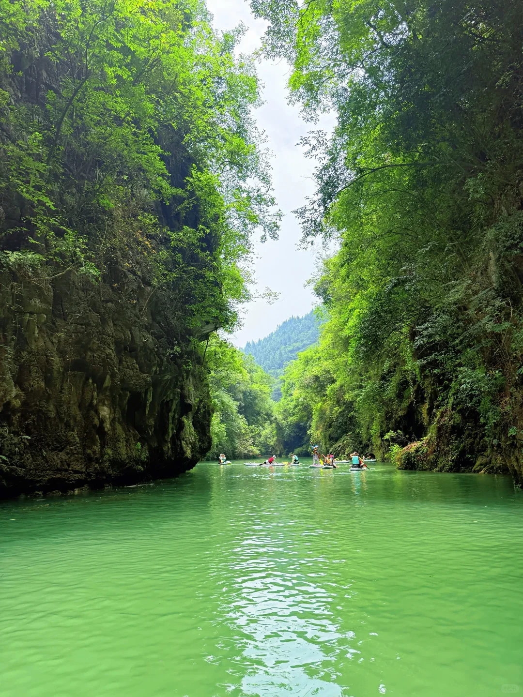

# 

- 作者: TNF打工人
- 👍23 · 💬4 · ⭐29 · 图 6
- feed_id: 6a6ca47900000000320237f8

> [OCR] system

> [OCR] SurfWave
11'x 43" x 6"

> [OCR] system

> [OCR] SUP

> [OCR] [?]

> [OCR] system

## 正文
从荆州自驾出发，一脚油门，闯进宜昌这片小众的绿野秘境！🛶
	
真的被这里的祖母绿溪水治愈了。两岸是垂直的壁崖，头顶是茂密的原始森林，我们划着桨板一路向前。
🚣‍♀️穿行峡谷时，偶遇静谧的飞瀑
🏞️抬头是蓝天下的连绵群山
🌉穿过石桥时，水面倒映着树影
玩累了，直接把桨板停在峡谷中央躺平
不用刻意寻找风景，这里每一帧都像电影画面📸
不想上班，只想在这里随波逐流一整个夏天！
	
📍地点： 宜昌·松门溪
🚗交通： 荆州自驾约1.5小时（建议导航具体下水点）
🔖Tips： 带好防水袋、防晒衣和驱蚊水，新手也能轻松驾驭！
	
#荆州周边游[话题]# #周末去哪儿[话题]# #宜昌旅游[话题]# #桨板SUP[话题]# #小众旅行地[话题]# #湖北山水[话题]# #宜昌松门溪[话题]# #逃离城市[话题]# #夏日玩水[话题]#

---